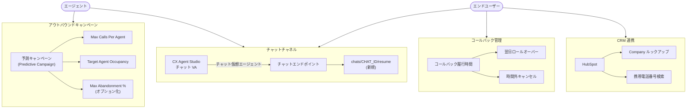

# Google Cloud CCaaS: バージョン 4.12 リリース

**リリース日**: 2026-03-24

**サービス**: Google Cloud Contact Center as a Service (CCaaS)

**機能**: CCaaS 4.12 新機能リリース

**ステータス**: GA

[このアップデートのインフォグラフィックを見る](https://takech9203.github.io/google-cloud-news-summary/20260324-ccaas-4-12.html)

## 概要

Google Cloud CCaaS (Contact Center AI Platform) のバージョン 4.12 がリリースされた。本リリースでは、予測キャンペーンの制御強化、チャットセッション再開エンドポイント、コールバック履行時間の設定、CX Agent Studio によるチャット仮想エージェント作成対応、HubSpot 連携の拡充など、複数の重要な新機能が追加されている。

本アップデートは、コンタクトセンターの運用効率向上と顧客体験の改善を目的としており、アウトバウンドダイヤラーの精度向上、チャットチャネルの柔軟性強化、CRM 連携の深化が主な柱となっている。コンタクトセンター管理者、スーパーバイザー、および CRM インテグレーション担当者が主な対象ユーザーとなる。

**アップデート前の課題**

- 予測キャンペーンではオーバーダイヤル調整乗数と最大放棄率のみで制御しており、エージェントごとの同時通話数やエージェント稼働率を直接指定できなかった
- 一度解除 (dismissed) されたチャットセッションを再開する手段がなく、エンドユーザーは新規チャットを開始する必要があった
- コールバックの履行時間帯を設定できず、営業時間外にスケジュールされたコールバックの制御が困難だった
- CX Agent Studio でのチャット仮想エージェント作成がサポートされておらず、音声仮想エージェントのみ対応していた
- HubSpot 連携で Company プロファイルに対するルックアップや、携帯電話番号での検索ができなかった

**アップデート後の改善**

- 予測キャンペーンに Max Calls Per Agent と Target Agent Occupancy の新しい制御が追加され、ダイヤルレートをより自然かつ一貫して調整できるようになった
- `chats/CHAT_ID/resume` エンドポイントにより、dismissed/va_dismissed ステータスのチャットセッションをチャット履歴付きで再開可能になった
- コールバック履行時間の設定により、営業時間外のコールバックを翌日にロールオーバーまたはキャンセルする制御が可能になった
- CX Agent Studio でチャット仮想エージェントを作成できるようになり、音声とチャットの両チャネルを統一的に管理可能になった
- HubSpot 連携で Company プロファイルへのルックアップと携帯電話番号検索がサポートされた

## アーキテクチャ図

CCaaS 4.12 の主要な新機能の構成を示す。予測キャンペーンの制御強化、チャットセッション再開機能、コールバック履行時間管理、HubSpot 連携拡充が主な改善領域となっている。

## サービスアップデートの詳細

### 主要機能

1. **予測キャンペーンの制御強化**
   - **Max Calls Per Agent**: エージェントあたりの最大同時通話数を設定可能。オーバーダイヤルによる通話放棄リスクを軽減する
   - **Target Agent Occupancy**: 目標エージェント稼働率を設定可能。ダイヤルレートをより自然かつ一貫して調整できる
   - **Max Abandonment % のオプション化**: 最大放棄率の設定が任意になり、放棄率の上限維持を必要としないキャンペーンに対応
   - 管理者は Campaigns > Add Campaign > Mode > Predictive から新しい制御項目にアクセスできる

2. **チャットセッション再開エンドポイント (Resume Chat)**
   - 新しい `chats/CHAT_ID/resume` エンドポイントを使用して、dismissed または va_dismissed ステータスのチャットセッションを再開可能
   - 再開されたチャットセッションでは、エンドユーザーとエージェントの両方にチャット履歴が表示される
   - Web SDK の `resumeChat(chatId)` メソッドからも利用可能

3. **コールバック履行時間の設定**
   - コンタクトセンターがコールバックを履行する時間帯を設定可能
   - コールバックロールオーバーを有効にすると、営業時間外にスケジュールされたコールバックは翌日にロールオーバーされる
   - ロールオーバーを無効にした場合、営業時間外のコールバックはキャンセルされる
   - デフォルトでは利用不可。利用するには Google の担当者にインスタンスでの有効化を依頼する必要がある

4. **CX Agent Studio によるチャット仮想エージェント作成**
   - Contact Center AI Platform が CX Agent Studio (Customer Experience Agent Studio) を使用したチャット仮想エージェントの作成をサポート
   - 既存の音声仮想エージェント対応に加え、チャットチャネルにも拡張された
   - 音声とチャットの両チャネルで統一的な仮想エージェント管理が可能になる

5. **エージェント内線番号検索の改善**
   - エンドユーザーがエージェント内線番号を入力して複数のエージェントがマッチした場合、システムが 8 件ずつグループで読み上げるようになった
   - 新しい内線ディレクトリメッセージ (Multiple agents found、Search results next page、End of search results) が追加された

6. **HubSpot 連携の拡充**
   - **Company プロファイルルックアップ**: HubSpot 連携で Company プロファイルに対する検索が可能になった。管理者はプライマリとセカンダリのルックアップオブジェクトを設定でき、Contacts と Companies の両方でエンドユーザーを検索できる
   - **携帯電話番号検索**: Settings > Developer Settings > CRM から Mobile phone number lookup を有効にすると、HubSpot の「Phone number」と「Mobile phone number」の両フィールドを自動検索する

### バグ修正

本リリースでは多数のバグ修正が含まれている。主な修正対象には、通話転送時のセッション処理、エージェントステータス管理、ラップアップおよびディスポジション設定の転送先キュー設定への準拠、転送セッションのダッシュボード表示、チャットアダプター UI の改善などが含まれる。

## 技術仕様

### 新規 API エンドポイント

| 項目 | 詳細 |
|------|------|
| エンドポイント | `POST chats/{CHAT_ID}/resume` |
| 対象ステータス | `dismissed`, `va_dismissed` |
| レスポンス | 再開されたチャットセッション (履歴付き) |
| SDK メソッド | `client.resumeChat(chatId)` |

### 予測キャンペーン新規制御パラメータ

| パラメータ | 説明 |
|-----------|------|
| Max Calls Per Agent | エージェントあたりの最大同時通話数 |
| Target Agent Occupancy | 目標エージェント稼働率 (%) |
| Max Abandonment % | 最大放棄率 (オプション化) |

### HubSpot 連携設定

| 機能 | 設定パス |
|------|---------|
| Company プロファイルルックアップ | CRM 設定 > Primary/Secondary Lookup Objects |
| 携帯電話番号検索 | Settings > Developer Settings > CRM > Phone Number Lookup |

## 設定方法

### 前提条件

1. Google Cloud CCaaS インスタンスが有効であること
2. デプロイメントスケジュールに基づき、バージョン 4.12 がインスタンスに適用されていること
3. コールバック履行時間機能を使用する場合は Google 担当者への有効化依頼が必要

### 手順

#### ステップ 1: 予測キャンペーンの制御設定

管理者ポータルにて Campaigns > Add Campaign > Mode > Predictive を選択し、Add Campaign ダイアログに表示される Max Calls Per Agent と Target Agent Occupancy を設定する。Max Abandonment % は必要に応じて設定する。

#### ステップ 2: HubSpot 携帯電話番号検索の有効化

Settings > Developer Settings > CRM にアクセスし、Phone Number Lookup セクションの Mobile phone number lookup チェックボックスを有効にする。

#### ステップ 3: チャットセッション再開の利用

アプリケーションから `chats/{CHAT_ID}/resume` エンドポイントを呼び出すか、Web SDK の `resumeChat(chatId)` メソッドを使用する。

## メリット

### ビジネス面

- **通話放棄率の低減**: 予測キャンペーンの新しい制御により、オーバーダイヤルによる通話放棄リスクを軽減し、キャンペーンのコンプライアンスを向上できる
- **顧客体験の向上**: チャットセッション再開機能により、エンドユーザーは中断されたチャットをシームレスに再開でき、会話のコンテキストが保持される
- **運用効率の改善**: コールバック履行時間の設定により、営業時間外のコールバック管理が自動化される

### 技術面

- **CRM 連携の深化**: HubSpot の Company プロファイルルックアップと携帯電話番号検索により、顧客識別の精度が向上する
- **仮想エージェント管理の統一**: CX Agent Studio でチャット仮想エージェントを作成できるようになり、音声とチャットの仮想エージェントを同一プラットフォームで管理可能になった
- **API の拡張**: Resume chat エンドポイントにより、チャットセッションのライフサイクル管理がプログラマティックに行える

## デメリット・制約事項

### 制限事項

- コールバック履行時間機能はデフォルトでは無効であり、Google 担当者への有効化依頼が必要
- デプロイメントスケジュールにより、インスタンスへの適用タイミングが異なる

### 考慮すべき点

- 予測キャンペーンの新しい制御パラメータの最適値は、キャンペーンの規模やエージェント数に応じた調整が必要
- チャットセッション再開は dismissed/va_dismissed ステータスのセッションのみが対象であり、finished ステータスのセッションには適用されない

## ユースケース

### ユースケース 1: アウトバウンドセールスキャンペーンの最適化

**シナリオ**: 大規模なアウトバウンドセールスチームが予測キャンペーンを運用しているが、オーバーダイヤルによる通話放棄率が高く、規制コンプライアンスに懸念がある。

**効果**: Max Calls Per Agent と Target Agent Occupancy を設定することで、ダイヤルレートをエージェントの処理能力に合わせて自然に調整でき、通話放棄率を抑えつつキャンペーン効率を維持できる。

### ユースケース 2: カスタマーサポートのチャット継続性向上

**シナリオ**: EC サイトのカスタマーサポートで、エンドユーザーがチャット中に一時的に離席し、セッションがタイムアウトで dismissed になるケースが頻発している。

**効果**: Resume chat エンドポイントを活用することで、エンドユーザーが戻った際にチャット履歴付きでセッションを再開でき、同じ問題を最初から説明し直す必要がなくなる。

## 関連サービス・機能

- **CX Agent Studio (Customer Experience Agent Studio)**: 仮想エージェントの作成・管理プラットフォーム。本リリースでチャット仮想エージェント作成がサポートされた
- **Dialogflow CX**: 高度な仮想エージェントを構築するためのサービス。CX Agent Studio と連携して利用される
- **Agent Assist**: エージェント支援 AI。通話・チャット中のリアルタイムアシスタンス機能を提供
- **HubSpot CRM**: CRM 連携先の一つ。本リリースで Company プロファイルルックアップと携帯電話番号検索が追加された

## 参考リンク

- [インフォグラフィック](https://takech9203.github.io/google-cloud-news-summary/20260324-ccaas-4-12.html)
- [公式リリースノート](https://docs.cloud.google.com/release-notes#March_24_2026)
- [CCaaS ドキュメント](https://cloud.google.com/contact-center/ccai-platform/docs)
- [予測キャンペーンの設定](https://cloud.google.com/contact-center/ccai-platform/docs/campaign-predictive)
- [Web SDK API リファレンス](https://cloud.google.com/contact-center/ccai-platform/docs/headless-web-api)
- [デプロイメントスケジュール](https://cloud.google.com/contact-center/ccai-platform/docs/deployment-schedules)

## まとめ

Google Cloud CCaaS 4.12 は、予測キャンペーンの制御強化、チャットセッション再開 API、CX Agent Studio チャット VA 対応、HubSpot 連携拡充など、コンタクトセンターの運用効率と顧客体験を包括的に改善するリリースである。特に予測キャンペーンの新しい制御パラメータとチャット再開エンドポイントは、運用現場への即時的なインパクトが大きい機能であり、早期の検証・適用を推奨する。

---

**タグ**: #GoogleCloud #CCaaS #ContactCenter #PredictiveCampaign #ChatBot #CXAgentStudio #HubSpot #CRM #VirtualAgent #CustomerExperience
