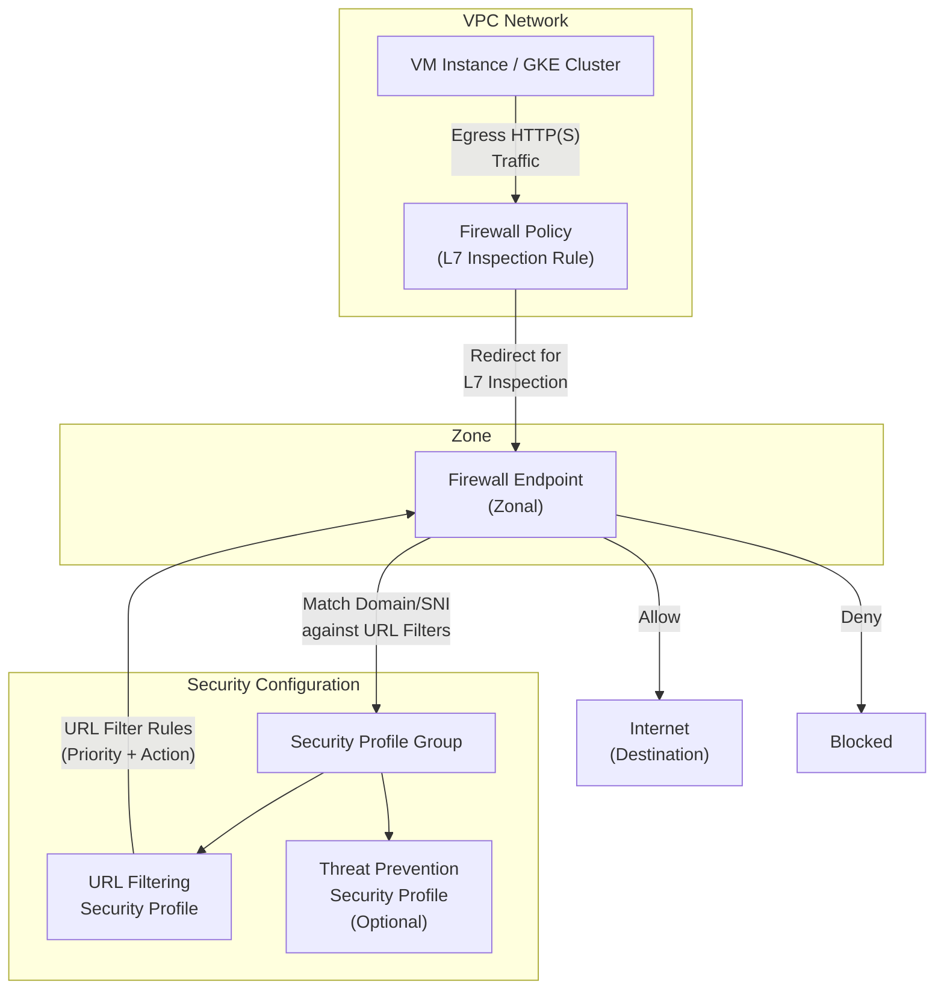

# Cloud NGFW: URL フィルタリングサービスが GA

**リリース日**: 2026-03-24

**サービス**: Cloud Next Generation Firewall (Cloud NGFW)

**機能**: URL フィルタリングサービス

**ステータス**: General Availability (GA)

:bar_chart: [このアップデートのインフォグラフィックを見る](https://takech9203.github.io/google-cloud-news-summary/20260324-cloud-ngfw-url-filtering-ga.html)

## 概要

Cloud NGFW の URL フィルタリングサービスが General Availability (GA) として正式リリースされた。本サービスは、エグレス HTTP(S) メッセージに含まれるドメイン名および Server Name Indication (SNI) 情報を使用して、ワークロードのトラフィックをフィルタリングする機能を提供する。2025 年 9 月に Preview として公開されていた本機能が、本番環境での利用に適した GA ステータスに昇格した。

URL フィルタリングサービスは、Google マネージドのゾーナルファイアウォールエンドポイントと Google Cloud のパケットインターセプト技術を活用し、設定されたドメイン名や SNI のリストに対してトラフィックを照合・検査する。DNS ベースのアクセス制限が効果的でない場合や、信頼されたサイトをホストするサーバー上の特定ドメインのみをブロックしたい場合にも、HTTP メッセージヘッダーを検査することで精密な制御が可能である。

対象ユーザーは、クラウドワークロードのエグレストラフィックを制御したいネットワークセキュリティ管理者、コンプライアンス要件に対応する必要のあるセキュリティアーキテクト、および外部通信を厳密に管理したい企業の IT 管理者である。

**アップデート前の課題**

- IP アドレスベースのファイアウォールルールでは、頻繁に変更される IP アドレスへの追従が困難で、管理コストが高かった
- DNS ベースのアクセス制限では、同一サーバー上にホストされた複数ドメインの個別制御ができなかった
- FQDN オブジェクト (Standard ティア) ではネットワーク層での IP アドレス解決のみで、アプリケーション層での URL パス単位の制御ができなかった
- 悪意のある URL や C2 (Command and Control) サーバーへの通信をリアルタイムで検出・遮断する機能が限定的だった

**アップデート後の改善**

- ドメイン名と SNI 情報に基づくアプリケーション層でのトラフィックフィルタリングが GA として本番環境で利用可能になった
- TLS インスペクションとの連携により、暗号化トラフィックのホストヘッダーも検査対象にできるようになった
- 侵入検知・防止サービス (IPS) と組み合わせることで、悪意のある URL への通信遮断、C2 サーバーへのアクセス防止、マルウェア検出を統合的に実現できるようになった

## アーキテクチャ図



VM インスタンスまたは GKE クラスタからのエグレス HTTP(S) トラフィックがファイアウォールポリシーによりファイアウォールエンドポイントにリダイレクトされ、セキュリティプロファイルに定義された URL フィルターに基づいてドメイン名および SNI の照合が行われる。照合結果に応じて、トラフィックが許可または拒否される。

## サービスアップデートの詳細

### 主要機能

1. **ドメイン名および SNI ベースの URL フィルタリング**
   - エグレス HTTP(S) メッセージのホストヘッダーおよび TLS ネゴシエーション時の SNI 情報を検査してドメインを照合する
   - URL フィルターにはマッチャー文字列、一意の優先度、アクション (許可/拒否) を定義する
   - 暗黙の deny URL フィルターにより、明示的に許可されていない URL はデフォルトでブロックされる

2. **TLS インスペクションとの統合**
   - TLS インスペクションを有効にすると、暗号化トラフィックのメッセージヘッダーを復号してホストヘッダー内のドメイン名を検査可能
   - TLS インスペクションが無効の場合でも、TLS ネゴシエーション時の ClientHello メッセージに含まれる SNI で照合を実行
   - 非暗号化 HTTP トラフィックでは、TLS インスペクションの有無にかかわらずホストヘッダーを使用

3. **侵入検知・防止サービス (IPS) との連携**
   - URL フィルタリングでエグレストラフィックを許可した後、IPS が有効であればさらに脅威スキャンを実施
   - 悪意のある URL への通信遮断、C2 サーバーへのアクセス防止、実行ファイルのマルウェア検出を統合的に提供

## 技術仕様

### URL フィルタリングサービスの構成要素

| 項目 | 詳細 |
|------|------|
| セキュリティプロファイルタイプ | `url-filtering` |
| セキュリティプロファイルグループ | URL フィルタリングと脅威防止のプロファイルを格納するコンテナ |
| ファイアウォールエンドポイント | ゾーンレベルの組織リソース、L7 トラフィック検査を実行 |
| 対応プロトコル | HTTP/1.x、HTTP/2 |
| 非対応プロトコル | QUIC、Encrypted SNI (ESNI)、Encrypted Client Hello (ECH) (TLS インスペクション有効時) |
| スループット (TLS インスペクション有効) | エンドポイントあたり最大 2 Gbps |
| スループット (TLS インスペクション無効) | エンドポイントあたり最大 10 Gbps |
| 接続あたりスループット (TLS 有効) | 最大 250 Mbps |
| 接続あたりスループット (TLS 無効) | 最大 1.25 Gbps |
| Cloud NGFW ティア | Enterprise |

### セキュリティプロファイルの設定例

```json
{
  "name": "projects/PROJECT_ID/locations/global/securityProfiles/url-filter-profile",
  "type": "URL_FILTERING",
  "urlFilteringProfile": {
    "urlFilters": [
      {
        "action": "DENY",
        "matchers": ["malicious-site.example.com", "*.bad-domain.example.net"],
        "priority": 100
      },
      {
        "action": "ALLOW",
        "matchers": ["*.google.com", "*.googleapis.com"],
        "priority": 200
      }
    ]
  }
}
```

## 設定方法

### 前提条件

1. Google Cloud プロジェクトで Compute Engine API および Network Security API が有効化されていること
2. Compute Network Admin ロール (`roles/compute.networkAdmin`) が組織レベルで付与されていること
3. Cloud NGFW Enterprise ティアの機能を使用するため、ファイアウォールエンドポイントがデプロイ済みであること

### 手順

#### ステップ 1: URL フィルタリングセキュリティプロファイルの作成

URL フィルターのマッチャー文字列とアクションを定義したセキュリティプロファイルを作成する。

```bash
# URL フィルタリングセキュリティプロファイルの作成
gcloud network-security security-profiles create SEC_PROFILE_NAME \
    --type=url-filtering \
    --organization=ORG_ID \
    --location=global
```

#### ステップ 2: セキュリティプロファイルグループの作成

セキュリティプロファイルをセキュリティプロファイルグループに関連付ける。

```bash
# セキュリティプロファイルグループの作成
gcloud network-security security-profile-groups create SEC_PROFILE_GROUP_NAME \
    --organization=ORG_ID \
    --location=global \
    --url-filtering-profile=SEC_PROFILE_NAME
```

#### ステップ 3: ファイアウォールエンドポイントの作成と VPC への関連付け

ファイアウォールエンドポイントを対象ゾーンに作成し、VPC ネットワークに関連付ける。

```bash
# ファイアウォールエンドポイントの作成
gcloud network-security firewall-endpoints create ENDPOINT_NAME \
    --zone=ZONE \
    --organization=ORG_ID

# VPC ネットワークへの関連付け
gcloud network-security firewall-endpoint-associations create ASSOCIATION_NAME \
    --endpoint=ENDPOINT_NAME \
    --network=projects/PROJECT_ID/global/networks/VPC_NAME \
    --zone=ZONE
```

#### ステップ 4: ファイアウォールポリシールールの追加

エグレストラフィックを L7 検査にリダイレクトするファイアウォールポリシールールを作成する。

```bash
# ファイアウォールポリシーにルールを追加
gcloud compute network-firewall-policies rules create PRIORITY \
    --firewall-policy=POLICY_NAME \
    --direction=EGRESS \
    --action=apply_security_profile_group \
    --security-profile-group=//networksecurity.googleapis.com/organizations/ORG_ID/locations/global/securityProfileGroups/SEC_PROFILE_GROUP_NAME \
    --layer4-configs=tcp:80,tcp:443
```

## メリット

### ビジネス面

- **セキュリティ体制の強化**: 悪意のある URL や C2 サーバーへの通信を自動的に検出・遮断し、データ漏洩やサイバー攻撃のリスクを大幅に低減する
- **コンプライアンス対応**: 特定のウェブサイトやドメインへのアクセスを制御することで、業界規制やセキュリティポリシーへの準拠を支援する
- **運用コスト削減**: IP アドレスの頻繁な変更や DNS 変更に伴うファイアウォールルールの手動更新が不要になり、メンテナンス負荷が軽減される

### 技術面

- **アプリケーション層での精密な制御**: IP アドレスベースの制御では実現できない、ドメイン単位・URL パス単位のきめ細かいフィルタリングが可能
- **暗号化トラフィックへの対応**: TLS インスペクションとの統合により、HTTPS トラフィックのドメイン検査が可能で、暗号化通信に隠れた脅威も検出できる
- **既存ルーティングへの影響なし**: パケットインターセプト技術により、既存のルーティングポリシーを変更せずに透過的にトラフィック検査を挿入できる

## デメリット・制約事項

### 制限事項

- QUIC、Encrypted SNI (ESNI)、Encrypted Client Hello (ECH) は TLS インスペクション有効時にサポートされない。TLS インスペクション有効時にはこれらのトラフィックは通過しない
- TLS インスペクション無効時には、QUIC/ESNI/ECH トラフィックはドメインおよび SNI 情報にアクセスできない状態で通過する。明示的な allow フィルターがない場合、暗黙の deny フィルターによりブロックされる
- ファイアウォールエンドポイントが処理可能なパケットサイズに制限がある

### 考慮すべき点

- TLS インスペクションを有効にすると暗号化トラフィックの復号・再暗号化が発生するため、スループットが最大 2 Gbps に低下する (無効時は最大 10 Gbps)
- ファイアウォールエンドポイントの過負荷時には正当なトラフィックもドロップされる可能性があるため、容量使用率のモニタリングが必要
- Cloud NGFW Enterprise ティアの機能であるため、エンドポイントの時間単位の課金と検査トラフィック量に応じた従量課金が発生する

## ユースケース

### ユースケース 1: 悪意のある外部通信の遮断

**シナリオ**: 企業のクラウドワークロードがマルウェアに感染し、C2 サーバーと通信を試みるケース。URL フィルタリングサービスにより、既知の悪意のあるドメインへのエグレス通信を自動的に遮断する。

**効果**: IPS と組み合わせることで、既知の脅威 URL のブロックに加えて、未知の脅威パターンの検出も可能になり、多層防御を実現できる。

### ユースケース 2: 規制準拠のための外部アクセス制御

**シナリオ**: 金融機関や医療機関が、コンプライアンス要件に基づき、ワークロードからのエグレストラフィックを承認済みドメインのみに制限する必要がある場合。

**効果**: ホワイトリスト方式で許可するドメインを明示的に定義し、暗黙の deny フィルターでそれ以外のすべての外部通信をブロックすることで、データ漏洩リスクを最小化できる。

### ユースケース 3: マルチテナント環境でのテナント別アクセス制御

**シナリオ**: SaaS プロバイダーが複数のテナントワークロードを VPC 内で運用しており、テナントごとにアクセス可能な外部サービスを制御したい場合。

**効果**: セキュリティプロファイルとファイアウォールポリシーの組み合わせにより、テナント別の URL フィルタリングルールを適用でき、テナント間のセキュリティ分離を強化できる。

## 料金

URL フィルタリングサービスは Cloud NGFW Enterprise ティアの機能であり、以下の料金体系が適用される:

- **ファイアウォールエンドポイント**: デプロイされたエンドポイントごとに時間単位の課金
- **データ処理**: ファイアウォールエンドポイントで検査されたトラフィック量 (GB 単位) に応じた従量課金

North-South トラフィック (VM とインターネット間) および East-West トラフィック (VPC 内リソース間) の両方が課金対象となる。

詳細は [Cloud NGFW pricing](https://cloud.google.com/firewall/pricing) を参照。

## 利用可能リージョン

Cloud NGFW のファイアウォールエンドポイントはゾーンレベルのリソースであり、Google Cloud がファイアウォールエンドポイントをサポートするすべてのゾーンで利用可能。VPC ネットワークが複数のゾーンにまたがる場合は、各ゾーンにファイアウォールエンドポイントを作成して関連付ける必要がある。

## 関連サービス・機能

- **Cloud NGFW IPS (侵入検知・防止サービス)**: URL フィルタリングと組み合わせて使用可能な脅威検出・防止機能。同じセキュリティプロファイルグループ内に IPS プロファイルを追加することで統合的な防御を実現
- **TLS インスペクション**: 暗号化トラフィックの復号・検査を可能にする機能。URL フィルタリングの検査精度を向上させる
- **Cloud NGFW Standard (FQDN オブジェクト)**: ネットワーク層でのドメインベースフィルタリング。URL フィルタリングはアプリケーション層での検査であり、より精密な制御が可能
- **Cloud Logging**: URL フィルタリングのログを Cloud Logging に出力し、許可・拒否されたトラフィックの監査とモニタリングが可能
- **VPC Service Controls**: VPC Service Controls と併用することで、データ流出防止の多層防御を構築可能

## 参考リンク

- :bar_chart: [インフォグラフィック](https://takech9203.github.io/google-cloud-news-summary/20260324-cloud-ngfw-url-filtering-ga.html)
- [公式リリースノート](https://docs.cloud.google.com/firewall/docs/release-notes#March_24_2026)
- [URL filtering service overview](https://docs.cloud.google.com/firewall/docs/about-url-filtering)
- [Configure the URL filtering service](https://docs.cloud.google.com/firewall/docs/configure-url-filtering)
- [URL filtering security profiles](https://docs.cloud.google.com/firewall/docs/configure-urlf-security-profiles)
- [TLS inspection overview](https://docs.cloud.google.com/firewall/docs/about-tls-inspection)
- [Set up URL filtering tutorial](https://docs.cloud.google.com/firewall/docs/tutorials/set-up-urlf-tutorial)
- [Cloud NGFW pricing](https://cloud.google.com/firewall/pricing)

## まとめ

Cloud NGFW の URL フィルタリングサービスが GA となり、エグレス HTTP(S) トラフィックのドメイン名および SNI ベースのフィルタリングが本番環境で利用可能になった。2025 年 9 月の Preview リリースから約 6 か月を経て GA に昇格した本機能は、IP アドレスベースの制御では実現困難だったアプリケーション層でのきめ細かいアクセス制御を提供する。Cloud NGFW Enterprise ティアの IPS や TLS インスペクションと組み合わせることで、クラウドワークロードの多層防御を強化できるため、セキュリティ要件の高い環境では導入を検討することを推奨する。

---

**タグ**: #CloudNGFW #URLFiltering #NetworkSecurity #Firewall #GA #Enterprise #TLSInspection #EgressControl
