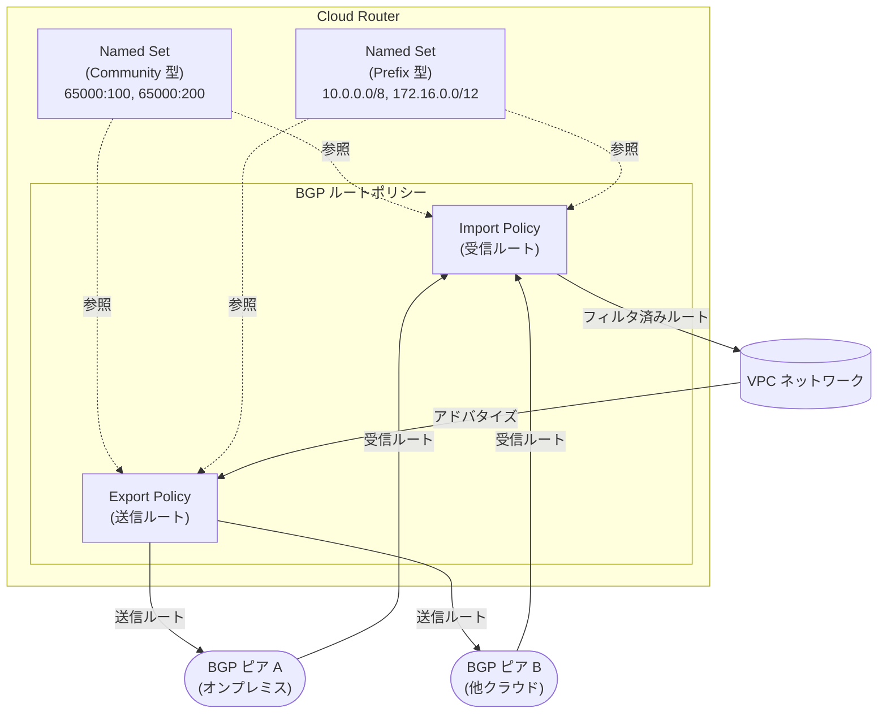

# Cloud Router: BGP ルートポリシー向け Named Sets (Preview)

**リリース日**: 2026-03-24

**サービス**: Cloud Router

**機能**: BGP ルートポリシー向け Named Sets

**ステータス**: Preview

[このアップデートのインフォグラフィックを見る](https://takech9203.github.io/google-cloud-news-summary/20260324-cloud-router-named-sets-bgp.html)

## 概要

Cloud Router の BGP ルートポリシーにおいて、Named Sets (名前付きセット) 機能が Preview として利用可能になった。Named Sets は、BGP コミュニティや BGP プレフィックスの式をグループ化し、単一のエンティティとして管理・参照できる仕組みである。

BGP ルートポリシーは、BGP ルートのフィルタリングやルート属性の変更を行うためのルールを定義する機能であり、Common Expression Language (CEL) を使用してポリシーを記述する。従来は、コミュニティ値やプレフィックスをポリシーの各タームに直接記述する必要があったが、Named Sets の導入により、これらの値をグループ化して名前で参照できるようになった。

この機能は、複数の BGP ピアに対して同じコミュニティセットやプレフィックスセットを適用するネットワークエンジニアや、大規模なハイブリッド/マルチクラウド環境を管理する Solutions Architect にとって有用である。

**アップデート前の課題**

- BGP ルートポリシーの各タームにコミュニティ値やプレフィックスを直接記述する必要があり、同じ値の組み合わせを複数のポリシーで使用する場合に冗長な設定が発生していた
- コミュニティやプレフィックスの変更時に、関連するすべてのポリシータームを個別に更新する必要があった
- 大量のコミュニティ値やプレフィックスを含むポリシーの可読性が低く、管理が煩雑だった

**アップデート後の改善**

- コミュニティやプレフィックスの式を Named Set としてグループ化し、名前で参照できるようになった
- Named Set を更新するだけで、参照しているすべてのポリシーに変更が反映されるため、運用負荷が軽減された
- ポリシー定義がシンプルになり、可読性と保守性が向上した

## アーキテクチャ図



Named Sets をコミュニティ型・プレフィックス型として定義し、BGP ルートポリシーから名前で参照する構成を示している。複数のポリシーから同一の Named Set を共有できるため、一元管理が可能になる。

## サービスアップデートの詳細

### 主要機能

1. **Community Named Set (コミュニティ名前付きセット)**
   - BGP コミュニティ値 (例: `65000:100`, `65001:200`) をグループ化して管理
   - Import/Export ポリシーのマッチ条件やアクションで名前参照が可能
   - コミュニティのマッチング (`matchesEvery`)、追加 (`add`)、削除 (`remove`)、置換 (`replaceAll`) の各操作で使用可能

2. **Prefix Named Set (プレフィックス名前付きセット)**
   - BGP プレフィックス (例: `10.0.0.0/8`, `192.168.0.0/16`) をグループ化して管理
   - `destination.inAnyRange()` によるルートマッチングで名前参照が可能
   - `prefix().longer()`, `prefix().orLonger()`, `prefix().lengthRange()` などの範囲指定と組み合わせて使用可能

3. **Named Set の管理操作**
   - Named Set の作成 (`add-named-set`)、アップロード (`upload-named-set`)、一覧表示 (`list-named-sets`) が可能
   - YAML または JSON 形式でのファイルベース定義をサポート
   - Cloud Router 単位で Named Set を管理し、同一 Cloud Router 内のポリシーから参照

## 技術仕様

### Named Set のタイプ

| 項目 | Community Named Set | Prefix Named Set |
|------|-------------------|-----------------|
| セットタイプ | `COMMUNITY` | `PREFIX` |
| 用途 | BGP コミュニティ値のグループ化 | BGP プレフィックスのグループ化 |
| マッチ操作 | `communities.matchesEvery()` | `destination.inAnyRange()` |
| アクション操作 | `communities.add()`, `communities.remove()`, `communities.replaceAll()` | - |
| Import ポリシー | マッチ条件で使用可能 | マッチ条件で使用可能 |
| Export ポリシー | マッチ条件・アクションで使用可能 | マッチ条件で使用可能 |

### 関連する BGP ルートポリシーの制約

| 項目 | 詳細 |
|------|------|
| ポリシーの方向 | 1 つのポリシーは Import または Export のいずれか一方向のみ |
| 評価順序 | ポリシーはリストされた順序で評価され、タームは指定した優先度順に評価 |
| デフォルト動作 | Fail open (明示的にドロップされないルートは受け入れられる) |
| ピアからのプレフィックス上限 | 5,000 プレフィックス (超過時は BGP セッションがリセット) |
| 拡張コミュニティ | マッチ・変更不可 (標準 BGP コミュニティのみ対応) |

## 設定方法

### 前提条件

1. Google Cloud プロジェクトで Cloud Router が作成済みであること
2. `gcloud` CLI がインストール・認証済みであること (beta または alpha チャンネル)

### 手順

#### ステップ 1: Named Set の作成

```bash
# 空の Community Named Set を追加
gcloud beta compute routers add-named-set ROUTER_NAME \
  --set-name=my-community-set \
  --set-type=COMMUNITY \
  --region=REGION

# 空の Prefix Named Set を追加
gcloud beta compute routers add-named-set ROUTER_NAME \
  --set-name=my-prefix-set \
  --set-type=PREFIX \
  --region=REGION
```

#### ステップ 2: Named Set の定義をアップロード

```bash
# YAML ファイルで Named Set を定義してアップロード
gcloud beta compute routers upload-named-set ROUTER_NAME \
  --region=REGION \
  --set-name=my-community-set \
  --file-name=community-set.yaml \
  --file-format=yaml
```

#### ステップ 3: BGP ルートポリシーで Named Set を参照

```bash
# ルートポリシーを作成
gcloud compute routers add-route-policy ROUTER_NAME \
  --policy-name=my-import-policy \
  --policy-type=IMPORT \
  --region=REGION

# Named Set を参照するポリシータームを追加
gcloud compute routers add-route-policy-term ROUTER_NAME \
  --policy-name=my-import-policy \
  --region=REGION \
  --priority=1 \
  --match='communities.matchesEvery(["65000:1", "65000:2"])' \
  --actions='med.set(100)'
```

#### ステップ 4: Named Set の一覧確認

```bash
# Cloud Router に設定された Named Set の一覧を表示
gcloud beta compute routers list-named-sets ROUTER_NAME \
  --region=REGION
```

## メリット

### ビジネス面

- **運用効率の向上**: コミュニティやプレフィックスの変更を一か所で行えるため、大規模ネットワークの運用コストを削減
- **ヒューマンエラーの削減**: 同じ値を複数箇所に記述する必要がなくなり、設定ミスのリスクが低減

### 技術面

- **ポリシー管理の簡素化**: 複雑なルートポリシーを論理的なグループに分割して管理可能
- **再利用性の向上**: 同一の Named Set を複数のポリシーから参照でき、DRY (Don't Repeat Yourself) 原則に沿った設計が可能
- **可読性の向上**: ポリシー定義内で名前付きの論理グループを参照することで、意図が明確になる

## デメリット・制約事項

### 制限事項

- 現在 Preview ステータスのため、本番環境での使用には注意が必要
- Named Set は Cloud Router 単位で管理されるため、複数の Cloud Router 間で直接共有はできない
- 拡張 BGP コミュニティ属性はサポートされていない (標準 BGP コミュニティのみ)

### 考慮すべき点

- Preview 機能は将来的に仕様変更の可能性がある
- テスト環境で設定を検証してから本番環境に適用することが推奨される
- `gcloud beta` または `gcloud alpha` チャンネルのコマンドを使用する必要がある

## ユースケース

### ユースケース 1: マルチピア環境でのコミュニティベースルーティング

**シナリオ**: 複数のオンプレミス拠点と Cloud Interconnect で接続しており、拠点ごとに異なるトラフィック制御を BGP コミュニティで行っている環境。同じコミュニティセットを複数の BGP ピアの Import ポリシーで使用する必要がある。

**効果**: Community Named Set を定義することで、コミュニティ値の変更を一か所で管理でき、全ピアのポリシーに即座に反映される。

### ユースケース 2: プレフィックスベースのルートフィルタリング

**シナリオ**: ハイブリッドクラウド環境で、特定のプレフィックス範囲 (例: RFC 1918 プライベートアドレス) のみを受け入れるルートフィルタを複数のピアに適用したい。

**効果**: Prefix Named Set にフィルタ対象のプレフィックスをまとめて定義し、各ピアの Import ポリシーから参照することで、フィルタルールの一貫性を確保できる。

## 料金

Cloud Router 自体には追加料金はかからない。Named Sets 機能は Cloud Router の BGP ルートポリシー機能の一部として提供される。ただし、Cloud Router を使用する Cloud Interconnect や Cloud VPN などの接続サービスには別途料金が発生する。

詳細は [Cloud Router の料金ページ](https://cloud.google.com/network-connectivity/pricing) を参照。

## 関連サービス・機能

- **Cloud Interconnect (Dedicated/Partner)**: Cloud Router と組み合わせてオンプレミスとの BGP セッションを確立するための接続サービス
- **Cloud VPN (HA VPN)**: Cloud Router を使用した動的ルーティングによる VPN 接続
- **Cross-Cloud Interconnect**: 他クラウドプロバイダーとの接続で Cloud Router の BGP セッション管理を使用
- **BGP ルートポリシー**: Named Sets が参照される親機能。CEL ベースのルート制御を提供
- **Router Appliance (Network Connectivity Center)**: Cloud Router と連携するサードパーティ仮想アプライアンス

## 参考リンク

- [公式リリースノート](https://docs.cloud.google.com/release-notes#March_24_2026)
- [BGP ルートポリシーの概要](https://cloud.google.com/network-connectivity/docs/router/concepts/bgp-route-policies-overview)
- [BGP ルートポリシーの作成](https://cloud.google.com/network-connectivity/docs/router/how-to/bgp-route-policies/create-policies)
- [BGP ルートポリシーリファレンス](https://cloud.google.com/network-connectivity/docs/router/reference/bgp-route-policy-reference)
- [Cloud Router の概要](https://cloud.google.com/network-connectivity/docs/router/concepts/overview)
- [料金ページ](https://cloud.google.com/network-connectivity/pricing)

## まとめ

Cloud Router の Named Sets 機能は、BGP ルートポリシーにおけるコミュニティ値やプレフィックスの管理を大幅に改善する Preview 機能である。大規模なハイブリッド/マルチクラウド環境で複数の BGP ピアを管理するユーザーにとって、運用効率の向上とヒューマンエラーの削減に寄与する。まずはテスト環境で Named Sets の作成と参照を試し、既存のポリシー定義のリファクタリングを検討することを推奨する。

---

**タグ**: #CloudRouter #BGP #NamedSets #ルートポリシー #ネットワーク #Preview #HybridCloud #CloudInterconnect
