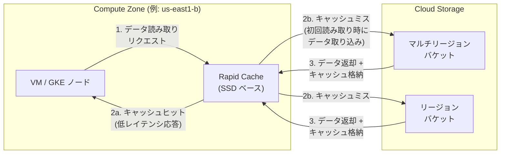

# Cloud Storage: Anywhere Cache が Rapid Cache に名称変更

**リリース日**: 2026-03-24

**サービス**: Cloud Storage

**機能**: Anywhere Cache から Rapid Cache への名称変更

**ステータス**: GA (一般提供)

[このアップデートのインフォグラフィックを見る](https://takech9203.github.io/google-cloud-news-summary/infographic/20260324-cloud-storage-rapid-cache-rename.html)

## 概要

Google Cloud は、Cloud Storage の SSD ベースのゾーン読み取りキャッシュ機能である「Anywhere Cache」の名称を「Rapid Cache」に変更することを発表しました。この名称変更は、Cloud Storage の高性能ストレージ製品ラインである「Rapid」ブランドとの整合性を図るものです。既に提供されている Rapid Bucket (ゾーンバケット) や Rapid ストレージクラスと同じブランド体系に統一されます。

Rapid Cache (旧 Anywhere Cache) は、Cloud Storage バケットに対して SSD ベースのゾーン読み取りキャッシュを提供する機能です。コンピューティングリソースと同じゾーンにデータをキャッシュすることで、最大 2.5 TB/s のスループットと低レイテンシを実現します。読み取り負荷の高いワークロード、特に AI/ML モデルのトレーニングやデータ分析において、パフォーマンスの向上とネットワークコストの削減に貢献します。

今回の変更は名称のみであり、機能自体に変更はありません。既存の Anywhere Cache を利用しているユーザーは、ドキュメントや CLI コマンドの名称変更に注意する必要がありますが、キャッシュの動作やパフォーマンスには影響ありません。

**アップデート前の課題**

- Cloud Storage の高性能製品ラインにおいて「Anywhere Cache」と「Rapid Bucket / Rapid ストレージ」という異なるブランド名が混在していた
- キャッシュ機能とストレージクラスの関連性がブランド名から直感的に理解しにくかった
- 新規ユーザーにとって「Anywhere Cache」という名称からゾーン固定の SSD キャッシュという性質が伝わりにくかった

**アップデート後の改善**

- 「Rapid」ブランドに統一されることで、Cloud Storage の高性能製品ラインが一貫した命名体系を持つようになった
- Rapid Cache、Rapid Bucket、Rapid ストレージクラスという統一されたブランドにより、製品間の関連性が明確になった
- 「Rapid」という名称が高速性を直感的に示し、機能の価値提案がより明確になった

## アーキテクチャ図



Rapid Cache はコンピューティングリソースと同じゾーンに配置され、初回読み取り時にデータをキャッシュに取り込みます。以降の読み取りリクエストはキャッシュから低レイテンシで応答され、マルチリージョンデータ転送料金も削減されます。

## サービスアップデートの詳細

### 主要機能

1. **名称変更: Anywhere Cache から Rapid Cache へ**
   - 機能そのものに変更はなく、ブランド名のみの変更
   - Cloud Storage の「Rapid」製品ラインとの統一

2. **SSD ベースのゾーン読み取りキャッシュ (機能は従来通り)**
   - コンピューティングリソースと同じゾーンにデータをキャッシュ
   - 最大 2.5 TB/s のスループットを提供
   - 初回読み取り時にデータを自動取り込み (Ingest on First Read)

3. **自動スケーリング (機能は従来通り)**
   - キャッシュサイズは使用量に応じて自動的にスケールアップ / ダウン
   - 帯域幅は 100 Gbps をベースに、1 TiB あたり 20 Gbps の割合で自動スケーリング
   - 固定サイズの指定は不要

## 技術仕様

### キャッシュの制限事項

| 項目 | 詳細 |
|------|------|
| 最大キャッシュサイズ | 1 PiB |
| 最大帯域幅 (プロジェクト/ゾーンあたり) | 20 Tbps |
| ベース帯域幅 | 100 Gbps |
| 帯域幅スケーリング | 1 TiB あたり 20 Gbps |
| 同時作成可能キャッシュ数 (プロジェクト/ゾーンあたり) | 20 |
| デフォルト TTL | 86400 秒 (1 日) |
| TTL 設定範囲 | 1 日 - 7 日 |
| データ整合性 | 強整合性 |

### Rapid ブランド製品ラインの整理

| 製品名 | 説明 |
|--------|------|
| Rapid Cache (旧 Anywhere Cache) | SSD ベースのゾーン読み取りキャッシュ |
| Rapid Bucket | ゾーンバケット (Rapid ストレージクラス使用) |
| Rapid ストレージクラス | 最高パフォーマンスのストレージクラス |

## 設定方法

### 前提条件

1. Google Cloud プロジェクトが有効であること
2. Cloud Storage バケットが作成済みであること
3. 適切な IAM 権限が付与されていること

### 手順

#### ステップ 1: キャッシュの作成

```bash
# Rapid Cache (旧 Anywhere Cache) を作成
gcloud storage buckets anywhere-caches create gs://BUCKET_NAME ZONE
```

ZONE にはコンピューティングリソースが稼働するゾーン (例: `us-east1-b`) を指定します。複数のゾーンを同時に指定することも可能です。

#### ステップ 2: TTL の設定 (オプション)

```bash
# TTL を指定してキャッシュを作成
gcloud storage buckets anywhere-caches create gs://BUCKET_NAME ZONE --ttl=86400s
```

TTL は秒 (`86400s`)、分 (`1440m`)、時間 (`24h`)、日 (`1d`) で指定できます。デフォルトは 1 日です。

#### ステップ 3: キャッシュの確認

```bash
# バケットに関連付けられたキャッシュを一覧表示
gcloud storage buckets anywhere-caches list gs://BUCKET_NAME
```

キャッシュの状態と設定を確認できます。

## メリット

### ビジネス面

- **ブランドの一貫性**: 「Rapid」ブランドへの統一により、Cloud Storage の高性能製品ラインの理解が容易になり、導入検討がスムーズに
- **マルチリージョンデータ転送料金の削減**: キャッシュからのデータ読み取りは、バケットから直接読み取る場合と比較して転送料金が割引される
- **ストレージクラスの取得料金免除**: Nearline、Coldline、Archive ストレージのデータをキャッシュから読み取る場合、取得料金が発生しない

### 技術面

- **低レイテンシ**: コンピューティングリソースと同じゾーンに SSD キャッシュを配置することで、読み取りレイテンシを大幅に削減
- **高スループット**: 最大 2.5 TB/s のスループットを提供し、大規模データ処理ワークロードを加速
- **運用負荷の低減**: キャッシュサイズと帯域幅の自動スケーリングにより、手動でのキャパシティ管理が不要

## デメリット・制約事項

### 制限事項

- 名称変更に伴い、ドキュメントや既存のスクリプト内の参照を更新する必要がある可能性がある
- CLI コマンド名の変更タイミングによっては、移行期間中に新旧コマンドの対応が必要になる場合がある
- ゾーンバケット (Rapid Bucket) とは併用不可 -- Rapid Cache はマルチリージョンまたはリージョンバケット向けの機能

### 考慮すべき点

- 既存の自動化スクリプトやインフラストラクチャ・アズ・コード (Terraform 等) における名称参照の確認と更新
- チーム内のドキュメントやナレッジベースにおける旧名称の更新
- BigQuery ワークロードで使用する場合は、リージョン内の全ゾーンでキャッシュを有効にすることが推奨される (コンピューティングリソースのゾーン移動に備えるため)

## ユースケース

### ユースケース 1: AI/ML モデルトレーニングの高速化

**シナリオ**: GKE 上で大規模な AI モデルのトレーニングを実行しており、複数のノードがマルチリージョンバケットから繰り返しデータを読み取る環境

**実装例**:
```bash
# トレーニングノードと同じゾーンにキャッシュを作成
gcloud storage buckets anywhere-caches create gs://training-data-bucket us-central1-a --ttl=7d
```

**効果**: トレーニングデータの読み取りが SSD キャッシュから提供されるため、スループットが向上し、マルチリージョンデータ転送料金も削減される

### ユースケース 2: BigQuery 分析ワークロードの最適化

**シナリオ**: BigQuery で大量のデータを処理しており、Cloud Storage バケットからの読み取りパフォーマンスを最適化したい場合

**実装例**:
```bash
# BigQuery のリージョン内全ゾーンにキャッシュを作成
gcloud storage buckets anywhere-caches create gs://analytics-bucket us-east1-b us-east1-c us-east1-d
```

**効果**: BigQuery のコンピューティングリソースがゾーン間で移動しても、常にキャッシュからデータを読み取ることができ、パフォーマンスが安定する

## 料金

Rapid Cache の料金体系は名称変更前と同一です。キャッシュはペイパーユースモデルで、使用しないキャッシュには追加料金は発生しません。

### 料金例

| 項目 | 料金 |
|------|------|
| キャッシュからの読み取りオペレーション | Class B オペレーションより低い料金 |
| キャッシュからのデータ転送 | バケット直接読み取りより割引された転送料金 |
| Nearline/Coldline/Archive 取得料金 | キャッシュからの読み取り時は免除 |
| 未使用のキャッシュ | 追加料金なし (ペイパーユース) |

## 利用可能リージョン

Rapid Cache は Anywhere Cache と同じリージョンおよびゾーンで利用可能です。マルチリージョンバケットおよびリージョンバケットに対して、コンピューティングリソースが稼働する任意のゾーンにキャッシュを作成できます。利用可能なゾーンの最新情報は公式ドキュメントを参照してください。

## 関連サービス・機能

- **Rapid Bucket**: ゾーンバケットを作成し Rapid ストレージクラスでデータを格納する機能。Rapid Cache とは異なり、キャッシュではなくプライマリストレージとして機能する
- **Rapid ストレージクラス**: Cloud Storage で最高のデータアクセスおよび I/O パフォーマンスを提供するストレージクラス
- **Cloud CDN**: エッジキャッシングによるコンテンツ配信。Rapid Cache がゾーンレベルの SSD キャッシュであるのに対し、Cloud CDN はエンドユーザーに近いエッジでのキャッシングを提供
- **Cloud Storage FUSE ファイルキャッシュ**: クライアント側の読み取りキャッシュ。Rapid Cache がサーバー側のゾーンキャッシュであるのに対し、FUSE ファイルキャッシュはクライアント VM 上のローカルキャッシュを提供
- **Rapid Cache Recommender**: データ使用量とストレージを分析し、キャッシュ作成の推奨事項を提供する機能

## 参考リンク

- [インフォグラフィック](https://takech9203.github.io/google-cloud-news-summary/infographic/20260324-cloud-storage-rapid-cache-rename.html)
- [公式リリースノート](https://cloud.google.com/storage/docs/release-notes)
- [Rapid Cache (旧 Anywhere Cache) ドキュメント](https://cloud.google.com/storage/docs/anywhere-cache)
- [Rapid Cache の作成と管理](https://cloud.google.com/storage/docs/using-anywhere-cache)
- [Rapid Bucket ドキュメント](https://cloud.google.com/storage/docs/rapid/rapid-bucket)
- [料金ページ](https://cloud.google.com/storage/pricing#anywhere-cache)

## まとめ

Cloud Storage の Anywhere Cache が Rapid Cache に名称変更されました。これは「Rapid」ブランドへの統一を目的としたものであり、Rapid Bucket や Rapid ストレージクラスと一貫した命名体系が確立されます。機能自体に変更はないため、既存ユーザーはスクリプトやドキュメント内の名称参照を確認し、必要に応じて更新することを推奨します。

---

**タグ**: #CloudStorage #RapidCache #AnywhereCache #名称変更 #キャッシュ #パフォーマンス #SSD #AI/ML
