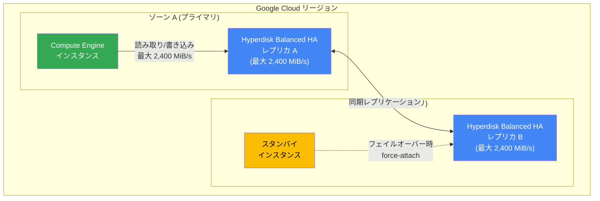

# Compute Engine: Hyperdisk Balanced High Availability の最大スループットが 2,400 MiB/s に倍増

**リリース日**: 2026-03-24

**サービス**: Compute Engine

**機能**: Hyperdisk Balanced High Availability の最大スループット増加

**ステータス**: GA (一般提供)

[このアップデートのインフォグラフィックを見る](https://takech9203.github.io/google-cloud-news-summary/infographic/20260324-compute-engine-hyperdisk-balanced-ha-throughput.html)

## 概要

Google Cloud は、Hyperdisk Balanced High Availability (HA) の単一ボリュームあたりの最大スループットを従来の 1,200 MiB/s から 2,400 MiB/s へと 2 倍に引き上げました。この改善は一般提供 (GA) として利用可能です。

Hyperdisk Balanced High Availability は、リージョン内の 2 つのゾーン間でデータを同期的にレプリケーションすることで、ミッションクリティカルなワークロードに高可用性ブロックストレージを提供するディスクタイプです。今回のスループット上限の引き上げにより、単一ボリュームでより高い I/O パフォーマンスを実現できるようになりました。

この改善は、大規模データベース、高性能コンピューティング、リアルタイム分析など、高スループットと高可用性の両方を必要とするワークロードを運用するユーザーにとって大きなメリットとなります。

**アップデート前の課題**

- 単一の Hyperdisk Balanced HA ボリュームで最大 1,200 MiB/s のスループットしか得られず、高スループットが必要な場合は複数ボリュームの並列利用が必要だった
- 複数ボリュームの管理によりインフラ構成の複雑さが増していた
- 高可用性を維持しながら高スループットを実現するために、アプリケーション側でのストライピングなどの追加設計が必要だった

**アップデート後の改善**

- 単一ボリュームで最大 2,400 MiB/s のスループットが可能になり、ボリューム管理が簡素化された
- 従来は複数ボリュームが必要だったワークロードを、単一ボリュームで処理可能になった
- インフラ構成がシンプルになり、運用負荷が軽減された

## アーキテクチャ図



Hyperdisk Balanced HA は、リージョン内の 2 つのゾーンにデータを同期的にレプリケーションします。プライマリゾーンで障害が発生した場合、セカンダリゾーンのレプリカに force-attach することで、1 分以内にフェイルオーバーが可能です。

## サービスアップデートの詳細

### 主要機能

1. **最大スループットの倍増**
   - 単一ボリュームあたりの最大スループットが 1,200 MiB/s から 2,400 MiB/s に増加
   - プロビジョニング時にスループット値を指定可能 (ボリューム作成後も変更可)

2. **同期レプリケーションの継続**
   - 2 つのゾーン間でのデータ同期レプリケーションは変更なし
   - 高スループットでも RPO (Recovery Point Objective) は引き続きゼロに近い値を維持

3. **既存機能との互換性**
   - マルチライターモードによる複数 VM からの同時書き込みアクセスに対応
   - インスタントスナップショット、標準スナップショットによるバックアップに対応
   - 非同期レプリケーションによるリージョン間保護にも対応

## 技術仕様

### パフォーマンス上限

| 項目 | アップデート前 | アップデート後 |
|------|---------------|---------------|
| 最大スループット (単一ボリューム) | 1,200 MiB/s | 2,400 MiB/s |
| 最大 IOPS (単一ボリューム) | 100,000 | 100,000 (変更なし) |
| ボリュームサイズ | 4 GiB - 64 TiB | 4 GiB - 64 TiB (変更なし) |
| ベースラインスループット (無料分) | 140 MiB/s | 140 MiB/s (変更なし) |
| ベースライン IOPS (無料分) | 3,000 | 3,000 (変更なし) |

### スループットの設定可能範囲

スループットの上限はプロビジョニングされた IOPS に依存します。プロビジョニングされた IOPS 値 P に対して、以下の計算式で範囲が決まります。

- 最小スループット: MAX(140, P/256) MiB/s
- 最大スループット: MIN(2,400, P/4) MiB/s

### gcloud CLI によるディスク作成例

```bash
gcloud compute disks create my-ha-disk \
    --type=hyperdisk-balanced-high-availability \
    --size=1000 \
    --provisioned-iops=100000 \
    --provisioned-throughput=2400 \
    --region=us-central1 \
    --replica-zones=us-central1-a,us-central1-b
```

## 設定方法

### 前提条件

1. Hyperdisk Balanced HA をサポートするマシンシリーズを使用していること (C3, C3D, C4, C4A, N4, N4A, N4D, Z3, A3, G4, M3)
2. インスタンスのマシンタイプが 2,400 MiB/s のスループットをサポートしていること (例: N4A 48 vCPU 以上、N4D 48 vCPU 以上、Z3 など)

### 手順

#### ステップ 1: 高スループットディスクの作成

```bash
gcloud compute disks create high-throughput-ha-disk \
    --type=hyperdisk-balanced-high-availability \
    --size=2000 \
    --provisioned-iops=100000 \
    --provisioned-throughput=2400 \
    --region=us-central1 \
    --replica-zones=us-central1-a,us-central1-b
```

サイズ、IOPS、スループットを指定して Hyperdisk Balanced HA ボリュームを作成します。最大スループットの 2,400 MiB/s を利用するには、十分な IOPS (9,600 以上) をプロビジョニングする必要があります。

#### ステップ 2: インスタンスへのアタッチ

```bash
gcloud compute instances attach-disk my-instance \
    --disk=high-throughput-ha-disk \
    --disk-scope=regional \
    --zone=us-central1-a
```

ディスクをプライマリゾーンのインスタンスにアタッチします。インスタンスのマシンタイプがディスクのプロビジョニング済みパフォーマンスをサポートしていることを確認してください。

#### ステップ 3: 既存ディスクのスループット変更

```bash
gcloud compute disks update high-throughput-ha-disk \
    --provisioned-throughput=2400 \
    --region=us-central1
```

既存のディスクのスループットを更新できます。パフォーマンスの変更は 4 時間に 1 回まで可能です。

## メリット

### ビジネス面

- **コスト最適化**: 複数ボリュームのストライピングが不要になり、管理コストと構成の複雑さが削減される
- **SLA の向上**: 単一ボリュームで高スループットと高可用性を実現でき、ゾーン障害時も迅速なフェイルオーバーが可能

### 技術面

- **パフォーマンスの向上**: 単一ボリュームで 2 倍のスループットが得られ、I/O 集約型ワークロードのボトルネックを解消
- **アーキテクチャの簡素化**: 複数ボリュームの並列利用が不要になり、アプリケーション側の I/O 分散ロジックが簡素化される
- **柔軟なプロビジョニング**: 作成後もスループット値を動的に変更可能で、ワークロードの変化に対応しやすい

## デメリット・制約事項

### 制限事項

- 2,400 MiB/s のスループットを実現するには、インスタンスのマシンタイプがそのパフォーマンスレベルをサポートしている必要がある (小規模なマシンタイプではインスタンス側の上限がボトルネックになる)
- パフォーマンスの変更は 4 時間に 1 回のみ可能
- Hyperdisk Balanced HA ボリュームからマシンイメージやイメージの作成はできない
- Hyperdisk パフォーマンスはハーフデュプレックスであり、IOPS とスループットの上限は読み取りと書き込みの合計に適用される

### 考慮すべき点

- スループットを最大限活用するには 256 KB 以上の I/O サイズが必要
- Hyperdisk Balanced HA のストレージコストは、Hyperdisk Balanced の 2 倍 (2 ゾーンへのレプリケーションのため)
- Hyperdisk ボリュームはリソースベースの確約利用割引 (CUD) や継続利用割引 (SUD) の対象外

## ユースケース

### ユースケース 1: 大規模データベースの高可用性運用

**シナリオ**: ミッションクリティカルなデータベース (例: SAP HANA、Oracle Database) を Google Cloud 上で運用しており、高スループットと高可用性の両方が求められる。

**実装例**:
```bash
# 大容量・高スループットのHA ディスクを作成
gcloud compute disks create sap-hana-data \
    --type=hyperdisk-balanced-high-availability \
    --size=4096 \
    --provisioned-iops=100000 \
    --provisioned-throughput=2400 \
    --region=asia-northeast1 \
    --replica-zones=asia-northeast1-a,asia-northeast1-b
```

**効果**: 単一ボリュームで 2,400 MiB/s のスループットを確保しながら、ゾーン障害時にも 1 分以内でフェイルオーバー可能。複数ボリュームのストライピングが不要になり、運用が簡素化される。

### ユースケース 2: リアルタイムデータ分析基盤

**シナリオ**: 大量のストリーミングデータをリアルタイムに書き込みながら、同時に分析クエリを実行する必要がある。可用性を維持しつつ、高い書き込みスループットが要求される。

**効果**: 2,400 MiB/s のスループットにより、従来の 2 倍のデータ書き込み速度を単一ボリュームで実現。ゾーン障害時もデータロスなしに処理を継続可能。

## 料金

Hyperdisk Balanced HA は、プロビジョニングされたサイズ、IOPS、スループットに基づいて課金されます。ストレージコストは 2 ゾーンへのレプリケーションのため Hyperdisk Balanced の 2 倍です。ベースラインパフォーマンス (3,000 IOPS、140 MiB/s) は無料です。

### 料金例

| 構成 | 月額料金構成要素 |
|--------|-----------------|
| ストレージ (容量) | プロビジョニングサイズ x GiB 単価 (Hyperdisk Balanced の 2 倍) |
| IOPS (ベースライン超過分) | (プロビジョニング IOPS - 3,000) x IOPS 単価 |
| スループット (ベースライン超過分) | (プロビジョニングスループット - 140 MiB/s) x スループット単価 |

具体的な単価は利用リージョンにより異なります。詳細は [Disk pricing](https://cloud.google.com/compute/disks-image-pricing#disk) を参照してください。

## 利用可能リージョン

Hyperdisk Balanced High Availability は全てのリージョンで利用可能です。ただし、AI ゾーンでは利用できません。

## 関連サービス・機能

- **Hyperdisk Balanced**: 単一ゾーンの高性能ブロックストレージ。高可用性が不要な場合に利用
- **Regional Persistent Disk**: 同様に 2 ゾーン間の同期レプリケーションを提供する Persistent Disk タイプ。Hyperdisk Balanced HA と比較してパフォーマンス上限が低い
- **非同期レプリケーション (Async Replication)**: リージョン間でのデータ保護を提供。Hyperdisk Balanced HA と組み合わせてリージョン障害にも対応可能
- **マネージドインスタンスグループ (MIG)**: リージョナル MIG と組み合わせることで、自動フェイルオーバーを含む高可用性アーキテクチャを構築可能

## 参考リンク

- [インフォグラフィック](https://takech9203.github.io/google-cloud-news-summary/infographic/20260324-compute-engine-hyperdisk-balanced-ha-throughput.html)
- [公式リリースノート](https://cloud.google.com/release-notes#March_24_2026)
- [Hyperdisk Balanced High Availability 概要](https://cloud.google.com/compute/docs/disks/hd-types/hyperdisk-balanced-ha)
- [同期レプリケーションについて](https://cloud.google.com/compute/docs/disks/about-regional-persistent-disk)
- [ディスク料金](https://cloud.google.com/compute/disks-image-pricing#disk)

## まとめ

Hyperdisk Balanced High Availability の最大スループットが 2,400 MiB/s に倍増したことにより、ミッションクリティカルな高スループットワークロードにおけるアーキテクチャが大幅に簡素化されます。既存の Hyperdisk Balanced HA ユーザーは、ディスクのプロビジョニングスループットを更新するだけでこの改善を活用できるため、対象ワークロードのパフォーマンス要件を見直し、スループット設定の引き上げを検討することを推奨します。

---

**タグ**: #ComputeEngine #Hyperdisk #HighAvailability #BlockStorage #スループット #GA #パフォーマンス改善
