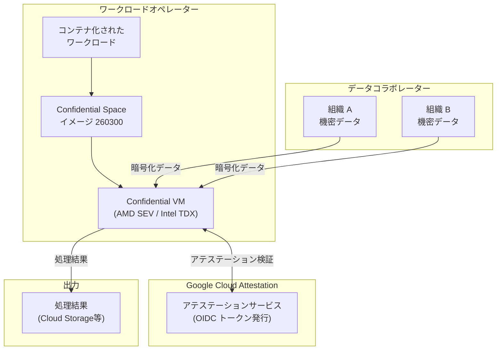

# Confidential Space: 新イメージ 260300 リリース

**リリース日**: 2026-03-24

**サービス**: Confidential Space

**機能**: 新しい Confidential Space イメージ (260300)

**ステータス**: Announcement

[このアップデートのインフォグラフィックを見る](https://takech9203.github.io/google-cloud-news-summary/20260324-confidential-space-image-260300.html)

## 概要

Google Cloud は Confidential Space の新しいイメージ (260300) をリリースしました。Confidential Space は、複数の当事者が機密データを相互に公開することなく、合意されたワークロードで処理できる信頼実行環境 (TEE) を提供するサービスです。

Confidential Space イメージは Container-Optimized OS をベースとした最小構成の OS であり、Confidential VM インスタンス上で単一のコンテナ化されたワークロードを実行するために設計されています。今回のイメージ 260300 は、2026 年 2 月にリリースされたイメージ 260100/260200 に続く最新版となります。

新しいイメージへの更新により、最新のセキュリティパッチや基盤となる OS の改善が適用されます。本番環境で Confidential Space を使用しているユーザーは、セキュリティと安定性を維持するために最新イメージへの移行が推奨されます。

**アップデート前の課題**

- 以前の最新イメージは 260100/260200 (2026 年 2 月リリース) であり、それ以降のセキュリティパッチが未適用だった
- データコラボレーターが support_attributes で LATEST を要求している場合、旧イメージでは検証に失敗する可能性があった

**アップデート後の改善**

- イメージ 260300 が新たに LATEST サポート属性を持つ最新イメージとなった
- 最新のセキュリティパッチと OS 基盤の更新が適用された

## アーキテクチャ図



Confidential Space は、データコラボレーターの機密データを Confidential VM 上の信頼実行環境で処理し、アテステーションサービスによる検証を通じてデータへのアクセスを制御します。

## サービスアップデートの詳細

### 主要機能

1. **新イメージ 260300 の提供**
   - 2026 年 3 月版の Confidential Space イメージが利用可能
   - Production イメージと Debug イメージの両方が提供される

2. **サポート属性の更新**
   - イメージ 260300 が LATEST サポート属性を取得
   - 以前の LATEST イメージ (260100) は STABLE に移行
   - データコラボレーターは support_attributes アサーションでイメージの鮮度を検証可能

3. **Container-Optimized OS ベースの更新**
   - Confidential Space イメージは COS-TDX ベースで構築
   - 暗号化されたディスクパーティション、認証済みネットワーク接続、ブート測定などのセキュリティ機能を継続提供

## 技術仕様

### イメージバージョン履歴 (最近のリリース)

| イメージ名 | リリース日 |
|------|------|
| confidential-space-260300 | 2026-03-24 |
| confidential-space-260100 | 2026-02-21 |
| confidential-space-251200 | 2025-12-16 |
| confidential-space-251001 | 2025-10-13 |
| confidential-space-251000 | 2025-10-03 |

### サポートされる Confidential Computing テクノロジー

| テクノロジー | 説明 |
|------|------|
| AMD SEV | AMD Secure Encrypted Virtualization |
| Intel TDX | Intel Trust Domain Extensions |
| Intel TDX + NVIDIA CC | Intel TDX と NVIDIA Confidential Computing の組み合わせ (Preview) |

### イメージの種類

| タイプ | 用途 | SSH |
|------|------|------|
| Production | 本番ワークロード。データへのアクセスがロックダウンされる | 無効 |
| Debug | テスト用。非本番データで使用 | 有効 (root アクセス可) |

## 設定方法

### 前提条件

1. Google Cloud プロジェクトで Confidential Computing API が有効化されていること
2. ワークロード用のサービスアカウントに `confidentialcomputing.workloadUser` ロールが付与されていること
3. Confidential VM がサポートされるリージョンとマシンタイプを使用すること

### 手順

#### ステップ 1: 最新イメージの確認

```bash
gcloud compute images list \
  --project=confidential-space-images \
  --no-standard-images \
  --filter="family~'confidential-space$'"
```

#### ステップ 2: Confidential VM の作成 (新イメージを使用)

```bash
gcloud compute instances create my-confidential-space-vm \
  --confidential-compute-type=SEV \
  --image=confidential-space-260300 \
  --image-project=confidential-space-images \
  --machine-type=n2d-standard-4 \
  --zone=us-central1-a \
  --service-account=my-workload-sa@my-project.iam.gserviceaccount.com \
  --scopes=cloud-platform \
  --metadata="tee-image-reference=us-docker.pkg.dev/my-project/my-repo/my-workload:latest"
```

#### ステップ 3: サポート属性の検証設定 (データコラボレーター側)

データコラボレーターは Workload Identity Pool のプロバイダー設定で、イメージのサポート属性を検証条件に追加できます。

```json
{
  "attributeCondition": "assertion.submods.confidential_space.support_attributes.includes('LATEST')"
}
```

## メリット

### ビジネス面

- **データプライバシーの確保**: 複数組織間で機密データを安全に共同処理できるため、金融機関間の不正検知や医療データの共同分析などが実現可能
- **コンプライアンス対応**: PII や PHI などの規制対象データを安全に処理する環境を提供

### 技術面

- **ハードウェアベースのセキュリティ**: AMD SEV や Intel TDX による メモリ暗号化でデータ処理中の保護を実現
- **リモートアテステーション**: OIDC トークンベースの検証により、ワークロードの信頼性を暗号学的に証明
- **最新セキュリティパッチ**: 定期的なイメージ更新により既知の脆弱性への対応が維持される

## デメリット・制約事項

### 制限事項

- Confidential Space イメージは単一ワークロードの一回限りの実行を前提としており、永続ストレージは提供されない
- Production イメージでは SSH が無効化されており、ワークロードオペレーターによるデータアクセスは不可
- Debug イメージにはサポート属性が付与されないため、データコラボレーターはテスト時に属性チェックを除外する必要がある

### 考慮すべき点

- 長期間稼働する VM は古いイメージを使い続けるリスクがあるため、ワークロード完了後に VM を削除し、次回実行時に新しい VM を作成する運用が推奨される
- LATEST から STABLE への移行タイミングに注意し、データコラボレーターのアテステーション条件を適切に設定する必要がある

## ユースケース

### ユースケース 1: 金融機関間の不正取引検知

**シナリオ**: 複数の銀行が、互いの顧客データを直接共有することなく、不正送金パターンを共同で分析したい場合。各銀行は暗号化されたトランザクションデータを提供し、Confidential Space 上の分析ワークロードが安全にデータを処理する。

**効果**: 各銀行のデータプライバシーを維持しながら、単独では検出できない組織横断的な不正パターンを特定可能

### ユースケース 2: 医療データの共同研究

**シナリオ**: 複数の医療機関が患者の PHI を保護しながら、共同で疾患パターンの分析や創薬研究を行いたい場合。Confidential Space を使用して、各機関のデータを安全に集約・処理する。

**効果**: HIPAA などの規制に準拠しながら、大規模な医療データセットでの研究が実現可能

## 関連サービス・機能

- **Confidential VM**: Confidential Space の基盤となる仮想マシン。AMD SEV や Intel TDX によるメモリ暗号化を提供
- **Workload Identity Federation**: データコラボレーターがワークロードに対してリソースアクセスを認可するための仕組み
- **Container-Optimized OS**: Confidential Space イメージのベースとなる OS
- **Artifact Registry**: ワークロードのコンテナイメージを格納するリポジトリ
- **Cloud KMS**: 機密データの暗号化キーを管理するサービス

## 参考リンク

- [インフォグラフィック](https://takech9203.github.io/google-cloud-news-summary/20260324-confidential-space-image-260300.html)
- [公式リリースノート](https://docs.cloud.google.com/confidential-computing/confidential-space/docs/release-notes)
- [ドキュメント: Confidential Space 概要](https://cloud.google.com/confidential-computing/confidential-space/docs/confidential-space-overview)
- [ドキュメント: Confidential Space イメージ](https://cloud.google.com/confidential-computing/confidential-space/docs/confidential-space-images)
- [ドキュメント: ワークロードのデプロイ](https://cloud.google.com/confidential-computing/confidential-space/docs/deploy-workloads)

## まとめ

Confidential Space イメージ 260300 のリリースは、定期的なイメージ更新サイクルの一環であり、最新のセキュリティパッチと基盤 OS の改善を含んでいます。Confidential Space を本番環境で使用しているユーザーは、セキュリティと LATEST サポート属性の維持のために、新しいイメージへの移行を検討してください。新規に Confidential Space を導入する場合は、最新のイメージ 260300 を使用してワークロードをデプロイすることが推奨されます。

---

**タグ**: #ConfidentialSpace #ConfidentialComputing #ConfidentialVM #TEE #セキュリティ #データプライバシー #GoogleCloud
