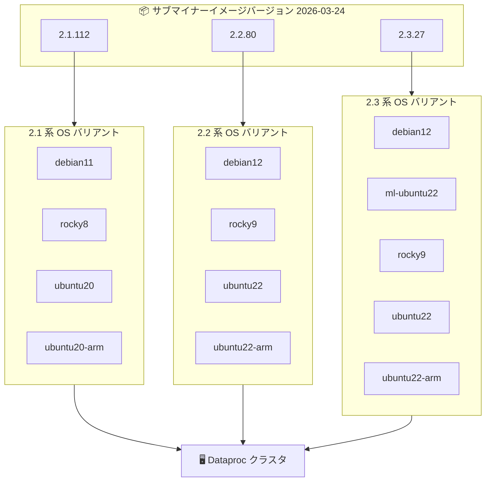

# Dataproc: 新しいサブマイナーイメージバージョンのリリース

**リリース日**: 2026-03-24

**サービス**: Dataproc on Compute Engine

**機能**: サブマイナーイメージバージョンの更新

**ステータス**: Announcement

📊 [このアップデートのインフォグラフィックを見る](https://takech9203.github.io/google-cloud-news-summary/20260324-dataproc-subminor-image-versions.html)

## 概要

Dataproc on Compute Engine において、新しいサブマイナーイメージバージョンがリリースされました。今回のリリースでは、メジャーバージョン 2.1、2.2、2.3 の各系統に対して、Debian、Rocky Linux、Ubuntu、Ubuntu ARM の各 OS ディストリビューション向けイメージが提供されています。

サブマイナーイメージバージョンは、既存のメジャー/マイナーバージョンに対するパッチ適用、コンポーネントの修正、セキュリティアップデートを含む定期的なリリースです。本番環境のクラスタでは、最新のサブマイナーバージョンを使用することが推奨されています。

今回のリリースでは、2.1.112、2.2.80、2.3.27 の 3 系統合計 13 のイメージバージョンが新たに利用可能になりました。

**アップデート前の課題**

- 以前のサブマイナーバージョン (2.1.111、2.2.79、2.3.26) に含まれていた既知の問題やセキュリティ脆弱性が存在していた
- 2026 年 3 月 8 日にリリースされた 2.1.110、2.2.78、2.3.25 は 3 月 11 日にロールバックされており、安定した最新バージョンの提供が待たれていた

**アップデート後の改善**

- 最新のパッチやバグ修正が適用されたイメージバージョンが利用可能になった
- 前回のリリース (3 月 17 日の 2.1.111、2.2.79、2.3.26) からさらに更新された安定版イメージが提供された
- 全 3 系統で Debian、Rocky Linux、Ubuntu、Ubuntu ARM の各 OS ディストリビューションがサポートされている

## アーキテクチャ図



Dataproc クラスタ作成時に、3 つのメジャーバージョン系統からそれぞれ対応する OS ディストリビューションを選択してイメージバージョンを指定します。

## サービスアップデートの詳細

### 主要機能

1. **2.1.112 系イメージ**
   - 対応 OS: Debian 11、Rocky Linux 8、Ubuntu 20.04、Ubuntu 20.04 ARM
   - メジャーバージョン 2.1 のサポート期限: 2026 年 3 月 31 日
   - サポート終了が近いため、2.2 または 2.3 への移行計画を推奨

2. **2.2.80 系イメージ**
   - 対応 OS: Debian 12、Rocky Linux 9、Ubuntu 22.04、Ubuntu 22.04 ARM
   - メジャーバージョン 2.2 のサポート期限: 2027 年 3 月 31 日
   - 2024 年 9 月からデフォルトのイメージバージョンとして設定されている

3. **2.3.27 系イメージ**
   - 対応 OS: Debian 12、ML Ubuntu 22.04、Rocky Linux 9、Ubuntu 22.04、Ubuntu 22.04 ARM
   - メジャーバージョン 2.3 のサポート期限: 2027 年 6 月 9 日
   - ML (Machine Learning) 用イメージが含まれており、GPU やデータサイエンスライブラリがプリインストールされている
   - Premium ティアクラスタのデフォルトイメージバージョン

## 技術仕様

### リリースされたイメージバージョン一覧

| メジャーバージョン | サブマイナーバージョン | OS ディストリビューション |
|------|------|------|
| 2.1 | 2.1.112 | debian11, rocky8, ubuntu20, ubuntu20-arm |
| 2.2 | 2.2.80 | debian12, rocky9, ubuntu22, ubuntu22-arm |
| 2.3 | 2.3.27 | debian12, ml-ubuntu22, rocky9, ubuntu22, ubuntu22-arm |

### バージョンサポート期限

| メジャーバージョン | サポート期限 | 利用可能期限 |
|------|------|------|
| 2.1 | 2026/03/31 | 2026/12/31 |
| 2.2 | 2027/03/31 | 2027/12/31 |
| 2.3 | 2027/06/09 | 2029/06/09 |

## 設定方法

### 前提条件

1. Google Cloud プロジェクトが作成済みであること
2. Dataproc API が有効化されていること
3. 適切な IAM 権限 (dataproc.clusters.create) が付与されていること

### 手順

#### ステップ 1: 特定のサブマイナーバージョンでクラスタを作成

```bash
# 2.3.27-debian12 イメージでクラスタを作成
gcloud dataproc clusters create my-cluster \
    --region=us-central1 \
    --image-version=2.3.27-debian12
```

#### ステップ 2: ARM イメージを使用する場合

```bash
# Ubuntu ARM イメージでクラスタを作成
gcloud dataproc clusters create my-arm-cluster \
    --region=us-central1 \
    --image-version=2.3.27-ubuntu22-arm
```

#### ステップ 3: ML イメージを使用する場合

```bash
# ML イメージでクラスタを作成 (GPU 利用時に推奨)
gcloud dataproc clusters create my-ml-cluster \
    --region=us-central1 \
    --image-version=2.3.27-ml-ubuntu22
```

## メリット

### 技術面

- **セキュリティ強化**: 最新のパッチとセキュリティ修正が適用されたイメージにより、クラスタのセキュリティが向上する
- **安定性向上**: 前回ロールバックされたバージョン (2.1.110/2.2.78/2.3.25) の修正を含む安定版が提供される
- **多様な OS サポート**: Debian、Rocky Linux、Ubuntu、Ubuntu ARM の 4 種類の OS ディストリビューションから選択可能

### ビジネス面

- **運用負荷の軽減**: 定期的なサブマイナーバージョンのリリースにより、手動でのパッチ適用が不要
- **ARM 対応によるコスト最適化**: ARM ベースのインスタンス (T2A) を活用することで、コスト効率の高いクラスタ構成が可能

## デメリット・制約事項

### 制限事項

- サブマイナーバージョンのロールアウトは全リージョンへの展開に最大 1 週間かかる場合がある
- 新しいサブマイナーバージョンがロールバックされる可能性がある (過去のリリースでも複数回発生)

### 考慮すべき点

- メジャーバージョン 2.1 のサポート期限が 2026 年 3 月 31 日と迫っているため、2.1 系を使用中のユーザーは 2.2 または 2.3 への移行を計画する必要がある
- 既存クラスタのイメージバージョンは変更できないため、新しいバージョンを適用するにはクラスタの再作成が必要

## ユースケース

### ユースケース 1: セキュリティパッチの適用

**シナリオ**: 既存の Dataproc クラスタで古いサブマイナーバージョンを使用しており、セキュリティ脆弱性への対応が必要な場合

**実装例**:
```bash
# 現在のクラスタのイメージバージョンを確認
gcloud dataproc clusters describe my-cluster \
    --region=us-central1 \
    --format="value(config.softwareConfig.imageVersion)"

# 最新バージョンで新しいクラスタを作成
gcloud dataproc clusters create my-cluster-v2 \
    --region=us-central1 \
    --image-version=2.3.27-debian12

# ワークロードの移行後、古いクラスタを削除
gcloud dataproc clusters delete my-cluster --region=us-central1
```

**効果**: 最新のセキュリティパッチが適用され、CVE 対応が完了する

### ユースケース 2: ARM インスタンスによるコスト最適化

**シナリオ**: バッチ処理ワークロードにおいて、ARM ベースのインスタンスを使用してコストを削減したい場合

**実装例**:
```bash
gcloud dataproc clusters create my-arm-cluster \
    --region=us-central1 \
    --image-version=2.3.27-ubuntu22-arm \
    --master-machine-type=t2a-standard-4 \
    --worker-machine-type=t2a-standard-8 \
    --num-workers=4
```

**効果**: ARM ベースの Tau T2A インスタンスにより、同等のワークロードを低コストで実行可能

## 料金

Dataproc の料金は、クラスタで使用される仮想 CPU あたり 1 時間 0.01 ドルです。この料金は Compute Engine リソースの料金に上乗せされます。サブマイナーイメージバージョンの更新自体に追加料金は発生しません。

詳細は [Dataproc 料金ページ](https://cloud.google.com/dataproc/pricing) を参照してください。

## 関連サービス・機能

- **[Serverless for Apache Spark](https://cloud.google.com/dataproc-serverless/docs)**: クラスタ管理不要のサーバーレス Spark 実行環境。インフラ管理が不要な場合の代替選択肢
- **[Cloud Storage](https://cloud.google.com/storage)**: Dataproc クラスタのデータストレージとして利用。HDFS の代替としてクラスタ外部にデータを永続化
- **[BigQuery](https://cloud.google.com/bigquery)**: Dataproc の Spark ジョブから BigQuery コネクタ経由でデータの読み書きが可能
- **[Cloud Monitoring](https://cloud.google.com/monitoring)**: Dataproc クラスタのメトリクス監視とアラート設定

## 参考リンク

- 📊 [インフォグラフィック](https://takech9203.github.io/google-cloud-news-summary/20260324-dataproc-subminor-image-versions.html)
- [公式リリースノート](https://docs.cloud.google.com/release-notes#March_24_2026)
- [Dataproc イメージバージョン一覧](https://docs.cloud.google.com/dataproc/docs/concepts/versioning/dataproc-version-clusters#supported-dataproc-image-versions)
- [Dataproc バージョニングの概要](https://docs.cloud.google.com/dataproc/docs/concepts/versioning/overview)
- [料金ページ](https://cloud.google.com/dataproc/pricing)

## まとめ

Dataproc on Compute Engine の 2.1.112、2.2.80、2.3.27 系の新しいサブマイナーイメージバージョンがリリースされました。定期的なサブマイナーバージョンの更新はセキュリティパッチやバグ修正を含むため、本番環境では最新のサブマイナーバージョンへの更新が推奨されます。特にメジャーバージョン 2.1 のサポート期限が 2026 年 3 月 31 日と迫っているため、2.1 系を使用中のユーザーは 2.2 または 2.3 への移行を早急に検討してください。

---

**タグ**: #Dataproc #ComputeEngine #ImageVersion #BigData #Spark #Hadoop
