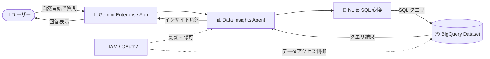

# Gemini Enterprise: Data Insights agent (GA with allowlist)

**リリース日**: 2026-03-24

**サービス**: Gemini Enterprise

**機能**: Data Insights agent

**ステータス**: GA (allowlist)

📊 [このアップデートのインフォグラフィックを見る](https://takech9203.github.io/google-cloud-news-summary/20260324-gemini-enterprise-data-insights-agent.html)

## 概要

Gemini Enterprise の Data Insights agent が GA (allowlist) として提供開始された。Data Insights agent は Google が構築した「Made by Google」エージェントであり、BigQuery に格納されたデータからインサイトを自然言語で取得できる機能を提供する。

Data Insights agent は、ユーザーが自然言語で質問を入力すると、それを SQL クエリに変換して BigQuery データセットに対して実行し、結果をわかりやすい形式で返す。これにより、SQL の知識がないビジネスユーザーでも BigQuery のデータを直接分析できるようになる。

本機能は GA with allowlist のステータスであり、利用するには Google Cloud の営業担当者に連絡してアクセスをリクエストする必要がある。

**アップデート前の課題**

- BigQuery のデータからインサイトを得るには SQL の知識が必要で、ビジネスユーザーが直接データを分析することが難しかった
- データ分析のリクエストはデータエンジニアやアナリストに依頼する必要があり、回答までに時間がかかっていた
- 自然言語からの SQL 生成は Preview 段階であり、本番環境での利用には信頼性の面で懸念があった

**アップデート後の改善**

- Data Insights agent が GA となり、本番ワークロードでの利用が可能になった
- 自然言語で BigQuery データに対する質問ができ、SQL の知識がなくてもデータ分析が可能になった
- Gemini Enterprise アプリまたは REST API からプログラム的にエージェントを利用できるようになった

## アーキテクチャ図



ユーザーが自然言語で質問すると、Data Insights agent が SQL に変換して BigQuery に問い合わせを行い、結果をインサイトとして返す。IAM と OAuth2 による認証・認可でデータアクセスが制御される。

## サービスアップデートの詳細

### 主要機能

1. **自然言語によるデータクエリ**
   - ユーザーが自然言語で質問を入力すると、エージェントが自動的に SQL クエリに変換して BigQuery データセットに対して実行する
   - スキーマの説明や NL to SQL のプロンプトをカスタマイズして、変換精度を向上させることが可能

2. **テーブルアクセス制御**
   - allowlist (許可リスト) または blocklist (拒否リスト) を使用して、エージェントがアクセスできるテーブルを制御できる
   - 機密データを含むテーブルへのアクセスを制限することで、セキュリティを確保

3. **NL to SQL のカスタマイズ**
   - 自然言語クエリと期待される SQL の例を提供することで、エージェントの出力品質を向上できる
   - スキーマの説明を自然言語で記述し、エージェントの理解を補助

4. **マルチインターフェース対応**
   - Gemini Enterprise アプリの UI からインタラクティブに利用可能
   - REST API (`streamAssist` メソッド) を使用してプログラム的にアクセスすることも可能

## 技術仕様

### 必要な IAM ロール

| ロール | 説明 |
|--------|------|
| `roles/bigquery.dataViewer` | BigQuery データの閲覧権限 |
| `roles/bigquery.jobUser` | BigQuery ジョブの実行権限 |
| `roles/bigquery.metadataViewer` | BigQuery メタデータの閲覧権限 |
| `roles/discoveryengine.admin` | Gemini Enterprise の管理権限 (管理者用) |

### エージェント設定 (REST API)

```json
{
  "displayName": "Data Insights Agent",
  "description": "BigQuery データからインサイトを提供するエージェント",
  "managed_agent_definition": {
    "data_science_agent_config": {
      "bq_project_id": "PROJECT_ID",
      "bq_dataset_id": "DATASET_ID",
      "allowlistTables": ["table_1", "table_2"],
      "blocklistTables": ["sensitive_table"]
    }
  },
  "authorization_config": {
    "tool_authorizations": ["AUTHORIZATION_RESOURCE_NAME"]
  }
}
```

## 設定方法

### 前提条件

1. Gemini Enterprise のセットアップが完了していること
2. Gemini Enterprise のライセンスを取得していること
3. Google Cloud 営業担当者に連絡して Data Insights agent へのアクセスが許可されていること
4. 分析対象の BigQuery データセットが準備されていること

### 手順

#### ステップ 1: OAuth2 認証リソースの作成

```bash
curl -X POST \
  -H "Authorization: Bearer $(gcloud auth print-access-token)" \
  -H "Content-Type: application/json" \
  -H "X-Goog-User-Project: PROJECT_NUMBER" \
  "https://discoveryengine.googleapis.com/v1alpha/projects/PROJECT_NUMBER/locations/LOCATION/authorizations?authorizationId=AUTHORIZATION_ID" \
  -d '{
    "name": "projects/PROJECT_NUMBER/locations/LOCATION/authorizations/AUTHORIZATION_ID",
    "serverSideOauth2": {
      "clientId": "CLIENT_ID",
      "clientSecret": "CLIENT_SECRET",
      "authorizationUri": "AUTHORIZATION_URI",
      "tokenUri": "https://oauth2.googleapis.com/token"
    }
  }'
```

Data Insights agent が BigQuery データにアクセスするための認証リソースを作成する。

#### ステップ 2: エージェントインスタンスの作成

```bash
curl -X POST \
  -H "Authorization: Bearer $(gcloud auth print-access-token)" \
  -H "Content-Type: application/json" \
  -H "X-Goog-User-Project: PROJECT_NUMBER" \
  "https://discoveryengine.googleapis.com/v1alpha/projects/PROJECT_NUMBER/locations/LOCATION/collections/default_collection/engines/APP_ID/assistants/default_assistant/agents" \
  -d '{
    "displayName": "AGENT_NAME",
    "description": "AGENT_DESCRIPTION",
    "managed_agent_definition": {
      "data_science_agent_config": {
        "bq_project_id": "BQ_PROJECT_ID",
        "bq_dataset_id": "BQ_DATASET_ID"
      }
    },
    "authorization_config": {
      "tool_authorizations": ["AUTHORIZATION_RESOURCE_NAME"]
    }
  }'
```

BigQuery データセットを指定してエージェントインスタンスを作成する。

#### ステップ 3: エージェントのデプロイ

```bash
curl -X POST \
  -H "Authorization: Bearer $(gcloud auth print-access-token)" \
  -H "Content-Type: application/json" \
  -H "X-Goog-User-Project: PROJECT_NUMBER" \
  "https://discoveryengine.googleapis.com/v1alpha/AGENT_RESOURCE_NAME:deploy" \
  -d '{
    "name": "AGENT_RESOURCE_NAME"
  }'
```

作成したエージェントをデプロイして利用可能にする。デプロイは Long-Running Operation (LRO) として実行される。

#### ステップ 4: ユーザー権限の設定

Google Cloud コンソールの Gemini Enterprise ページからエージェントのユーザー権限を設定する。ユーザーまたはグループ単位で IAM ロールを割り当てる。

## メリット

### ビジネス面

- **データ民主化の推進**: SQL の知識がないビジネスユーザーでも、自然言語で BigQuery データからインサイトを取得でき、データドリブンな意思決定を加速できる
- **分析の待ち時間削減**: データアナリストへの依頼を介さず、ユーザー自身がリアルタイムでデータにアクセスできるため、意思決定のスピードが向上する

### 技術面

- **API によるプログラム統合**: REST API を通じてエージェントをカスタムアプリケーションに組み込むことが可能
- **セキュリティ制御**: テーブルの allowlist/blocklist と IAM ロールによる細かなアクセス制御が可能

## デメリット・制約事項

### 制限事項

- GA with allowlist のため、利用するには Google Cloud 営業担当者への連絡が必要であり、すぐにセルフサービスで利用開始することはできない
- Gemini Enterprise のライセンスが別途必要

### 考慮すべき点

- NL to SQL の変換精度は、スキーマの説明や例の提供によるチューニングが必要になる場合がある
- 複雑なクエリや結合を伴う分析では、自然言語からの変換が意図通りにならない可能性がある
- BigQuery のクエリコストはエージェント利用時にも発生するため、コスト管理が必要

## ユースケース

### ユースケース 1: 営業チームによる売上分析

**シナリオ**: 営業マネージャーが「先月の地域別売上トップ 10 は?」「前四半期比で売上が 20% 以上減少した製品は?」といった質問を自然言語で行い、BigQuery に格納された売上データからリアルタイムにインサイトを取得する。

**効果**: データアナリストへの依頼待ち時間をゼロにし、営業会議の場で即座にデータに基づいた議論が可能になる。

### ユースケース 2: カスタムダッシュボードへの組み込み

**シナリオ**: 社内ポータルサイトに REST API を通じて Data Insights agent を組み込み、各部門のユーザーがチャット形式でデータを問い合わせできるインターフェースを構築する。

**効果**: 既存の社内ツールに AI を活用したデータ分析機能を統合し、ユーザーの利便性を向上させる。

## 料金

Data Insights agent の利用には Gemini Enterprise のサブスクリプションとライセンスが必要。料金の詳細は Gemini Enterprise の料金ページを参照。

- 月額サブスクリプションまたは年間サブスクリプションから選択可能
- ライセンスはユーザー単位で割り当て
- BigQuery のクエリコストは別途発生

## 関連サービス・機能

- **BigQuery**: Data Insights agent のデータソースとなるデータウェアハウスサービス
- **Gemini Enterprise**: Data Insights agent のホストプラットフォーム。ライセンス管理やアプリ管理を提供
- **IAM (Identity and Access Management)**: エージェントおよびデータへのアクセス制御
- **Discovery Engine API**: エージェントの作成・管理・デプロイに使用される API 基盤

## 参考リンク

- 📊 [インフォグラフィック](https://takech9203.github.io/google-cloud-news-summary/20260324-gemini-enterprise-data-insights-agent.html)
- [公式リリースノート](https://docs.cloud.google.com/release-notes#March_24_2026)
- [Data Insights agent ドキュメント](https://cloud.google.com/gemini/enterprise/docs/data-agent)
- [Gemini Enterprise ライセンス](https://cloud.google.com/gemini/enterprise/docs/licenses)

## まとめ

Gemini Enterprise の Data Insights agent が GA (allowlist) となり、BigQuery データに対する自然言語でのクエリが本番環境で利用可能になった。SQL の知識を持たないビジネスユーザーでもデータからインサイトを直接取得できるようになる点で、データ民主化を推進する重要なアップデートである。利用を希望する場合は、Google Cloud の営業担当者に連絡してアクセスをリクエストすることが推奨される。

---

**タグ**: #GeminiEnterprise #BigQuery #DataInsights #AI #NaturalLanguageQuery #GA
