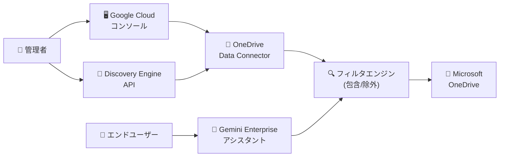

# Gemini Enterprise: Microsoft OneDrive データストアのフィルタリング強化 (Preview)

**リリース日**: 2026-03-24

**サービス**: Gemini Enterprise

**機能**: Microsoft OneDrive データストアのフィルタリング強化

**ステータス**: Public Preview

📊 [このアップデートのインフォグラフィックを見る](https://takech9203.github.io/google-cloud-news-summary/20260324-gemini-enterprise-onedrive-filtering.html)

## 概要

Gemini Enterprise において、Microsoft OneDrive データストアに対するフィルタリング機能が強化され、Google Cloud コンソールまたは API を使用してフィルタを構成できるようになった。この機能は Public Preview として提供されている。

フィルタを設定することで、Gemini Enterprise アシスタントがアクセスできるコンテンツを OneDrive パスの包含・除外によって正確に定義できる。これにより、組織内の機密情報へのアクセスを制御し、アシスタントが参照するデータの範囲を適切に管理することが可能になる。

この機能は、Microsoft OneDrive を外部データソースとして Gemini Enterprise に接続している企業ユーザーを対象としている。特に、大量のファイルが保存された OneDrive 環境で、セキュリティやコンプライアンスの観点からデータアクセスを細かく制御したい管理者にとって有用な機能である。

**アップデート前の課題**

- OneDrive データストアのフィルタ設定は API 経由でのみ可能であり、Google Cloud コンソールからの設定ができなかった
- フィルタの構成・更新にはREST API の知識が必要であり、管理者にとって設定のハードルが高かった
- データストア作成後のフィルタ変更時に、既存フィルタを含むすべてのフィルタを再指定する必要があった

**アップデート後の改善**

- Google Cloud コンソールから GUI でフィルタを構成できるようになり、設定の敷居が下がった
- API に加えてコンソールでもフィルタの作成・更新・確認が可能になった
- OneDrive パスの包含・除外を柔軟に定義でき、アシスタントがアクセスするデータ範囲をより直感的に管理できるようになった

## アーキテクチャ図



管理者が Google Cloud コンソールまたは API を通じてフィルタを設定し、フィルタエンジンが OneDrive から取得するデータの範囲を制御する。エンドユーザーが Gemini Enterprise アシスタントに問い合わせると、フィルタが適用された範囲のデータのみが検索・参照される。

## サービスアップデートの詳細

### 主要機能

1. **Google Cloud コンソールでのフィルタ構成**
   - GUI ベースでフィルタの作成・更新・確認が可能
   - API の知識がなくてもフィルタを管理できる

2. **OneDrive パスベースのフィルタリング**
   - `structured_search_filter` パラメータを使用してフィルタを定義
   - キーと値のペアで OneDrive フィールドに基づくフィルタリングが可能
   - 特定の OneDrive パスを包含または除外してデータアクセス範囲を制御

3. **既存データストアへのフィルタ追加・更新**
   - `updateDataConnector` メソッドで既存データストアのフィルタを更新可能
   - `dataConnector.get` メソッドでフィルタの適用状況を確認可能

## 技術仕様

### フィルタ設定パラメータ

| 項目 | 詳細 |
|------|------|
| フィルタフィールド | `structured_search_filter` (params オブジェクト内) |
| フィルタ形式 | キーと値のペア (値は文字列の配列) |
| 設定方法 | Google Cloud コンソール / REST API |
| 対象接続モード | Federated Search |
| 適用範囲 | 検索のみ (OneDrive アクションには適用されない) |

### API エンドポイント

| 操作 | API メソッド |
|------|-------------|
| データストア作成時にフィルタ設定 | `setUpDataConnector` |
| 既存データストアのフィルタ更新 | `updateDataConnector` |
| フィルタ設定の確認 | `dataConnector.get` |

### API リクエスト例

```json
{
  "collectionId": "COLLECTION_ID",
  "collectionDisplayName": "COLLECTION_DISPLAY_NAME",
  "dataConnector": {
    "dataSource": "onedrive_federated_search",
    "params": {
      "client_id": "CLIENT_ID",
      "client_secret": "CLIENT_SECRET",
      "tenant_id": "TENANT_ID",
      "structured_search_filter": {
        "FILTER_KEY": ["FILTER_VALUE1", "FILTER_VALUE2"]
      }
    },
    "entities": [{"entityName": "file"}],
    "refreshInterval": "7200s",
    "connectorType": "THIRD_PARTY_FEDERATED",
    "connectorModes": ["FEDERATED"]
  }
}
```

## 設定方法

### 前提条件

1. Gemini Enterprise のライセンスが有効であること
2. ID プロバイダの構成が完了していること
3. Discovery Engine Editor ロール (`roles/discoveryengine.editor`) が付与されていること
4. Microsoft Entra ID で OAuth 2.0 アプリケーションとして登録済みであること (Client ID、Client Secret、Tenant ID が必要)
5. Microsoft API パーミッションが適切に構成されていること

### 手順

#### ステップ 1: Microsoft Entra ID での認証情報の準備

Microsoft Entra ID で Gemini Enterprise を OAuth 2.0 アプリケーションとして登録し、以下の認証情報を取得する。

- Client ID
- Client Secret
- Tenant ID

#### ステップ 2: API を使用したフィルタ付きデータストアの作成

```bash
curl -X POST \
  -H "Authorization: Bearer $(gcloud auth print-access-token)" \
  -H "Content-Type: application/json" \
  -H "X-Goog-User-Project: PROJECT_ID" \
  "https://ENDPOINT_LOCATION-discoveryengine.googleapis.com/v1alpha/projects/PROJECT_ID/locations/LOCATION:setUpDataConnector" \
  -d '{
    "collectionId": "COLLECTION_ID",
    "collectionDisplayName": "COLLECTION_DISPLAY_NAME",
    "dataConnector": {
      "dataSource": "onedrive_federated_search",
      "params": {
        "client_id": "CLIENT_ID",
        "client_secret": "CLIENT_SECRET",
        "tenant_id": "TENANT_ID",
        "structured_search_filter": {
          "FILTER_KEY": ["FILTER_VALUE1", "FILTER_VALUE2"]
        }
      },
      "entities": [{"entityName": "file"}],
      "refreshInterval": "7200s",
      "connectorType": "THIRD_PARTY_FEDERATED",
      "connectorModes": ["FEDERATED"]
    }
  }'
```

`ENDPOINT_LOCATION` には `us`、`eu`、または `global` を指定する。

#### ステップ 3: フィルタの確認

```bash
curl -X GET \
  -H "Authorization: Bearer $(gcloud auth print-access-token)" \
  -H "X-Goog-User-Project: PROJECT_ID" \
  "https://ENDPOINT_LOCATION-discoveryengine.googleapis.com/v1alpha/projects/PROJECT_ID/locations/LOCATION/collections/COLLECTION_ID/dataConnector"
```

レスポンスの `structured_search_filter` フィールドでフィルタが正しく適用されていることを確認する。

## メリット

### ビジネス面

- **データガバナンスの強化**: 機密情報を含む OneDrive パスを除外することで、コンプライアンス要件に対応できる
- **管理の効率化**: Google Cloud コンソールから GUI で設定できるため、管理者の作業負荷が軽減される

### 技術面

- **柔軟なアクセス制御**: パスベースの包含・除外フィルタにより、きめ細かいデータアクセス制御が実現できる
- **API と GUI の両対応**: 自動化が必要な場合は API、手動管理には GUI と、用途に応じた使い分けが可能

## デメリット・制約事項

### 制限事項

- 本機能は Public Preview であり、「Pre-GA Offerings Terms」が適用される。サポートが限定的な場合がある
- フィルタは OneDrive アクション (フォルダ作成、ファイルコピーなど) には適用されない。検索時のデータ取得にのみ有効
- フィルタの更新時は、変更のないフィルタを含むすべてのフィルタを再指定する必要がある

### 考慮すべき点

- ID プロバイダの構成が前提条件であり、未構成の場合はデータソースアクセス制御が機能しない
- Microsoft Entra ID での OAuth 2.0 アプリケーション登録と API パーミッション設定が必要であり、Microsoft 側の管理者との連携が求められる

## ユースケース

### ユースケース 1: 部門別データアクセスの制御

**シナリオ**: 大企業の IT 管理者が、営業部門の Gemini Enterprise アシスタントに対して、営業部門の OneDrive フォルダのみにアクセスを制限したい。

**実装例**:
```json
{
  "structured_search_filter": {
    "Path": [
      "https://contoso.sharepoint.com/personal/sales_team/Documents/Sales/"
    ]
  }
}
```

**効果**: アシスタントは営業関連のドキュメントのみを参照し、他部門の機密情報にはアクセスしない。

### ユースケース 2: 機密フォルダの除外

**シナリオ**: 法務部門の契約書や人事部門の個人情報を含むフォルダを、全社向けアシスタントの検索対象から除外したい。

**効果**: コンプライアンス要件を満たしつつ、社内ナレッジの活用を促進できる。

## 利用可能リージョン

データストアのマルチリージョンとして以下が利用可能:

- `us` (米国マルチリージョン)
- `eu` (EU マルチリージョン)
- `global` (グローバル)

## 関連サービス・機能

- **Gemini Enterprise**: AI アシスタントプラットフォーム。OneDrive データストアはサードパーティデータコネクタの一つ
- **Discovery Engine API**: データストアの作成・管理に使用される基盤 API
- **Microsoft SharePoint コネクタ**: 同様のフィルタリング機能が SharePoint データストアにも提供されている (包含フィルタ `admin_filter` と除外フィルタ `admin_exclusion_filter` を使用)
- **Microsoft Entra ID**: Gemini Enterprise と OneDrive 間の認証に必要な ID プロバイダ

## 参考リンク

- 📊 [インフォグラフィック](https://takech9203.github.io/google-cloud-news-summary/20260324-gemini-enterprise-onedrive-filtering.html)
- [公式リリースノート](https://docs.cloud.google.com/release-notes#March_24_2026)
- [OneDrive フィルタ設定ドキュメント](https://cloud.google.com/gemini/enterprise/docs/connectors/ms-onedrive/add-filters-to-onedrive-data-store)
- [OneDrive データストア設定ガイド](https://cloud.google.com/gemini/enterprise/docs/connectors/ms-onedrive/set-up-data-store)
- [Gemini Enterprise エディション](https://cloud.google.com/gemini/enterprise/docs/editions)

## まとめ

Gemini Enterprise の Microsoft OneDrive データストアに対するフィルタリング機能が強化され、Google Cloud コンソールと API の両方からフィルタを構成できるようになった。OneDrive を外部データソースとして利用している組織は、パスベースの包含・除外フィルタを活用することで、アシスタントがアクセスするデータの範囲を適切に制御し、セキュリティとコンプライアンスの要件を満たしつつ、社内ナレッジの活用を推進できる。本機能は Public Preview のため、本番環境への導入時には GA への昇格状況を確認することを推奨する。

---

**タグ**: #GeminiEnterprise #OneDrive #DataStore #Filtering #Preview #DataConnector #DiscoveryEngine
