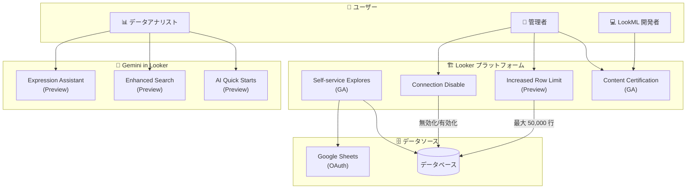

# Looker: Looker 26.4 機能アップデート

**リリース日**: 2026-03-24

**サービス**: Looker

**機能**: Looker 26.4 機能アップデート

**ステータス**: Mixed (GA and Preview)

:bar_chart: [このアップデートのインフォグラフィックを見る](https://takech9203.github.io/google-cloud-news-summary/20260324-looker-26-4-features.html)

## 概要

Looker 26.4 は、Gemini を活用した AI 機能の拡充、データガバナンスの強化、運用管理の改善を含む大規模なリリースである。Expression Assistant、Enhanced Search、AI-assisted Quick Starts といった Gemini 連携機能が Preview として追加され、Self-service Explores と Content Certification が GA に昇格した。

このリリースは、BI プラットフォームとしての Looker に AI ファーストのアプローチを本格的に導入するものであり、データアナリスト、BI 管理者、LookML 開発者の全てのペルソナに影響する。特に Gemini 統合により、Looker の学習曲線を下げ、データ分析の民主化を加速させることが期待される。

**アップデート前の課題**

- テーブル計算やカスタムフィールドの式を手動で記述する必要があり、Looker 式の構文知識が求められた
- コンテンツ検索はキーワードマッチングに限定され、ビジネス用語での検索が困難だった
- データベース側の障害時、管理者はクエリを手動で停止するか、キューに残り続けるクエリを放置するしかなかった
- Self-service Explores と Content Certification は Preview 段階であり、本番環境での利用に制約があった
- マップ、散布図、テーブルチャートの行数上限が 5,000 行に制限されており、大規模データの可視化に不向きだった
- Explore の Quick Start 分析は手動で定義する必要があり、新しいユーザーの導入障壁となっていた

**アップデート後の改善**

- Gemini Expression Assistant により、自然言語でテーブル計算やカスタムフィールドの式を生成可能になった (Preview)
- Enhanced Search により、ビジネス用語や分析的な質問でセマンティック検索が可能になった (Preview)
- Connection Disable オプションにより、データベース障害時にワンクリックで接続を一時停止できるようになった
- Self-service Explores が GA 化し、OAuth 経由の Google Sheets アップロードにも対応した
- Content Certification が GA 化し、LookML Explores の認証、自動認証、認証ステータスでの検索フィルタリングが追加された
- 管理者がマップ、散布図、テーブルチャートの行数上限を最大 50,000 行まで設定可能になった (Preview)
- Gemini が Explore を分析して Quick Start 分析を自動生成できるようになった (Preview)

## アーキテクチャ図

Looker 26.4 のアーキテクチャ概要図。Gemini を活用した AI 機能群がユーザー向けに提供され、プラットフォーム側ではガバナンスと運用管理が強化されている。

## サービスアップデートの詳細

### 主要機能

1. **Expression Assistant (Preview)**
   - Gemini を使用して、自然言語でテーブル計算やカスタムフィールドの Looker 式を生成
   - 「Help me write an expression with Gemini」ボタンから利用可能
   - 生成された式は「Refine」で修正、「Apply」で適用が可能
   - Looker (original) は 26.4 以降、Looker (Google Cloud core) は Google Cloud console で有効化
   - `create_table_calculations` または `create_custom_fields` 権限と `Gemini` ロールが必要

2. **Connection Disable オプション**
   - Connection Settings ページに新しい「Disable Connection」トグルを追加
   - データベース側に障害がある場合、管理者が接続を一時的に無効化できる
   - 無効化中は Looker がデータベースにクエリを送信せず、ユーザーにエラーメッセージを返す
   - データベースの問題解決後、トグルをオフにすることで即座に復旧

3. **Self-service Explores (GA)**
   - CSV、Excel、Google Sheets ファイルをアップロードしてデータを探索可能
   - Looker 26.4 で OAuth 経由の Google Sheets アップロードに対応 (Google Drive ナビゲーションでシートを選択)
   - アップロードされたデータは BigQuery に永続化され、LookML モデルが自動生成される
   - `upload_data` 権限が必要

4. **Content Certification (GA)**
   - ダッシュボード、Look、Explore に信頼性を示す認証バッジを付与する機能
   - Looker 26.4 での新規追加:
     - LookML Explores の認証が可能に
     - 管理者が現在および将来の LookML ダッシュボードと LookML Explores を自動認証可能
     - Enhanced Search 有効時、認証ステータスで検索結果のソート・フィルタリングが可能
   - 3 段階の信頼レベル: Ungoverned (非信頼)、Empty state (標準)、Certified (高信頼)
   - 重要な編集が行われると認証が自動的に取り消される「Revoke Certification on Edit」オプション

5. **Enhanced Search (Preview)**
   - Gemini によるセマンティック検索で、キーワードマッチングを超えた概念的な意味の理解を実現
   - ビジネス用語や分析的な質問 (例: 「total customer acquisition cost」) での検索が可能
   - Boards、Dashboards、Explores、Folders、Looks、LookML ダッシュボードなどを検索対象
   - コンテンツの人気度、閲覧頻度、認証ステータスに基づくランキング
   - コンテンツタイプ、フォルダ、作成者、日付、認証ステータスでフィルタリング可能

6. **AI-assisted Quick Starts for Explores (Preview)**
   - Gemini が Explore を分析し、Quick Start 分析を自動生成
   - Quick Start が未定義の Explore を開くと「Try AI Quick Starts」オプションが表示
   - 生成された分析をクリックすると、クエリが自動実行されビジュアライゼーションが表示
   - `develop` 権限と `Gemini` ロールが必要

7. **Increased Row Limit (Preview)**
   - マップチャート、散布図、テーブルチャートの行数上限を最大 50,000 行/データポイントまで設定可能
   - Content guardrails 管理ページの「Visualization limits」で設定
   - デフォルトは無効、管理者が有効化する必要がある
   - 既存のダッシュボードタイルは自動反映されず、手動で編集が必要

## 技術仕様

### 各機能のステータスと要件

| 機能 | ステータス | 対象プラットフォーム | 主な要件 |
|------|-----------|---------------------|----------|
| Expression Assistant | Preview | Looker (original) 26.4+, Looker (Google Cloud core) | Gemini in Looker 有効化、Gemini ロール |
| Connection Disable | GA | Looker (original), Looker (Google Cloud core) | 管理者権限 |
| Self-service Explores | GA | Looker 25.20+, OAuth は 26.2+ | `upload_data` 権限、BigQuery 接続 |
| Content Certification | GA | Looker (original), Looker (Google Cloud core) | `certify_content` 権限 |
| Enhanced Search | Preview | Looker (original), Looker (Google Cloud core) | Gemini in Looker 有効化、Semantic Search 有効化 |
| AI Quick Starts | Preview | Looker (original) 25.2+, Looker (Google Cloud core) | Gemini in Looker 有効化、`develop` 権限 |
| Increased Row Limit | Preview | Looker (original), Looker (Google Cloud core) | 管理者が Preview feature を有効化 |

### Increased Row Limit の Visualization limits 設定

| チャートタイプ | 設定項目 | 上限 |
|---------------|---------|------|
| マップチャート | Maps visualization row limit | 50,000 データポイント |
| 散布図 | Scatterplot visualization row limit | 50,000 データポイント |
| テーブルチャート | Table visualization row limit | 50,000 行 |

### PDF ダウンロード時の制限 (Increased Row Limit 有効時)

| 項目 | 制限値 |
|------|--------|
| テーブルチャート1タイルあたり最大行数 | 50,000 行 |
| ダッシュボードあたり最大セル数合計 | 200,000 セル |
| 散布図/マップチャート最大データポイント | 50,000 |

## 設定方法

### 前提条件

1. Looker インスタンスが 26.4 以降にアップデート済みであること
2. Gemini 機能を利用する場合、Gemini in Looker が管理者により有効化されていること
3. 各機能に応じた適切な権限とロールが付与されていること

### 手順

#### ステップ 1: Gemini in Looker の有効化

Looker (original) の場合:
- Admin パネル > Platform > Gemini in Looker で各機能を個別に有効化
- Expression Assistant、Semantic Search、AI-Assisted Quick Starts をそれぞれトグルでオン

Looker (Google Cloud core) の場合:
- Google Cloud console で Gemini in Looker を有効化

#### ステップ 2: Self-service Explores の OAuth 設定 (Google Sheets アップロード用)

1. Google Cloud console で OAuth クライアントを作成 (Web application タイプ)
2. Authorized JavaScript origins に Looker インスタンスの URL を追加
3. Client ID と Client secret を Looker の Admin > Self-service Explores ページに入力

#### ステップ 3: Increased Row Limit の有効化

1. Admin パネル > Preview Features で「Increased Row Limit」を有効化
2. Admin パネル > Performance Center > Content guardrails で Visualization limits を設定
3. 既存のダッシュボードタイルを編集して新しい行数上限を適用

#### ステップ 4: Connection Disable の使用

1. Admin パネル > Database > Connections で対象の接続を編集
2. 「Disable Connection」トグルを有効化
3. データベースの問題解決後、トグルを無効化して接続を復旧

## メリット

### ビジネス面

- **データ分析の民主化**: Gemini Expression Assistant と AI Quick Starts により、Looker 式の知識がなくてもデータ分析が可能になり、セルフサービス BI の利用者層が拡大する
- **データガバナンスの強化**: Content Certification の GA 化と LookML Explores 認証により、組織全体でのデータ信頼性管理が本格運用可能になる
- **運用コストの削減**: Connection Disable により、データベース障害時の対応が簡素化され、障害対応時間が短縮される

### 技術面

- **セマンティック検索**: Enhanced Search により、コンテンツの発見性が大幅に向上し、既存のダッシュボードや分析の再利用が促進される
- **大規模データの可視化**: 行数上限が 50,000 に拡大され、より詳細なデータの可視化が可能になる
- **自動認証**: LookML ダッシュボードと Explores の自動認証により、ガバナンスワークフローの自動化が実現する

## デメリット・制約事項

### 制限事項

- Gemini 機能 (Expression Assistant、Enhanced Search、AI Quick Starts) は Preview 段階であり、サポートが限定的
- Expression Assistant は英語 (アメリカ英語) での利用が推奨されており、多言語対応は限定的
- Increased Row Limit を有効化すると、インスタンスのパフォーマンスに影響する可能性がある (データベース負荷、ブラウザ負荷、ネットワーク負荷)
- Increased Row Limit の既存ダッシュボードタイルへの自動反映はされない
- PDF ダウンロード時、テーブルチャートはダッシュボードあたり 200,000 セルの合計上限がある

### 考慮すべき点

- Self-service Explores のデータは BigQuery に永続化されるため、ストレージコストが発生する
- Content Certification の「Revoke Certification on Edit」を有効にすると、重要な編集時に認証が自動取り消しされるため、ワークフローへの影響を事前に確認する必要がある
- Enhanced Search の利用には Gemini in Looker のライセンスと有効化が必要
- Connection Disable 中は全てのクエリがブロックされるため、影響範囲を事前に確認する必要がある

## ユースケース

### ユースケース 1: ビジネスアナリストによるセルフサービス分析

**シナリオ**: マーケティング部門のアナリストが、Looker 式の構文を知らなくても、売上データのテーブル計算を作成したい。

**実装例**:
1. Explore でテーブル計算を追加する際に「Help me write an expression with Gemini」をクリック
2. 「前月比の売上成長率をパーセンテージで表示し、正の場合は上矢印、負の場合は下矢印を付ける」と自然言語で記述
3. Gemini が生成した式を確認し、「Apply」で適用

**効果**: Looker 式の学習コストを削減し、非技術ユーザーでも高度なテーブル計算を作成可能にする

### ユースケース 2: データベース障害時の迅速な対応

**シナリオ**: 本番データベースでパフォーマンス問題が発生し、Looker からの大量クエリがデータベースの負荷を悪化させている。

**実装例**:
1. Admin パネルの Connections 設定で対象接続の「Disable Connection」トグルを有効化
2. ユーザーにはエラーメッセージが表示され、新規クエリは送信されない
3. データベースの問題解決後、トグルを無効化して通常運用に復帰

**効果**: データベース障害時のクエリ手動停止作業が不要になり、障害対応時間を短縮できる

### ユースケース 3: データガバナンスの強化

**シナリオ**: 組織全体で信頼できるダッシュボードと Explore を明確にし、ユーザーが信頼性の高いコンテンツを容易に見つけられるようにしたい。

**実装例**:
1. Content Certification を有効化し、認証担当者に `certify_content` 権限を付与
2. LookML ダッシュボードと LookML Explores の自動認証を設定
3. Enhanced Search で認証ステータスによるフィルタリングを活用し、認証済みコンテンツを優先表示

**効果**: データの信頼性が可視化され、ユーザーが正確なデータに基づいた意思決定を行える

## 料金

Looker の料金は Looker (Google Cloud core) のエディションに基づく年間契約制である。

| エディション | 特徴 | API コール上限 (月間) |
|-------------|------|----------------------|
| Standard | 最大 50 ユーザー、小規模チーム向け | クエリ: 1,000 / 管理: 1,000 |
| Enterprise | 無制限ユーザー、VPC-SC 対応 | クエリ: 100,000 / 管理: 10,000 |
| Embed | 組み込み BI 向け、カスタムテーマ | クエリ: 500,000 / 管理: 100,000 |

Gemini in Looker の機能を利用するには、対応するエディションとライセンスが必要。詳細は [Looker 料金ページ](https://cloud.google.com/looker/pricing) を参照。

## 関連サービス・機能

- **Gemini for Google Cloud**: Looker の AI 機能 (Expression Assistant、Enhanced Search、Quick Starts) の基盤となる生成 AI サービス
- **BigQuery**: Self-service Explores のデータ永続化先として使用。Looker からのクエリ実行基盤
- **Google Sheets**: Self-service Explores での OAuth 経由のデータアップロードに対応
- **Google Drive**: Enhanced OAuth フローでの Google Sheets ファイル選択に使用
- **Conversational Analytics**: Gemini in Looker の別機能として、自然言語でのデータ対話を提供
- **Cloud Monitoring**: Looker インスタンスの監視に使用可能 (Enterprise エディション以上)

## 参考リンク

- :bar_chart: [インフォグラフィック](https://takech9203.github.io/google-cloud-news-summary/20260324-looker-26-4-features.html)
- [公式リリースノート](https://cloud.google.com/release-notes#March_24_2026)
- [Gemini Expression Assistant ドキュメント](https://cloud.google.com/looker/docs/gemini-expression-asst)
- [Self-service Explores ドキュメント](https://cloud.google.com/looker/docs/exploring-self-service)
- [Content Certification ドキュメント](https://cloud.google.com/looker/docs/content-certification)
- [Enhanced Search ドキュメント](https://cloud.google.com/looker/docs/finding-content#enhanced_search)
- [AI Quick Starts ドキュメント](https://cloud.google.com/looker/docs/gemini-quick-starts)
- [Increased Row Limit ドキュメント](https://cloud.google.com/looker/docs/admin-panel-performance-center-content-guardrails#visualization-limits)
- [Connection Settings ドキュメント](https://cloud.google.com/looker/docs/connecting-to-your-db)
- [Looker 料金ページ](https://cloud.google.com/looker/pricing)
- [Gemini in Looker 概要](https://cloud.google.com/looker/docs/gemini-overview-looker)

## まとめ

Looker 26.4 は Gemini 統合による AI 機能の大幅な拡充と、Self-service Explores / Content Certification の GA 化を含む包括的なリリースである。特に Gemini Expression Assistant と Enhanced Search は、データ分析の民主化を加速させる重要な機能であり、BI チームは Preview 段階から評価を開始することを推奨する。Connection Disable や Increased Row Limit といった運用管理機能の改善も、日常的な管理業務の効率化に貢献する。

---

**タグ**: #Looker #GeminiAI #BI #DataGovernance #SelfServiceAnalytics #ContentCertification #SemanticSearch #DataVisualization
