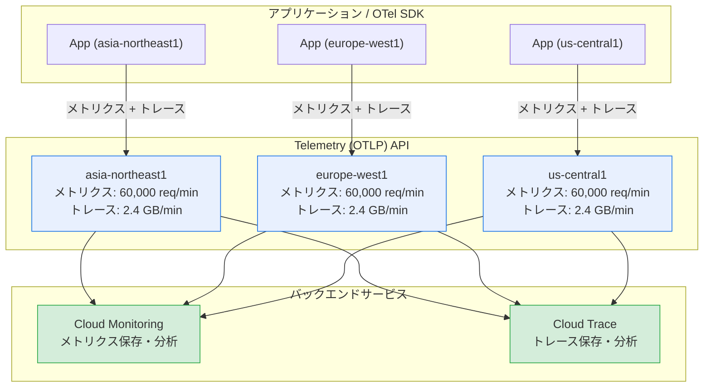

# Cloud Monitoring / Cloud Trace: Telemetry API リージョナルクォータの導入

**リリース日**: 2026-03-24

**サービス**: Cloud Monitoring, Cloud Trace

**機能**: Telemetry API リージョナルクォータ

**ステータス**: Feature

[このアップデートのインフォグラフィックを見る](https://takech9203.github.io/google-cloud-news-summary/20260324-telemetry-api-regional-quotas.html)

## 概要

Google Cloud の Telemetry (OTLP) API において、メトリクスおよびトレースのインジェストクォータがグローバルクォータからリージョナルクォータへ移行されました。Cloud Monitoring ではリージョンあたり毎分 60,000 メトリクスインジェストリクエスト、Cloud Trace ではリージョンごとにバイトベースのトレースインジェストクォータが設定されています。

この変更は、OpenTelemetry OTLP 仕様に基づく Telemetry API を利用してメトリクスやトレースデータを送信しているすべてのユーザーに影響します。リージョナルクォータへの移行により、特定のリージョンに集中するワークロードが他のリージョンのクォータを消費することがなくなり、マルチリージョン環境での公平なリソース配分が実現されます。

**アップデート前の課題**

- グローバルクォータのため、特定のリージョンからの大量リクエストが他のリージョンのインジェスト能力に影響を与える可能性があった
- リージョンごとのインジェスト容量を予測・管理することが困難だった
- トレースインジェストがリクエスト数ベースのクォータで管理されており、実際のデータ量に基づく制御ができなかった

**アップデート後の改善**

- リージョンごとに独立したクォータが適用されるため、他リージョンの影響を受けずに安定したインジェストが可能になった
- Cloud Trace のクォータがバイトベースに変更され、実際のデータ量に基づいたより直感的なクォータ管理が可能になった
- 主要 11 リージョンでは毎分 2.4 GB という大容量のトレースインジェストが利用可能になった

## アーキテクチャ図



Telemetry API のリージョナルクォータアーキテクチャを示す図。各リージョンのアプリケーションは対応するリージョンの Telemetry API エンドポイントにデータを送信し、リージョンごとに独立したクォータが適用されます。

## サービスアップデートの詳細

### 主要機能

1. **メトリクスインジェストのリージョナルクォータ (Cloud Monitoring)**
   - リージョンあたり毎分 60,000 メトリクスインジェストリクエストのクォータが設定
   - リクエストあたり最大 200 データポイントにより、実効デフォルトクォータは毎秒 200,000 サンプル相当
   - 従来のグローバルクォータを置き換える形で導入

2. **トレースインジェストのリージョナルクォータ (Cloud Trace)**
   - 主要 11 リージョンでは毎分 2.4 GB のトレースインジェストをサポート
   - その他のリージョンでは毎分 300 MB のトレースインジェストをサポート
   - 従来のリクエスト数ベースのグローバルクォータからバイトベースのリージョナルクォータへ移行

3. **クォータ体系の統一的な刷新**
   - メトリクスとトレースの両方で一貫してリージョナルクォータモデルを採用
   - Telemetry API 固有のクォータであり、Cloud Monitoring API のインジェストクォータとは独立
   - データインジェスト後は既存の Cloud Monitoring / Cloud Trace のクォータと制限が引き続き適用

## 技術仕様

### メトリクスインジェストクォータ

| 項目 | 詳細 |
|------|------|
| クォータ種別 | リージョナル (リージョンごとに独立) |
| リクエスト数上限 | 60,000 リクエスト/分/リージョン |
| リクエストあたり最大データポイント | 200 |
| リクエストあたり最大 ResourceMetrics | 200 |
| Summary メトリクスあたり最大分位数 | 10 |
| 実効インジェストレート | 最大 200,000 サンプル/秒 (バッチサイズ 200 の場合) |

### トレースインジェストクォータ

| リージョンカテゴリ | 対象リージョン | クォータ |
|-------------------|--------------|---------|
| 主要リージョン | asia-east1, asia-northeast1, asia-southeast1, asia-south1, europe-west1, europe-west2, europe-west3, europe-west4, us-central1, us-east4, us-west1 | 2.4 GB/分 |
| その他のリージョン | 上記以外のすべてのリージョン | 300 MB/分 |

### Telemetry API プロトコルサポート

```text
サポートプロトコル:
- http/protobuf
- http/json
- grpc (SDK からの直接エクスポート時は gRPC を推奨)
```

## 設定方法

### 前提条件

1. Google Cloud プロジェクトで Cloud Monitoring API および Cloud Trace API が有効化されていること
2. OpenTelemetry SDK または OpenTelemetry Collector が構成済みであること

### 手順

#### ステップ 1: 現在のクォータ使用状況を確認

```bash
# Google Cloud コンソールの Quotas ダッシュボードで確認
# https://console.cloud.google.com/iam-admin/quotas

# または gcloud CLI で確認
gcloud alpha services quota list \
  --service=monitoring.googleapis.com \
  --project=<PROJECT_ID>
```

現在のクォータ使用状況を確認し、リージョナルクォータへの移行による影響を評価します。

#### ステップ 2: OpenTelemetry Collector のエンドポイント設定を確認

```yaml
# otel-collector-config.yaml
exporters:
  otlp:
    endpoint: "telemetry.googleapis.com:443"
    headers:
      x-goog-user-project: "<PROJECT_ID>"
    compression: gzip
```

Telemetry API のエンドポイントにデータを送信する設定を確認します。リージョナルクォータは自動的に適用されるため、エンドポイントの変更は不要です。

#### ステップ 3: クォータ増加のリクエスト (必要に応じて)

```bash
# クォータ増加が必要な場合は Google Cloud コンソールから申請
# IAM & Admin > Quotas > 該当クォータを選択 > Edit Quotas
```

デフォルトのリージョナルクォータでは不足する場合、Google Cloud コンソールまたは Google Cloud サポートを通じてクォータ増加をリクエストできます。

## メリット

### ビジネス面

- **マルチリージョン環境の安定性向上**: リージョンごとに独立したクォータにより、特定リージョンの負荷集中が他リージョンのオブザーバビリティに影響しなくなる
- **予測可能なキャパシティプランニング**: リージョン単位でのクォータ管理により、ワークロードの分散計画がより正確に行える

### 技術面

- **バイトベースのトレースクォータ**: リクエスト数ではなくデータ量に基づくクォータにより、Span のサイズに関わらず一貫した制御が可能
- **主要リージョンの大容量サポート**: 11 の主要リージョンで毎分 2.4 GB のトレースインジェストにより、大規模分散システムのトレース収集にも対応
- **既存設定との互換性**: リージョナルクォータは自動的に適用されるため、既存の Telemetry API 設定を変更する必要がない

## デメリット・制約事項

### 制限事項

- Telemetry API は Pre-GA 段階であり、サポートが限定的な場合がある
- 主要 11 リージョン以外のリージョンではトレースインジェストクォータが 300 MB/分と比較的小さい
- メトリクスインジェストのクォータ増加には Google Cloud サポートへの連絡が必要な場合がある

### 考慮すべき点

- グローバルクォータからリージョナルクォータへの移行に伴い、特定のリージョンに集中していたワークロードではクォータの利用状況が変化する可能性がある
- 複数リージョンにまたがるアプリケーションでは、各リージョンのクォータ消費をモニタリングするアラートポリシーの設定を推奨
- Telemetry API のクォータと Cloud Monitoring API / Cloud Trace API のクォータは独立しているため、両方を管理する必要がある

## ユースケース

### ユースケース 1: グローバル分散マイクロサービスのオブザーバビリティ

**シナリオ**: アジア、ヨーロッパ、北米の複数リージョンに GKE クラスタを展開し、各クラスタで OpenTelemetry Collector を使用してメトリクスとトレースを収集している。

**実装例**:
```yaml
# 各リージョンの OTel Collector DaemonSet 設定
exporters:
  otlp:
    endpoint: "telemetry.googleapis.com:443"
    headers:
      x-goog-user-project: "my-global-project"

service:
  pipelines:
    traces:
      exporters: [otlp]
    metrics:
      exporters: [otlp]
```

**効果**: 各リージョンで独立した 60,000 req/min (メトリクス) および 2.4 GB/min (トレース) のクォータが利用可能になり、リージョン間のクォータ競合が解消される。

### ユースケース 2: 大規模トレースデータの収集

**シナリオ**: us-central1 リージョンで高トラフィックな API ゲートウェイを運用しており、大量のトレースデータを生成している。従来のリクエスト数ベースのグローバルクォータでは制限に達することがあった。

**効果**: バイトベースのリージョナルクォータ (2.4 GB/分) への移行により、Span 数やリクエスト数に依存せずデータ量で管理できるようになり、大量のトレースデータを安定して収集できる。

## 料金

Telemetry API 経由で取り込まれたメトリクスは「Prometheus Samples Ingested」SKU で課金されます。これは Google Cloud Managed Service for Prometheus と同じ SKU です。トレースデータは Cloud Trace の標準料金に基づいて課金されます。

| 使用量 | 月額料金 (概算) |
|--------|-----------------|
| Cloud Trace: 最初の 250 万 Span/月 | 無料 |
| Cloud Trace: 250 万 Span 超過分 | $0.20 / 100 万 Span |
| Cloud Monitoring: メトリクスインジェスト (最初の 150 MB) | 無料 |
| Cloud Monitoring: メトリクスインジェスト (150-100,000 MB) | $0.15 / MB |

## 利用可能リージョン

トレースインジェストの主要リージョン (2.4 GB/分):

- **アジア太平洋**: asia-east1 (台湾), asia-northeast1 (東京), asia-southeast1 (シンガポール), asia-south1 (ムンバイ)
- **ヨーロッパ**: europe-west1 (ベルギー), europe-west2 (ロンドン), europe-west3 (フランクフルト), europe-west4 (オランダ)
- **北米**: us-central1 (アイオワ), us-east4 (バージニア), us-west1 (オレゴン)

その他のリージョンでは 300 MB/分のトレースインジェストクォータが適用されます。メトリクスインジェストは全リージョンで 60,000 リクエスト/分です。

## 関連サービス・機能

- **Cloud Monitoring**: Telemetry API 経由で取り込まれたメトリクスの保存・可視化・アラート設定を担当
- **Cloud Trace**: Telemetry API 経由で取り込まれたトレースデータの保存・分析を担当
- **OpenTelemetry Collector**: Telemetry API へのデータ送信に推奨されるコレクターコンポーネント
- **Google Cloud Managed Service for Prometheus**: Telemetry API と同じメトリクスインジェスト基盤を共有
- **Cloud Logging**: オブザーバビリティの三本柱 (メトリクス・トレース・ログ) の一つとして補完的に機能

## 参考リンク

- [インフォグラフィック](https://takech9203.github.io/google-cloud-news-summary/20260324-telemetry-api-regional-quotas.html)
- [公式リリースノート](https://cloud.google.com/release-notes#March_24_2026)
- [Cloud Monitoring クォータとリミット](https://cloud.google.com/monitoring/quotas)
- [Cloud Trace クォータとリミット](https://cloud.google.com/trace/docs/quotas)
- [Telemetry (OTLP) API 概要](https://cloud.google.com/stackdriver/docs/reference/telemetry/overview)
- [OTLP メトリクスの概要](https://cloud.google.com/stackdriver/docs/otlp-metrics/overview)
- [Cloud Monitoring 料金](https://cloud.google.com/stackdriver/pricing)

## まとめ

Telemetry API のリージョナルクォータ導入は、マルチリージョン環境でのオブザーバビリティ基盤の安定性を向上させる重要なアップデートです。特にトレースインジェストのバイトベースクォータへの移行は、大規模分散システムにおけるトレースデータ収集の予測可能性を大幅に改善します。現在 Telemetry API を利用しているユーザーは、各リージョンのクォータ消費状況を確認し、必要に応じてアラートポリシーを設定することを推奨します。

---

**タグ**: #CloudMonitoring #CloudTrace #TelemetryAPI #OpenTelemetry #OTLP #Quotas #Observability
