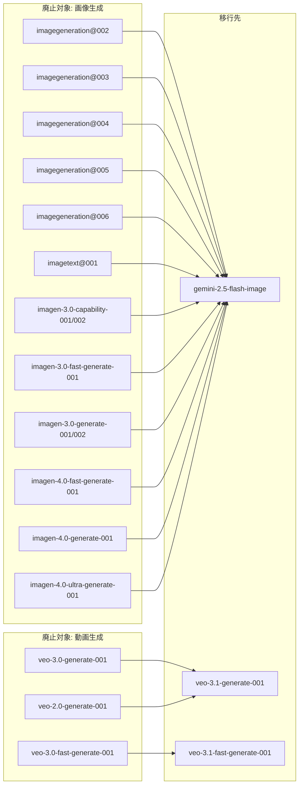

# Generative AI on Vertex AI: Imagen / Veo GA エンドポイントの廃止

**リリース日**: 2026-03-24

**サービス**: Generative AI on Vertex AI

**機能**: Imagen および Veo GA エンドポイントの廃止

**ステータス**: Deprecated

[このアップデートのインフォグラフィックを見る](https://takech9203.github.io/google-cloud-news-summary/20260324-vertex-ai-imagen-veo-deprecation.html)

## 概要

Google Cloud は、Vertex AI 上の画像生成 (Imagen) および動画生成 (Veo) の旧世代 GA エンドポイントを大規模に廃止することを発表した。画像生成では imagegeneration@002 から @006、imagetext@001、imagen-3.0 系列、imagen-4.0 系列の計 14 エンドポイントが廃止対象となり、推奨移行先は `gemini-2.5-flash-image` に統一される。動画生成では veo-3.0 系列および veo-2.0 系列の 3 エンドポイントが廃止対象となり、veo-3.1 系列への移行が推奨される。

この廃止は、Google が画像生成機能を Gemini モデルファミリーに統合し、動画生成を最新の Veo 3.1 に集約する戦略の一環である。移行期限は 2026 年 6 月 30 日に設定されており、それまでにエンドポイントを更新しないとサービスが停止する可能性がある。

対象ユーザーは、Vertex AI の画像生成 API (Imagen) や動画生成 API (Veo) を本番環境で利用しているすべての開発者およびチームである。特に、旧世代の imagegeneration エンドポイントや Imagen 3.0 系を利用しているユーザーは早急な対応が必要となる。

**アップデート前の課題**

- 画像生成エンドポイントが多数のバージョンに分散しており (imagegeneration@002〜@006、imagen-3.0 系、imagen-4.0 系)、どのモデルを使うべきか選択が難しかった
- 旧世代の imagegeneration エンドポイント (@002〜@006) は最新のモデルと比較して品質やパフォーマンスに差があった
- 動画生成でも veo-2.0 と veo-3.0 の複数バージョンが並存し、最新機能 (9:16 アスペクト比対応、4K アップサンプリングなど) が利用できなかった

**アップデート後の改善**

- 画像生成の推奨エンドポイントが `gemini-2.5-flash-image` に統一され、選択が明確になる
- Gemini ベースの画像生成により、テキストと画像のインターリーブ生成、マルチターン会話型編集など高度な機能が利用可能になる
- 動画生成が Veo 3.1 に集約され、最新の品質向上と新機能の恩恵を受けられる

## アーキテクチャ図



廃止対象の画像生成エンドポイントはすべて `gemini-2.5-flash-image` に、動画生成エンドポイントは対応する Veo 3.1 エンドポイントに移行する。

## サービスアップデートの詳細

### 主要機能

1. **画像生成エンドポイントの廃止と統合**
   - imagegeneration@002 から @006 までの旧世代エンドポイントが廃止
   - imagetext@001 (画像からテキスト生成) が廃止
   - Imagen 3.0 系列 (capability-001/002、fast-generate-001、generate-001/002) が廃止
   - Imagen 4.0 系列 (fast-generate-001、generate-001、ultra-generate-001) が廃止
   - すべて `gemini-2.5-flash-image` への移行を推奨

2. **動画生成エンドポイントの廃止と統合**
   - veo-3.0-generate-001 は veo-3.1-generate-001 に移行
   - veo-3.0-fast-generate-001 は veo-3.1-fast-generate-001 に移行
   - veo-2.0-generate-001 は veo-3.1-generate-001 に移行

3. **移行期限**
   - すべてのエンドポイントの移行期限は 2026 年 6 月 30 日
   - 期限後は廃止対象エンドポイントへのリクエストが失敗する可能性がある

## 技術仕様

### 画像生成エンドポイントの移行マッピング

| 廃止対象エンドポイント | 移行先 |
|------|------|
| imagegeneration@002 | gemini-2.5-flash-image |
| imagegeneration@003 | gemini-2.5-flash-image |
| imagegeneration@004 | gemini-2.5-flash-image |
| imagegeneration@005 | gemini-2.5-flash-image |
| imagegeneration@006 | gemini-2.5-flash-image |
| imagetext@001 | gemini-2.5-flash-image |
| imagen-3.0-capability-001 | gemini-2.5-flash-image |
| imagen-3.0-capability-002 | gemini-2.5-flash-image |
| imagen-3.0-fast-generate-001 | gemini-2.5-flash-image |
| imagen-3.0-generate-001 | gemini-2.5-flash-image |
| imagen-3.0-generate-002 | gemini-2.5-flash-image |
| imagen-4.0-fast-generate-001 | gemini-2.5-flash-image |
| imagen-4.0-generate-001 | gemini-2.5-flash-image |
| imagen-4.0-ultra-generate-001 | gemini-2.5-flash-image |

### 動画生成エンドポイントの移行マッピング

| 廃止対象エンドポイント | 移行先 |
|------|------|
| veo-3.0-generate-001 | veo-3.1-generate-001 |
| veo-3.0-fast-generate-001 | veo-3.1-fast-generate-001 |
| veo-2.0-generate-001 | veo-3.1-generate-001 |

### gemini-2.5-flash-image の主要仕様

| 項目 | 詳細 |
|------|------|
| モデル ID | gemini-2.5-flash-image |
| 入力 | テキスト、画像 |
| 出力 | テキストおよび画像 |
| 最大入力トークン | 32,768 |
| 最大出力トークン | 32,768 |
| 画像生成時の消費トークン | 1,290 トークン/画像 |
| 最大入力画像数 | 3 |
| 最大出力画像数 | 10 |
| 対応アスペクト比 | 1:1, 3:2, 2:3, 3:4, 4:3, 4:5, 5:4, 9:16, 16:9, 21:9 |
| ステータス | GA |

## 設定方法

### 前提条件

1. Google Cloud プロジェクトで Vertex AI API が有効化されていること
2. 適切な IAM 権限 (Vertex AI ユーザー以上) が付与されていること

### 手順

#### ステップ 1: 現在使用中のエンドポイントを特定

```bash
# プロジェクト内で使用されている画像生成エンドポイントを検索
grep -r "imagegeneration@\|imagen-3.0\|imagen-4.0\|veo-2.0\|veo-3.0" --include="*.py" --include="*.js" --include="*.yaml" .
```

コードベース内の廃止対象エンドポイントの使用箇所を特定する。

#### ステップ 2: 画像生成エンドポイントの移行 (Imagen から Gemini)

```python
# 移行前: Imagen エンドポイント
from vertexai.preview.vision_models import ImageGenerationModel

model = ImageGenerationModel.from_pretrained("imagen-3.0-generate-002")
response = model.generate_images(prompt="A sunset over mountains")

# 移行後: Gemini 2.5 Flash Image エンドポイント
from vertexai.generative_models import GenerativeModel

model = GenerativeModel("gemini-2.5-flash-image")
response = model.generate_content("Generate an image of a sunset over mountains")
```

Imagen API から Gemini API への移行では、API の呼び出し方法が異なるため注意が必要。Gemini ではテキストプロンプトと画像生成が統合されたインターフェースとなる。

#### ステップ 3: 動画生成エンドポイントの移行

```python
# 移行前
# model = "veo-3.0-generate-001"

# 移行後
# model = "veo-3.1-generate-001"
```

Veo の移行はモデル ID の変更のみで対応可能。API インターフェースに大きな変更はない。

## メリット

### ビジネス面

- **エンドポイント管理の簡素化**: 14 以上のエンドポイントが 1 つに統合されることで、管理コストが大幅に削減される
- **最新機能へのアクセス**: Gemini ベースの画像生成により、マルチターン編集やテキスト/画像インターリーブなどの高度な機能が利用可能

### 技術面

- **統一された API**: Gemini API を通じてテキスト生成と画像生成を同一インターフェースで利用可能
- **Veo 3.1 の品質向上**: 最新の動画生成モデルにより、9:16 アスペクト比や 4K アップサンプリングなどの新機能が利用可能

## デメリット・制約事項

### 制限事項

- gemini-2.5-flash-image は Imagen とは異なる API インターフェースを使用するため、コードの書き換えが必要
- gemini-2.5-flash-image ではファンクションコーリング、コード実行、コンテキストキャッシュなどが未サポート
- Imagen 固有の機能 (Controlled Customization など) が gemini-2.5-flash-image で同等にサポートされるか確認が必要

### 考慮すべき点

- 移行期限は 2026 年 6 月 30 日だが、早めのテストと移行を推奨
- Imagen から Gemini への移行では、レスポンス形式や画像品質の特性が異なる可能性がある
- Imagen 4.0 Ultra Generate のような高品質モデルの代替として gemini-2.5-flash-image が十分かの検証が必要

## 料金

画像生成および動画生成の料金は移行先モデルによって異なる。詳細は公式料金ページを参照。

- gemini-2.5-flash-image: トークンベースの料金体系 (画像生成 1 枚あたり 1,290 トークン消費)
- veo-3.1 系列: 動画生成の料金体系に準拠

詳細は [Vertex AI Generative AI 料金ページ](https://cloud.google.com/vertex-ai/generative-ai/pricing) を参照。

## 利用可能リージョン

gemini-2.5-flash-image の主な利用可能リージョン:
- Global (global)
- US: us-central1, us-east1, us-east4, us-east5, us-south1, us-west1, us-west4
- Europe: europe-central2, europe-north1, europe-southwest1, europe-west1, europe-west4, europe-west8

Veo 3.1 系列: Global (global) で利用可能。

## 関連サービス・機能

- **Gemini 3.1 Flash Image (Preview)**: 2026 年 2 月 26 日にプレビュー公開された次世代画像生成モデル。最大 131,072 入力トークン、Thinking 機能サポートなど、gemini-2.5-flash-image からの更なる進化版
- **Vertex AI Studio**: ブラウザ上で画像生成モデルを直接テスト可能なインターフェース
- **Vertex AI Model Garden**: 各種画像/動画生成モデルの一覧と管理

## 参考リンク

- [インフォグラフィック](https://takech9203.github.io/google-cloud-news-summary/20260324-vertex-ai-imagen-veo-deprecation.html)
- [公式リリースノート](https://docs.cloud.google.com/release-notes#March_24_2026)
- [Imagen on Vertex AI ドキュメント](https://cloud.google.com/vertex-ai/generative-ai/docs/image/overview)
- [Gemini 2.5 Flash Image モデル仕様](https://cloud.google.com/vertex-ai/generative-ai/docs/models/gemini/2-5-flash-image)
- [Veo on Vertex AI ドキュメント](https://cloud.google.com/vertex-ai/generative-ai/docs/video/overview)
- [Vertex AI Generative AI 料金](https://cloud.google.com/vertex-ai/generative-ai/pricing)
- [Vertex AI 廃止情報](https://cloud.google.com/vertex-ai/docs/deprecations)

## まとめ

今回の大規模なエンドポイント廃止は、Google が画像生成を Gemini モデルファミリーに統合し、動画生成を Veo 3.1 世代に集約する明確な方針転換を示している。移行期限の 2026 年 6 月 30 日までに、対象エンドポイントを利用しているすべてのアプリケーションで移行作業を完了する必要がある。特に Imagen から Gemini への移行は API インターフェースが異なるため、早期にテスト環境での検証を開始することを推奨する。

---

**タグ**: #VertexAI #GenerativeAI #Imagen #Veo #Deprecated #ImageGeneration #VideoGeneration #Gemini #Migration
