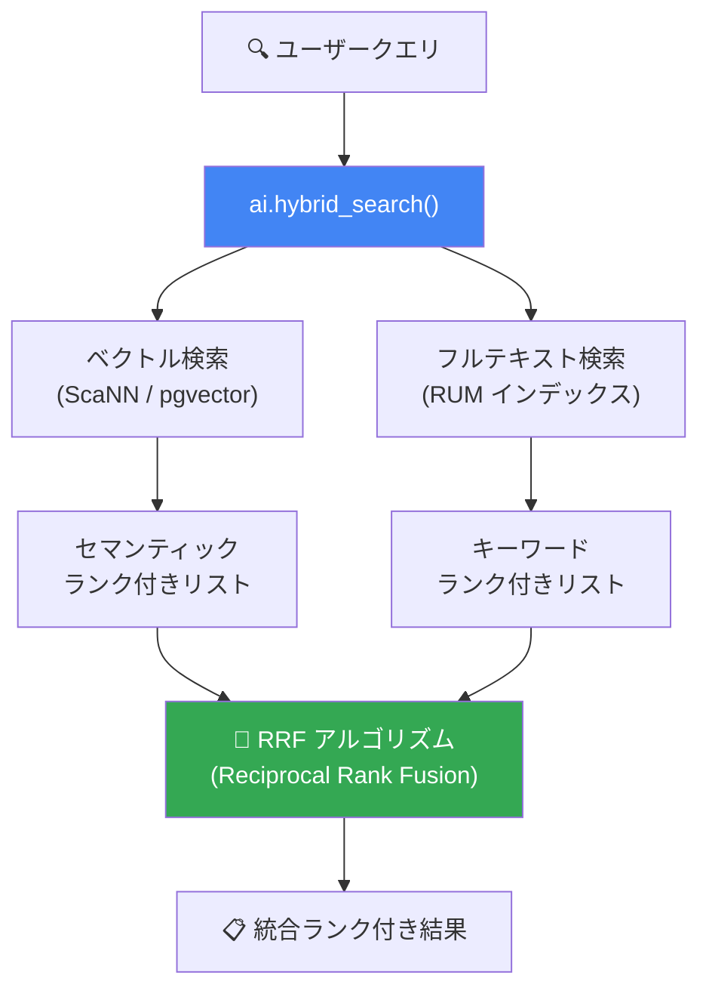

# AlloyDB for PostgreSQL (AlloyDB AI): ai.hybrid_search() 関数と RUM エクステンション

**リリース日**: 2026-03-25

**サービス**: AlloyDB for PostgreSQL (AlloyDB AI)

**機能**: ai.hybrid_search() 関数と RUM エクステンション (Preview)

**ステータス**: Preview

📊 [このアップデートのインフォグラフィックを見る](https://takech9203.github.io/google-cloud-news-summary/20260325-alloydb-ai-hybrid-search-rum.html)

## 概要

AlloyDB AI に2つの重要な検索機能が Preview として追加された。1つ目は `ai.hybrid_search()` 関数で、ベクトル類似検索とフルテキスト検索の結果を Reciprocal Rank Fusion (RRF) アルゴリズムで統合し、単一のランク付きリストとして返す。これにより、セマンティック検索とキーワード検索を組み合わせたハイブリッド検索をシンプルな SQL 関数呼び出しで実行できるようになった。

2つ目は RUM エクステンションで、PostgreSQL の標準的な GIN インデックスを拡張し、位置情報をインデックス内に直接格納する。これにより、フレーズ検索や関連性ランキングの際にテーブルデータへのアクセスが不要となり、複雑なフルテキスト検索操作が大幅に高速化される。

これらの機能は、RAG (Retrieval-Augmented Generation) アプリケーション、EC サイトの商品検索、ナレッジベース検索など、高精度な検索を必要とするユースケースに携わる開発者やデータエンジニアに特に有用である。

**アップデート前の課題**

- ハイブリッド検索を実現するには、ベクトル検索と全文検索を個別に実行し、CTE (Common Table Expression) を用いて RRF スコアを手動で計算する複雑な SQL を記述する必要があった
- GIN インデックスではフレーズ検索時にテーブルの元データを参照する必要があり、大規模データセットでのフレーズ検索や関連性ランキングのパフォーマンスに課題があった
- 検索結果の融合ロジックをアプリケーション側またはクエリ内で管理する必要があり、開発の複雑さが増していた

**アップデート後の改善**

- `ai.hybrid_search()` 関数により、ハイブリッド検索を単一の SQL 関数呼び出しで実行可能になった。RRF による結果融合が内部的に処理される
- RUM エクステンションにより、位置情報がインデックスに格納されるため、フレーズ検索やランキング計算時にテーブルデータへのアクセスが不要になり、検索パフォーマンスが向上した
- 検索精度の向上とクエリの簡素化により、AI アプリケーション開発の生産性が改善された

## アーキテクチャ図



`ai.hybrid_search()` 関数がベクトル検索とフルテキスト検索を並列に実行し、RRF アルゴリズムで結果を融合して単一のランク付きリストを返すフローを示している。

## サービスアップデートの詳細

### 主要機能

1. **ai.hybrid_search() 関数**
   - ベクトル類似検索とフルテキスト検索の結果を自動的に融合する SQL 関数
   - Reciprocal Rank Fusion (RRF) アルゴリズムを使用して、各検索タイプの結果を単一のランク付きリストに統合
   - RRF は各ドキュメントの順位の逆数に基づいてスコアを算出し、複数のランキングリストにおいて高順位のドキュメントがより大きなスコアを獲得する仕組み
   - 従来の手動 CTE ベースのハイブリッド検索クエリを置き換え、シンプルな関数呼び出しで同等以上の結果を提供

2. **RUM エクステンション**
   - 標準的な GIN インデックスの拡張版で、位置情報 (positional information) をインデックス内に直接格納
   - フレーズ検索 (隣接する単語の順序を考慮した検索) がインデックスのみで完結するため、テーブルデータへのアクセスが不要
   - 関連性ランキング (ts_rank) の計算もインデックスから直接実行可能
   - 大規模データセットにおけるフルテキスト検索のパフォーマンスを大幅に改善

3. **AlloyDB AI エコシステムとの統合**
   - 既存の ScaNN インデックスや pgvector エクステンションと組み合わせて使用可能
   - `google_ml.embedding()` で生成したベクトルエンベディングとの併用が可能
   - Vertex AI モデル (text-embedding-005 など) との統合により、エンベディング生成からハイブリッド検索までをデータベース内で完結

## 技術仕様

### ai.hybrid_search() 関数

| 項目 | 詳細 |
|------|------|
| ステータス | Preview |
| 検索タイプ | ベクトル類似検索 + フルテキスト検索 |
| 融合アルゴリズム | Reciprocal Rank Fusion (RRF) |
| RRF 定数 (k) | 60 (標準値) |
| ベクトルインデックス | ScaNN、HNSW、IVFFlat 対応 |
| テキストインデックス | GIN、RUM 対応 |

### RUM エクステンション

| 項目 | 詳細 |
|------|------|
| ステータス | Preview |
| ベースインデックス | GIN インデックスの拡張 |
| 主な特徴 | 位置情報のインデックス内格納 |
| 対応操作 | フレーズ検索、関連性ランキング |
| パフォーマンス改善 | テーブルアクセス不要で検索・ランキング実行 |

### 従来のハイブリッド検索クエリ (Before)

```sql
-- 従来: CTE を使った手動ハイブリッド検索
WITH vector_search AS (
  SELECT id,
    RANK() OVER (ORDER BY embedding <=> google_ml.embedding('text-embedding-005', 'search text')) AS rank
  FROM products
  ORDER BY embedding <=> google_ml.embedding('text-embedding-005', 'search text')
  LIMIT 10
),
text_search AS (
  SELECT id,
    RANK() OVER (ORDER BY ts_rank(to_tsvector('english', description), to_tsquery('keyword')) DESC)
  FROM products
  WHERE to_tsvector('english', description) @@ to_tsquery('keyword')
  ORDER BY ts_rank(to_tsvector('english', description), to_tsquery('keyword')) DESC
  LIMIT 10
)
SELECT COALESCE(vector_search.id, text_search.id) AS id,
  COALESCE(1.0 / (60 + vector_search.rank), 0.0) +
  COALESCE(1.0 / (60 + text_search.rank), 0.0) AS rrf_score
FROM vector_search
FULL OUTER JOIN text_search ON vector_search.id = text_search.id
ORDER BY rrf_score DESC
LIMIT 5;
```

### ai.hybrid_search() を使用したクエリ (After)

```sql
-- 新: ai.hybrid_search() 関数で簡潔に記述
SELECT * FROM ai.hybrid_search(
  'products',           -- テーブル名
  'search text',        -- 検索クエリ
  'description',        -- テキスト検索対象カラム
  'embedding',          -- ベクトルカラム
  'text-embedding-005', -- エンベディングモデル
  5                     -- 返却件数
);
```

## 設定方法

### 前提条件

1. AlloyDB for PostgreSQL クラスターが作成済みであること
2. `google_ml_integration` エクステンションが有効であること
3. Vertex AI との統合が構成済みであること (エンベディングモデル使用時)

### 手順

#### ステップ 1: RUM エクステンションの有効化

```sql
-- RUM エクステンションを有効化
CREATE EXTENSION IF NOT EXISTS rum;
```

#### ステップ 2: RUM インデックスの作成

```sql
-- テキストカラムに RUM インデックスを作成
CREATE INDEX idx_products_description_rum
  ON products USING rum (to_tsvector('english', description));
```

#### ステップ 3: ベクトルインデックスの作成 (ScaNN 推奨)

```sql
-- ScaNN インデックスを作成
CREATE INDEX idx_products_embedding_scann
  ON products USING scann (embedding cosine)
  WITH (num_leaves = 100);
```

#### ステップ 4: ai.hybrid_search() の実行

```sql
-- ハイブリッド検索を実行
SELECT * FROM ai.hybrid_search(
  'products',
  'comfortable running shoes',
  'description',
  'embedding',
  'text-embedding-005',
  10
);
```

## メリット

### ビジネス面

- **検索精度の向上**: セマンティック検索とキーワード検索を組み合わせることで、ユーザーの意図により合致した検索結果を提供でき、コンバージョン率向上が期待できる
- **開発コストの削減**: 外部の検索エンジンやベクトルデータベースを別途用意する必要がなく、AlloyDB 内でハイブリッド検索を完結できるため、インフラ管理コストが低減する

### 技術面

- **クエリの簡素化**: 手動の CTE ベースの RRF 計算が不要になり、`ai.hybrid_search()` の単一関数呼び出しで実装可能
- **検索パフォーマンスの向上**: RUM エクステンションにより、フレーズ検索と関連性ランキングがインデックスのみで完結し、大規模データセットでのレスポンスタイムが改善
- **拡張性**: ScaNN インデックスとの組み合わせにより、ベクトル検索は HNSW 比で最大 10 倍高速、メモリ使用量は 3 分の 1 に削減

## デメリット・制約事項

### 制限事項

- 現在 Preview ステータスのため、SLA の対象外であり本番環境での使用には注意が必要
- Preview 機能は GA までに仕様が変更される可能性がある
- RUM エクステンションは GIN インデックスより多くのディスク容量を消費する (位置情報の格納による)

### 考慮すべき点

- RUM インデックスは GIN インデックスより書き込みコストが高くなる可能性がある。更新頻度の高いテーブルではトレードオフの検討が必要
- `ai.hybrid_search()` 関数のパラメータチューニング (RRF の重み付けなど) が検索品質に影響するため、ユースケースに応じた最適化が推奨される
- Preview 段階であるため、パフォーマンス特性が GA 時に変わる可能性がある

## ユースケース

### ユースケース 1: EC サイトの商品検索

**シナリオ**: EC サイトで「comfortable running shoes for marathon」と検索した場合、セマンティック検索で「快適なランニングシューズ」に関連する商品をヒットさせつつ、キーワード検索で「marathon」が含まれる商品も確実にヒットさせたい。

**実装例**:
```sql
SELECT * FROM ai.hybrid_search(
  'products',
  'comfortable running shoes for marathon',
  'product_description',
  'description_embedding',
  'text-embedding-005',
  20
);
```

**効果**: セマンティック理解とキーワードマッチの両方を活用し、ユーザーの検索意図に合致した商品を上位に表示。従来のキーワードのみの検索と比較して、検索結果の関連性が向上する。

### ユースケース 2: RAG アプリケーションのコンテキスト検索

**シナリオ**: 社内ナレッジベースに対する RAG アプリケーションで、LLM への入力コンテキストとして最も関連性の高いドキュメントを検索する。技術用語の正確な一致と意味的な類似性の両方を考慮したい。

**効果**: RRF による融合検索で、技術用語がそのまま含まれるドキュメント (キーワード検索) と、意味的に関連するドキュメント (ベクトル検索) の両方を適切にランク付けし、LLM のハルシネーションを低減する高品質なコンテキストを提供する。

## 料金

AlloyDB for PostgreSQL は消費ベースの料金モデルを採用しており、インスタンスリソース (vCPU、メモリ)、ストレージ、ネットワーク Egress に基づいて課金される。`ai.hybrid_search()` 関数や RUM エクステンション自体に追加料金は発生しないが、Vertex AI のエンベディングモデルを使用する場合は別途 Vertex AI の料金が適用される。

CUD (Committed Use Discounts) により、1 年契約で 25%、3 年契約で 52% の割引が利用可能。

詳細は [AlloyDB for PostgreSQL 料金ページ](https://cloud.google.com/alloydb/pricing) を参照。

## 利用可能リージョン

AlloyDB for PostgreSQL が利用可能な全リージョンで使用可能。詳細は [AlloyDB のリージョンとゾーン](https://cloud.google.com/alloydb/docs/locations) を参照。

## 関連サービス・機能

- **Vertex AI**: エンベディングモデル (text-embedding-005) との統合により、テキストデータからベクトルエンベディングを生成し、ハイブリッド検索に使用
- **AlloyDB AI ScaNN インデックス**: Google の ScaNN アルゴリズムによる高性能ベクトル検索インデックス。ハイブリッド検索のベクトル検索部分で活用
- **AlloyDB AI 関数 (ai.if, ai.rank, ai.generate)**: AI を活用したフィルタリング、リランキング、テキスト生成機能。ハイブリッド検索と組み合わせてより高度な検索パイプラインを構築可能
- **LangChain AlloyDB 統合**: LangChain の AlloyDBVectorStore クラスを通じたハイブリッド検索 (HybridSearchConfig) もサポート
- **Cloud Monitoring / Cloud Logging**: AlloyDB インスタンスのパフォーマンスモニタリングとクエリログの管理

## 参考リンク

- 📊 [インフォグラフィック](https://takech9203.github.io/google-cloud-news-summary/20260325-alloydb-ai-hybrid-search-rum.html)
- [公式リリースノート](https://cloud.google.com/release-notes#March_25_2026)
- [AlloyDB AI ハイブリッド検索ドキュメント](https://cloud.google.com/alloydb/docs/ai/run-hybrid-vector-similarity-search)
- [AlloyDB AI 概要](https://cloud.google.com/alloydb/docs/ai)
- [AlloyDB AI ベクトル検索概要](https://cloud.google.com/alloydb/docs/ai/vector-search-overview)
- [AlloyDB AI ユースケース](https://cloud.google.com/alloydb/docs/ai/alloydb-ai-use-cases)
- [料金ページ](https://cloud.google.com/alloydb/pricing)

## まとめ

AlloyDB AI の `ai.hybrid_search()` 関数と RUM エクステンションは、データベース内でのハイブリッド検索を大幅に簡素化・高速化する Preview 機能である。特に RAG アプリケーションや EC サイト検索など、セマンティック理解とキーワードマッチの両方が求められるユースケースにおいて、外部検索エンジンなしで高品質な検索を実現できる点が大きな価値となる。Preview 段階ではあるが、GA に向けて早期に検証・評価を開始することを推奨する。

---

**タグ**: #AlloyDB #AlloyDB-AI #HybridSearch #RUM #FullTextSearch #VectorSearch #RRF #PostgreSQL #Preview
