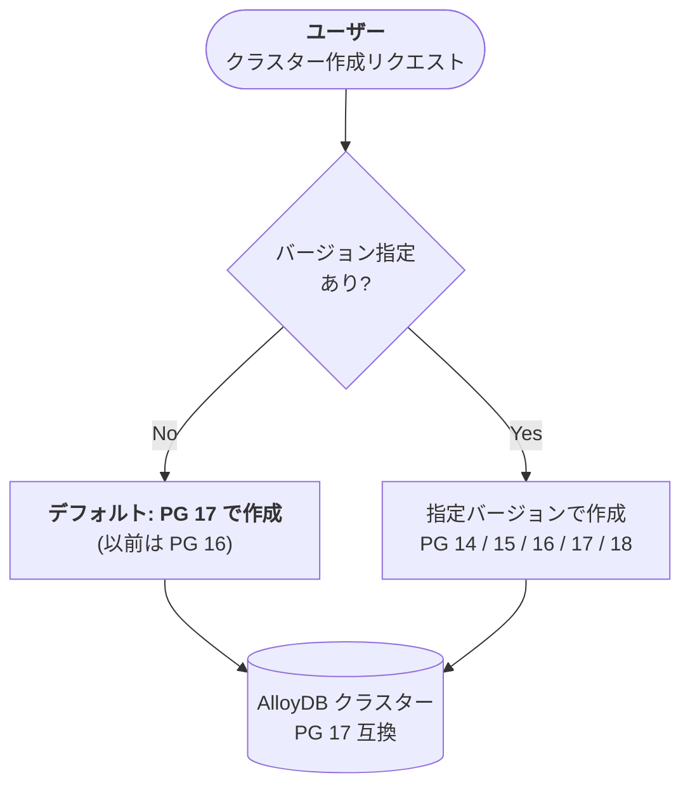

# AlloyDB for PostgreSQL: デフォルト PostgreSQL メジャーバージョンが 17 に変更

**リリース日**: 2026-03-25

**サービス**: AlloyDB for PostgreSQL

**機能**: デフォルト PostgreSQL メジャーバージョンの 17 への変更

**ステータス**: Change

:bar_chart: [このアップデートのインフォグラフィックを見る](https://takech9203.github.io/google-cloud-news-summary/20260325-alloydb-postgresql-17-default.html)

## 概要

AlloyDB for PostgreSQL において、新規クラスター作成時にメジャーバージョンを明示的に指定しない場合のデフォルトバージョンが PostgreSQL 17 に変更された。これまでデフォルトは PostgreSQL 16 であったが、2025 年 9 月 22 日に PostgreSQL 17 互換が GA となったことを受け、デフォルトバージョンが引き上げられた形となる。

この変更は、Google Cloud コンソール、gcloud CLI、AlloyDB Admin API、Terraform のいずれの方法でクラスターを作成する場合にも適用される。既存のクラスターには影響はなく、新規に作成するクラスターのみが対象となる。

**アップデート前の課題**

- バージョンを指定せずにクラスターを作成すると PostgreSQL 16 互換で作成されていた
- PostgreSQL 17 の新機能を利用するには、明示的に `--database-version=POSTGRES_17` を指定する必要があった

**アップデート後の改善**

- バージョンを指定せずにクラスターを作成すると PostgreSQL 17 互換で作成されるようになった
- PostgreSQL 17 の新機能 (改善されたメモリメトリクス、パフォーマンス改善など) をデフォルトで利用可能になった
- 新規プロジェクトで最新バージョンの機能を意識せずに享受できるようになった

## アーキテクチャ図



ユーザーがクラスター作成時にバージョンを指定しない場合、デフォルトとして PostgreSQL 17 が適用される流れを示す。

## サービスアップデートの詳細

### 主要機能

1. **デフォルトバージョンの変更**
   - 新規クラスター作成時のデフォルト PostgreSQL メジャーバージョンが 16 から 17 に変更
   - gcloud CLI、AlloyDB Admin API、Terraform、Google Cloud コンソールのすべてで適用

2. **PostgreSQL 17 互換の主な特徴**
   - 2025 年 9 月 22 日に AlloyDB での GA が発表済み
   - 現在の最新マイナーバージョンは 17.5
   - AlloyDB Omni でも 17.5 が利用可能

3. **サポート対象バージョンの全体像**
   - PostgreSQL 18 (Preview)、17 (デフォルト)、16、15、14 が利用可能
   - 既存クラスターは作成時のバージョンを維持し、手動でのメジャーバージョンアップグレードが必要

## 技術仕様

### AlloyDB で利用可能な PostgreSQL バージョン

| PostgreSQL バージョン | AlloyDB バージョン | AlloyDB Omni | ステータス |
|---|---|---|---|
| PostgreSQL 18 | 18.1 | 非対応 | Preview |
| PostgreSQL 17 | 17.5 | 17.5 | GA (デフォルト) |
| PostgreSQL 16 | 16.9 | 16.8 / 16.3 | GA |
| PostgreSQL 15 | 15.13 | 15.12 / 15.7 / 15.5 / 15.4 / 15.2 | GA |
| PostgreSQL 14 | 14.18 | 非対応 | GA |

### PostgreSQL 17 利用時の注意事項

- スタンバイサーバーからの論理レプリケーションは非対応
- メモリメトリクス (`available memory`) が OS ページキャッシュを考慮した値に変更されるため、PG 16 以前と比較して低い値が表示される場合がある

## 設定方法

### 前提条件

1. Google Cloud プロジェクトが作成済みであること
2. AlloyDB Admin API が有効化されていること
3. 適切な IAM ロール (`roles/alloydb.admin`) が付与されていること

### 手順

#### ステップ 1: デフォルトバージョン (PG 17) でクラスターを作成

```bash
# バージョン指定なし - デフォルトで PG 17 が適用される
gcloud alloydb clusters create my-cluster \
  --password=YOUR_PASSWORD \
  --region=us-central1 \
  --project=YOUR_PROJECT_ID \
  --network=default
```

#### ステップ 2: 特定バージョンを指定してクラスターを作成 (必要な場合)

```bash
# PG 16 を明示的に指定する場合
gcloud alloydb clusters create my-cluster \
  --database-version=POSTGRES_16 \
  --password=YOUR_PASSWORD \
  --region=us-central1 \
  --project=YOUR_PROJECT_ID \
  --network=default
```

#### ステップ 3: プライマリインスタンスの作成

```bash
gcloud alloydb instances create my-instance \
  --instance-type=PRIMARY \
  --cpu-count=2 \
  --region=us-central1 \
  --cluster=my-cluster \
  --project=YOUR_PROJECT_ID
```

## メリット

### ビジネス面

- **最新機能への自動対応**: 新規プロジェクトで明示的な設定なしに最新の PostgreSQL 17 機能を利用可能
- **運用コストの削減**: バージョン指定の漏れによる古いバージョンでのクラスター作成を防止

### 技術面

- **改善されたメモリメトリクス**: PG 17 以降では OS ページキャッシュを考慮した正確なメモリ使用量の把握が可能
- **最新のセキュリティパッチ**: PG 17 系列の最新マイナーバージョン (17.5) が自動適用される
- **パフォーマンス向上**: PostgreSQL 17 のクエリプランナーやバキューム処理の改善を享受できる

## デメリット・制約事項

### 制限事項

- スタンバイサーバーからの論理レプリケーションは PostgreSQL 17 では非対応
- 既存クラスターのバージョンは変更されない (インプレースメジャーバージョンアップグレードまたはデータ移行が必要)

### 考慮すべき点

- IaC (Terraform など) でバージョンを明示的に指定していない場合、今後作成されるクラスターが PG 17 になるため、既存環境との整合性を確認すること
- PG 17 で `available memory` メトリクスの算出方法が変更されているため、モニタリングアラートの閾値の見直しが必要な場合がある
- PG 16 以前から PG 17 にメジャーバージョンアップグレードする場合は、アプリケーションの互換性テストを事前に実施すること

## ユースケース

### ユースケース 1: 新規プロジェクトの立ち上げ

**シナリオ**: 新しいアプリケーション開発プロジェクトで AlloyDB クラスターを作成する。

**実装例**:
```bash
# バージョン指定不要 - 自動的に PG 17 で作成
gcloud alloydb clusters create app-cluster \
  --password=SECURE_PASSWORD \
  --region=asia-northeast1 \
  --project=my-new-project \
  --network=default
```

**効果**: 追加設定なしで PostgreSQL 17 の最新機能 (改善されたパフォーマンス、セキュリティパッチ) を利用可能。

### ユースケース 2: IaC テンプレートの更新確認

**シナリオ**: Terraform で AlloyDB クラスターを管理しており、`database_version` を明示的に指定していない。

**効果**: デフォルトバージョン変更により、新規作成されるクラスターが PG 17 になる。既存の PG 16 クラスターとの互換性を確認し、必要に応じて Terraform テンプレートにバージョンを明示的に記載することで、意図しないバージョン変更を防止できる。

## 料金

AlloyDB for PostgreSQL の料金体系は従量課金制であり、デフォルトバージョンの変更による料金への直接的な影響はない。料金はインスタンスリソース (vCPU、メモリ)、ストレージ、ネットワーク Egress に基づいて計算される。

CUD (Committed Use Discount) により、1 年契約で 25%、3 年契約で 52% の割引が適用される。

詳細は [AlloyDB for PostgreSQL の料金ページ](https://cloud.google.com/alloydb/pricing) を参照。

## 関連サービス・機能

- **AlloyDB Omni**: オンプレミス環境で動作する AlloyDB。PostgreSQL 17.5 に対応済み
- **Cloud SQL for PostgreSQL**: Google Cloud のもう一つの PostgreSQL マネージドサービス。PostgreSQL 17 は 2024 年 10 月に GA
- **Database Migration Service**: 他の PostgreSQL 環境から AlloyDB への移行サービス。PG 17 への移行に対応
- **AlloyDB AI**: ベクトル検索や ML モデル呼び出しを統合した AI 機能。PG 17 で利用可能

## 参考リンク

- :bar_chart: [インフォグラフィック](https://takech9203.github.io/google-cloud-news-summary/20260325-alloydb-postgresql-17-default.html)
- [公式リリースノート](https://docs.cloud.google.com/release-notes#March_25_2026)
- [AlloyDB データベースバージョンポリシー](https://cloud.google.com/alloydb/docs/db-version-policies)
- [AlloyDB クラスターの作成](https://cloud.google.com/alloydb/docs/cluster-create)
- [AlloyDB メジャーバージョンアップグレード](https://cloud.google.com/alloydb/docs/cluster-upgrade)
- [料金ページ](https://cloud.google.com/alloydb/pricing)

## まとめ

AlloyDB for PostgreSQL のデフォルト PostgreSQL メジャーバージョンが 17 に変更された。これにより新規クラスター作成時にバージョンを指定しない場合、自動的に PG 17 互換で作成される。IaC でバージョンを明示的に指定していない環境では、新規クラスターのバージョンが変わる可能性があるため、Terraform や gcloud スクリプトの設定を確認し、必要に応じてバージョンを明示的に指定することを推奨する。

---

**タグ**: #AlloyDB #PostgreSQL #PostgreSQL17 #DatabaseVersion #GoogleCloud #ManagedDatabase
