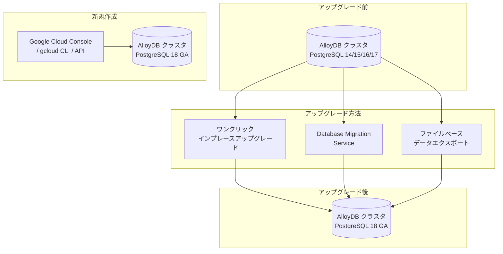

# AlloyDB for PostgreSQL: PostgreSQL 18 互換性が GA (一般提供)

**リリース日**: 2026-03-25

**サービス**: AlloyDB for PostgreSQL

**機能**: PostgreSQL 18 互換性 GA

**ステータス**: GA

📊 [このアップデートのインフォグラフィックを見る](https://takech9203.github.io/google-cloud-news-summary/20260325-alloydb-postgresql-18-ga.html)

## 概要

AlloyDB for PostgreSQL において、PostgreSQL バージョン 18 との互換性が一般提供 (GA) となった。これにより、AlloyDB クラスタを PostgreSQL 18 互換で新規作成できるほか、既存の PostgreSQL 14、15、16、17 互換クラスタからワンクリックでメジャーバージョン 18 へのアップグレードが可能になった。

PostgreSQL 18 は PostgreSQL コミュニティが提供する最新のメジャーバージョンであり、パフォーマンス改善、セキュリティ強化、新しい SQL 機能などが含まれている。AlloyDB は Google 独自のデータベースエンジンと PostgreSQL の完全互換性を両立しており、今回の GA により本番ワークロードでも PostgreSQL 18 の新機能を安心して活用できるようになった。

また、Database Migration Service (DMS) を使用して外部データベースから AlloyDB の PostgreSQL 18 互換クラスタへのマイグレーションも可能となり、既存の PostgreSQL 環境からの移行パスが整備された。

**アップデート前の課題**

- AlloyDB で PostgreSQL 18 互換性は Preview 段階であり、本番ワークロードでの使用は推奨されていなかった
- Preview 時点では Database Migration Service による PostgreSQL 18 互換クラスタへのマイグレーションがサポートされていなかった
- Preview 時点ではインプレースメジャーバージョンアップグレードで PostgreSQL 18 への移行ができなかった
- PostgreSQL 18 の新機能やパフォーマンス改善を AlloyDB の SLA 保証付きで利用できなかった

**アップデート後の改善**

- PostgreSQL 18 互換性が GA となり、SLA 保証付きで本番ワークロードに使用可能になった
- PostgreSQL 14/15/16/17 からワンクリックでインプレースメジャーバージョンアップグレードが可能になった
- Database Migration Service を使用した PostgreSQL 18 互換クラスタへのデータベースマイグレーションが利用可能になった
- PostgreSQL 18 の新しい SQL 機能やパフォーマンス改善を AlloyDB の高可用性・高性能アーキテクチャ上で活用できるようになった

## アーキテクチャ図



AlloyDB クラスタを PostgreSQL 18 にアップグレードする 3 つの方法と、新規クラスタ作成のフローを示す。インプレースアップグレードが推奨される方法であり、IP アドレスやデータベース設定を維持したまま移行できる。

## サービスアップデートの詳細

### 主要機能

1. **新規クラスタの PostgreSQL 18 互換作成**
   - Google Cloud Console、gcloud CLI、または AlloyDB Admin API を使用して PostgreSQL 18 互換の AlloyDB クラスタを新規作成可能
   - 作成時にメジャーバージョンとして PostgreSQL 18 を選択するだけで利用開始できる

2. **インプレースメジャーバージョンアップグレード**
   - PostgreSQL 14、15、16、17 互換の既存クラスタから PostgreSQL 18 へワンクリックでアップグレード可能
   - クラスタ名、IP アドレス、データベースフラグなどの設定がアップグレード後も維持される
   - プライマリインスタンスとリードプールインスタンスが同一操作で一括アップグレードされる
   - アプリケーション接続文字列の変更が不要

3. **Database Migration Service 対応**
   - 外部の PostgreSQL データベースや他のデータベースから AlloyDB PostgreSQL 18 互換クラスタへの移行が可能
   - 継続的なレプリケーション機能により、移行時のデータ欠損リスクを低減
   - SQL Server、Oracle などの異種データベースからの移行にも対応

## 技術仕様

### サポートされる PostgreSQL バージョン

| PostgreSQL 互換バージョン | AlloyDB | AlloyDB Omni |
|--------------------------|---------|--------------|
| PostgreSQL 18 (GA) | 18.x | 未対応 |
| PostgreSQL 17 (デフォルト) | 17.5 | 17.5 |
| PostgreSQL 16 | 16.9 | 16.8 / 16.3 |
| PostgreSQL 15 | 15.13 | 15.12 / 15.7 / 15.5 / 15.4 / 15.2 |
| PostgreSQL 14 | 14.18 | 未対応 |

### アップグレード方法の比較

| 項目 | インプレースアップグレード | ファイルベースエクスポート | Database Migration Service |
|------|---------------------------|--------------------------|---------------------------|
| ダウンタイム | 約 20 分以上 (スキーマ依存) | 長時間 (エクスポート開始から) | 短時間 (切り替え時のみ) |
| IP アドレス維持 | 維持される | 新規クラスタ | 新規クラスタ |
| データ選択 | 全データ | テーブル単位で選択可能 | 全データベース自動移行 |
| 推奨度 | 推奨 | 部分移行時 | 継続レプリケーション必要時 |

### インプレースアップグレードの手順概要

```bash
# gcloud CLI でのインプレースメジャーバージョンアップグレード
gcloud alloydb clusters upgrade CLUSTER_ID \
  --region=REGION \
  --version=POSTGRES_18 \
  --project=PROJECT_ID
```

## 設定方法

### 前提条件

1. AlloyDB for PostgreSQL が有効化された Google Cloud プロジェクト
2. 適切な IAM 権限 (alloydb.admin ロールまたは同等の権限)
3. アップグレードの場合: クラスタおよび全インスタンスが READY 状態であること

### 手順

#### ステップ 1: 新規クラスタの作成 (PostgreSQL 18 互換)

```bash
# PostgreSQL 18 互換の AlloyDB クラスタを作成
gcloud alloydb clusters create my-cluster \
  --region=us-central1 \
  --database-version=POSTGRES_18 \
  --project=my-project

# プライマリインスタンスを作成
gcloud alloydb instances create my-primary \
  --cluster=my-cluster \
  --region=us-central1 \
  --instance-type=PRIMARY \
  --cpu-count=4 \
  --project=my-project
```

新規クラスタを作成する場合は `--database-version=POSTGRES_18` を指定する。

#### ステップ 2: 既存クラスタのアップグレード

```bash
# アップグレード前にクローンで検証 (推奨)
gcloud alloydb clusters clone my-cluster-clone \
  --source-cluster=my-cluster \
  --region=us-central1 \
  --project=my-project

# インプレースメジャーバージョンアップグレードを実行
gcloud alloydb clusters upgrade my-cluster \
  --region=us-central1 \
  --version=POSTGRES_18 \
  --project=my-project
```

本番クラスタのアップグレード前に、クローンクラスタでアップグレード手順を検証することが推奨される。

#### ステップ 3: アップグレード後の確認

```sql
-- アップグレード後にデータベース統計を更新
ANALYZE;

-- PostgreSQL バージョンの確認
SELECT version();
```

アップグレード完了後、`ANALYZE` を実行してシステム統計を更新し、クエリプランナーの最適な動作を確保する。

## メリット

### ビジネス面

- **最新機能への即時アクセス**: PostgreSQL 18 の新しい SQL 機能やパフォーマンス改善を AlloyDB のマネージド環境で即座に活用できる
- **SLA 保証付きの本番利用**: GA リリースにより、エンタープライズワークロードでも安心して PostgreSQL 18 を採用できる
- **移行コストの低減**: ワンクリックのインプレースアップグレードにより、バージョンアップに伴う運用コストと計画工数を大幅に削減できる

### 技術面

- **ゼロダウンタイムに近いアップグレード**: インプレースアップグレードにより約 20 分程度のダウンタイムでメジャーバージョンを更新可能
- **接続設定の維持**: IP アドレスやデータベースフラグが維持されるため、アプリケーション側の変更が不要
- **自動バックアップ**: アップグレードプロセス中に自動的にプリアップグレードバックアップが作成され、問題発生時のロールバックが可能

## デメリット・制約事項

### 制限事項

- AlloyDB Omni では PostgreSQL 18 互換はまだ利用できない
- インプレースアップグレード中は約 20 分以上のダウンタイムが発生する (スキーマの複雑さに依存)
- アップグレード後に同じクラスタを以前のバージョンに直接ダウングレードすることはできない (プリアップグレードバックアップからの復元が必要)

### 考慮すべき点

- アップグレード前にクローンクラスタでの検証を推奨
- 拡張機能 (Extensions) の互換性をアップグレード前に確認する必要がある
- アップグレード後は `ANALYZE` コマンドを実行してシステム統計を更新する必要がある
- pglogical レプリケーションを使用している場合、アップグレード後に再設定が必要

## ユースケース

### ユースケース 1: 既存 AlloyDB クラスタの PostgreSQL 18 アップグレード

**シナリオ**: PostgreSQL 16 互換で稼働中の AlloyDB クラスタを、PostgreSQL 18 の新機能 (パフォーマンス改善、新しい SQL 構文) を活用するためにアップグレードする。

**実装例**:
```bash
# 1. クローンで事前検証
gcloud alloydb clusters clone test-upgrade-clone \
  --source-cluster=production-cluster \
  --region=us-central1 \
  --project=my-project

# 2. クローンでアップグレードテスト
gcloud alloydb clusters upgrade test-upgrade-clone \
  --region=us-central1 \
  --version=POSTGRES_18 \
  --project=my-project

# 3. 検証後、本番クラスタをアップグレード
gcloud alloydb clusters upgrade production-cluster \
  --region=us-central1 \
  --version=POSTGRES_18 \
  --project=my-project
```

**効果**: 最小限のダウンタイムで最新の PostgreSQL 機能を活用でき、アプリケーション接続設定の変更なしにアップグレードが完了する。

### ユースケース 2: 外部 PostgreSQL から AlloyDB PostgreSQL 18 への移行

**シナリオ**: オンプレミスまたは他クラウドの PostgreSQL データベースを、Database Migration Service を使用して AlloyDB PostgreSQL 18 互換クラスタに移行する。

**効果**: 継続的レプリケーションにより移行中のデータ欠損リスクを最小化しつつ、AlloyDB の高可用性アーキテクチャと PostgreSQL 18 の最新機能を同時に取得できる。

## 料金

AlloyDB for PostgreSQL は従量課金制で、以下の要素に基づいて課金される。PostgreSQL 18 互換性の選択によって追加料金は発生しない。

### 料金例

| リソース | 料金 (us-central1) |
|---------|-------------------|
| vCPU | $0.06608 / vCPU / 時間 |
| メモリ | $0.0112 / GB / 時間 |
| ストレージ | 使用量に応じた従量課金 |

| 構成例 | 月額料金 (概算) |
|--------|-----------------|
| 4 vCPU / 32 GB RAM (シングルゾーン) | 約 $454 / 月 |
| 16 vCPU / 128 GB RAM (HA 構成) | 約 $3,635 / 月 |

- 1 年間のコミットメント利用割引 (CUD): 25% 割引
- 3 年間のコミットメント利用割引 (CUD): 52% 割引
- 無料トライアルクラスタ: 8 vCPU / 1 TB ストレージ、30 日間無料で利用可能

## 利用可能リージョン

AlloyDB for PostgreSQL は世界 40 以上のリージョンで利用可能。主要リージョンは以下の通り。

| 地域 | リージョン |
|------|-----------|
| アメリカ | us-central1, us-east1, us-east4, us-west1, us-west2 など 14 リージョン |
| ヨーロッパ | europe-west1, europe-west3, europe-north1 など 13 リージョン |
| アジア太平洋 | asia-northeast1 (東京), asia-northeast2 (大阪), asia-southeast1 など 10 リージョン |
| オーストラリア | australia-southeast1, australia-southeast2 |
| 中東 | me-central1, me-central2, me-west1 |
| アフリカ | africa-south1 |

詳細は [AlloyDB ロケーション](https://cloud.google.com/alloydb/docs/locations) を参照。

## 関連サービス・機能

- **Database Migration Service**: 外部データベースから AlloyDB への移行ツール。PostgreSQL、SQL Server、Oracle からの移行をサポート
- **AlloyDB Omni**: AlloyDB のダウンロード可能なエディション。現時点では PostgreSQL 18 互換は未対応
- **Cloud SQL for PostgreSQL**: Google Cloud のもう一つの PostgreSQL マネージドサービス。よりシンプルなワークロード向け
- **AlloyDB AI**: AlloyDB に統合されたベクトル検索と ML モデル呼び出し機能。PostgreSQL 18 互換クラスタでも利用可能
- **Cloud Monitoring / Cloud Logging**: AlloyDB クラスタの監視とログ管理

## 参考リンク

- 📊 [インフォグラフィック](https://takech9203.github.io/google-cloud-news-summary/20260325-alloydb-postgresql-18-ga.html)
- [公式リリースノート](https://cloud.google.com/release-notes#March_25_2026)
- [AlloyDB データベースバージョンポリシー](https://cloud.google.com/alloydb/docs/db-version-policies)
- [インプレースメジャーバージョンアップグレード概要](https://cloud.google.com/alloydb/docs/major-version-upgrade-inplace-overview)
- [インプレースメジャーバージョンアップグレード手順](https://cloud.google.com/alloydb/docs/upgrade-db-inplace-major-version)
- [AlloyDB クラスタの作成](https://cloud.google.com/alloydb/docs/cluster-create)
- [料金ページ](https://cloud.google.com/alloydb/pricing)
- [AlloyDB ロケーション](https://cloud.google.com/alloydb/docs/locations)

## まとめ

AlloyDB for PostgreSQL の PostgreSQL 18 互換性が GA となり、エンタープライズ向け本番ワークロードでも PostgreSQL 最新バージョンの機能を安心して利用できるようになった。既存クラスタからのワンクリックインプレースアップグレードと Database Migration Service による外部データベースからの移行パスが整備されており、スムーズな導入が可能である。PostgreSQL 14~17 を利用中のユーザーは、クローンクラスタでの事前検証を経てアップグレードを計画することを推奨する。

---

**タグ**: #AlloyDB #PostgreSQL #PostgreSQL18 #データベース #メジャーバージョンアップグレード #GA #DatabaseMigrationService
