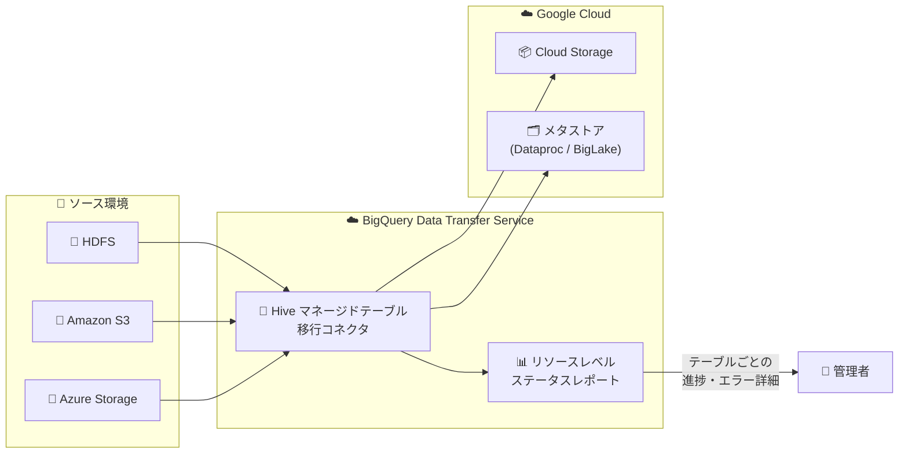

# BigQuery Data Transfer Service: Hive マネージドテーブルのリソースレベルステータスレポート

**リリース日**: 2026-03-25

**サービス**: BigQuery Data Transfer Service

**機能**: Hive マネージドテーブルのリソースレベルステータスレポート

**ステータス**: Preview

📊 [このアップデートのインフォグラフィックを見る](https://takech9203.github.io/google-cloud-news-summary/20260325-bigquery-dts-hive-resource-status.html)

## 概要

BigQuery Data Transfer Service において、Hive マネージドテーブルの転送に対するリソースレベルのステータスレポート機能が Preview として提供開始された。この機能により、個別テーブル単位で転送の進行状況を追跡し、詳細なエラー情報を確認できるようになる。

Hive マネージドテーブルの移行コネクタは、Hive メタストアで管理されるテーブル (Hive 形式および Iceberg 形式) を、オンプレミスやクラウド環境から Google Cloud へシームレスに移行するための機能である。HDFS、Amazon S3、Azure Blob Storage / Azure Data Lake Storage Gen2 をデータソースとしてサポートしている。

本アップデートは、大規模なデータ移行プロジェクトにおいて数百から数千のテーブルを一括で移行する際に、個々のテーブルの状態を正確に把握したいデータエンジニアやクラウド移行チームを主な対象としている。

**アップデート前の課題**

- 転送ジョブ全体のステータスは確認できたが、個別テーブルごとの進行状況を把握するには `dwh-dts-status` ツールを別途ダウンロードして実行する必要があった
- テーブル単位のエラー詳細が不十分で、障害発生時の原因特定に時間がかかることがあった
- 大量テーブルの移行時に、どのテーブルが完了し、どのテーブルが失敗したかを効率的に確認する手段が限られていた

**アップデート後の改善**

- BigQuery Data Transfer Service 上で直接、リソースレベル (個別テーブル単位) のステータスを監視できるようになった
- 個別テーブルごとの詳細なエラー情報が確認可能になり、障害対応が迅速化された
- 転送全体の進捗をテーブル粒度で追跡できるようになり、移行プロジェクトの可視性が向上した

## アーキテクチャ図



Hive マネージドテーブルの移行フローにおいて、新たにリソースレベルステータスレポート機能が追加され、個別テーブルの転送状況とエラー詳細を管理者が直接確認できるようになった。

## サービスアップデートの詳細

### 主要機能

1. **リソースレベルの進捗追跡**
   - 転送構成内の個別テーブルごとにステータスを確認可能
   - テーブルのステータスは `PENDING`、`RUNNING`、`SUCCEEDED`、`FAILED`、`CANCELLED` のいずれかで表示される

2. **詳細なエラーレポート**
   - 個別テーブルで発生したエラーの詳細情報を確認可能
   - 障害発生時に影響範囲をテーブル単位で特定でき、トラブルシューティングの効率が向上

3. **データベース単位のステータス確認**
   - 特定のデータベースに属するすべてのテーブルの転送ステータスを一覧表示
   - 大規模移行プロジェクトにおけるデータベース単位の進捗管理に活用可能

## 技術仕様

### 転送ステータス

| ステータス | 説明 |
|------|------|
| PENDING | 転送が待機中 |
| RUNNING | 転送が実行中 |
| SUCCEEDED | 転送が正常に完了 |
| FAILED | 転送が失敗 |
| CANCELLED | 転送がキャンセルされた |

### 対応データソース

| データソース | 説明 |
|------|------|
| HDFS | Hadoop Distributed File System からの転送 (エージェント必要) |
| Amazon S3 | エージェントレスでの転送 |
| Azure Blob Storage / ADLS Gen2 | エージェントレスでの転送 |

### 必要な権限

- `bigquery.admin` ロール: 転送構成の管理とステータス確認に必要
- `logging.viewer` ロール: ログの閲覧に必要
- サービスエージェントには `metastore.metadataOwner`、`storagetransfer.admin`、`storage.objectAdmin` などのロールが必要

## 設定方法

### 前提条件

1. BigQuery Data Transfer API および Storage Transfer API が有効化されていること
2. Hive メタストアの移行コネクタによる転送が構成済みであること
3. 適切な IAM ロール (`bigquery.admin`、`logging.viewer`) が付与されていること

### 手順

#### ステップ 1: dwh-dts-status ツールの準備

```bash
# dwh-migration-tools パッケージをダウンロード
# https://github.com/google/dwh-migration-tools/releases から取得

# Google Cloud への認証
gcloud auth application-default login
```

#### ステップ 2: 転送構成のリソースレベルステータスを確認

```bash
# 特定の転送構成内のすべてのテーブルのステータスを確認
./dwh-dts-status \
  --list-status-for-config \
  --project-id=PROJECT_ID \
  --config-id=CONFIG_ID \
  --location=LOCATION
```

#### ステップ 3: データベース単位でステータスを確認

```bash
# 特定データベースのすべてのテーブルのステータスを確認
./dwh-dts-status \
  --list-status-for-database \
  --project-id=PROJECT_ID \
  --database=DATABASE_NAME
```

## メリット

### ビジネス面

- **移行プロジェクトの可視性向上**: テーブル単位の進捗把握により、プロジェクトマネージャーが正確な進捗報告を行える
- **ダウンタイムの短縮**: エラー発生時の迅速な原因特定により、移行全体のスケジュール遅延リスクを低減

### 技術面

- **きめ細かいトラブルシューティング**: 個別テーブルのエラー詳細により、問題の根本原因を迅速に特定可能
- **運用効率の向上**: 転送ジョブ全体を再実行せず、失敗したテーブルのみに対処できる

## デメリット・制約事項

### 制限事項

- 本機能は現在 Preview であり、「Pre-GA Offerings Terms」が適用される。サポートが限定的な場合がある
- Apache Iceberg テーブルの移行には BigLake メタストアへの登録が必要
- Hive マネージドテーブルの移行には Dataproc Metastore への登録が必要
- 移行には `bq` コマンドラインツールの使用が必須

### 考慮すべき点

- Preview 機能のため、GA 時に仕様が変更される可能性がある
- サポートやフィードバックは `bigquery-permission-migration-support@google.com` へ連絡が必要

## ユースケース

### ユースケース 1: 大規模 Hadoop クラスタからの段階的移行

**シナリオ**: 数千テーブルを持つオンプレミスの Hadoop クラスタを Google Cloud へ段階的に移行するプロジェクトにおいて、各バッチの転送状況をテーブル単位で追跡したい。

**効果**: リソースレベルステータスにより、各バッチ内のテーブルごとの成功/失敗を即座に確認でき、失敗したテーブルのみを再移行対象として特定できる。移行スケジュールの精度が向上し、プロジェクト全体のリスクが低減される。

### ユースケース 2: マルチクラウド環境からの統合移行

**シナリオ**: Amazon S3 と Azure Blob Storage に分散しているデータを BigQuery に統合する際、ソースごとにテーブルレベルのステータスを監視したい。

**効果**: 各データソースからの転送について個別テーブルのエラー詳細を確認でき、ソース固有の問題 (アクセス権限、ネットワーク制約など) を迅速に切り分けられる。

## 料金

BigQuery Data Transfer Service の料金については [BigQuery 料金ページ](https://cloud.google.com/bigquery/pricing#data-transfer-service-pricing) を参照。データが BigQuery に転送された後は、標準の BigQuery [ストレージ](https://cloud.google.com/bigquery/pricing#storage) および [クエリ](https://cloud.google.com/bigquery/pricing#queries) 料金が適用される。

## 利用可能リージョン

BigQuery Data Transfer Service は BigQuery と同様にマルチリージョンリソースとして動作し、多数のシングルリージョンも利用可能。詳細は [データセットのロケーションと転送](https://cloud.google.com/bigquery/docs/dts-locations) を参照。

## 関連サービス・機能

- **[BigQuery](https://cloud.google.com/bigquery/docs/introduction)**: 転送先のデータウェアハウスサービス。転送されたデータの保存・分析基盤
- **[Dataproc Metastore](https://cloud.google.com/dataproc-metastore/docs/overview)**: Hive マネージドテーブルのメタデータ登録先として使用
- **[BigLake メタストア](https://cloud.google.com/bigquery/docs/about-blms)**: Iceberg テーブルのメタデータ登録先として使用
- **[Cloud Storage](https://cloud.google.com/storage/docs)**: 移行データのファイルストレージとして使用
- **[Cloud Monitoring](https://cloud.google.com/monitoring/docs)**: 転送構成のメトリクス監視 (実行レイテンシ、アクティブ実行数、完了実行数)
- **[Cloud Logging](https://cloud.google.com/logging/docs)**: 転送実行のログ記録と分析

## 参考リンク

- 📊 [インフォグラフィック](https://takech9203.github.io/google-cloud-news-summary/20260325-bigquery-dts-hive-resource-status.html)
- [公式リリースノート](https://docs.google.com/release-notes#March_25_2026)
- [Hive マネージドテーブルの移行ドキュメント](https://cloud.google.com/bigquery/docs/hdfs-data-lake-transfer)
- [BigQuery Data Transfer Service 概要](https://cloud.google.com/bigquery/docs/dts-introduction)
- [転送の監視とログ](https://cloud.google.com/bigquery/docs/dts-monitor)
- [料金ページ](https://cloud.google.com/bigquery/pricing#data-transfer-service-pricing)

## まとめ

BigQuery Data Transfer Service に Hive マネージドテーブルのリソースレベルステータスレポート機能が Preview として追加された。大規模なデータ移行プロジェクトにおいて、個別テーブル単位での進捗追跡とエラー詳細の確認が可能になり、移行作業の可視性と運用効率が大幅に向上する。Hadoop、Amazon S3、Azure からの移行を計画しているチームは、この機能を活用して移行プロジェクトの管理精度を高めることを推奨する。

---

**タグ**: #BigQuery #DataTransferService #Hive #データ移行 #Preview #Hadoop #モニタリング
