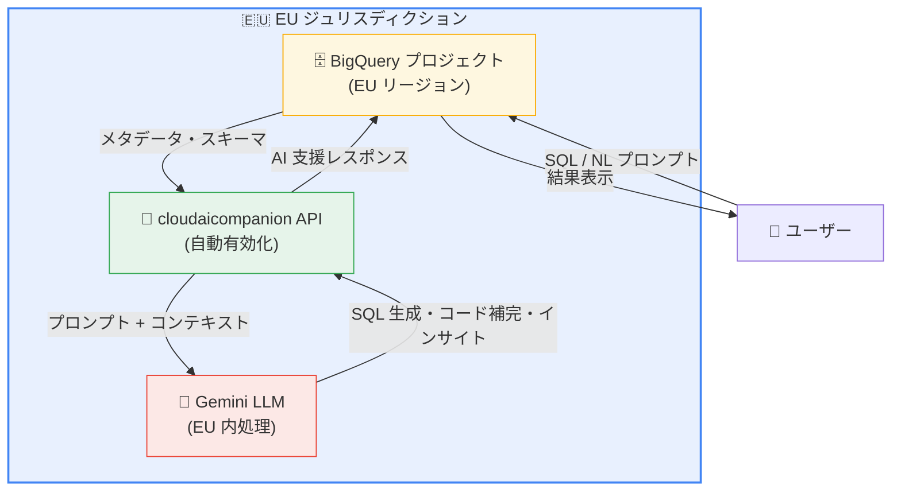

# BigQuery: Gemini for Google Cloud API が EU ジュリスディクションで有効化

**リリース日**: 2026-03-25

**サービス**: BigQuery

**機能**: Gemini for Google Cloud API の EU ジュリスディクション対応

**ステータス**: Announcement

📊 [このアップデートのインフォグラフィックを見る](https://takech9203.github.io/google-cloud-news-summary/20260325-bigquery-gemini-api-eu-jurisdiction.html)

## 概要

Gemini for Google Cloud API (`cloudaicompanion.googleapis.com`) が、EU ジュリスディクションにある既存の BigQuery プロジェクトで自動的に有効化されるようになりました。これにより、EU データレジデンシー要件に準拠した環境で Gemini を活用した BigQuery の AI 支援機能が利用可能になります。

Gemini in BigQuery は、SQL コード補完、データキャンバス、データインサイト、データ準備など、データ分析における AI パワードの支援を提供するサービスです。今回のアップデートにより、EU 内でデータを処理する必要がある組織でも、これらの機能をデータ主権の懸念なく活用できるようになります。

このアップデートは、EU のデータ保護規制 (GDPR など) に準拠した運用を行う企業にとって特に重要です。Gemini の処理がジュリスディクション境界内で行われることで、データの越境移動を最小限に抑え、データガバナンスのベストプラクティスに沿った運用が可能になります。

**アップデート前の課題**

- EU ジュリスディクションの BigQuery プロジェクトでは、Gemini for Google Cloud API を手動で有効化する必要があった
- EU データレジデンシー要件を持つ組織では、Gemini 機能の利用にデータ主権上の懸念があった
- Gemini の AI 支援機能を利用するには、管理者が API の有効化と IAM ロールの付与を個別に実施する必要があった

**アップデート後の改善**

- EU ジュリスディクションの既存 BigQuery プロジェクトで `cloudaicompanion.googleapis.com` が自動的に有効化される
- Gemini の処理が EU ジュリスディクション境界内で行われるため、データレジデンシー要件に準拠した状態で AI 支援機能を利用可能
- 管理者による API 有効化のステップが不要になり、Gemini 機能へのアクセスが簡素化された

## アーキテクチャ図



EU ジュリスディクション内で Gemini in BigQuery のデータ処理が完結するアーキテクチャを示しています。ユーザーのプロンプトとコンテキスト情報は EU 境界内の Gemini LLM で処理され、データの越境移動が発生しません。

## サービスアップデートの詳細

### 主要機能

1. **cloudaicompanion API の自動有効化**
   - EU ジュリスディクションの既存 BigQuery プロジェクトで `cloudaicompanion.googleapis.com` が自動的に有効化
   - 管理者による手動 API 有効化が不要に
   - 新規プロジェクトでも EU ジュリスディクション設定時に自動有効化

2. **EU ジュリスディクション内での Gemini 処理**
   - Gemini の処理がクエリのロケーションまたはデータセットのロケーションのジュリスディクション境界内で実行
   - 例: `europe-west1` リージョンのデータセットに対する Gemini 処理は EU ジュリスディクション内で実施
   - グローバルデフォルトロケーション設定により管理者がプロジェクトレベルで制御可能

3. **対応する Gemini in BigQuery 機能**
   - SQL コード補完 (オートコンプリート、コメントからの SQL 生成)
   - BigQuery データキャンバス (自然言語でのデータ探索)
   - BigQuery データインサイト (パターン検出、統計分析)
   - BigQuery データ準備 (データクレンジング・変換の AI 支援)

## 技術仕様

### 必要な IAM 権限

| 権限 | 説明 |
|------|------|
| `cloudaicompanion.entitlements.get` | Gemini エンタイトルメントの取得 |
| `cloudaicompanion.instances.completeCode` | コード補完機能の利用 |
| `cloudaicompanion.instances.completeTask` | タスク完了機能の利用 |
| `cloudaicompanion.instances.generateCode` | コード生成機能の利用 |
| `cloudaicompanion.operations.get` | オペレーション状態の取得 |
| `cloudaicompanion.topics.create` | トピックの作成 |

### 推奨 IAM ロール

| ロール | 説明 |
|------|------|
| BigQuery Studio User | Gemini in BigQuery の基本機能を利用するユーザー向け |
| BigQuery Studio Admin | Gemini in BigQuery の管理機能を含む全機能を利用する管理者向け |

### ジュリスディクション処理の仕組み

```json
{
  "gemini_processing": {
    "jurisdiction": "EU",
    "supported_regions": [
      "europe-west1",
      "europe-west2",
      "europe-west3",
      "europe-west4",
      "europe-west6",
      "europe-north1",
      "europe-central2"
    ],
    "api": "cloudaicompanion.googleapis.com",
    "auto_enabled": true
  }
}
```

## 設定方法

### 前提条件

1. EU ジュリスディクション内のリージョンにデータセットが配置されている BigQuery プロジェクト
2. ユーザーに BigQuery Studio User または BigQuery Studio Admin ロールが付与されていること

### 手順

#### ステップ 1: Gemini 機能の利用確認

```bash
# プロジェクトで cloudaicompanion API が有効化されているか確認
gcloud services list --enabled --project=PROJECT_ID \
  --filter="name:cloudaicompanion.googleapis.com"
```

EU ジュリスディクションのプロジェクトでは自動的に有効化されているため、手動での有効化は不要です。

#### ステップ 2: IAM ロールの付与

```bash
# ユーザーに BigQuery Studio User ロールを付与
gcloud projects add-iam-policy-binding PROJECT_ID \
  --member="user:USER_EMAIL" \
  --role="roles/bigquery.studioUser"
```

IAM ロールの付与後、BigQuery Studio で Gemini 機能が利用可能になります。

#### ステップ 3: グローバルデフォルトロケーションの設定 (オプション)

プロジェクトまたは組織レベルでグローバルデフォルトロケーションを設定し、Gemini の処理ロケーションを明示的に制御できます。ユーザーは BigQuery Studio のクエリロケーション設定でオーバーライドすることも可能です。

## メリット

### ビジネス面

- **EU データレジデンシーコンプライアンス**: GDPR やその他の EU データ保護規制に準拠した状態で Gemini の AI 支援機能を利用可能。規制対応コストの削減に寄与
- **運用の簡素化**: API の自動有効化により管理者の作業負荷が削減。Gemini 機能の導入障壁が低下し、組織全体での迅速な活用が可能に
- **データ分析の生産性向上**: EU 内のデータアナリスト・データサイエンティストが、データ主権を維持したまま AI 支援によるクエリ作成・データ探索を活用可能

### 技術面

- **ジュリスディクション境界内処理**: Gemini の処理が EU 境界内で完結し、データの越境移動を最小化
- **既存のセキュリティ制御との統合**: VPC Service Controls、IAM、データ暗号化など既存のセキュリティ制御がそのまま適用
- **SOC 1/2/3、ISO/IEC 27001 準拠**: GA 機能については Gemini for Google Cloud のセキュリティ認証がカバー

## デメリット・制約事項

### 制限事項

- Gemini in BigQuery は個別のロケーション単位でのデータレジデンシーは提供しない。US と EU のジュリスディクション単位でのみ指定可能。これら以外のジュリスディクションのデータはグローバルに処理される
- Gemini in BigQuery のジュリスディクション処理は GA 機能のみが対象。プレビュー機能は対象外
- BigQuery Python ノートブックのコード補完と Colab Enterprise の Data Science Agent はグローバル Gemini 処理のみをサポート
- Gemini in Cloud Assist チャット (GCA) はグローバル Gemini 処理のみをサポート
- Cloud Logging 監査ログは Gemini in BigQuery のユーザープロンプトとレスポンスに対して利用不可
- Gemini in BigQuery は Assured Workloads パッケージの対象外

### 考慮すべき点

- Gemini in BigQuery は BigQuery と同じコンプライアンスおよびセキュリティ提供をサポートしていない。Gemini for Google Cloud がサポートしていないコンプライアンス要件があるプロジェクトでは有効化しないことを推奨
- 自動有効化された API を無効にしたい場合は、`cloudaicompanion` の IAM 権限を取り消すか、Gemini for Google Cloud API 自体を無効化する必要がある
- AI が生成したコードや分析結果は常に人間によるレビューが必要

## ユースケース

### ユースケース 1: EU 拠点の金融機関でのデータ分析

**シナリオ**: EU 内に拠点を持つ金融機関が、GDPR 準拠を維持しながら BigQuery に蓄積された取引データを分析する必要がある。

**実装例**:
```sql
-- Gemini の SQL 生成機能を使用して自然言語からクエリを生成
-- プロンプト: "直近四半期の取引量トップ5の顧客を表示して"
-- Gemini が生成する SQL:
SELECT
  customer_id,
  customer_name,
  COUNT(*) AS transaction_count,
  SUM(amount) AS total_amount
FROM `project.eu_dataset.transactions`
WHERE transaction_date >= DATE_SUB(CURRENT_DATE(), INTERVAL 3 MONTH)
GROUP BY customer_id, customer_name
ORDER BY total_amount DESC
LIMIT 5;
```

**効果**: データの EU 外への移動なしに、Gemini の AI 支援で分析クエリの作成効率が向上。データアナリストの生産性が大幅に改善される。

### ユースケース 2: EU のヘルスケア企業でのデータインサイト

**シナリオ**: EU のヘルスケア企業が、患者データの匿名化済みデータセットに対して自動的にインサイトを生成し、データ品質や傾向を把握したい。

**効果**: Gemini データインサイト機能により、手動での探索的分析にかかる時間を短縮。EU ジュリスディクション内での処理により、ヘルスケアデータの取り扱いに関する規制要件を満たしながら AI 支援を活用可能。

## 料金

Gemini in BigQuery の一部の機能は追加料金なしで利用可能です。その他の機能はコンピュート容量の使用により獲得されるクォータが必要です。

- BigQuery オンデマンド、Enterprise edition、Enterprise Plus edition を利用している組織で、データインサイトと自動メタデータ生成機能が利用可能
- BigQuery Standard edition のみを使用している場合は、Gemini Code Assist Standard のサブスクリプションで同等機能を利用可能

詳細な料金体系については [Gemini for Google Cloud 料金ページ](https://cloud.google.com/products/gemini/pricing#gemini-in-bigquery-pricing) を参照してください。

## 利用可能リージョン

Gemini in BigQuery は全ての [BigQuery ロケーション](https://cloud.google.com/bigquery/docs/locations) で利用可能です。ジュリスディクション処理は以下の 2 つのジュリスディクションで対応しています。

| ジュリスディクション | 対象リージョン例 |
|------|------|
| EU | europe-west1, europe-west2, europe-west3, europe-west4, europe-west6, europe-north1, europe-central2 |
| US | us-central1, us-east1, us-west1 など |

上記以外のリージョンのデータはグローバルに処理されます。

## 関連サービス・機能

- **Gemini for Google Cloud**: Gemini in BigQuery の親サービス。Google Cloud 全体で AI 支援を提供するプロダクトスイート
- **Gemini Code Assist**: コード補完・生成機能を提供。BigQuery 以外の IDE (VS Code, IntelliJ など) でも利用可能
- **VPC Service Controls**: BigQuery リソース周辺にセキュリティ強化された境界を作成。Gemini のトラフィックもこの制御の対象
- **Cloud IAM**: Gemini in BigQuery へのアクセス制御を管理。cloudaicompanion の権限で細かな制御が可能
- **Dataplex Universal Catalog**: Gemini in BigQuery がコンテキスト情報の取得に使用。メタデータとスキーマ情報をデータと同じロケーションに保持
- **Assured Workloads**: 規制対応ワークロード向けのサービス。現時点では Gemini in BigQuery は対象外のため注意が必要

## 参考リンク

- 📊 [インフォグラフィック](https://takech9203.github.io/google-cloud-news-summary/20260325-bigquery-gemini-api-eu-jurisdiction.html)
- [公式リリースノート](https://cloud.google.com/release-notes#March_25_2026)
- [Gemini in BigQuery のセットアップ](https://cloud.google.com/bigquery/docs/gemini-set-up)
- [Gemini in BigQuery のデータ処理ロケーション](https://cloud.google.com/bigquery/docs/gemini-locations)
- [Gemini in BigQuery のセキュリティ・プライバシー・コンプライアンス](https://cloud.google.com/bigquery/docs/gemini-security-privacy-compliance)
- [Gemini in BigQuery の概要](https://cloud.google.com/bigquery/docs/gemini-overview)
- [Gemini for Google Cloud 料金ページ](https://cloud.google.com/products/gemini/pricing#gemini-in-bigquery-pricing)

## まとめ

今回のアップデートにより、EU ジュリスディクションの BigQuery プロジェクトで Gemini for Google Cloud API が自動有効化され、EU データレジデンシー要件に準拠した状態で AI 支援機能を活用できるようになりました。GDPR など EU のデータ保護規制に対応する必要がある組織は、IAM ロールの付与を確認し、BigQuery Studio で Gemini 機能の利用を開始することを推奨します。Gemini in BigQuery のジュリスディクション処理の制限事項 (GA 機能のみ対象、一部機能はグローバル処理のみ) を事前に確認した上で導入計画を策定してください。

---

**タグ**: #BigQuery #Gemini #EU #データレジデンシー #コンプライアンス #GDPR #AI支援 #cloudaicompanion
