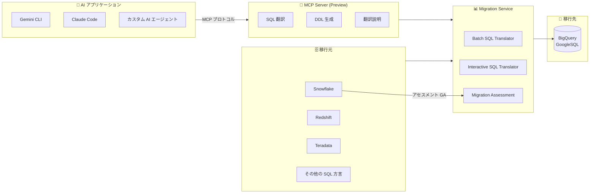

# BigQuery: Migration Service MCP server (Preview) と Snowflake 移行アセスメント (GA)

**リリース日**: 2026-03-25

**サービス**: BigQuery

**機能**: Migration Service MCP server (Preview) / Snowflake migration assessment (GA)

**ステータス**: Preview (MCP server) / GA (Snowflake assessment)

📊 [このアップデートのインフォグラフィックを見る](https://takech9203.github.io/google-cloud-news-summary/20260325-bigquery-migration-tools-update.html)

## 概要

BigQuery Migration Service に関する 2 つの重要なアップデートが発表された。1 つ目は、BigQuery Migration Service MCP server が Preview として利用可能になったことである。Model Context Protocol (MCP) を活用し、AI アプリケーションから SQL 翻訳タスクを直接実行できるようになった。SQL クエリの GoogleSQL 構文への変換、SQL 入力クエリからの DDL ステートメント生成、SQL 翻訳結果の説明取得が可能である。

2 つ目は、Snowflake から BigQuery への移行アセスメントが GA (一般提供) になったことである。これにより、Snowflake から BigQuery への移行の複雑さを評価するツールが正式にサポートされ、本番環境での利用が推奨される状態となった。既存の Snowflake 環境の分析、BigQuery への移行後の最適な構成の提案、移行計画の策定を包括的に支援する。

これらのアップデートは、データウェアハウスの BigQuery への移行を検討している組織、特に Snowflake からの移行を計画しているチームや、AI を活用した開発ワークフローに SQL 翻訳を組み込みたいエンジニアにとって大きな価値がある。

**アップデート前の課題**

- SQL 翻訳タスクを実行するには、Google Cloud コンソールや API を直接操作する必要があり、AI エージェントや IDE からのシームレスな利用が困難だった
- Snowflake からの移行アセスメントは Preview 段階であり、本番環境での利用には制限やサポートの制約があった
- 移行計画の策定において、AI アシスタントと移行ツールを連携させるための標準化されたインターフェースが存在しなかった

**アップデート後の改善**

- MCP server を通じて、Gemini CLI、Claude Code、Gemini Code Assist などの AI アプリケーションから直接 SQL 翻訳タスクを実行可能になった
- Snowflake 移行アセスメントが GA となり、SLA に基づく本番環境での安定した利用と正式サポートが提供されるようになった
- MCP の標準プロトコルにより、さまざまな AI ツールから一貫したインターフェースで移行タスクを呼び出せるようになった

## アーキテクチャ図



AI アプリケーションから MCP プロトコルを通じて BigQuery Migration Service の SQL 翻訳機能にアクセスし、各種データウェアハウスからの移行を支援する構成を示す。Snowflake からの移行アセスメントは GA として正式サポートされている。

## サービスアップデートの詳細

### 主要機能

1. **Migration Service MCP server (Preview)**
   - SQL クエリを GoogleSQL 構文に翻訳する機能を MCP プロトコル経由で提供
   - SQL 入力クエリから DDL (Data Definition Language) ステートメントを生成
   - SQL 翻訳結果の説明を取得し、変換内容を理解可能
   - Gemini CLI、Claude Code、Gemini Code Assist、カスタム AI アプリケーションから利用可能
   - HTTPS エンドポイントによるリモート MCP サーバーとして動作

2. **Snowflake 移行アセスメント (GA)**
   - Snowflake 環境の包括的な分析と評価レポートの生成
   - 既存システムレポート: データベース数、スキーマ数、テーブル数、合計サイズ (TB) のスナップショット
   - BigQuery 定常状態の変換提案: 移行後の最適な構成とコスト削減の提案
   - 移行計画: 自動翻訳可能なクエリ数、テーブルごとの移行所要時間の見積もり
   - Snowflake と BigQuery の料金モデル比較と TCO (Total Cost of Ownership) 計算

3. **サポートされる SQL 方言 (MCP server 経由)**
   - Snowflake SQL、Amazon Redshift SQL、Teradata SQL/BTEQ/TPT
   - Oracle SQL/PL/SQL、SQL Server T-SQL、PostgreSQL SQL
   - Apache Spark SQL、Apache Impala SQL、MySQL SQL など多数

## 技術仕様

### MCP server の構成

| 項目 | 詳細 |
|------|------|
| プロトコル | Model Context Protocol (MCP) |
| トランスポート | HTTPS (リモート MCP サーバー) |
| 認証 | OAuth 2.0 + IAM |
| ステータス | Preview |
| 対応クライアント | Gemini CLI、Claude Code、Gemini Code Assist、カスタム AI アプリ |

### Snowflake 移行アセスメントの要件

| 項目 | 詳細 |
|------|------|
| ステータス | GA (一般提供) |
| Snowflake ユーザー権限 | IMPORTED PRIVILEGES (database Snowflake) |
| 推奨認証方式 | キーペアベース認証 (SERVICE ユーザー) |
| メタデータ ZIP 上限 | 非圧縮合計 50 GB 未満 |
| クエリ履歴上限 | 非圧縮合計 5 TB 未満 |
| 出力先 | Cloud Storage バケット + BigQuery データセット |

### 必要な権限 (Migration Service)

```text
# Migration Service の利用に必要な権限
bigquerymigration.workflows.create
bigquerymigration.workflows.get
bigquerymigration.workflows.list
bigquerymigration.workflows.delete
bigquerymigration.subtasks.get
bigquerymigration.subtasks.list

# 事前定義ロール
roles/bigquerymigration.viewer  # 読み取り専用
roles/bigquerymigration.editor  # 読み取り/書き込み

# Cloud Storage アクセス
storage.objects.get    # ソースバケット
storage.objects.list   # ソースバケット
storage.objects.create # 出力先バケット
```

## 設定方法

### 前提条件

1. Google Cloud プロジェクトで BigQuery Migration API が有効であること (2022 年 2 月 15 日以降に作成されたプロジェクトは自動有効化)
2. MCP server 利用の場合: BigQuery MCP server の有効化
3. Snowflake アセスメントの場合: Snowflake インスタンスへの接続が可能なマシンと、IMPORTED PRIVILEGES を持つ Snowflake ユーザー

### 手順

#### ステップ 1: MCP server の有効化

```bash
# BigQuery MCP server を有効化
gcloud beta services mcp enable bigquery.googleapis.com \
  --project=PROJECT_ID
```

2026 年 3 月 17 日以降、BigQuery API が有効なプロジェクトでは MCP server の個別有効化が不要になる予定である (段階的にリリース)。

#### ステップ 2: MCP クライアントの設定 (Claude Code の例)

```json
{
  "mcpServers": {
    "bigquery": {
      "type": "streamable-http",
      "url": "https://bigquery.googleapis.com/mcp"
    }
  }
}
```

認証には OAuth 2.0 を使用する。API キーは BigQuery MCP server では使用できない。

#### ステップ 3: Snowflake アセスメントの実行

```bash
# dwh-migration-dumper ツールをダウンロード
# https://github.com/google/dwh-migration-tools/releases/latest

# メタデータを抽出
# (Snowflake インスタンスに接続して実行)

# 抽出したファイルを Cloud Storage にアップロード
gsutil cp metadata.zip gs://BUCKET_NAME/assessment/
gsutil cp query_logs.zip gs://BUCKET_NAME/assessment/

# Google Cloud コンソールからアセスメントジョブを作成・実行
```

アセスメント結果は Looker Studio レポートとして表示され、既存システムの分析、BigQuery への移行提案、移行計画を確認できる。

## メリット

### ビジネス面

- **移行計画の精度向上**: Snowflake アセスメントの GA により、信頼性の高い移行評価と TCO 比較が可能になり、経営層への提案資料の作成が容易になる
- **移行コストの可視化**: Snowflake と BigQuery の料金モデル比較、Total Cost of Ownership の自動計算により、移行による ROI を定量的に評価できる
- **移行リスクの低減**: 自動翻訳可能なクエリの割合や手動対応が必要な領域が事前に把握でき、移行プロジェクトの見積もり精度が向上する

### 技術面

- **AI 駆動の移行ワークフロー**: MCP server により、AI エージェントが SQL 翻訳を自動実行し、移行作業の大幅な効率化が可能になる
- **標準プロトコルによる拡張性**: MCP という標準化されたプロトコルを通じて、さまざまな AI ツールやカスタムアプリケーションから一貫して利用できる
- **包括的な SQL 方言サポート**: Snowflake、Redshift、Teradata、Oracle など主要なデータウェアハウスの SQL 方言をカバーし、幅広い移行シナリオに対応する

## デメリット・制約事項

### 制限事項

- MCP server は Preview 段階であり、SLA の対象外で限定的なサポートとなる
- BigQuery MCP server 全般の制限として、クエリ処理時間のデフォルト上限は 3 分、結果の最大行数は 3,000 行である
- Snowflake アセスメントのメタデータ ZIP ファイルの非圧縮合計サイズは 50 GB 未満に制限される
- MCP server は API キーによる認証をサポートしていない (OAuth 2.0 が必要)

### 考慮すべき点

- MCP server の Preview 機能を本番ワークフローに組み込む場合は、GA 昇格時の仕様変更の可能性を考慮する必要がある
- SQL 翻訳はベストエフォートで行われるため、複雑なクエリや独自の SQL 関数は手動での修正が必要になる場合がある
- 翻訳時にヘルパー UDF (bqutil) が使用される場合、本番環境では自プロジェクトへのデプロイが推奨される
- Snowflake アセスメントでは、2025 年 8 月以降 Snowflake がパスワードベースユーザーに MFA を強制するため、キーペア認証の利用が推奨される

## ユースケース

### ユースケース 1: AI エージェントによる大規模 SQL 移行の自動化

**シナリオ**: 企業が Snowflake から BigQuery へ数千の SQL クエリを移行する必要がある。移行チームは AI エージェントを活用してクエリの翻訳、検証、修正のサイクルを自動化したい。

**実装例**:
```text
# AI エージェント (Gemini CLI) からの MCP 呼び出しイメージ

1. MCP server 経由で SQL クエリを GoogleSQL に翻訳
2. 翻訳結果の説明を取得して変換内容を確認
3. DDL ステートメントを生成してスキーマを作成
4. 問題があれば AI が修正案を提示
```

**効果**: 手動での SQL 翻訳と比較して移行速度が大幅に向上し、AI アシスタントによる継続的なフィードバックにより翻訳品質も改善される。

### ユースケース 2: Snowflake から BigQuery への移行フィジビリティスタディ

**シナリオ**: 大規模な Snowflake 環境 (数百のデータベース、数千のテーブル) を持つ企業が、BigQuery への移行の実現可能性とコストメリットを経営層に報告する必要がある。

**効果**: GA となったアセスメントツールにより、信頼性の高い移行評価レポートを生成し、Snowflake と BigQuery の TCO 比較、自動翻訳率、移行所要時間の見積もりを含む包括的な提案資料を作成できる。

## 料金

BigQuery Migration API の利用自体は無料である。ただし、入出力ファイルに使用される Cloud Storage のストレージ料金は通常どおり発生する。

### 料金例

| 項目 | 料金 |
|------|------|
| BigQuery Migration API | 無料 |
| Cloud Storage (入出力ファイル) | 通常のストレージ料金が適用 |
| BigQuery ストレージ (移行後データ) | アクティブストレージ: $0.02/GB/月、長期ストレージ: $0.01/GB/月 |
| BigQuery クエリ (オンデマンド) | $6.25/TB |

詳細は [BigQuery 料金ページ](https://cloud.google.com/bigquery/pricing) を参照。

## 関連サービス・機能

- **BigQuery Data Transfer Service**: Snowflake コネクタを使用してスキーマとデータを BigQuery に転送する。インクリメンタル転送にも対応
- **BigQuery Batch SQL Translator**: SQL スクリプトの一括翻訳を実行する。MCP server はこの機能をプログラマティックに呼び出す手段を提供
- **BigQuery Interactive SQL Translator**: 個別のクエリをリアルタイムで翻訳する対話型ツール
- **Google Cloud Migration Center**: 移行先での実行コストの見積もり機能を提供
- **Cloud Storage**: 移行アセスメントの入出力ファイルの保管に使用
- **Looker Studio**: 移行アセスメントの結果レポートの表示に使用
- **Data Validation Tool (DVT)**: 移行後のデータ検証を実行するオープンソースツール

## 参考リンク

- 📊 [インフォグラフィック](https://takech9203.github.io/google-cloud-news-summary/20260325-bigquery-migration-tools-update.html)
- [公式リリースノート](https://cloud.google.com/release-notes#March_25_2026)
- [BigQuery Migration Service 概要](https://cloud.google.com/bigquery/docs/migration-intro)
- [BigQuery MCP server の使用](https://cloud.google.com/bigquery/docs/use-bigquery-mcp)
- [Snowflake から BigQuery への移行](https://cloud.google.com/bigquery/docs/migration/snowflake-migration-intro)
- [BigQuery 移行アセスメント](https://cloud.google.com/bigquery/docs/migration-assessment)
- [Batch SQL Translator](https://cloud.google.com/bigquery/docs/batch-sql-translator)
- [料金ページ](https://cloud.google.com/bigquery/pricing)

## まとめ

今回のアップデートにより、BigQuery Migration Service は AI 駆動の移行ワークフローと、Snowflake からの本番対応アセスメントという 2 つの重要な機能強化を得た。MCP server (Preview) は AI エージェントと SQL 翻訳の統合を可能にし、Snowflake アセスメントの GA は移行プロジェクトの計画と意思決定を確実に支援する。Snowflake から BigQuery への移行を検討している組織は、まず GA となったアセスメントツールで移行の実現可能性を評価し、MCP server を活用した AI 支援型の移行ワークフローの構築を検討することを推奨する。

---

**タグ**: #BigQuery #Migration #MCP #Snowflake #SQLTranslation #DataWarehouse #Preview #GA
