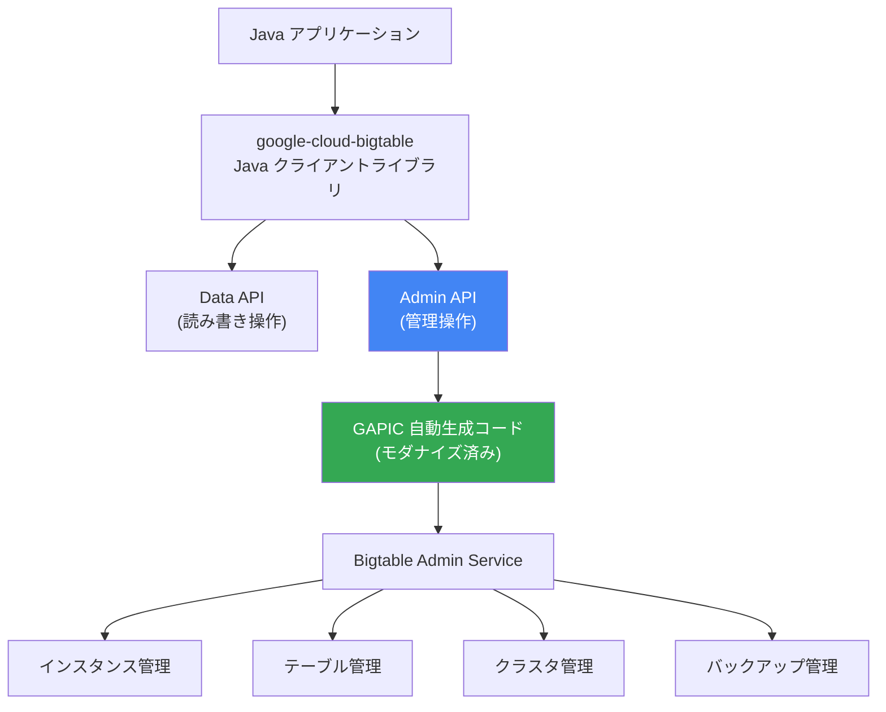

# Bigtable: Java クライアント Admin API のモダナイゼーション

**リリース日**: 2026-03-25

**サービス**: Cloud Bigtable

**機能**: Java client Admin API modernization

**ステータス**: Announcement

[このアップデートのインフォグラフィックを見る](https://takech9203.github.io/google-cloud-news-summary/20260325-bigtable-java-client-admin-api.html)

## 概要

Bigtable client for Java の Admin API がモダナイズされた。これは、クライアントライブラリの管理操作 (テーブル、インスタンス、クラスタなどの作成・管理) に使用される Admin API を最新のアーキテクチャに刷新するアップデートである。詳細な移行手順とコード例については、公式の「Upgrading client libraries」ドキュメントが提供されている。

このモダナイゼーションは、Python クライアントで先行して実施された「selective GAPIC generation」(選択的 GAPIC 自動生成) による Admin Client のモダナイゼーションと同様のアプローチを Java クライアントにも適用したものと考えられる。GAPIC (Generated API Client) の選択的生成により、必要な API のみを効率的に生成し、クライアントライブラリの品質と保守性を向上させる。

対象ユーザーは、Bigtable Java クライアントライブラリ (`google-cloud-bigtable`) を使用してインスタンス、テーブル、クラスタなどの管理操作を行っている Java 開発者である。

**アップデート前の課題**

- 従来の Admin API はレガシーなコード生成パイプラインに基づいており、新しい API 機能の追加に時間がかかる場合があった
- Admin API のコードベースが手動メンテナンスの部分を多く含み、保守コストが高かった
- 新しい Bigtable 機能 (Materialized Views、Logical Views、Schema Bundles など) の Admin API サポートを迅速に提供する必要があった

**アップデート後の改善**

- モダナイズされた Admin API により、最新の GAPIC ジェネレーターによる自動生成コードが使用される
- 新しい Bigtable 管理機能への対応が迅速化される
- クライアントライブラリの一貫性と品質が向上する

## アーキテクチャ図



Java クライアントライブラリの Admin API がモダナイズされた GAPIC 自動生成コードに移行し、Bigtable Admin Service との通信がより効率的かつ保守しやすくなった。

## サービスアップデートの詳細

### 主要機能

1. **Admin API のモダナイゼーション**
   - Java クライアントの Admin API が最新の GAPIC ジェネレーターベースのコードに移行
   - 選択的 GAPIC 生成 (selective GAPIC generation) により、必要な API のみを効率的に生成
   - Python クライアントで先行実装された同様のアプローチを Java に適用

2. **移行ガイドの提供**
   - 公式の「Upgrading client libraries」ドキュメントで詳細な移行手順を提供
   - コード例を含む段階的な移行パスを文書化

3. **最新機能との整合性**
   - Materialized Views、Logical Views、Schema Bundles など最近追加された Admin API 機能との整合性を確保
   - PreparedStatement、GoogleSQL サポートなど Data API 側の進化とも連携

## 技術仕様

### クライアントライブラリ情報

| 項目 | 詳細 |
|------|------|
| ライブラリ | `google-cloud-bigtable` (Java) |
| Maven groupId | `com.google.cloud` |
| Maven artifactId | `google-cloud-bigtable` |
| GitHub リポジトリ | [googleapis/java-bigtable](https://github.com/googleapis/java-bigtable) |
| 対象 API | Bigtable Admin API |

### Maven 依存関係の設定

```xml
<dependencyManagement>
  <dependencies>
    <dependency>
      <groupId>com.google.cloud</groupId>
      <artifactId>libraries-bom</artifactId>
      <version>26.69.0</version>
      <type>pom</type>
      <scope>import</scope>
    </dependency>
  </dependencies>
</dependencyManagement>

<dependencies>
  <dependency>
    <groupId>com.google.cloud</groupId>
    <artifactId>google-cloud-bigtable</artifactId>
  </dependency>
</dependencies>
```

## 設定方法

### 前提条件

1. Java 開発環境が構成されていること
2. 既存の Bigtable Java クライアントライブラリを使用したプロジェクトがあること
3. Maven または Gradle によるビルド環境

### 手順

#### ステップ 1: クライアントライブラリのバージョン更新

Maven BOM を最新バージョンに更新する。

```xml
<dependency>
  <groupId>com.google.cloud</groupId>
  <artifactId>libraries-bom</artifactId>
  <version>最新バージョン</version>
  <type>pom</type>
  <scope>import</scope>
</dependency>
```

#### ステップ 2: 移行ガイドの確認

公式の [Upgrading client libraries](https://docs.cloud.google.com/bigtable/docs/upgrading-clients) ドキュメントを確認し、Admin API に関する破壊的変更やマイグレーション手順を把握する。

#### ステップ 3: コードの更新とテスト

移行ガイドに従ってコードを更新し、既存のテストを実行して動作を確認する。

## メリット

### ビジネス面

- **迅速な新機能採用**: Admin API のモダナイゼーションにより、新しい Bigtable 管理機能をより早く利用できるようになる
- **保守コストの削減**: 自動生成コードベースへの移行により、長期的なメンテナンスコストが低下する

### 技術面

- **コード品質の向上**: GAPIC 自動生成による一貫したコード品質と API パターンの統一
- **新機能サポートの迅速化**: Materialized Views、Logical Views、Schema Bundles などの新しい管理機能への対応が容易になる
- **言語間の一貫性**: Python クライアントと同様のモダナイズドアーキテクチャにより、多言語間での一貫した開発体験を提供

## デメリット・制約事項

### 考慮すべき点

- 既存の Admin API を使用しているコードでは、移行作業が必要になる場合がある
- 移行の詳細については公式の「Upgrading client libraries」ドキュメントを参照し、破壊的変更の有無を確認すること
- HBase クライアント (bigtable-hbase) を使用している場合は、別途 HBase 固有の移行手順を確認する必要がある

## ユースケース

### ユースケース 1: Bigtable インスタンスの自動管理

**シナリオ**: Java アプリケーションから Bigtable インスタンスやテーブルをプログラマティックに作成・管理しているケース

**効果**: モダナイズされた Admin API により、Materialized Views や Logical Views などの最新機能を含む管理操作がより安定して実行できるようになる

### ユースケース 2: CI/CD パイプラインでのインフラ管理

**シナリオ**: CI/CD パイプラインで Bigtable のテーブルやバックアップを自動管理しているケース

**効果**: 最新のクライアントライブラリに更新することで、自動バックアップや Schema Bundles などの新機能を管理パイプラインに組み込める

## 料金

Bigtable クライアントライブラリ自体は無料で利用できる。Bigtable サービスの料金は使用量に基づく。

- **ノード料金**: リージョンとノードタイプにより異なる (例: 約 $0.65/ノード/時間)
- **ストレージ料金**: SSD または HDD の選択により異なる
- **CUD (Committed Use Discounts)**: 1 年契約で 20% 割引、3 年契約で 40% 割引

詳細は [Bigtable 料金ページ](https://cloud.google.com/bigtable/pricing) を参照。

## 関連サービス・機能

- **Bigtable Materialized Views**: Admin API で管理される新機能。SQL クエリ結果を事前計算して保存する
- **Bigtable Logical Views**: Admin API で管理される新機能。SQL クエリをビューとして保存し共有できる
- **Bigtable Schema Bundles**: Admin API で管理される新機能。Protobuf スキーマの管理に使用
- **Cloud Monitoring**: Bigtable の System insights (旧 Monitoring ページ) と連携してメトリクスを監視
- **HBase クライアント for Java**: Bigtable の HBase 互換クライアント。Admin API のモダナイゼーションとは別の移行パスが提供される

## 参考リンク

- [インフォグラフィック](https://takech9203.github.io/google-cloud-news-summary/20260325-bigtable-java-client-admin-api.html)
- [公式リリースノート](https://docs.cloud.google.com/release-notes#March_25_2026)
- [Upgrading client libraries (移行ガイド)](https://docs.cloud.google.com/bigtable/docs/upgrading-clients)
- [Cloud Bigtable Client Libraries](https://docs.cloud.google.com/bigtable/docs/reference/libraries)
- [java-bigtable GitHub リポジトリ](https://github.com/googleapis/java-bigtable)
- [料金ページ](https://cloud.google.com/bigtable/pricing)

## まとめ

Bigtable Java クライアントの Admin API モダナイゼーションは、クライアントライブラリの内部アーキテクチャを最新の GAPIC 自動生成ベースに刷新するアップデートである。既存の Admin API を使用しているプロジェクトでは、公式の「Upgrading client libraries」ドキュメントを確認し、必要に応じてコードの移行を行うことを推奨する。

---

**タグ**: #Bigtable #Java #ClientLibrary #AdminAPI #Migration
