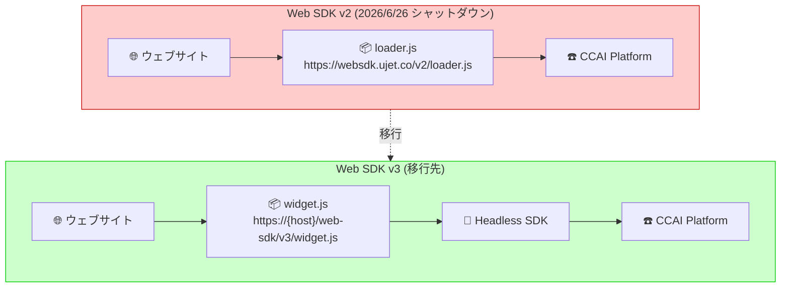

# Google Cloud Contact Center as a Service (CCaaS): Web SDK バージョン 2 シャットダウンのお知らせ

**リリース日**: 2026-03-25

**サービス**: Google Cloud Contact Center as a Service (CCaaS) / CCAI Platform

**機能**: Web SDK version 2 shutdown announcement

**ステータス**: Announcement (Shutdown)

📊 [このアップデートのインフォグラフィックを見る](https://takech9203.github.io/google-cloud-news-summary/20260325-ccaas-web-sdk-v2-shutdown.html)

## 概要

Google Cloud は、Contact Center AI Platform (CCAI Platform) の Web SDK バージョン 2 を 2026 年 6 月 26 日に完全シャットダウンすることを発表した。Web SDK v2 は、ウェブアプリケーションにコンタクトセンター機能を統合するためのクライアントサイド SDK であり、チャットや音声通話などのカスタマーサポート機能をウェブサイトに組み込むために使用されてきた。

2025 年 6 月 26 日に Web SDK バージョン 3 が一般提供 (GA) として正式リリースされており、v2 から v3 への移行期間として約 1 年間が設けられている。2026 年 6 月 26 日以降、Web SDK v2 は動作しなくなるため、それまでに v3 への移行を完了する必要がある。v2 への新機能追加は既に停止されている。

この発表は、2025 年 12 月 23 日に最初にアナウンスされたシャットダウン予告の再通知であり、シャットダウン期限まで残り約 3 か月となったタイミングでの注意喚起となっている。

**アップデート前の課題**

- Web SDK v2 はレガシーなアーキテクチャに基づいており、Headless SDK との統合が限定的だった
- v2 ではチャット履歴の閲覧やトランスクリプトのダウンロード機能が標準提供されていなかった
- v2 ではプロアクティブチャットトリガーに条件演算子 (OR/AND) を使用できなかった
- v2 ではエージェント側からチャット中にファイルを添付する機能がなかった
- v2 のイベントリスナーやメソッドは v3 の Headless SDK と互換性がなかった

**アップデート後の改善**

- Web SDK v3 は Headless SDK をベースに構築されており、Headless SDK の全メソッドが利用可能になった
- v3 では以前のチャット履歴の閲覧とトランスクリプトのダウンロードが可能になった
- v3 では HTML ウェブフォームによるデータ収集機能が追加された
- v3 ではプロアクティブチャットトリガーに OR/AND 条件演算子が利用可能になった
- v3 ではエージェントがチャット中にファイル添付が可能になった
- v3 ではテーマカスタマイズの新しいアプローチが提供されている

## アーキテクチャ図



Web SDK v2 は外部ホスト (websdk.ujet.co) から loader.js を読み込む構成だったが、v3 では自社の CCAI Platform インスタンスから widget.js を読み込む構成に変更されている。v3 は Headless SDK を基盤としており、より柔軟なカスタマイズと機能拡張が可能。

## サービスアップデートの詳細

### 主要機能

1. **シャットダウンスケジュール**
   - 2025 年 6 月 26 日: Web SDK v3 一般提供 (GA) リリース
   - 2025 年 12 月 23 日: Web SDK v2 シャットダウンの最初のアナウンス
   - 2026 年 3 月 25 日: シャットダウン予告の再通知 (本アナウンス)
   - 2026 年 6 月 26 日: Web SDK v2 完全シャットダウン

2. **Web SDK v3 の新機能**
   - Headless SDK ベースのアーキテクチャによる全メソッドへのアクセス
   - チャット履歴の閲覧とトランスクリプトダウンロード
   - HTML ウェブフォームによるデータ収集
   - プロアクティブチャットトリガーの条件演算子サポート
   - エージェントによるファイル添付機能
   - チャットオーディオの無効化機能
   - システムメッセージのカテゴリ分類 (standard, confirmation, error)
   - セッション終了時のポストセッション転送

3. **移行時の主な変更点**
   - スクリプト読み込み元の変更: `websdk.ujet.co/v2/loader.js` から `{your_ccaas_host}/web-sdk/v3/widget.js` へ
   - マウントポイントの追加: v3 では `ccaas.mount('#ccaas-widget')` が必要
   - 設定オプションの変更: `customData` や `disableAttachment` が `ccaas.config()` メソッドに移動
   - イベントリスナーの変更: `ccaas.on('chat:update', ...)` から `client.on('chat.updated', ...)` へ

## 技術仕様

### v2 と v3 の主要な違い

| 項目 | Web SDK v2 | Web SDK v3 |
|------|-----------|-----------|
| スクリプトソース | `https://websdk.ujet.co/v2/loader.js` | `https://{your_ccaas_host}/web-sdk/v3/widget.js` |
| 初期化 | `new UJET({...})` | `new UJET({...})` + `ccaas.mount(element)` |
| 設定オプション | 初期化時に指定 | `ccaas.config({...})` で別途設定 |
| イベント | `ccaas.on('chat:update', ...)` | `ccaas.client.on('chat.updated', ...)` |
| Headless SDK | 非対応 | 完全対応 (全メソッド利用可能) |
| テーマ | 従来方式 | 新しいカスタマイズアプローチ |
| npm パッケージ | なし | `@ujet/websdk-headless` |

### v3 初期化オプション

```javascript
// Web SDK v3 初期化例
var ccaas = new UJET({
  companyId: "{COMPANY_KEY}",
  host: "https://{your_ccaas_host}",
  authenticate: getAuthToken
});

// 設定オプション (v2 では初期化時に指定していた項目)
ccaas.config({
  disableAttachment: true,
  customData: {
    version: { label: 'Version', value: '1.0.0' }
  },
  hideNewConversation: true,
  hideDownloadTranscriptOptions: false
});

// マウント (v3 で新規追加)
ccaas.mount('#ccaas-widget');
```

## 設定方法

### 前提条件

1. CCAI Platform の管理者権限を持つアカウント
2. 対象ウェブサイトのソースコードへのアクセス権
3. CCAI Platform インスタンスの Company Key と Host 情報

### 手順

#### ステップ 1: 既存の v2 スクリプトの特定

現在のウェブサイトのソースコードから、以下の v2 スクリプトタグを探す。

```html
<script type="module" src="https://websdk.ujet.co/v2/loader.js"></script>
```

#### ステップ 2: v3 スクリプトへの置き換え

v2 スクリプトタグを v3 スクリプトタグに置き換える。

```html
<script src="https://{your_ccaas_host}/web-sdk/v3/widget.js"></script>
```

#### ステップ 3: マウントポイントの追加と初期化コードの更新

```html
<!-- マウントポイント用の空要素を追加 -->
<div id="ccaas-widget"></div>

<script>
  var ccaas = new UJET({
    companyId: "{COMPANY_KEY}",
    host: "https://{your_ccaas_host}",
    authenticate: getAuthToken
  });

  // v2 で初期化時に指定していたオプションを config() に移行
  ccaas.config({
    // 必要に応じて設定
  });

  ccaas.mount('#ccaas-widget');
</script>
```

#### ステップ 4: イベントリスナーの更新

```javascript
// v2 のイベントリスナー (変更前)
// ccaas.on('chat:update', (chat) => { console.log(chat) })

// v3 のイベントリスナー (変更後)
const client = ccaas.client;
client.on('chat.updated', (chat) => { console.log(chat) });
```

## メリット

### ビジネス面

- **顧客体験の向上**: チャット履歴の閲覧やトランスクリプトダウンロードなど、エンドユーザー向けの機能が充実しサポート品質が向上する
- **柔軟なデータ収集**: HTML ウェブフォーム機能により、カスタマイズされたデータ収集フローを実装でき、顧客情報の事前取得が効率化される

### 技術面

- **Headless SDK との統合**: Headless SDK の全メソッドが利用可能になり、より高度なカスタマイズや独自 UI の構築が容易になる
- **自社インスタンスからの配信**: スクリプトが自社の CCAI Platform インスタンスからホストされるため、外部依存が減少しセキュリティとパフォーマンスが改善される
- **npm パッケージ対応**: `@ujet/websdk-headless` パッケージによりモダンな開発ワークフローに統合しやすくなった

## デメリット・制約事項

### 制限事項

- 2026 年 6 月 26 日以降、Web SDK v2 は完全に動作しなくなるため、期限までに移行を完了しなければウェブサイトのコンタクトセンター統合が機能停止する
- v2 と v3 でイベント名やメソッドの互換性がないため、カスタム実装部分の書き換えが必要

### 考慮すべき点

- v2 で `customData` や `disableAttachment` を初期化オプションに含めていた場合、v3 では `ccaas.config()` メソッドに移動が必要
- Content Security Policy (CSP) を設定している場合、`https://{your_ccaas_host}/` を `script-src` と `frame-src` に追加する必要がある
- v2 の Private Preview 版 Web SDK v3 を使用していた場合、自社インスタンスから widget.js にアクセスするよう実装を更新する必要がある
- 移行作業には開発チームのサポートが必要 (特に Headless SDK を使用する場合)

## ユースケース

### ユースケース 1: 基本的なチャットウィジェットの移行

**シナリオ**: 既存のウェブサイトで Web SDK v2 を使用してチャットウィジェットを提供している企業が v3 に移行する。

**実装例**:
```html
<!DOCTYPE html>
<html lang="en">
<head>
  <meta charset="UTF-8">
  <title>CCAI Platform Web SDK v3</title>
</head>
<body>
  <div id="ccaas-widget"></div>
  <script src="https://{your_ccaas_host}/web-sdk/v3/widget.js"></script>
  <script>
    var ccaas = new UJET({
      companyId: "$COMPANY_ID",
      host: "$HOST",
      authenticate: getAuthToken
    });
    ccaas.mount("#ccaas-widget");

    function getAuthToken() {
      return fetch('/auth/token').then(function(resp) {
        return resp.json();
      });
    }
  </script>
</body>
</html>
```

**効果**: 最小限のコード変更で v3 への移行が完了し、Headless SDK の全機能にアクセス可能になる。

### ユースケース 2: Headless SDK を活用した独自 UI の構築

**シナリオ**: 企業独自のチャット UI を構築したい場合に、Headless SDK をベースにカスタムウィジェットを開発する。

**効果**: v3 の Headless SDK を直接使用することで、ブランドに合わせた完全カスタム UI を構築でき、標準ウィジェットでは実現できないユーザー体験を提供できる。

## 料金

CCAI Platform の料金は、インスタンスサイズと課金モデルに基づく月額課金制である。Web SDK 自体に追加料金は発生しない。

### インスタンスサイズ

| インスタンスサイズ | 最大同時セッション数 |
|------|------|
| Small | 250 (最低 25 エージェント) |
| Medium | 1,600 |
| Large | 3,800 |
| X-Large | 14,000 |
| 2X-Large | 38,000 |
| 3X-Large | 100,000 |

### 課金モデル

CCAI Platform は以下の 3 つの課金モデルから選択する (インスタンスに割り当てられたモデルによる):

- **同時エージェント数**: 月間の最大同時ログインエージェント数
- **指名エージェント数**: エージェントロールを持つ最大ユーザー数
- **利用時間 (分)**: エージェントロールのユーザーがログインしている合計時間

非本番環境用のインスタンス (Trial Small, Sandbox Small, Dev Small) はテレフォニー費用を除き無料で利用可能。詳細な料金はアカウントチームに確認が必要。

## 利用可能リージョン

CCAI Platform は複数の国と Google Cloud リージョンで利用可能。詳細は [CCAI Platform ロケーション](https://cloud.google.com/contact-center/ccai-platform/docs/localities) ページを参照。

## 関連サービス・機能

- **Dialogflow CX**: CCAI Platform と統合し、高度なバーチャルエージェントを構築してルーティンなインタラクションを処理する
- **Agent Assist**: エージェントの通話やチャット中にリアルタイムでステップバイステップの支援を提供する
- **Customer Experience Insights**: 自然言語処理を使用してコールドライバー、センチメント、よくある質問などを分析する
- **Headless Web SDK**: Web SDK v3 の基盤となる SDK。独自 UI を構築する場合に直接使用可能
- **Mobile SDK**: iOS/Android 向けのモバイルアプリ統合用 SDK。Web SDK とは別に提供されている

## 参考リンク

- 📊 [インフォグラフィック](https://takech9203.github.io/google-cloud-news-summary/20260325-ccaas-web-sdk-v2-shutdown.html)
- [公式リリースノート](https://cloud.google.com/release-notes#March_25_2026)
- [Web SDK v3 ガイド](https://cloud.google.com/contact-center/ccai-platform/docs/web-sdk-v3-getting-started)
- [Web SDK v2 から v3 への移行ガイド](https://cloud.google.com/contact-center/ccai-platform/docs/web-sdk-v3-upgrade)
- [Web SDK v3 実装例 (GitHub)](https://github.com/GoogleCloudPlatform/ccaas-web-sdk-v3-examples)
- [Headless Web SDK ガイド](https://cloud.google.com/contact-center/ccai-platform/docs/headless-web-guide)
- [CCAI Platform 概要](https://cloud.google.com/contact-center/ccai-platform/docs)
- [CCAI Platform インスタンス作成・料金](https://cloud.google.com/contact-center/ccai-platform/docs/get-started)

## まとめ

Web SDK v2 は 2026 年 6 月 26 日に完全シャットダウンされるため、現在 v2 を使用している企業は早急に v3 への移行計画を策定し実施する必要がある。移行ガイドと実装例が公式に提供されているため、これらを活用して移行作業を進めることを推奨する。v3 では Headless SDK ベースのアーキテクチャにより機能が大幅に強化されており、移行は単なる必須対応ではなく、コンタクトセンター統合の品質向上の機会でもある。

---

**タグ**: #GoogleCloud #CCaaS #CCAIPlatform #WebSDK #Migration #Shutdown #ContactCenter
