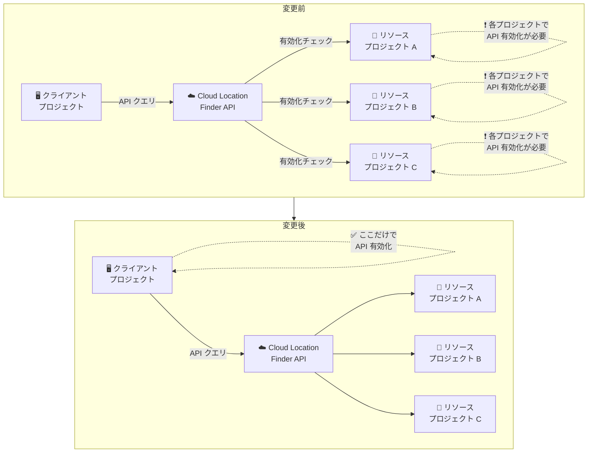

# Cloud Location Finder: サービス有効化とクォータチェックの変更

**リリース日**: 2026-03-25

**サービス**: Cloud Location Finder

**機能**: サービス有効化とクォータチェックの変更

**ステータス**: Announcement

📊 [このアップデートのインフォグラフィックを見る](https://takech9203.github.io/google-cloud-news-summary/20260325-cloud-location-finder-quota-change.html)

## 概要

Cloud Location Finder API において、サービスの有効化とクォータのチェック対象プロジェクトが変更されました。これまでクエリ対象のプロジェクト (リソースプロジェクト) でチェックされていたサービス有効化とクォータが、API クエリを実行するプロジェクト (クライアントプロジェクト) でチェックされるようになりました。

この変更により、Cloud Location Finder API を利用するためには、クライアントプロジェクトでのみ API を有効化すれば十分となります。複数のリソースプロジェクトに対してクエリを実行する場合でも、各リソースプロジェクトで個別に API を有効化する必要がなくなりました。

Cloud Location Finder は現在 Preview 段階のサービスで、Google Cloud、Google Distributed Cloud、AWS、Azure、Oracle Cloud Infrastructure など複数のクラウドプロバイダーのロケーション情報を統合的に検索できる API です。近接性、管轄区域、カーボンフットプリントなどの条件でクラウドロケーションをフィルタリングできます。

**アップデート前の課題**

- Cloud Location Finder API のサービス有効化とクォータがリソースプロジェクト (クエリ対象のプロジェクト) でチェックされていた
- 複数のリソースプロジェクトに対してクエリを実行する場合、各リソースプロジェクトで個別に Cloud Location Finder API を有効化する必要があった
- リソースプロジェクトごとにクォータが適用されるため、クォータ管理が分散していた

**アップデート後の改善**

- サービス有効化とクォータのチェックがクライアントプロジェクト (API クエリ実行元) に統一された
- クライアントプロジェクトでのみ Cloud Location Finder API を有効化すれば、任意のリソースプロジェクトに対してクエリを実行できる
- クォータ管理がクライアントプロジェクトに集約され、一元的な管理が可能になった

## アーキテクチャ図



変更前はリソースプロジェクトごとに API の有効化とクォータチェックが行われていましたが、変更後はクライアントプロジェクトに一元化されました。

## サービスアップデートの詳細

### 主要機能

1. **サービス有効化チェックの変更**
   - API の有効化チェックがリソースプロジェクトからクライアントプロジェクトに移行
   - クライアントプロジェクトで `cloudlocationfinder.googleapis.com` を有効化するだけで利用可能
   - 有効化コマンド: `gcloud services enable cloudlocationfinder.googleapis.com --project CLIENT_PROJECT`

2. **クォータチェックの変更**
   - API リクエストのクォータがクライアントプロジェクトで計算されるように変更
   - 複数のリソースプロジェクトに対するクエリでも、クォータはクライアントプロジェクト単位で管理
   - クォータの上限管理が一元化されたことで、運用負荷が軽減

3. **IAM 権限の要件は変更なし**
   - リソースプロジェクトに対する `cloudlocationfinder.viewer` ロールは引き続き必要
   - サービス有効化とクォータのチェック先が変わっただけで、アクセス制御モデル自体は維持

## 技術仕様

### クライアントプロジェクトとリソースプロジェクトの関係

| 項目 | 変更前 | 変更後 |
|------|--------|--------|
| API 有効化チェック | リソースプロジェクト | クライアントプロジェクト |
| クォータチェック | リソースプロジェクト | クライアントプロジェクト |
| IAM 権限チェック | リソースプロジェクト | リソースプロジェクト (変更なし) |
| 課金 | リソースプロジェクト | クライアントプロジェクト |

### API エンドポイント

| バージョン | エンドポイント |
|-----------|--------------|
| v1 | `https://cloudlocationfinder.googleapis.com/v1/` |
| v1alpha | `https://cloudlocationfinder.googleapis.com/v1alpha/` |

### 主要な API メソッド

| メソッド | パス | 説明 |
|---------|------|------|
| get | `GET /v1/{name=projects/*/locations/*/cloudLocations/*}` | クラウドロケーションの詳細を取得 |
| list | `GET /v1/{parent=projects/*/locations/*}/cloudLocations` | クラウドロケーションの一覧を取得 |
| search | `GET /v1/{parent=projects/*/locations/*}/cloudLocations:search` | 条件に基づくクラウドロケーションの検索 |

## 設定方法

### 前提条件

1. Google Cloud CLI がインストールされていること
2. クライアントプロジェクトで Cloud Location Finder API が有効であること

### 手順

#### ステップ 1: クライアントプロジェクトで API を有効化

```bash
# クライアントプロジェクトで Cloud Location Finder API を有効化
gcloud services enable cloudlocationfinder.googleapis.com --project CLIENT_PROJECT_ID
```

このコマンドだけで、クライアントプロジェクトから任意のリソースプロジェクトに対してクエリを実行できるようになります。

#### ステップ 2: IAM 権限の設定

```bash
# リソースプロジェクトに対する閲覧権限を付与
gcloud projects add-iam-policy-binding RESOURCE_PROJECT_ID \
  --member user:myemail@example.com \
  --role roles/cloudlocationfinder.viewer
```

IAM 権限は引き続きリソースプロジェクトに対して設定する必要があります。

#### ステップ 3: クエリの実行

```bash
# クライアントプロジェクトからクエリを実行
curl -H "Authorization: Bearer $(gcloud auth print-access-token)" \
  "https://cloudlocationfinder.googleapis.com/v1/projects/CLIENT_PROJECT_ID/locations/global/cloudLocations"
```

## メリット

### ビジネス面

- **運用管理の簡素化**: 複数のリソースプロジェクトで個別に API を有効化する手間が不要になり、管理コストが削減される
- **コスト管理の一元化**: クォータと課金がクライアントプロジェクトに集約されることで、利用状況の把握と予算管理が容易になる

### 技術面

- **セットアップの簡素化**: 新しいリソースプロジェクトを追加する際に、API の有効化が不要になるため、オンボーディングが迅速化
- **クォータの効率的な利用**: クォータがクライアントプロジェクト単位で管理されるため、プロジェクト横断的なクエリでのクォータ管理が容易になる
- **自動化の容易化**: API 有効化の管理ポイントが減ることで、IaC (Infrastructure as Code) テンプレートの簡素化が可能

## デメリット・制約事項

### 制限事項

- Cloud Location Finder は現在 Preview 段階であり、GA (一般提供) ではない
- Preview 製品は「Pre-GA Offerings Terms」の対象となり、サポートが限定される場合がある
- サードパーティクラウドプロバイダーのロケーションデータは公開情報に基づいており、Google Cloud はその正確性を保証しない

### 考慮すべき点

- この変更により、既存の環境でリソースプロジェクトのみで API を有効化していた場合、クライアントプロジェクトでの有効化が必要になる
- クォータがクライアントプロジェクトに集約されるため、大量のリソースプロジェクトに対してクエリを実行する場合はクォータ上限に注意が必要
- IAM 権限 (`cloudlocationfinder.viewer`) は引き続きリソースプロジェクトに対して付与する必要がある点に注意

## ユースケース

### ユースケース 1: マルチプロジェクト環境でのロケーション検索

**シナリオ**: 複数の GCP プロジェクトを運用する組織が、各プロジェクトのワークロードに最適なクラウドロケーションを一元的に検索したい場合。

**実装例**:
```bash
# 管理用クライアントプロジェクトで API を有効化 (1 回のみ)
gcloud services enable cloudlocationfinder.googleapis.com --project admin-project

# 任意のリソースプロジェクトに対してクエリを実行
curl -H "Authorization: Bearer $(gcloud auth print-access-token)" \
  "https://cloudlocationfinder.googleapis.com/v1/projects/admin-project/locations/global/cloudLocations:search?source_cloud_location=projects/admin-project/locations/global/cloudLocations/gcp-us-central1&query=cloud_provider=CLOUD_PROVIDER_GCP%20AND%20cloud_location_type=CLOUD_LOCATION_TYPE_ZONE&page_size=5"
```

**効果**: 管理用プロジェクトで API を一度有効化するだけで、組織内の全プロジェクトに対するロケーション検索が可能。各プロジェクトでの個別有効化が不要。

### ユースケース 2: マルチクラウドのロケーション最適化

**シナリオ**: GCP と AWS を併用する環境で、レイテンシを最小化するための最寄りのクラウドゾーンを検索したい場合。

**効果**: クライアントプロジェクトから、GCP だけでなく AWS、Azure、Oracle Cloud Infrastructure のロケーション情報も横断的に検索でき、マルチクラウド戦略の意思決定を支援。

## 料金

Cloud Location Finder は現在 Preview 段階であり、料金体系の詳細は公式ドキュメントを確認してください。Preview 期間中は無料で利用できる場合がありますが、正式な料金については以下のリンクを参照してください。

- [Cloud Location Finder ドキュメント](https://cloud.google.com/location-finder/docs)

## 関連サービス・機能

- **Google Cloud Resource Manager**: プロジェクトの管理と IAM ポリシーの設定に使用。Cloud Location Finder のアクセス制御と連携
- **Google Distributed Cloud**: Cloud Location Finder でサポートされるロケーションタイプの 1 つ。GDC ゾーンの検索に対応
- **GDC Hardware Management API**: Google Distributed Cloud connected ロケーションの検索時に必要な追加 API
- **Cloud Billing**: クォータチェックがクライアントプロジェクトに移行したことで、課金管理もクライアントプロジェクトに集約

## 参考リンク

- 📊 [インフォグラフィック](https://takech9203.github.io/google-cloud-news-summary/20260325-cloud-location-finder-quota-change.html)
- [公式リリースノート](https://cloud.google.com/release-notes#March_25_2026)
- [Cloud Location Finder 概要](https://cloud.google.com/location-finder/docs/overview)
- [Cloud Location Finder クイックスタート](https://cloud.google.com/location-finder/docs/quickstart)
- [Cloud Location Finder REST API リファレンス](https://cloud.google.com/location-finder/docs/reference/rest)
- [Cloud Location Finder トラブルシューティング](https://cloud.google.com/location-finder/docs/troubleshooting)

## まとめ

Cloud Location Finder のサービス有効化とクォータチェックがリソースプロジェクトからクライアントプロジェクトに変更されたことで、マルチプロジェクト環境での API 利用が大幅に簡素化されました。既存の環境では、クライアントプロジェクトで API が有効化されていることを確認し、必要に応じて設定を更新することを推奨します。

---

**タグ**: #CloudLocationFinder #Quota #ServiceActivation #MultiCloud #Preview
