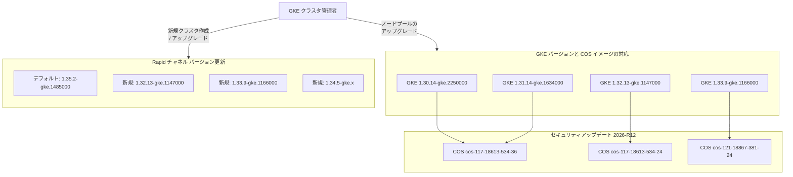

# Google Kubernetes Engine (GKE): セキュリティアップデート (2026-R12) およびバージョン更新

**リリース日**: 2026-03-25

**サービス**: Google Kubernetes Engine (GKE)

**機能**: セキュリティアップデート (2026-R12) およびバージョン更新

**ステータス**: Available

📊 [このアップデートのインフォグラフィックを見る](https://takech9203.github.io/google-cloud-news-summary/20260325-gke-security-version-updates-2026-r12.html)

## 概要

Google Kubernetes Engine (GKE) において、セキュリティアップデート 2026-R12 およびクラスタバージョンの更新がリリースされた。今回のセキュリティアップデートでは、累積的なセキュリティ修正を含む最新の Container-Optimized OS (COS) イメージを使用した新しい GKE バージョンが提供されている。

セキュリティアップデートの対象は GKE 1.30、1.31、1.32、1.33 の各マイナーバージョンであり、それぞれ対応する COS イメージが更新されている。COS イメージにはカーネルレベルのセキュリティ修正やシステムパッケージの脆弱性対応が含まれており、ノードのセキュリティ態勢を最新の状態に維持するために重要なアップデートである。

バージョン更新については、Rapid チャネルにおいて新しいバージョンが利用可能になり、バージョン 1.35.2-gke.1485000 が Rapid チャネルでのクラスタ作成時のデフォルトバージョンに設定された。これにより、Rapid チャネルを使用するユーザーは最新の Kubernetes 1.35 系を即座に利用できるようになった。

**アップデート前の課題**

- 以前の COS イメージにはセキュリティ修正が適用されていない脆弱性が存在していた
- GKE ノードが古い COS イメージで稼働している場合、累積的なセキュリティリスクにさらされていた
- Rapid チャネルでの最新バージョン (1.35.2-gke.1485000) が利用できなかった

**アップデート後の改善**

- 累積的なセキュリティ修正を含む最新の COS イメージが適用され、ノードのセキュリティが強化された
- GKE 1.30～1.33 の各バージョンに対応するセキュリティパッチが提供された
- Rapid チャネルで 1.35.2-gke.1485000 がデフォルトバージョンとなり、最新の Kubernetes 機能を新規クラスタで即座に利用可能になった
- 新しいバージョン (1.32.13-gke.1147000、1.33.9-gke.1166000、1.34.5-gke.x) が Rapid チャネルで利用可能になった

## アーキテクチャ図



各 GKE バージョンに対応する COS イメージのマッピングと、Rapid チャネルで利用可能になった新バージョンを示す。セキュリティアップデートではノードイメージが更新され、バージョン更新では Rapid チャネルのデフォルトバージョンと利用可能バージョンが変更されている。

## サービスアップデートの詳細

### 主要機能

1. **COS イメージのセキュリティ更新**
   - 累積的なセキュリティ修正を含む新しい Container-Optimized OS イメージがリリースされた
   - Linux カーネルの脆弱性修正、システムパッケージのセキュリティパッチが含まれる
   - GKE 1.30～1.33 の 4 つのマイナーバージョンに対応するパッチバージョンが提供された

2. **Rapid チャネルのデフォルトバージョン変更**
   - バージョン 1.35.2-gke.1485000 が Rapid チャネルの新規クラスタ作成時のデフォルトバージョンに設定された
   - Kubernetes 1.35 系の最新機能やバグ修正が含まれている

3. **Rapid チャネルへの新バージョン追加**
   - 1.32.13-gke.1147000、1.33.9-gke.1166000、1.34.5-gke.x が Rapid チャネルで新たに利用可能になった
   - これらのバージョンにはセキュリティ修正とバグ修正が含まれている

## 技術仕様

### セキュリティアップデート対象バージョンと COS イメージ

| GKE バージョン | COS イメージバージョン | COS マイルストーン |
|---|---|---|
| 1.30.14-gke.2250000 | cos-117-18613-534-36 | M117 |
| 1.31.14-gke.1634000 | cos-117-18613-534-36 | M117 |
| 1.32.13-gke.1147000 | cos-117-18613-534-24 | M117 |
| 1.33.9-gke.1166000 | cos-121-18867-381-24 | M121 |

### Rapid チャネル バージョン情報

| 項目 | 詳細 |
|------|------|
| 新デフォルトバージョン | 1.35.2-gke.1485000 |
| 新規利用可能バージョン | 1.32.13-gke.1147000, 1.33.9-gke.1166000, 1.34.5-gke.x |
| 対象チャネル | Rapid |

### リリースチャネルの特性

| チャネル | 特徴 | 推奨用途 |
|---------|------|---------|
| Rapid | 最新バージョンを最も早く提供。GKE SLA の対象外 | プレプロダクション環境での新バージョン検証 |
| Regular (デフォルト) | Rapid リリース後 2～3 か月で提供 | 大多数のユーザー向け。機能と安定性のバランス |
| Stable | Regular リリース後 2～3 か月で提供 | 安定性を最優先する本番環境 |
| Extended | Regular チャネルと連動。長期サポート | マイナーバージョンを長期間維持したい環境 |

## 設定方法

### 前提条件

1. GKE クラスタが稼働中であること
2. 適切な IAM 権限 (container.admin ロールまたは container.clusterAdmin ロール) を持つこと
3. gcloud CLI がインストールされ、認証済みであること

### 手順

#### ステップ 1: 現在のクラスタバージョンの確認

```bash
# クラスタの現在のバージョンを確認
gcloud container clusters describe CLUSTER_NAME \
  --region=REGION \
  --format="value(currentMasterVersion)"

# ノードプールのバージョンを確認
gcloud container node-pools list \
  --cluster=CLUSTER_NAME \
  --region=REGION \
  --format="table(name,version)"
```

現在のクラスタバージョンとノードプールバージョンを確認し、セキュリティアップデートの対象かどうかを判断する。

#### ステップ 2: 利用可能なバージョンの確認

```bash
# 利用可能なバージョンの一覧を表示
gcloud container get-server-config \
  --region=REGION \
  --format="yaml(channels)"
```

Rapid チャネルで利用可能なバージョンを確認し、アップグレード先のバージョンを選択する。

#### ステップ 3: ノードプールのアップグレード

```bash
# ノードプールを指定バージョンにアップグレード
gcloud container clusters upgrade CLUSTER_NAME \
  --node-pool=NODE_POOL_NAME \
  --cluster-version=1.33.9-gke.1166000 \
  --region=REGION
```

セキュリティ修正を適用するために、ノードプールを対象バージョンにアップグレードする。自動アップグレードが有効な場合、チャネルのスケジュールに従って自動的にアップグレードされる。

#### ステップ 4: アップグレードの確認

```bash
# アップグレード後のノードバージョンを確認
gcloud container node-pools describe NODE_POOL_NAME \
  --cluster=CLUSTER_NAME \
  --region=REGION \
  --format="value(version)"

# ノードの状態を確認
kubectl get nodes -o wide
```

アップグレードが正常に完了したことを確認する。

## メリット

### ビジネス面

- **セキュリティコンプライアンスの維持**: 累積的なセキュリティ修正により、コンプライアンス要件を満たすために必要なセキュリティパッチが適用される
- **運用リスクの低減**: 既知の脆弱性が修正されることで、セキュリティインシデント発生リスクが低減される
- **最新機能への早期アクセス**: Rapid チャネルのバージョン更新により、Kubernetes 1.35 の最新機能をいち早く評価・検証できる

### 技術面

- **カーネルレベルのセキュリティ強化**: COS イメージの更新により、Linux カーネルの脆弱性が修正される
- **コンテナランタイムの安全性向上**: containerd を含むコンテナランタイムスタックのセキュリティが改善される
- **自動アップグレードとの統合**: リリースチャネルの自動アップグレード機能により、手動操作なしでセキュリティ修正が適用可能

## デメリット・制約事項

### 制限事項

- セキュリティアップデートは COS (Container-Optimized OS) ノードイメージを対象としており、Ubuntu ノードイメージには別途対応が必要な場合がある
- Rapid チャネルのバージョンは GKE SLA の対象外であるため、本番環境での使用は推奨されない
- ノードプールのアップグレードにはローリングアップデートによるダウンタイムが発生する可能性がある

### 考慮すべき点

- ノードプールのアップグレード中はワークロードの一時的な再スケジューリングが発生する
- サージアップグレードまたはブルー/グリーンアップグレード戦略を設定して、アップグレード時の影響を最小限に抑えることを推奨する
- 自動アップグレードが有効な場合、メンテナンスウィンドウの設定により適用タイミングを制御可能
- 新しい COS イメージとの互換性問題がないか、ステージング環境での事前検証を推奨する

## ユースケース

### ユースケース 1: セキュリティパッチの迅速な適用

**シナリオ**: セキュリティポリシーにより、リリース後 72 時間以内にセキュリティパッチを適用する必要がある組織が、GKE クラスタを最新のセキュリティアップデートに更新する。

**実装例**:
```bash
# Rapid チャネルから新しいパッチバージョンを適用
gcloud container clusters upgrade production-cluster \
  --node-pool=default-pool \
  --cluster-version=1.32.13-gke.1147000 \
  --region=us-central1

# アップグレード状況のモニタリング
gcloud container operations list \
  --filter="targetLink:production-cluster AND operationType:UPGRADE_NODES" \
  --region=us-central1
```

**効果**: COS イメージに含まれる累積的なセキュリティ修正が適用され、既知の脆弱性に対するリスクが低減される。

### ユースケース 2: Kubernetes 1.35 の新機能評価

**シナリオ**: 開発チームが Kubernetes 1.35 の新機能をプレプロダクション環境で評価するために、Rapid チャネルの新デフォルトバージョンを使用して新規クラスタを作成する。

**実装例**:
```bash
# Rapid チャネルで新規クラスタを作成 (デフォルトで 1.35.2-gke.1485000)
gcloud container clusters create test-cluster \
  --release-channel=rapid \
  --region=us-central1 \
  --num-nodes=3
```

**効果**: Kubernetes 1.35 の最新機能を安全な環境で検証でき、Regular/Stable チャネルへのロールアウト前に互換性の問題を発見できる。

## 関連サービス・機能

- **Container-Optimized OS (COS)**: GKE ノードの基盤となる OS イメージ。Google が管理・最適化しており、セキュリティパッチが定期的にリリースされる
- **GKE リリースチャネル**: Rapid、Regular、Stable、Extended の 4 つのチャネルでバージョン管理を自動化する機能
- **GKE セキュリティ速報**: GKE に影響する脆弱性と対応パッチバージョンを公開するセキュリティ情報ページ
- **Binary Authorization**: コンテナイメージのデプロイポリシーを適用し、信頼されたイメージのみをデプロイする機能
- **GKE Sandbox (gVisor)**: カーネルレベルの脆弱性からワークロードを保護する追加のセキュリティレイヤー

## 参考リンク

- 📊 [インフォグラフィック](https://takech9203.github.io/google-cloud-news-summary/20260325-gke-security-version-updates-2026-r12.html)
- [公式リリースノート](https://cloud.google.com/release-notes#March_25_2026)
- [GKE リリースチャネルの概念](https://cloud.google.com/kubernetes-engine/docs/concepts/release-channels)
- [GKE セキュリティ速報](https://cloud.google.com/kubernetes-engine/docs/security-bulletins)
- [Container-Optimized OS リリースノート](https://cloud.google.com/container-optimized-os/docs/release-notes)
- [GKE ノードイメージ](https://cloud.google.com/kubernetes-engine/docs/concepts/node-images)
- [GKE クラスタのアップグレード](https://cloud.google.com/kubernetes-engine/docs/how-to/upgrading-a-cluster)
- [料金ページ](https://cloud.google.com/kubernetes-engine/pricing)

## まとめ

GKE セキュリティアップデート 2026-R12 は、Container-Optimized OS イメージの累積的なセキュリティ修正を GKE 1.30～1.33 の各バージョンに適用する重要なアップデートである。同時に、Rapid チャネルでは 1.35.2-gke.1485000 が新デフォルトバージョンとなり、最新の Kubernetes 機能へのアクセスが可能になった。GKE クラスタ管理者は、セキュリティリスクを最小化するために対象バージョンへのノードプールアップグレードを速やかに計画することを推奨する。自動アップグレードが有効な場合はメンテナンスウィンドウに従って自動的に適用されるが、セキュリティ要件が厳しい環境では手動での早期適用を検討すべきである。

---

**タグ**: #GKE #Kubernetes #セキュリティアップデート #ContainerOptimizedOS #COS #リリースチャネル #Rapid #バージョン更新 #2026-R12
