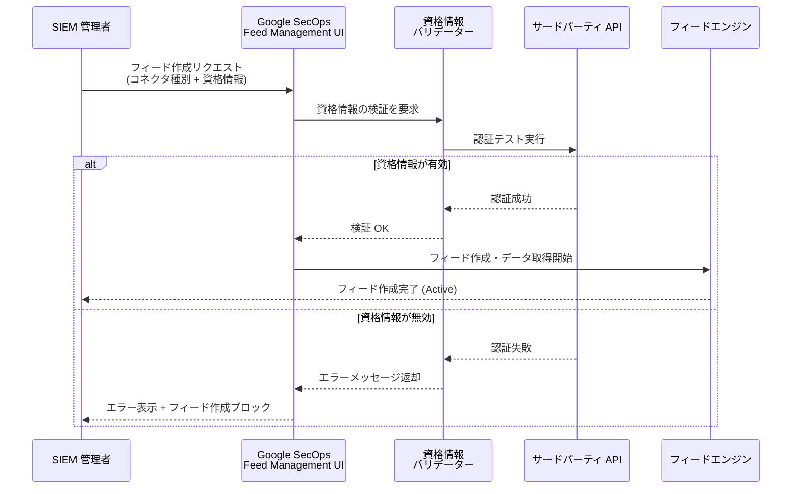

# Google SecOps (SIEM): サードパーティ API コネクタの資格情報バリデーション

**リリース日**: 2026-03-25

**サービス**: Google SecOps (SIEM)

**機能**: サードパーティ API コネクタの資格情報バリデーション

**ステータス**: GA

[このアップデートのインフォグラフィックを見る](https://takech9203.github.io/google-cloud-news-summary/20260325-google-secops-credential-validation.html)

## 概要

Google SecOps (SIEM) において、全 49 種類のサードパーティ API コネクタに対する資格情報バリデーション機能が利用可能になった。フィード作成時にサードパーティ API コネクタを使用する場合、Google SecOps が提供された資格情報を自動的に検証し、不正な資格情報によるフィード作成を未然に防止する。

この機能により、セキュリティ運用チームはフィード設定時に即座に認証エラーのフィードバックを受け取ることができる。従来はフィード作成後に初めてデータ取得が失敗し、その時点でエラーに気付くという運用上の課題があったが、今回のアップデートでフィード作成の段階で問題を検出・修正できるようになった。

対象ユーザーは Google SecOps を利用してサードパーティのセキュリティツールやサービスからログを取り込んでいるセキュリティアナリストおよび SIEM 管理者である。

**アップデート前の課題**

- フィード作成時に資格情報の正当性が検証されず、誤った認証情報でもフィードが作成できてしまっていた
- 認証エラーはフィード作成後のデータ取得フェーズで初めて `LOGIN_FAILED` や `ACCESS_DENIED` として検出されていた
- 壊れたフィード (Broken Feed) が作成され、ステータスが `Failed` になるまで問題に気付かないケースがあった
- 誤設定のフィードのトラブルシューティングに時間を要していた

**アップデート後の改善**

- フィード作成時に資格情報が自動的に検証され、不正な場合は即座にエラーメッセージが表示される
- 無効な資格情報ではフィード作成がブロックされ、壊れたフィードの発生を防止できる
- 全 49 種類のサードパーティ API コネクタで一貫した検証が行われる
- フィード設定のトラブルシューティング時間が短縮される

## アーキテクチャ図

フィード作成フローにおける資格情報バリデーションの処理シーケンス。無効な資格情報が検出された場合、フィード作成がブロックされ、管理者に即座にフィードバックが返される。

## サービスアップデートの詳細

### 主要機能

1. **自動資格情報バリデーション**
   - フィード作成時にサードパーティ API への認証テストを自動実行
   - ユーザー名、パスワード、API キー、シークレットキーなど、コネクタごとに必要な認証パラメータを検証

2. **即時エラーフィードバック**
   - 資格情報が不正な場合、フィード設定 UI 上で即座にエラーメッセージを表示
   - エラーの原因を特定しやすいメッセージにより、迅速な修正が可能

3. **フィード作成ブロック**
   - 無効な資格情報が検出された場合、フィードの作成自体がブロックされる
   - 有効な資格情報が提供されるまでフィードは作成されない
   - 壊れたフィードの発生を根本的に防止

4. **全 49 コネクタ対応**
   - Duo Auth、ThreatConnect、Salesforce などを含む全サードパーティ API コネクタで利用可能
   - コネクタの種類に関わらず一貫したバリデーション体験を提供

## 技術仕様

### 対象ソースタイプとバリデーション

| 項目 | 詳細 |
|------|------|
| 対象ソースタイプ | Third-party API |
| 対応コネクタ数 | 49 種類 |
| バリデーションタイミング | フィード作成時 (Submit 前) |
| バリデーション方式 | サードパーティ API への認証テスト |
| エラー時の動作 | フィード作成をブロック + エラーメッセージ表示 |

### フィード設定の流れ

フィード作成は以下の手順で行われ、バリデーションは Submit 時に実行される。

1. **SIEM Settings > Feeds** に移動
2. **Add New Feed** をクリック
3. **Source type** で「Third party API」を選択
4. **Log type** で対象のログタイプを選択
5. 認証パラメータ (Username、Secret、API Hostname など) を入力
6. **Submit** をクリック -- ここで資格情報バリデーションが実行される

## メリット

### ビジネス面

- **運用効率の向上**: フィード設定ミスの早期発見により、セキュリティ運用チームのトラブルシューティング工数を削減
- **セキュリティ可視性の維持**: 壊れたフィードによるログ取り込みの中断を防止し、セキュリティモニタリングのギャップを回避
- **オンボーディング時間の短縮**: 新しいデータソースの追加時に、設定の正当性を即座に確認可能

### 技術面

- **Fail-Fast 設計**: 問題を可能な限り早い段階 (フィード作成時) で検出し、後続の障害を防止
- **一貫したバリデーション**: 全 49 コネクタで統一的な検証メカニズムが提供される
- **認証情報の安全な管理**: Google SecOps は認証情報を Secret Manager に保存しており、バリデーションプロセスもセキュアに実行される

## デメリット・制約事項

### 考慮すべき点

- バリデーションはフィード作成時のみ実行されるため、作成後に資格情報が失効した場合は従来通り `LOGIN_FAILED` エラーで検出される
- サードパーティ API 側の一時的な障害時にバリデーションが失敗する可能性がある
- 資格情報のローテーション後は、既存フィードの編集時に新しい資格情報の再検証が必要となる場合がある

## ユースケース

### ユースケース 1: 新規データソースのオンボーディング

**シナリオ**: セキュリティチームが Duo Authentication のログを Google SecOps に取り込むため、新しいフィードを設定する。管理者が Integration Key と Secret Key を入力してフィードを作成しようとするが、Secret Key にコピーミスがある。

**効果**: フィード作成時に即座にエラーメッセージが表示され、管理者は Secret Key を修正して再度送信できる。壊れたフィードが作成されることなく、正しい設定で最初からデータ取り込みが開始される。

### ユースケース 2: 大規模環境でのフィード一括設定

**シナリオ**: 大規模組織で複数のサードパーティセキュリティツール (ThreatConnect、Salesforce、CrowdStrike など) からのログ取り込みを同時に設定する。

**効果**: 各フィードの資格情報が作成時に検証されるため、設定完了後に「一部のフィードだけデータが来ていない」という問題の発生を防止できる。すべてのフィードが正常に動作する状態で運用を開始できる。

## 関連サービス・機能

- **Google SecOps Feed Management**: フィードの作成・管理・モニタリングを行う基盤機能。今回のバリデーションはこの機能の拡張
- **Secret Manager**: Google SecOps がフィードの資格情報を安全に保存するために使用
- **Google SecOps SOAR**: SIEM で取り込んだアラートに対する自動対応を実現するプラットフォーム
- **Chronicle Alerts Connector**: Google SecOps のアラートを SOAR に連携するコネクタ

## 参考リンク

- [インフォグラフィック](https://takech9203.github.io/google-cloud-news-summary/20260325-google-secops-credential-validation.html)
- [公式リリースノート](https://docs.google.com/release-notes#March_25_2026)
- [Feed Management UI ドキュメント](https://cloud.google.com/chronicle/docs/administration/feed-management)
- [Google SecOps SIEM 概要](https://cloud.google.com/chronicle/docs/overview)

## まとめ

Google SecOps のサードパーティ API コネクタにおける資格情報バリデーション機能は、フィード設定のミスを作成段階で検出・防止する実用的な改善である。全 49 種類のコネクタに対応しており、セキュリティ運用チームはフィード設定の信頼性向上と壊れたフィードの削減による運用負荷の軽減が期待できる。サードパーティ API コネクタを利用してログを取り込んでいる環境では、今後のフィード作成時に自動的にこの検証が適用される。

---

**タグ**: #GoogleSecOps #SIEM #FeedManagement #CredentialValidation #SecurityOperations #ThirdPartyAPI
