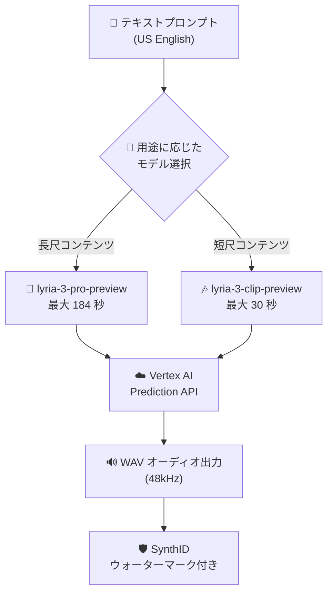

# Generative AI on Vertex AI: Lyria 3 オーディオ生成 (Public Preview)

**リリース日**: 2026-03-25

**サービス**: Generative AI on Vertex AI

**機能**: Lyria 3 オーディオ生成

**ステータス**: Public Preview

[このアップデートのインフォグラフィックを見る](https://takech9203.github.io/google-cloud-news-summary/20260325-vertex-ai-lyria-3-audio-generation.html)

## 概要

Google は Vertex AI 上で Lyria 3 オーディオ生成モデルを Public Preview として提供開始した。Lyria 3 は、テキストプロンプトからオーディオを生成する次世代モデルであり、2 つのバリエーションが利用可能である。`lyria-3-pro-preview` は最大 184 秒のオーディオを生成でき、`lyria-3-clip-preview` は最大 30 秒のオーディオを生成できる。

Lyria 3 は、前世代の Lyria 2 (lyria-002) から大幅に進化したモデルである。Lyria 2 では 1 クリップあたり約 32.8 秒の音楽生成に限定されていたが、Lyria 3 Pro では最大 184 秒 (約 3 分) の長尺オーディオ生成が可能となり、より実用的なコンテンツ制作に対応できるようになった。

このアップデートは、音楽制作、コンテンツクリエイター、ゲーム開発、広告制作など、オーディオコンテンツを必要とする幅広いユーザーを対象としている。

**アップデート前の課題**

- Lyria 2 (lyria-002) では 1 クリップあたり最大 32.8 秒のオーディオしか生成できなかった
- 長尺のオーディオコンテンツを作成するには複数のクリップを手動で結合する必要があった
- 用途に応じたモデルの選択肢がなく、短いクリップも長いコンテンツも同一モデルで対応する必要があった

**アップデート後の改善**

- `lyria-3-pro-preview` により最大 184 秒の長尺オーディオ生成が可能になった
- `lyria-3-clip-preview` により短尺オーディオ生成に最適化されたモデルが利用可能になった
- 用途に応じて Pro (長尺) と Clip (短尺) を使い分けることが可能になった

## アーキテクチャ図



Lyria 3 では用途に応じて 2 つのモデルバリエーションを選択でき、Vertex AI の Prediction API を通じてオーディオを生成する。生成されたオーディオには SynthID ウォーターマークが付与される。

## サービスアップデートの詳細

### 主要機能

1. **lyria-3-pro-preview (長尺オーディオ生成)**
   - 最大 184 秒 (約 3 分) のオーディオを 1 回のリクエストで生成可能
   - 長尺の BGM、ポッドキャスト用ジングル、広告用オーディオなどに適している

2. **lyria-3-clip-preview (短尺オーディオ生成)**
   - 最大 30 秒のオーディオを生成可能
   - 短い効果音、ショート動画用 BGM、通知音などに最適化されている

3. **テキストからオーディオへの生成**
   - テキストプロンプトによる直感的なオーディオ生成
   - ジャンル、ムード、楽器構成、テンポなどを自然言語で指定可能
   - ネガティブプロンプトによる除外要素の指定にも対応 (Lyria 2 からの継承機能)

## 技術仕様

### モデル比較

| 項目 | lyria-3-pro-preview | lyria-3-clip-preview | lyria-002 (参考: Lyria 2) |
|------|---------------------|----------------------|---------------------------|
| 最大オーディオ長 | 184 秒 | 30 秒 | 32.8 秒 |
| ステータス | Public Preview | Public Preview | GA |
| 出力フォーマット | WAV (48kHz) | WAV (48kHz) | WAV (48kHz) |
| プロンプト言語 | US English | US English | US English |

### API リクエスト例

```bash
# lyria-3-pro-preview を使用した長尺オーディオ生成
curl -X POST \
  -H "Authorization: Bearer $(gcloud auth print-access-token)" \
  -H "Content-Type: application/json" \
  https://LOCATION-aiplatform.googleapis.com/v1/projects/PROJECT_ID/locations/LOCATION/publishers/google/models/lyria-3-pro-preview:predict \
  -d '{
    "instances": [
      {
        "prompt": "A cinematic orchestral piece with sweeping strings and dramatic percussion building to a triumphant finale."
      }
    ],
    "parameters": {}
  }'
```

## 設定方法

### 前提条件

1. Google Cloud プロジェクトが作成済みであること
2. Vertex AI API が有効化されていること
3. 適切な IAM 権限 (Vertex AI ユーザーロールなど) が付与されていること

### 手順

#### ステップ 1: Vertex AI API の有効化

```bash
gcloud services enable aiplatform.googleapis.com
```

#### ステップ 2: REST API によるオーディオ生成

```bash
# lyria-3-clip-preview を使用した短尺オーディオ生成
curl -X POST \
  -H "Authorization: Bearer $(gcloud auth print-access-token)" \
  -H "Content-Type: application/json" \
  https://us-central1-aiplatform.googleapis.com/v1/projects/PROJECT_ID/locations/us-central1/publishers/google/models/lyria-3-clip-preview:predict \
  -d '{
    "instances": [
      {
        "prompt": "An upbeat electronic dance track with a fast tempo and pulsing synth bass."
      }
    ],
    "parameters": {}
  }'
```

レスポンスに含まれる `audioContent` フィールドの Base64 エンコードされたデータをデコードすることで、WAV オーディオファイルを取得できる。

#### ステップ 3: Vertex AI Studio (Media Studio) からの利用

Google Cloud コンソールの Vertex AI Studio > Media Studio ページからも GUI で利用可能である。

## メリット

### ビジネス面

- **長尺コンテンツ制作の効率化**: 184 秒のオーディオを一括生成できるため、BGM やジングルの制作コストと時間を大幅に削減できる
- **用途に応じた柔軟なモデル選択**: Pro と Clip の 2 モデルにより、コストと品質のバランスを最適化できる

### 技術面

- **API ベースの統合**: Vertex AI の標準的な Prediction API を通じて利用でき、既存のワークフローに容易に統合可能
- **長尺生成の実現**: 従来の約 33 秒から 184 秒へと大幅に拡張され、後処理での結合作業が不要になった

## デメリット・制約事項

### 制限事項

- Public Preview のため、本番環境での SLA は提供されない
- プロンプト言語は US English (en-us) のみ対応
- Preview モデルのため、今後のバージョンアップで API や動作が変更される可能性がある

### 考慮すべき点

- Preview 段階のため、生成品質や安定性は GA 版と異なる場合がある
- SynthID ウォーターマークが自動的に付与される
- コンテンツ安全フィルター、引用チェック、アーティストインテントチェックが適用される

## ユースケース

### ユースケース 1: 動画コンテンツ向け BGM 制作

**シナリオ**: YouTube やソーシャルメディア向けの動画コンテンツに使用するオリジナル BGM を作成したい。3 分程度の動画に合わせた BGM が必要。

**実装例**:
```bash
curl -X POST \
  -H "Authorization: Bearer $(gcloud auth print-access-token)" \
  -H "Content-Type: application/json" \
  https://us-central1-aiplatform.googleapis.com/v1/projects/PROJECT_ID/locations/us-central1/publishers/google/models/lyria-3-pro-preview:predict \
  -d '{
    "instances": [
      {
        "prompt": "A warm and inviting acoustic folk track with gentle fingerpicked guitar, soft violin, and a steady gentle rhythm. Calm and positive mood throughout."
      }
    ],
    "parameters": {}
  }'
```

**効果**: lyria-3-pro-preview を使用することで、最大 184 秒の BGM を 1 回のリクエストで生成でき、動画制作のワークフローを効率化できる。

### ユースケース 2: アプリ通知音やショート動画の効果音

**シナリオ**: モバイルアプリの通知音やショート動画プラットフォーム向けの短い BGM を量産したい。

**効果**: lyria-3-clip-preview を使用することで、30 秒以内の短尺オーディオを効率的に生成でき、複数のバリエーションを素早く試すことができる。

## 料金

Lyria 3 の Preview 段階での料金は公式に確認できていない。参考として、Lyria 2 (GA) の料金は 30 秒のオーディオ生成あたり $0.06 である。詳細は [Vertex AI 料金ページ](https://cloud.google.com/vertex-ai/pricing) を参照のこと。

## 関連サービス・機能

- **Lyria 2 (lyria-002)**: 前世代の音楽生成モデル。GA として利用可能で、32.8 秒のインストルメンタル音楽を生成
- **Vertex AI Studio (Media Studio)**: GUI ベースでオーディオ生成を試すことができるインタラクティブな開発環境
- **Imagen 4**: Vertex AI 上のテキストから画像を生成するモデル。Lyria と組み合わせてマルチメディアコンテンツを制作可能
- **Veo 3**: Vertex AI 上の動画生成モデル。Lyria で生成したオーディオと組み合わせた動画制作が可能

## 参考リンク

- [インフォグラフィック](https://takech9203.github.io/google-cloud-news-summary/20260325-vertex-ai-lyria-3-audio-generation.html)
- [公式リリースノート](https://docs.cloud.google.com/release-notes#March_25_2026)
- [Lyria 音楽生成ガイド](https://cloud.google.com/vertex-ai/generative-ai/docs/music/generate-music)
- [Lyria プロンプトガイド](https://cloud.google.com/vertex-ai/generative-ai/docs/music/music-gen-prompt-guide)
- [Lyria API リファレンス](https://cloud.google.com/vertex-ai/generative-ai/docs/model-reference/lyria-music-generation)
- [料金ページ](https://cloud.google.com/vertex-ai/pricing)

## まとめ

Lyria 3 の Public Preview 提供により、Vertex AI 上でのオーディオ生成能力が大幅に強化された。特に lyria-3-pro-preview による最大 184 秒の長尺オーディオ生成は、従来の Lyria 2 の約 33 秒という制限を大きく超える進化であり、実用的なコンテンツ制作での活用が期待される。Preview 段階であるため本番利用には注意が必要だが、オーディオ生成をワークフローに組み込みたいユーザーは早期に検証を開始することを推奨する。

---

**タグ**: #VertexAI #GenerativeAI #Lyria3 #AudioGeneration #MusicGeneration #PublicPreview #MachineLearning
