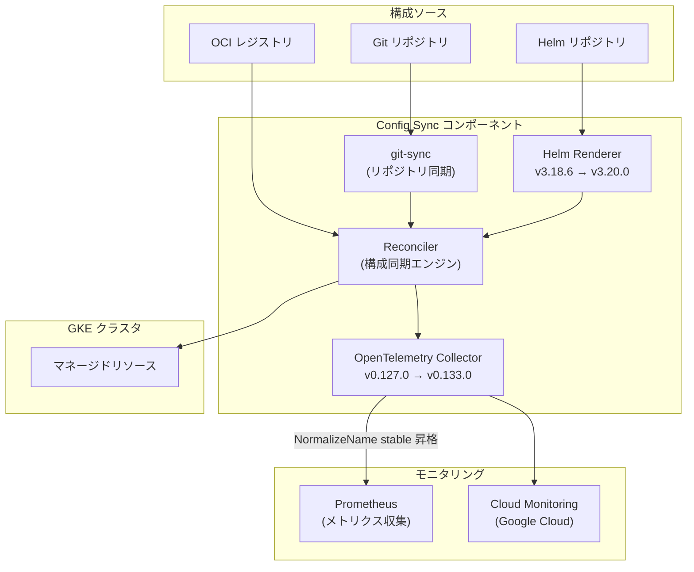

# Anthos Config Management: OpenTelemetry、Helm アップグレードおよび CVE 修正

**リリース日**: 2026-03-26

**サービス**: Anthos Config Management (Config Sync)

**機能**: OpenTelemetry Collector イメージ、Helm バージョンのアップグレードおよび依存関係の CVE 修正

**ステータス**: Breaking/Change

[このアップデートのインフォグラフィックを見る](https://takech9203.github.io/google-cloud-news-summary/20260326-anthos-config-management-otel-helm-update.html)

## 概要

Anthos Config Management (Config Sync) において、セキュリティ強化を目的とした複数のコンポーネントアップグレードがリリースされた。今回のアップデートでは、Open Telemetry Collector イメージが v0.127.0 から v0.133.0 へ、バンドルされている Helm が v3.18.6 から v3.20.0 へそれぞれアップグレードされ、脆弱性の修正が取り込まれている。また、複数の依存関係の更新により CVE が対処されている。

特に注意が必要なのは、Open Telemetry Collector のアップグレードが Breaking Change として分類されている点である。このアップグレードにより、`pkg.translator.prometheus.NormalizeName` フィーチャーゲートが stable に昇格する。これは Prometheus メトリクスのエクスポート時にメトリクス名の正規化動作が変更されることを意味し、カスタムモニタリング設定を利用しているユーザーに影響を与える可能性がある。

対象ユーザーは、Config Sync を利用してマルチクラスタ構成管理を行っているすべての GKE クラスタ管理者およびプラットフォームエンジニアである。特にカスタムの OpenTelemetry Collector 設定や Prometheus メトリクスパイプラインを構築しているユーザーは、Breaking Change の影響を確認する必要がある。

**アップデート前の課題**

- Open Telemetry Collector v0.127.0 には既知の脆弱性が存在し、`pkg.translator.prometheus.NormalizeName` フィーチャーゲートが beta 段階であった
- バンドルされていた Helm v3.18.6 にセキュリティ上の脆弱性が含まれていた
- 複数の依存関係に CVE (Common Vulnerabilities and Exposures) が存在し、セキュリティリスクがあった

**アップデート後の改善**

- Open Telemetry Collector が v0.133.0 にアップグレードされ、脆弱性が修正されるとともにメトリクス正規化の動作が安定版として確定した
- Helm が v3.20.0 にアップグレードされ、脆弱性が修正された
- 依存関係の更新により複数の CVE が解消され、全体的なセキュリティ態勢が改善された

## アーキテクチャ図



Config Sync のコンポーネント構成と今回のアップデート対象を示す。OpenTelemetry Collector はメトリクスの収集・エクスポートを担い、Helm Renderer は Helm チャートのレンダリングを担当する。

## サービスアップデートの詳細

### 主要機能

1. **OpenTelemetry Collector イメージのアップグレード (Breaking)**
   - v0.127.0 から v0.133.0 へのアップグレードにより、複数の脆弱性修正が取り込まれた
   - `pkg.translator.prometheus.NormalizeName` フィーチャーゲートが stable に昇格し、Prometheus メトリクスエクスポート時のメトリクス名正規化が標準動作となった
   - この変更は Breaking Change であり、Prometheus メトリクス名の命名規則に影響する可能性がある
   - 以前の Config Sync リリースでは v0.119.0 から v0.127.0 へのアップグレード時に非推奨の OpenCensus receiver が削除されており、今回はそれに続くメジャーアップデートとなる

2. **Helm バージョンのアップグレード (Change)**
   - バンドルされた Helm が v3.18.6 から v3.20.0 にアップグレードされた
   - Helm チャートのレンダリングに使用されるバージョンが更新され、脆弱性修正が反映された
   - Config Sync で Helm チャートをソースとして利用しているユーザーは、Helm v3.20.0 の変更点を確認することが推奨される

3. **依存関係の CVE 修正 (Change)**
   - 複数の Common Vulnerabilities and Exposures (CVE) に対応するため、各種依存関係が更新された
   - これは Config Sync の定期的なセキュリティメンテナンスの一環である

## 技術仕様

### バージョン変更一覧

| コンポーネント | 変更前 | 変更後 | 変更種別 |
|---------------|--------|--------|----------|
| OpenTelemetry Collector | v0.127.0 | v0.133.0 | Breaking |
| Helm | v3.18.6 | v3.20.0 | Change |
| 各種依存関係 | - | 最新版に更新 | Change |

### OpenTelemetry フィーチャーゲートの変更

| フィーチャーゲート | 変更前の状態 | 変更後の状態 | 影響 |
|-------------------|-------------|-------------|------|
| `pkg.translator.prometheus.NormalizeName` | beta | stable | Prometheus メトリクス名の正規化が標準動作に |

### OpenTelemetry Collector アップグレード履歴 (Config Sync)

| バージョン | OTel Collector | 主な変更点 |
|-----------|---------------|-----------|
| 1.22.1 | v0.118.0 → v0.119.0 | 脆弱性修正 |
| 1.23.0 | - | 内部ライブラリを OpenCensus から OpenTelemetry へ移行 |
| 1.23.1 | v0.119.0 → v0.127.0 | OpenCensus receiver の削除 (Breaking) |
| 今回 | v0.127.0 → v0.133.0 | NormalizeName の stable 昇格 (Breaking) |

## 設定方法

### 前提条件

1. GKE クラスタで Config Sync が有効化されていること
2. Config Sync の最新バージョンにアップグレード可能な環境であること

### 手順

#### ステップ 1: 現在のバージョンを確認

```bash
# Config Sync のバージョン確認
gcloud beta container fleet config-management version \
    --project=PROJECT_ID
```

現在使用している Config Sync のバージョンと OpenTelemetry Collector のバージョンを確認する。

#### ステップ 2: カスタムモニタリング設定の確認

```bash
# otel-collector の設定を確認
kubectl get deployment otel-collector \
    -n config-management-system -o yaml
```

カスタムの OpenTelemetry Collector 設定を使用している場合、`pkg.translator.prometheus.NormalizeName` の stable 昇格による影響を確認する。Prometheus メトリクス名が正規化されるため、ダッシュボードやアラートルールの修正が必要になる可能性がある。

#### ステップ 3: Config Sync のアップグレード

```bash
# Config Sync のバージョンをアップグレード
gcloud beta container fleet config-management upgrade \
    --membership=MEMBERSHIP_NAME \
    --project=PROJECT_ID
```

アップグレード後、Config Sync コンポーネントが正常に動作していることを確認する。

#### ステップ 4: アップグレード後の確認

```bash
# Config Sync のステータス確認
nomos status

# otel-collector のログ確認
kubectl logs deployment/otel-collector \
    -n config-management-system --tail=50
```

OpenTelemetry Collector および Helm Renderer が正常に起動していることを確認する。

## メリット

### ビジネス面

- **セキュリティコンプライアンスの向上**: 複数の CVE が修正され、セキュリティ監査やコンプライアンス要件への適合が容易になる
- **運用リスクの低減**: 既知の脆弱性が解消されることで、セキュリティインシデントのリスクが軽減される

### 技術面

- **メトリクス正規化の安定化**: `NormalizeName` フィーチャーゲートが stable に昇格したことで、Prometheus メトリクス名の正規化動作が確定し、今後の予期しない変更リスクがなくなる
- **Helm の最新機能**: Helm v3.20.0 の機能改善およびバグ修正が利用可能になる
- **依存関係の最新化**: 各コンポーネントが最新バージョンに更新されることで、パフォーマンス改善やバグ修正の恩恵を受けられる

## デメリット・制約事項

### 制限事項

- OpenTelemetry Collector のアップグレードは Breaking Change であり、自動的に適用されるためオプトアウトできない
- `pkg.translator.prometheus.NormalizeName` の stable 昇格により、Prometheus メトリクス名が変更される可能性がある

### 考慮すべき点

- カスタムの Prometheus ダッシュボードやアラートルールを使用している場合、メトリクス名の変更により修正が必要になる可能性がある
- Helm v3.20.0 へのアップグレードにより、一部の Helm チャートで動作が変わる可能性があるため、事前にテスト環境での検証が推奨される
- 変更内容の詳細は [opentelemetry-collector-contrib の変更履歴](https://github.com/open-telemetry/opentelemetry-collector-contrib/blob/main/CHANGELOG.md) および [Helm のリリースノート](https://github.com/helm/helm/releases) を確認すること

## ユースケース

### ユースケース 1: Prometheus ベースのカスタムモニタリング環境

**シナリオ**: Config Sync のメトリクスを Prometheus で収集し、Grafana ダッシュボードで可視化している環境。`NormalizeName` の stable 昇格によりメトリクス名が変更される可能性がある。

**効果**: アップグレード前にメトリクス名の変更を確認し、ダッシュボードやアラートルールを事前に更新することで、モニタリングの中断を防止できる。

### ユースケース 2: Helm チャートによるマルチクラスタ構成管理

**シナリオ**: Config Sync の RootSync/RepoSync で Helm リポジトリをソースとして利用し、複数の GKE クラスタに統一された構成を配布している環境。

**効果**: Helm v3.20.0 へのアップグレードにより、チャートレンダリングのセキュリティが向上し、最新の Helm 機能を活用した構成管理が可能になる。

## 関連サービス・機能

- **Config Sync**: Anthos Config Management の中核機能で、Git、OCI、Helm からの構成同期を提供する
- **OpenTelemetry Collector**: Config Sync のメトリクス収集・エクスポートを担当するオブザーバビリティコンポーネント
- **Cloud Monitoring**: Google Cloud のモニタリングサービスで、Config Sync メトリクスの送信先として利用される
- **Policy Controller**: Config Sync と連携して Kubernetes リソースのポリシー適用を行う
- **GKE Enterprise**: Config Sync を含むエンタープライズ向け Kubernetes プラットフォーム

## 参考リンク

- [インフォグラフィック](https://takech9203.github.io/google-cloud-news-summary/20260326-anthos-config-management-otel-helm-update.html)
- [公式リリースノート](https://cloud.google.com/kubernetes-engine/enterprise/config-sync/docs/release-notes)
- [Config Sync ドキュメント](https://cloud.google.com/kubernetes-engine/enterprise/config-sync/docs/overview)
- [OpenTelemetry Collector Contrib 変更履歴](https://github.com/open-telemetry/opentelemetry-collector-contrib/blob/main/CHANGELOG.md)
- [Helm リリースノート](https://github.com/helm/helm/releases)
- [Config Sync モニタリングガイド](https://cloud.google.com/kubernetes-engine/enterprise/config-sync/docs/how-to/monitor-config-sync-cloud-monitoring)

## まとめ

今回の Anthos Config Management アップデートは、OpenTelemetry Collector と Helm のバージョンアップグレードおよび CVE 修正を含むセキュリティ重視のリリースである。特に OpenTelemetry Collector の `pkg.translator.prometheus.NormalizeName` フィーチャーゲートの stable 昇格は Breaking Change であるため、カスタムモニタリング環境を利用しているユーザーは事前にメトリクス名の変更影響を確認し、必要に応じてダッシュボードやアラートルールを更新することが推奨される。

---

**タグ**: #AnthoConfigManagement #ConfigSync #OpenTelemetry #Helm #CVE #セキュリティ #Breaking #GKE
