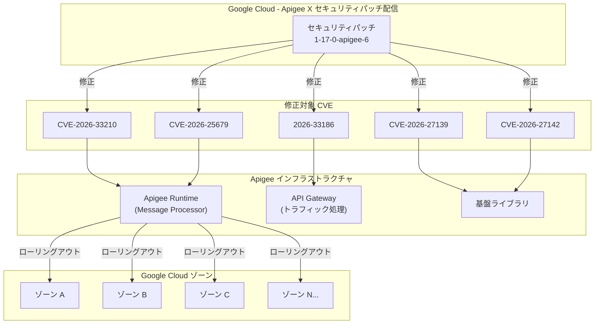

# Apigee X: セキュリティアップデート (1-17-0-apigee-6) CVE 修正

**リリース日**: 2026-03-26
**サービス**: Apigee X
**機能**: セキュリティアップデート (1-17-0-apigee-6) - CVE 修正
**ステータス**: セキュリティ / アナウンスメント

[このアップデートのインフォグラフィックを見る](https://takech9203.github.io/google-cloud-news-summary/20260326-apigee-x-security-update-1-17-0-6.html)

## 概要

2026 年 3 月 26 日、Google Cloud は Apigee X の新バージョン (1-17-0-apigee-6) をリリースした。本リリースは、Apigee インフラストラクチャに影響する複数のセキュリティ脆弱性 (CVE-2026-33210、CVE-2026-25679、CVE-2026-27139、CVE-2026-27142、2026-33186) を修正するセキュリティアップデートである。

このリリースのロールアウトは本日から開始されており、すべての Google Cloud ゾーンに展開が完了するまでに 4 営業日以上かかる可能性がある。バグ修正は含まれておらず、インフラストラクチャとライブラリの更新が主な内容である。

対象ユーザーは、Apigee X を利用してAPI管理を行っているすべての組織およびプラットフォームエンジニアである。セキュリティ脆弱性の修正を含むため、ロールアウト完了後は速やかに適用状況を確認することが推奨される。

**アップデート前の課題**

- Apigee インフラストラクチャに CVE-2026-33210、CVE-2026-25679 などの複数のセキュリティ脆弱性が存在していた
- 使用しているライブラリに既知の脆弱性が含まれており、攻撃対象となるリスクがあった
- インフラストラクチャコンポーネントが最新のセキュリティパッチを適用していない状態であった

**アップデート後の改善**

- CVE-2026-33210、CVE-2026-25679、CVE-2026-27139、CVE-2026-27142、2026-33186 の 5 件の脆弱性が修正された
- Apigee インフラストラクチャの基盤ライブラリが最新のセキュリティ対応版に更新された
- API ゲートウェイの安全性が向上し、脆弱性を悪用した攻撃リスクが低減された

## アーキテクチャ図

セキュリティパッチ 1-17-0-apigee-6 が 5 件の CVE を修正し、Apigee インフラストラクチャの各コンポーネント (Runtime、API Gateway、基盤ライブラリ) に適用された後、すべての Google Cloud ゾーンに段階的にローリングアウトされる流れを示す。

## サービスアップデートの詳細

### 主要機能

1. **CVE-2026-33210 および CVE-2026-25679 の修正**
   - Bug ID 495897297 および 495909767 に関連するセキュリティ修正
   - Apigee インフラストラクチャに影響する脆弱性を解消
   - API トラフィックの処理基盤における安全性が向上

2. **CVE-2026-27139 および CVE-2026-27142 の修正**
   - Apigee が依存するライブラリに存在していた脆弱性を修正
   - ライブラリレベルでのセキュリティ強化により、間接的な攻撃経路を遮断

3. **2026-33186 の修正**
   - インフラストラクチャレベルのセキュリティ修正
   - 基盤コンポーネントの堅牢性が向上

4. **インフラストラクチャとライブラリの更新**
   - セキュリティ脆弱性の修正に加え、依存ライブラリを最新版に更新
   - 今回のリリースではバグ修正 (機能的な不具合の修正) は含まれていない

## 技術仕様

### セキュリティ修正一覧

| Bug ID | 修正対象 CVE | 説明 |
|--------|-------------|------|
| 495897297 | CVE-2026-33210, CVE-2026-25679, CVE-2026-27139, CVE-2026-27142, 2026-33186 | Apigee インフラストラクチャのセキュリティ修正 |
| 495909767 | 同上 | Apigee インフラストラクチャのセキュリティ修正 |

### リリース情報

| 項目 | 詳細 |
|------|------|
| リリースバージョン | 1-17-0-apigee-6 |
| リリース日 | 2026 年 3 月 26 日 |
| ロールアウト期間 | 4 営業日以上 |
| バグ修正 | なし (インフラストラクチャとライブラリの更新のみ) |
| 対象 | Apigee X (マネージドサービス) |

### Apigee X のセキュリティパッチ適用プロセス

Apigee X はフルマネージドサービスであるため、セキュリティパッチは Google によって自動的にローリングアウトされる。ユーザー側でのアクション (手動でのバージョンアップグレードなど) は不要である。ただし、ロールアウトはすべてのゾーンに同時には適用されず、段階的に展開される。

## メリット

### ビジネス面

- **セキュリティリスクの低減**: 5 件の脆弱性が修正されることで、API 基盤を狙った攻撃のリスクが大幅に低減される
- **コンプライアンスの維持**: セキュリティパッチの迅速な適用により、PCI DSS や SOC 2 などのセキュリティ基準への準拠を維持できる
- **運用負荷ゼロ**: Apigee X はフルマネージドのため、ユーザー側でパッチ適用作業を行う必要がない

### 技術面

- **自動ローリングアウト**: Google によるマネージド環境でのパッチ適用により、ダウンタイムなしでセキュリティ更新が行われる
- **ライブラリの最新化**: 依存ライブラリが最新版に更新されることで、既知の脆弱性だけでなく将来的なリスクも低減される
- **インフラストラクチャの堅牢化**: 基盤コンポーネントのセキュリティが強化され、API ゲートウェイ全体の信頼性が向上する

## デメリット・制約事項

### 制限事項

- ロールアウトの完了にはすべての Google Cloud ゾーンに展開されるまで 4 営業日以上かかる場合がある
- ロールアウト期間中は、一部のゾーンでパッチ適用済み、他のゾーンでは未適用という状態が発生する
- Apigee hybrid を使用している場合は、別途手動でのアップグレード対応が必要となる可能性がある

### 考慮すべき点

- ロールアウトのタイミングはユーザーが制御できないため、適用状況を確認するにはリリースノートおよびサポートへの問い合わせが必要
- 各 CVE の深刻度の詳細 (CVSS スコアなど) はリリースノートでは公開されていないため、影響範囲の評価にはセキュリティチームとの連携が推奨される

## ユースケース

### ユースケース 1: フルマネージド Apigee X 環境での自動パッチ適用

**シナリオ**: Apigee X を使用して本番 API を公開している組織が、CVE 修正を含むセキュリティアップデートを受け取る場合

**効果**: ユーザー側での操作は不要で、Google による段階的なローリングアウトにより自動的にパッチが適用される。ロールアウト完了後、API ゲートウェイは最新のセキュリティ修正が反映された状態となり、脆弱性を悪用した攻撃から保護される。

### ユースケース 2: セキュリティ監査への対応

**シナリオ**: セキュリティ監査で API 基盤の脆弱性対応状況を求められた場合

**効果**: Apigee X のリリースノートを根拠として、CVE-2026-33210 など 5 件の脆弱性が修正済みであることを示すことができる。フルマネージドサービスのため、パッチ適用は Google が責任を持って実施しており、利用者側の対応漏れリスクがない。

## 料金

今回のセキュリティアップデートの適用に追加料金は発生しない。Apigee X の通常の利用料金の範囲内でセキュリティパッチが提供される。Apigee X の料金体系は API コール数、環境タイプ (Eval / Intermediate / Comprehensive)、およびアドオン機能に基づいている。

詳細は [Apigee の料金ページ](https://cloud.google.com/apigee/pricing) を参照。

## 関連サービス・機能

- **Apigee hybrid**: オンプレミスまたはマルチクラウド環境で Apigee を運用している場合、同様のセキュリティ修正が hybrid 向けにも提供される可能性がある。hybrid の場合はユーザーによる手動アップグレードが必要
- **Apigee Advanced API Security**: API セキュリティの強化機能を提供し、不正アクセスや悪用の検出を行う。インフラストラクチャレベルのセキュリティパッチと組み合わせることで、多層防御を実現できる
- **Cloud Armor**: DDoS 防御や WAF 機能を提供し、Apigee の前段でネットワークレベルのセキュリティを強化する
- **Security Command Center**: Google Cloud 全体のセキュリティ状態を一元管理し、Apigee を含むサービスの脆弱性状況を可視化できる

## 参考リンク

- [このアップデートのインフォグラフィック](https://takech9203.github.io/google-cloud-news-summary/20260326-apigee-x-security-update-1-17-0-6.html)
- [Apigee X リリースノート](https://cloud.google.com/apigee/docs/release/notes/apigee-release-notes)
- [Apigee セキュリティパッチプロセス](https://cloud.google.com/apigee/docs/hybrid/security-patching)
- [Apigee ドキュメント](https://cloud.google.com/apigee/docs)
- [料金ページ](https://cloud.google.com/apigee/pricing)

## まとめ

今回の Apigee X セキュリティアップデート (1-17-0-apigee-6) は、インフラストラクチャに影響する 5 件のセキュリティ脆弱性 (CVE-2026-33210、CVE-2026-25679、CVE-2026-27139、CVE-2026-27142、2026-33186) を修正する重要なリリースである。Apigee X はフルマネージドサービスのため、ユーザー側での操作は不要で Google による自動ローリングアウトでパッチが適用されるが、すべてのゾーンへの展開完了には 4 営業日以上かかる可能性がある。API 基盤のセキュリティを確保するため、ロールアウト完了後の適用状況の確認を推奨する。

---

**タグ**: #ApigeeX #Security #CVE #APIManagement #セキュリティアップデート #インフラストラクチャ #GoogleCloud
