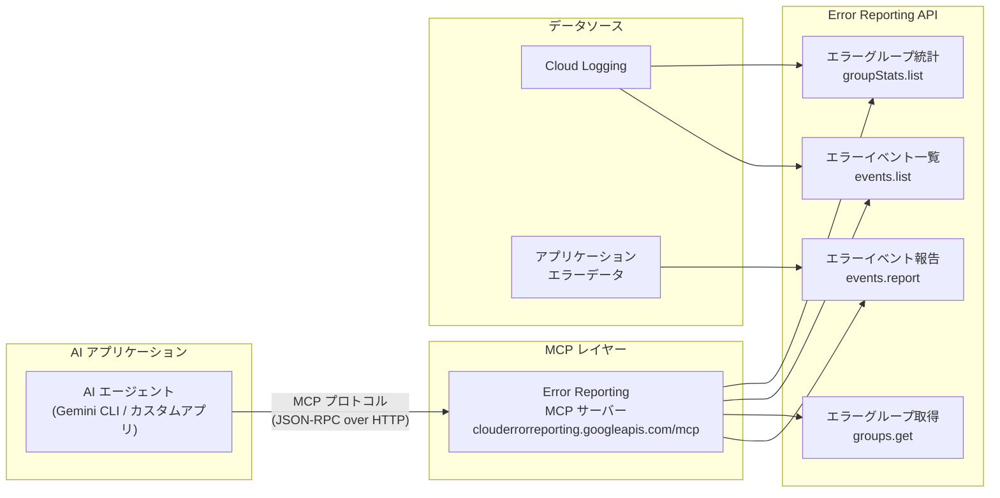

# Error Reporting: AI エージェント向け MCP サーバー (Preview)

**リリース日**: 2026-03-26

**サービス**: Error Reporting

**機能**: Error Reporting API MCP server for AI agents

**ステータス**: Preview

📊 [このアップデートのインフォグラフィックを見る](https://takech9203.github.io/google-cloud-news-summary/20260326-error-reporting-mcp-server.html)

## 概要

Error Reporting API の MCP (Model Context Protocol) サーバーが Preview として提供開始された。この MCP サーバーにより、AI エージェントや AI アプリケーションが Error Reporting のエラーデータとプログラム的に対話できるようになる。エージェントは MCP プロトコルを通じて、エラーグループの一覧取得、エラーイベントの詳細確認、エラー統計情報の分析などを自然言語ベースで実行可能になる。

Google Cloud は Cloud Logging、Cloud Monitoring、BigQuery、Compute Engine など多数のサービスでリモート MCP サーバーを提供しており、今回の Error Reporting MCP サーバーはオブザーバビリティ領域における MCP 対応の拡充となる。AI エージェントがエラーデータに直接アクセスできることで、障害の根本原因分析 (RCA) やインシデント対応の自動化が大幅に促進される。

**アップデート前の課題**

- AI エージェントが Error Reporting のデータにアクセスするには、REST API を直接呼び出すカスタムコードの実装が必要だった
- エラー情報の分析・トリアージは人手による Google Cloud コンソールの操作に依存しており、自動化が困難だった
- AI を活用したインシデント対応ワークフローにエラーデータを組み込むための標準化されたインターフェースが存在しなかった

**アップデート後の改善**

- MCP プロトコルを通じて AI エージェントが Error Reporting のエラーデータと直接対話可能になった
- Gemini CLI や各種 MCP 対応クライアントから自然言語でエラーの検索・分析ができるようになった
- エラーのトリアージ、根本原因分析、インシデント対応の自動化ワークフローを構築しやすくなった

## アーキテクチャ図



AI エージェントが MCP プロトコルを介して Error Reporting API の各エンドポイントと通信する構成を示す。エージェントは MCP サーバーを経由してエラーグループの統計情報、個別のエラーイベント、エラーグループの詳細を取得し、エラー分析やインシデント対応を自動化できる。

## サービスアップデートの詳細

### 主要機能

1. **MCP プロトコルによるエラーデータアクセス**
   - MCP 対応の AI クライアントから Error Reporting のデータに標準化された方法でアクセス可能
   - JSON-RPC over HTTP によるリモート MCP サーバーとして動作し、既存の MCP クライアントとシームレスに統合

2. **エラーグループ統計の取得と分析**
   - エラーグループごとの発生回数、影響を受けたユーザー数、最初と最後の発生日時などの統計情報を AI エージェントが取得
   - AI エージェントによるエラーの優先度付けやトレンド分析が可能

3. **エラーイベントの詳細調査**
   - 特定のエラーグループに属するエラーイベントの一覧を取得し、スタックトレースやコンテキスト情報を分析
   - 時間範囲やサービスコンテキストによるフィルタリングにより、効率的な根本原因分析を支援

## 技術仕様

### MCP サーバー構成

| 項目 | 詳細 |
|------|------|
| プロトコル | Model Context Protocol (MCP) - JSON-RPC over HTTP |
| エンドポイント | `https://clouderrorreporting.googleapis.com/mcp` (推定) |
| 認証 | OAuth 2.0 / サービスアカウント |
| ステータス | Preview |
| ベース API | Error Reporting API v1beta1 |

### Error Reporting API データモデル

| エンティティ | 説明 |
|-------------|------|
| ErrorEvent | アプリケーションで発生した個別のエラーイベント。発生時刻、コンテキスト、エラーメッセージを含む。生成後 30 日間保持 |
| ErrorGroup | スタックトレースに基づいて論理的にグループ化されたエラーイベントの集合。グループ ID とトラッキング Issue を含む |
| ErrorGroupStats | エラーグループの詳細統計。初回・最終発生日時、発生回数、影響ユーザー数などを含む |

### MCP クライアント設定例

```json
{
  "mcpServers": {
    "error-reporting": {
      "httpUrl": "https://clouderrorreporting.googleapis.com/mcp"
    }
  }
}
```

## 設定方法

### 前提条件

1. Google Cloud プロジェクトで Error Reporting API が有効化されていること
2. 適切な IAM ロール (`roles/errorreporting.viewer` 以上) が付与されていること
3. MCP 対応の AI クライアント (Gemini CLI、Firebase Studio、Claude Desktop など) がインストールされていること

### 手順

#### ステップ 1: Error Reporting API の有効化

```bash
gcloud services enable clouderrorreporting.googleapis.com
```

Google Cloud プロジェクトで Error Reporting API を有効にする。

#### ステップ 2: MCP クライアントの設定

MCP 対応クライアントの設定ファイルに Error Reporting MCP サーバーのエンドポイントを追加する。

```json
{
  "mcpServers": {
    "error-reporting": {
      "httpUrl": "https://clouderrorreporting.googleapis.com/mcp"
    }
  }
}
```

#### ステップ 3: 認証の設定

OAuth 認証フローを使用してクライアントを認証する。Gemini CLI の場合は初回接続時にブラウザベースのログインが求められる。サービスアカウントを使用する場合は、適切な認証情報を環境変数に設定する。

```bash
export GOOGLE_APPLICATION_CREDENTIALS="/path/to/service-account-key.json"
```

## メリット

### ビジネス面

- **インシデント対応時間の短縮**: AI エージェントがエラーデータを自動分析することで、障害の検知から根本原因の特定までの時間 (MTTR) を大幅に短縮できる
- **運用コストの削減**: エラーのトリアージや優先度付けを AI エージェントに委任することで、SRE チームの負荷を軽減できる

### 技術面

- **標準化されたインターフェース**: MCP プロトコルにより、異なる AI クライアントから統一された方法でエラーデータにアクセス可能
- **既存のオブザーバビリティスタックとの統合**: Cloud Logging MCP サーバーや Cloud Monitoring MCP サーバーと組み合わせることで、包括的な AI 駆動のオブザーバビリティワークフローを構築可能

## デメリット・制約事項

### 制限事項

- Preview ステータスのため、本番環境での使用は「Pre-GA Offerings Terms」の条件が適用される
- MCP 対応クライアントが必要であり、すべての AI ツールから利用できるわけではない
- Error Reporting API 自体が v1beta1 であり、API の仕様変更が発生する可能性がある

### 考慮すべき点

- AI エージェントにエラーデータへのアクセスを許可する際は、IAM ロールの最小権限原則を遵守すること
- Preview 機能のため、SLA やサポートレベルが限定的である点に留意が必要

## ユースケース

### ユースケース 1: AI 駆動のインシデントトリアージ

**シナリオ**: SRE チームがオンコール対応中に、大量のエラーが発生しているサービスの状況を迅速に把握したい場合。AI エージェントに「過去 1 時間で最もエラーが多いサービスを教えて」と質問するだけで、エラーグループの統計情報を取得・分析し、優先度の高い問題を特定する。

**効果**: エラーの手動調査に費やす時間を削減し、重要度の高い問題への迅速な対応が可能になる。

### ユースケース 2: 自動デプロイ後のエラー監視

**シナリオ**: CI/CD パイプラインと連携した AI エージェントが、新しいバージョンのデプロイ後に Error Reporting のデータを自動的に監視し、新しいエラーグループの出現やエラー率の異常な増加を検知してアラートを発行する。

**効果**: デプロイ後のリグレッション検知を自動化し、問題のあるデプロイの早期ロールバックを支援する。

### ユースケース 3: Cloud Logging + Error Reporting の統合分析

**シナリオ**: Cloud Logging MCP サーバーと Error Reporting MCP サーバーを組み合わせて、AI エージェントがエラーの発生状況とログの詳細を横断的に分析する。エラーグループのスタックトレースから関連するログエントリを自動的に特定し、根本原因を推定する。

**効果**: 複数のオブザーバビリティツールを跨いだ分析を AI エージェントが一元的に実行し、調査効率が向上する。

## 料金

Error Reporting MCP サーバー自体の追加料金は現時点では発表されていない。Error Reporting の利用料金は Cloud Operations Suite の料金体系に含まれる。

- Error Reporting によるエラーの受信と分析は無料
- ただし、Error Reporting API 経由でエラーを報告する場合、Cloud Logging のインジェストコストが発生する可能性がある

詳細は [Cloud Operations Suite の料金ページ](https://cloud.google.com/products/observability/pricing) を参照。

## 関連サービス・機能

- **Cloud Logging MCP サーバー**: `https://logging.googleapis.com/mcp` でログデータへの AI エージェントアクセスを提供。Error Reporting と組み合わせてエラーとログの統合分析が可能
- **Cloud Monitoring MCP サーバー**: `https://monitoring.googleapis.com/mcp` でメトリクスデータへのアクセスを提供。エラー発生時のシステムメトリクスとの相関分析に活用可能
- **Error Reporting API**: MCP サーバーの基盤となる REST API。エラーイベントの報告、エラーグループの管理、統計情報の取得を提供
- **Firebase Crashlytics**: モバイルアプリケーション (Android/iOS) のクラッシュレポーティング。Error Reporting と補完的な関係

## 参考リンク

- 📊 [インフォグラフィック](https://takech9203.github.io/google-cloud-news-summary/20260326-error-reporting-mcp-server.html)
- [公式リリースノート](https://cloud.google.com/error-reporting/docs/release-notes)
- [Error Reporting ドキュメント](https://cloud.google.com/error-reporting/docs)
- [Error Reporting API リファレンス](https://cloud.google.com/error-reporting/reference)
- [Google Cloud MCP 対応サービス一覧](https://cloud.google.com/mcp/supported-products)
- [料金ページ](https://cloud.google.com/products/observability/pricing)

## まとめ

Error Reporting API MCP サーバーの Preview リリースにより、AI エージェントがエラーデータに直接アクセスして分析・対応を自動化できる新しいパラダイムが実現された。Cloud Logging や Cloud Monitoring の既存 MCP サーバーと組み合わせることで、AI 駆動のオブザーバビリティワークフローの構築が可能になる。Preview 段階であるため本番環境での利用には注意が必要だが、インシデント対応の効率化や運用自動化を目指すチームは早期に評価を開始することを推奨する。

---

**タグ**: #ErrorReporting #MCP #ModelContextProtocol #AIエージェント #オブザーバビリティ #Preview #CloudOperations
