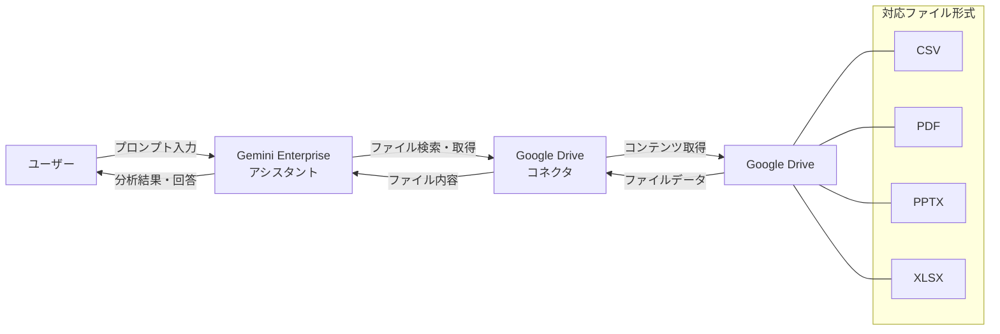

# Gemini Enterprise: Google Drive コネクタでのファイルチャット機能 (GA)

**リリース日**: 2026-03-26

**サービス**: Gemini Enterprise

**機能**: Chat with files in Google Drive connector

**ステータス**: GA (Generally Available)

[このアップデートのインフォグラフィックを見る](https://takech9203.github.io/google-cloud-news-summary/20260326-gemini-enterprise-drive-file-chat.html)

## 概要

Gemini Enterprise に Google Drive コネクタ内のファイルと直接チャットできる機能が一般提供 (GA) として追加されました。この機能により、CSV、PDF、PPTX、XLSX 形式のファイルをアシスタントにアップロードすることなく、Google Drive コネクタ経由でファイルの内容を分析し、回答を生成できるようになります。

この機能は、既に Microsoft SharePoint (2026年2月19日 GA)、Microsoft Outlook、Box (2026年3月4日 GA) の各コネクタで提供されていた「コネクタ内ファイルチャット」機能の Google Drive 版です。Google Workspace を中心に業務を行う組織にとって、ファイルのアップロード作業を省略しながら、AI による高度なファイル分析が可能になる重要なアップデートです。

対象ユーザーは、Gemini Enterprise のライセンスを持つすべてのユーザーであり、特にビジネスアナリスト、プロジェクトマネージャー、営業担当者など、Google Drive 上のドキュメントやスプレッドシートを日常的に利用するユーザーに大きなメリットがあります。

**アップデート前の課題**

- Google Drive 内のファイルについて Gemini Enterprise に質問するには、まずファイルをダウンロードしてからアシスタントにアップロードする必要があった
- 複数のファイルを横断的に分析する場合、個別にアップロードする手間が発生していた
- アップロードにはファイルサイズの制限 (PDF: 100 MB、XLSX: 50 MB、CSV: 7 MB、PPTX: 100 MB) があり、大量のファイルを扱う際にワークフローが煩雑だった

**アップデート後の改善**

- Google Drive コネクタを有効にするだけで、Drive 内の CSV、PDF、PPTX、XLSX ファイルについて直接チャットが可能になった
- ファイルのアップロード作業が不要になり、ワークフローが大幅に簡素化された
- Google Drive のアクセス権限に基づいたセキュアなファイルアクセスが維持される

## アーキテクチャ図



ユーザーが Gemini Enterprise アシスタントにプロンプトを入力すると、Google Drive コネクタ経由で対象ファイルの内容が取得され、Gemini Enterprise がその内容を分析して回答を生成します。

## サービスアップデートの詳細

### 主要機能

1. **Google Drive コネクタでのファイルチャット**
   - Google Drive コネクタに接続された CSV、PDF、PPTX、XLSX ファイルの内容を直接分析
   - ファイルのアップロード作業が不要で、コネクタ経由で自動的にファイル内容を取得
   - ファイル名をプロンプトに含めることで、検索精度を向上可能

2. **対応ファイル形式**
   - CSV: スプレッドシートデータの分析、集計、傾向把握
   - PDF: ドキュメントの要約、情報抽出、質問応答
   - PPTX: プレゼンテーション資料の内容分析、要約
   - XLSX: スプレッドシートデータの分析 (実行コードの確認が可能)

3. **セキュアなアクセス制御**
   - Google Drive のアクセス権限に基づいたデータフェデレーションにより、ユーザーがアクセス権を持つファイルのみ分析対象となる
   - データは Vertex AI Search のインデックスにコピーされず、直接 Google Drive API 経由で取得される

## 技術仕様

### 対応ファイル形式と制約

| 項目 | 詳細 |
|------|------|
| 対応形式 | CSV, PDF, PPTX, XLSX |
| アクセス方式 | データフェデレーション (Google Drive API 経由) |
| アクセス制御 | ユーザーの Google Drive 権限に基づく |
| データ保存 | Vertex AI Search インデックスにはコピーされない |

### コネクタ利用時の要件

| 項目 | 詳細 |
|------|------|
| 管理者設定 | Gemini Enterprise 管理者がコネクタのアクションを有効化する必要あり |
| ユーザー認証 | Google Drive へのアクセスを Gemini Enterprise に承認する必要あり |
| コネクタ設定 | チャット時は Google Drive コネクタのみを有効にし、他のコネクタと Google Search は無効にすることを推奨 |

## 設定方法

### 前提条件

1. Gemini Enterprise のサブスクリプションとライセンスが有効であること
2. Google Cloud プロジェクトで Gemini Enterprise が設定済みであること
3. ID プロバイダーが構成済みであること
4. Google Workspace のスマート機能が有効であること

### 手順

#### ステップ 1: Google Drive データストアの作成

Google Cloud コンソールで Gemini Enterprise ページに移動し、以下を実行します。

1. ナビゲーションメニューから「Data stores」をクリック
2. 「Create data store」をクリック
3. Source セクションで「Google Drive」を検索し、選択
4. Data セクションでドライブソースを指定 (全体 / 特定の共有ドライブ / 特定の共有フォルダ)
5. Configuration セクションでマルチリージョンとコネクタ名を設定
6. Billing セクションで料金プランを選択
7. 「Create」をクリック

#### ステップ 2: アプリの作成とデータストアの接続

データストアのステータスが「Active」に変わったら、アプリを作成し Google Drive データストアに接続します。

#### ステップ 3: ファイルチャットの利用

1. Gemini Enterprise のチャットボックスで「Connectors」をクリック
2. Google Drive コネクタを有効にし、他のコネクタと Google Search を無効にする
3. プロンプトを入力してファイルについて質問する

## メリット

### ビジネス面

- **生産性の向上**: ファイルのダウンロードとアップロードという手動プロセスが不要になり、情報へのアクセスが迅速化
- **ワークフローの効率化**: Google Drive に保存されたレポートやスプレッドシートについて、チャット形式で即座に質問・分析が可能
- **意思決定の迅速化**: 会議資料や財務データなどの情報を素早く要約・分析し、迅速な意思決定をサポート

### 技術面

- **データフェデレーション**: データがインデックスにコピーされないため、データの鮮度が常に最新状態を維持
- **セキュリティの維持**: Google Drive の既存のアクセス制御を活用し、追加のセキュリティ設定が不要
- **シームレスな統合**: Google Workspace エコシステムとの自然な統合により、導入の障壁が低い

## デメリット・制約事項

### 制限事項

- 対応ファイル形式は CSV、PDF、PPTX、XLSX の 4 種類に限定 (DOCX、TXT などは非対応)
- チャット時は Google Drive コネクタのみを有効にし、他のコネクタや Google Search は無効にする必要がある
- データフェデレーション利用時、Google Drive コネクタはユーザーのドメインが所有するドキュメントのみ検索可能

### 考慮すべき点

- 管理者が事前にコネクタのアクションを有効化する必要がある
- 共有ドライブ以外のファイルは、ドメイン内のユーザーが所有権を持っている必要がある
- 曖昧なプロンプトや広範すぎる質問は精度低下の原因となるため、具体的なファイル名を含めることが推奨される

## ユースケース

### ユースケース 1: 財務データの分析

**シナリオ**: 経理部門の担当者が、Google Drive に保存された月次売上レポート (XLSX) について、前月比の変動が大きい項目を素早く把握したい場合。

**実装例**:
```
プロンプト例: "2026年2月の月次売上レポート 'monthly-sales-202602.xlsx' で、
前月比10%以上変動した商品カテゴリを一覧にしてください。"
```

**効果**: ファイルをダウンロードして手動で分析する必要がなく、チャット形式で即座に分析結果を取得できる。

### ユースケース 2: プレゼンテーション資料の要約

**シナリオ**: プロジェクトマネージャーが、複数チームが作成した提案書 (PPTX) や報告書 (PDF) の要点を短時間で把握したい場合。

**効果**: 会議前の準備時間を大幅に短縮し、複数の資料から重要なポイントを効率的に抽出できる。

### ユースケース 3: CSV データの傾向分析

**シナリオ**: マーケティング担当者が、キャンペーンの効果測定データ (CSV) から主要な KPI の傾向を確認したい場合。

**効果**: XLSX や CSV ファイルについては実行コードが表示されるため、データの処理過程を確認しながら分析結果を活用できる。

## 料金

Gemini Enterprise の利用には、サブスクリプションとライセンスの購入が必要です。Google Drive コネクタでのファイルチャット機能は、Gemini Enterprise ライセンスに含まれる機能であり、追加料金は発生しません。

サブスクリプションは月額または年間から選択でき、プロジェクトとロケーションごとにライセンスが必要です。詳細な料金については公式の料金ページを参照してください。

## 関連サービス・機能

- **Microsoft SharePoint コネクタでのファイルチャット**: 2026年2月19日に GA。CSV、PDF、PPTX、XLSX ファイルに対応
- **Microsoft Outlook コネクタでのファイルチャット**: メール添付ファイルの分析に対応
- **Box コネクタでのファイルチャット**: 2026年3月4日に GA。CSV、PDF、PPTX、XLSX ファイルに対応
- **Gemini Enterprise アシスタントへのファイルアップロード**: 直接アップロードによるファイル分析 (従来機能)
- **Google Drive データストア**: Google Drive データの検索とフェデレーション機能

## 参考リンク

- [インフォグラフィック](https://takech9203.github.io/google-cloud-news-summary/20260326-gemini-enterprise-drive-file-chat.html)
- [公式リリースノート](https://cloud.google.com/gemini/enterprise/docs/release-notes)
- [ドキュメント: Chat with files in connectors](https://cloud.google.com/gemini/enterprise/docs/assistant-chat#chat_with_files_in_connectors)
- [Google Drive コネクタの設定](https://cloud.google.com/gemini/enterprise/docs/connectors/gdrive/set-up-data-store)
- [ライセンス管理](https://cloud.google.com/gemini/enterprise/docs/licenses)

## まとめ

Gemini Enterprise の Google Drive コネクタでのファイルチャット機能が GA となり、Google Drive 内の CSV、PDF、PPTX、XLSX ファイルをアップロードすることなく、直接チャット形式で分析できるようになりました。これは、Microsoft SharePoint や Box コネクタに続く拡張であり、Google Workspace を中心に業務を行う組織にとって生産性を大幅に向上させるアップデートです。管理者は Google Drive コネクタのデータストアを作成し、必要なアクションを有効化することで、すぐにこの機能を利用開始できます。

---

**タグ**: #GeminiEnterprise #GoogleDrive #コネクタ #ファイルチャット #GA #GenerallyAvailable #AI #生成AI
