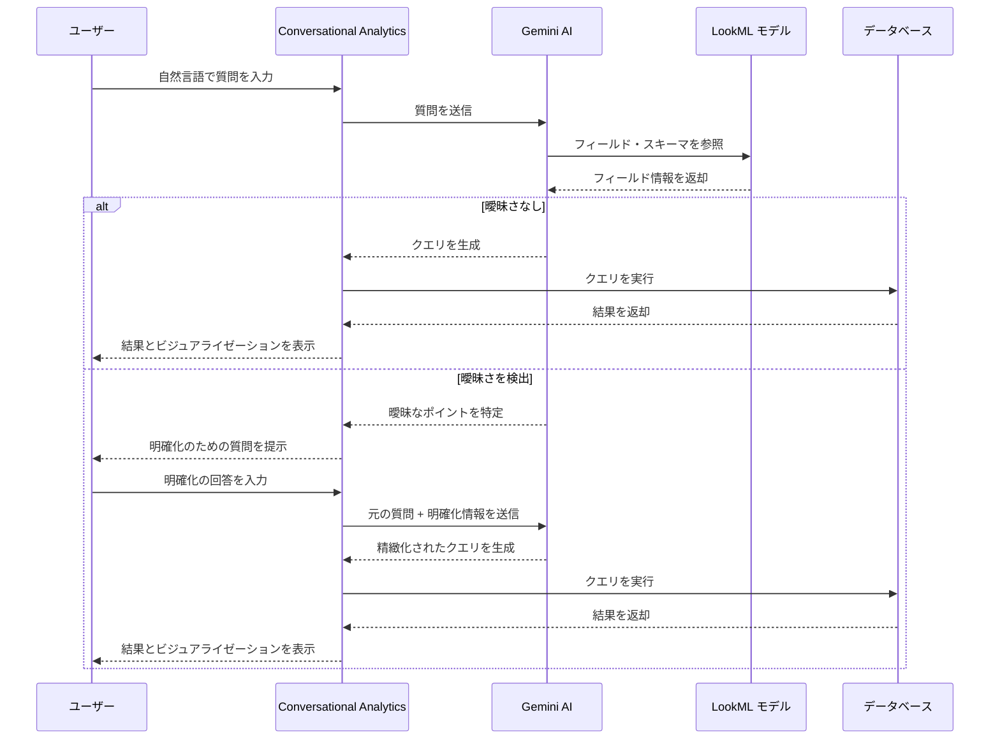

# Looker: Conversational Analytics 明確化質問機能 (Looker 26.6)

**リリース日**: 2026-03-26

**サービス**: Looker

**機能**: Conversational Analytics clarification questions (Looker 26.6)

**ステータス**: Feature

:bar_chart: [このアップデートのインフォグラフィックを見る](https://takech9203.github.io/google-cloud-news-summary/20260326-looker-conversational-analytics-clarification.html)

## 概要

Looker 26.6 の一部として、Conversational Analytics にクエリの曖昧さを検出し、ユーザーに明確化のための質問を返す機能が追加された。これまで Conversational Analytics は、ユーザーの自然言語による質問をそのまま解釈してクエリを生成・実行していたが、今回のアップデートにより、曖昧な表現や複数の解釈が可能な質問に対して、システム側からユーザーに確認を求めるインタラクションが導入される。

この機能は、Gemini for Google Cloud を基盤とする Conversational Analytics の精度と信頼性を大幅に向上させるものであり、特にデータモデルに多数のフィールドや類似した名称のディメンションが存在する環境において効果が高い。対象ユーザーは、Looker で Conversational Analytics を利用するデータアナリスト、ビジネスユーザー、および Conversational Analytics のデータエージェントを構築する管理者・LookML 開発者である。

**アップデート前の課題**

- ユーザーの質問に曖昧さがある場合でも、Conversational Analytics は独自に解釈してクエリを生成・実行しており、意図と異なる結果が返されることがあった
- 誤った解釈に基づくクエリ結果が表示された場合、ユーザーは質問を言い換えて再度試行する必要があり、試行錯誤のコストが発生していた
- LookML モデルに類似したフィールド名やラベルが存在する場合、どのフィールドが選択されるかがユーザーにとって不透明であった
- 曖昧さの回避は、データエージェントのインストラクションや LookML の description/synonyms パラメータによる事前定義に依存しており、全てのケースをカバーすることは困難だった

**アップデート後の改善**

- Conversational Analytics がクエリの曖昧さを自動的に検出し、ユーザーに明確化のための質問を提示するようになった
- ユーザーは明確化質問に回答することで、意図に沿ったクエリ結果を初回で得られる可能性が高まった
- 不要な再試行や質問の言い換えが減少し、データ分析のワークフロー効率が向上した
- LookML モデルやエージェントインストラクションで全ての曖昧性を事前定義する負担が軽減された

## アーキテクチャ図



ユーザーの質問に曖昧さがある場合、Conversational Analytics は直接クエリを実行せず、明確化質問をユーザーに提示する。ユーザーの回答を受け取った後、元の質問と合わせて精緻化されたクエリを生成・実行する。

## サービスアップデートの詳細

### 主要機能

1. **曖昧さの自動検出**
   - Gemini AI がユーザーの自然言語クエリを解析し、複数の解釈が可能な表現や不明確なフィールド参照を自動的に特定する
   - LookML モデルのスキーマ情報 (フィールドのラベル、説明、シノニム) と照合し、曖昧性の有無を判定する

2. **明確化質問の生成と提示**
   - 検出された曖昧さに基づき、ユーザーの意図を特定するための質問を自然言語で生成する
   - 例えば「売上」という質問に対して、「総売上 (Total Revenue) と純売上 (Net Revenue) のどちらを指していますか?」のような選択肢付きの質問が提示される

3. **コンテキストを保持した精緻化クエリ生成**
   - ユーザーの明確化回答は、元の質問のコンテキストと統合され、精度の高いクエリが生成される
   - マルチターン会話の既存機能と連携し、会話履歴を考慮した上で曖昧さが判定される

## 技術仕様

### 対応環境

| 項目 | 詳細 |
|------|------|
| 対応プラットフォーム | Looker (Google Cloud core)、Looker (original) |
| Looker バージョン | 26.6 以降 |
| 基盤 AI モデル | Gemini for Google Cloud |
| 対応データソース | Conversational Analytics が対応する全ての Explore およびデータエージェント |
| 会話モード | マルチターン会話に対応 |

### Conversational Analytics の質問処理フロー

Conversational Analytics は、ユーザーの質問を受け取ると以下のステップで処理する:

1. 自然言語の解析と意図の推定
2. LookML モデルのスキーマ参照 (フィールド、ラベル、description、synonyms)
3. 曖昧さの検出 (フィールド名の重複、用語の多義性、フィルタ条件の不足など)
4. 曖昧さがある場合: 明確化質問を生成してユーザーに提示
5. 曖昧さがない場合 / 明確化回答を受領した場合: クエリを生成・実行

## メリット

### ビジネス面

- **分析精度の向上**: 曖昧な質問に対して確認プロセスを挟むことで、誤った分析結果に基づく意思決定のリスクを低減できる
- **セルフサービス BI の促進**: 技術的なバックグラウンドを持たないビジネスユーザーでも、対話的なやり取りを通じて正確なデータを取得しやすくなる
- **分析ワークフローの効率化**: 質問の再入力や結果の再確認にかかる時間を削減し、インサイト取得までの時間を短縮できる

### 技術面

- **LookML 設定負荷の軽減**: 曖昧さの解消がランタイムで行われるため、LookML の description や synonyms で全てのケースをカバーする必要性が緩和される
- **データエージェント設計の簡素化**: エージェントインストラクションで曖昧なケースのハンドリングを事前定義する負担が軽減される
- **マルチターン会話との統合**: 既存の会話コンテキスト保持機能と自然に連携し、追加の設定なしで利用可能である

## デメリット・制約事項

### 制限事項

- 明確化質問が挟まれることで、単純なクエリの場合はレスポンス時間が増加する可能性がある
- Conversational Analytics の既存の制限事項 (ピボット非対応、カスタムフィールド生成非対応など) は引き続き適用される
- 明確化質問の精度は LookML モデルの品質 (フィールドのラベル、description の充実度) に依存する

### 考慮すべき点

- LookML モデルのベストプラクティス (明確なラベル、適切な description、不要フィールドの非表示) に従うことで、不要な明確化質問の発生を最小化できる
- データエージェントのインストラクションで default behavior を定義しておくと、曖昧さの検出精度が向上する
- Preview 機能として提供される場合、本番環境での利用にあたっては Pre-GA 条件が適用される可能性がある

## ユースケース

### ユースケース 1: フィールド名の曖昧さ解消

**シナリオ**: マーケティングチームのアナリストが「先月のコンバージョン数を教えて」と質問した。しかし、LookML モデルには「Web コンバージョン」「アプリコンバージョン」「トータルコンバージョン」の 3 つの measure が存在する。

**対話の流れ**:
```
ユーザー: 先月のコンバージョン数を教えて

Conversational Analytics: コンバージョン数について確認させてください。
以下のどのコンバージョンを指していますか?
- Web コンバージョン (orders.web_conversions)
- アプリコンバージョン (orders.app_conversions)
- トータルコンバージョン (orders.total_conversions)

ユーザー: トータルコンバージョンです

Conversational Analytics: 先月のトータルコンバージョン数は 12,450 件です。
[テーブルビジュアライゼーション]
```

**効果**: ユーザーが意図しないフィールドのデータを受け取るリスクが排除され、正確な分析結果を初回の対話で取得できる。

### ユースケース 2: フィルタ条件の不足に対する確認

**シナリオ**: 営業チームのマネージャーが「売上トップ 10 の顧客を表示して」と質問した。期間、地域、売上の種類 (粗利 or 純売上) が指定されていない。

**対話の流れ**:
```
ユーザー: 売上トップ 10 の顧客を表示して

Conversational Analytics: クエリをより正確にするため、以下を確認させてください:
- 対象期間はいつですか? (例: 今月、今四半期、今年度)
- 売上は総売上 (Gross Revenue) と純売上 (Net Revenue) の
  どちらを基準にしますか?

ユーザー: 今四半期の総売上でお願いします

Conversational Analytics: 今四半期の総売上トップ 10 の顧客は以下の通りです。
[棒グラフビジュアライゼーション]
```

**効果**: 不完全な条件指定による不正確な結果の取得を防ぎ、ユーザーの分析意図に沿った結果を提供できる。

## 関連サービス・機能

- **Gemini for Google Cloud**: Conversational Analytics の基盤となる AI モデル。質問の解釈、曖昧さの検出、明確化質問の生成を担当する
- **Conversational Analytics データエージェント**: カスタムインストラクションにより、明確化質問の精度を向上させる。デフォルト動作の定義やゴールデンクエリとの併用が推奨される
- **LookML**: フィールドの label、description、synonyms パラメータが曖昧さ検出の精度に直接影響する
- **Code Interpreter**: Conversational Analytics 内で Python ベースの高度な分析を実行する機能。明確化質問により得られた正確なクエリ結果に対して、さらに複雑な分析を適用可能

## 参考リンク

- :bar_chart: [インフォグラフィック](https://takech9203.github.io/google-cloud-news-summary/20260326-looker-conversational-analytics-clarification.html)
- [公式リリースノート](https://cloud.google.com/looker/docs/release-notes)
- [Conversational Analytics の使い方](https://cloud.google.com/looker/docs/conversational-analytics-looker-data)
- [Conversational Analytics のベストプラクティス](https://cloud.google.com/looker/docs/conversational-analytics-looker-best-practices)
- [データエージェントの作成と管理](https://cloud.google.com/looker/docs/conversational-analytics-looker-data-agents)
- [Conversational Analytics の概要](https://cloud.google.com/looker/docs/conversational-analytics-overview)

## まとめ

Looker 26.6 の Conversational Analytics 明確化質問機能は、自然言語によるデータ分析の精度と信頼性を向上させる重要なアップデートである。曖昧な質問に対してシステムが能動的に確認を行うことで、誤解釈に基づく不正確な分析結果のリスクが大幅に低減される。Conversational Analytics を利用している組織は、LookML モデルのベストプラクティス (明確なラベル、充実した description、不要フィールドの非表示) を改めて確認し、この新機能の効果を最大化することが推奨される。

---

**タグ**: #Looker #ConversationalAnalytics #Gemini #NaturalLanguageQuery #BI #Looker26.6
