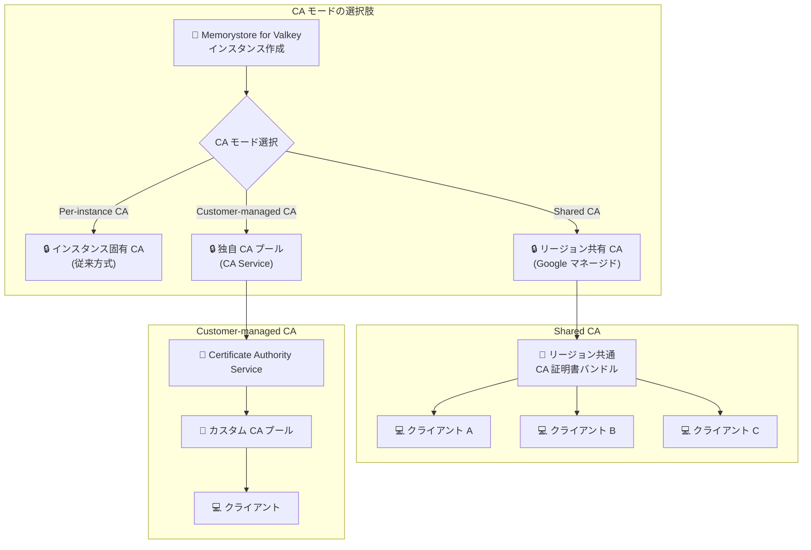

# Memorystore for Valkey: 新しい CA モード - Shared CA / Customer-managed CA (Preview)

**リリース日**: 2026-03-26

**サービス**: Memorystore for Valkey

**機能**: 新しい CA モード - Shared CA および Customer-managed CA (Preview)

**ステータス**: Preview

📊 [このアップデートのインフォグラフィックを見る](https://takech9203.github.io/google-cloud-news-summary/20260326-memorystore-valkey-ca-modes.html)

## 概要

Memorystore for Valkey の転送中暗号化 (in-transit encryption) において、従来のインスタンスごとの CA (Per-instance CA) モードに加えて、2 つの新しい認証局 (CA) モードが Preview として利用可能になった。**Shared CA** は Google が管理するリージョン単位の CA インフラストラクチャを使用し、リージョン内のすべてのインスタンスで 1 つの CA 証明書バンドルを共有する。**Customer-managed CA** は Certificate Authority Service (CA Service) 上でホストされている独自の CA プールを使用できるモードである。

これらの新しい CA モードにより、大規模な Memorystore for Valkey デプロイメントにおける証明書管理の運用負荷を大幅に軽減できる。特に、数十から数百のインスタンスを運用する環境では、Shared CA によりリージョン内の証明書管理が一元化され、Customer-managed CA により企業の既存の PKI (Public Key Infrastructure) との統合が容易になる。

**アップデート前の課題**

- 各インスタンスに固有の CA が割り当てられる Per-instance CA モードのみが利用可能であり、インスタンスごとに異なる CA 証明書をクライアントにインストール・管理する必要があった
- 大規模環境でインスタンス数が増加するほど、CA 証明書の管理・ローテーション作業が煩雑になっていた
- 企業独自の CA を利用した証明書管理ポリシーの適用ができず、組織のセキュリティ要件との整合性を取ることが難しかった

**アップデート後の改善**

- Shared CA モードにより、リージョン内のすべてのインスタンスで 1 つの CA 証明書バンドルを共有でき、証明書管理が大幅に簡素化された
- Customer-managed CA モードにより、Certificate Authority Service 上の独自 CA プールを使用して、企業の PKI ポリシーに準拠した証明書管理が可能になった
- インスタンス数に依存しない効率的な証明書管理ワークフローが実現された

## アーキテクチャ図



Memorystore for Valkey の 3 つの CA モードの構成を示す。Shared CA はリージョン内で共通の CA 証明書バンドルを使用し、Customer-managed CA は Certificate Authority Service と連携して独自の CA プールによる証明書管理を実現する。

## サービスアップデートの詳細

### 主要機能

1. **Per-instance CA (従来モード)**
   - 各 Memorystore for Valkey インスタンスに固有の CA が自動的に割り当てられる
   - インスタンスごとに個別の CA 証明書をクライアントにインストールする必要がある
   - CA は作成から 10 年間有効

2. **Shared CA (新規 - Preview)**
   - Google が管理するリージョン単位の CA インフラストラクチャを使用
   - 同一リージョン内のすべてのインスタンスで 1 つの CA 証明書バンドルを共有
   - クライアント側で管理する証明書が 1 セットで済むため、大規模環境での運用が大幅に簡素化される

3. **Customer-managed CA (新規 - Preview)**
   - Certificate Authority Service (CA Service) 上でホストされている独自の CA プールを使用
   - 企業の既存 PKI ポリシーに準拠した証明書管理が可能
   - CA プールのライフサイクル管理を完全に制御できる

## 技術仕様

### CA モード比較

| 項目 | Per-instance CA | Shared CA | Customer-managed CA |
|------|----------------|-----------|---------------------|
| CA 管理主体 | Google (インスタンスごと) | Google (リージョンごと) | ユーザー (CA Service) |
| 証明書バンドル | インスタンスごとに固有 | リージョン内で共通 | CA プールに基づく |
| CA ローテーション | 自動 (10 年周期) | Google が管理 | ユーザーが管理 |
| ステータス | GA | Preview | Preview |
| 適した環境 | 小規模/個別管理 | 大規模/統一管理 | 企業 PKI 統合 |

### TLS 要件

| 項目 | 詳細 |
|------|------|
| サポートされる TLS バージョン | TLS 1.2 以上 |
| 暗号化の有効化タイミング | インスタンス作成時のみ |
| サーバー証明書ローテーション | 毎週自動実行 |
| クライアント要件 | TLS 対応クライアントまたは Stunnel 等のサイドカー |

## 設定方法

### 前提条件

1. Google Cloud プロジェクトで Memorystore API が有効化されていること
2. サービス接続ポリシー (Service Connection Policy) がネットワークに設定されていること
3. Customer-managed CA を使用する場合は Certificate Authority Service API が有効化されていること
4. Customer-managed CA を使用する場合は CA プールが作成済みであること

### 手順

#### ステップ 1: Per-instance CA でのインスタンス作成 (従来方式)

```bash
gcloud memorystore instances create my-instance \
  --location=us-central1 \
  --endpoints='[{"connections": [{"pscAutoConnection": {"network": "projects/my-project/global/networks/my-network", "projectId": "my-project"}}]}]' \
  --replica-count=1 \
  --node-type=highmem-medium \
  --shard-count=3 \
  --transit-encryption-mode=server-authentication
```

従来の Per-instance CA モードでは、`--transit-encryption-mode=server-authentication` を指定してインスタンスを作成する。

#### ステップ 2: CA 証明書の取得

```bash
gcloud memorystore instances get-certificate-authority my-instance \
  --location=us-central1
```

インスタンスの CA 証明書を取得し、クライアントにインストールする。Shared CA モードの場合は、同一リージョン内の全インスタンスで同じ証明書バンドルが返却される。

#### ステップ 3: クライアントへの CA 証明書インストール

```bash
# CA 証明書をファイルに保存
sudo vim /tmp/server_ca.pem

# TLS 対応クライアントで接続
# ポート 6379、CA 証明書ファイルを指定して接続
```

取得した CA 証明書をクライアントマシンにインストールし、TLS 接続を設定する。

## メリット

### ビジネス面

- **運用コストの削減**: Shared CA により、大規模環境での証明書管理工数が大幅に削減される。インスタンス数に比例して増加していた管理コストが、リージョン単位の固定コストに変わる
- **コンプライアンス対応の強化**: Customer-managed CA により、企業の PKI ポリシーや業界規制に準拠した証明書管理が可能になる

### 技術面

- **証明書管理の簡素化**: Shared CA ではリージョン内で 1 つの CA 証明書バンドルを管理するだけでよく、クライアント設定の一貫性が向上する
- **PKI 統合の柔軟性**: Customer-managed CA により Certificate Authority Service の豊富な機能 (証明書テンプレート、発行ポリシー、監査ログなど) を活用できる
- **セキュリティ制御の向上**: 独自 CA を使用することで、証明書のライフサイクル全体を企業のセキュリティチームが管理可能

## デメリット・制約事項

### 制限事項

- Shared CA と Customer-managed CA はいずれも Preview ステータスであり、本番環境での使用には注意が必要
- 転送中暗号化はインスタンス作成時にのみ有効化可能であり、既存インスタンスの CA モードは変更できない
- CA モードの変更にはインスタンスの再作成が必要

### 考慮すべき点

- Customer-managed CA を使用する場合、CA Service の追加料金が発生する (CA プールの維持費、証明書発行費用)
- Shared CA はリージョン単位の共有であるため、リージョンをまたぐ環境ではリージョンごとに異なる CA 証明書バンドルの管理が必要
- Preview 機能のため、GA 時に仕様変更が発生する可能性がある

## ユースケース

### ユースケース 1: マイクロサービスアーキテクチャでの大規模キャッシュ管理

**シナリオ**: 複数のマイクロサービスが同一リージョン内の数十の Memorystore for Valkey インスタンスに接続するアーキテクチャにおいて、Shared CA を使用して証明書管理を統一する。

**効果**: クライアント側で管理する CA 証明書が 1 セットに集約され、新規インスタンス追加時もクライアント設定の変更が不要になる。証明書ローテーション時の影響範囲も明確化される。

### ユースケース 2: 金融機関での規制準拠

**シナリオ**: 金融機関が社内 PKI ポリシーに基づき、すべてのインフラストラクチャコンポーネントの証明書を自社管理の CA から発行する必要がある場合に、Customer-managed CA を使用して Certificate Authority Service 上の CA プールと統合する。

**効果**: 規制要件に準拠した証明書管理が実現され、監査ログや証明書のライフサイクル管理を Certificate Authority Service の機能で一元的に実施できる。

## 料金

Memorystore for Valkey 自体の料金は CA モードによる追加課金はない。ノードタイプとリージョンに基づく標準的な料金体系が適用される。

### 料金例

| ノードタイプ | us-central1 (1 ノードあたり/時間) |
|------------|----------------------------------|
| shared-core-nano | 開発/テスト用 (SLA なし) |
| standard-small | 標準ワークロード向け |
| highmem-medium | 約 $0.154/時間 |
| highmem-xlarge | 大規模ワークロード向け |

- CUD (Committed Use Discounts) で 1 年契約: 20% 割引、3 年契約: 40% 割引が利用可能
- Customer-managed CA を使用する場合は、Certificate Authority Service の料金が別途発生する

詳細は [Memorystore for Valkey 料金ページ](https://cloud.google.com/memorystore/valkey/pricing) を参照。

## 利用可能リージョン

Memorystore for Valkey がサポートするすべてのリージョンで利用可能。詳細は [Memorystore for Valkey ロケーション](https://cloud.google.com/memorystore/docs/valkey/locations) を参照。

## 関連サービス・機能

- **Certificate Authority Service (CA Service)**: Customer-managed CA モードで使用する CA プールをホストするサービス。プライベート CA の作成・管理・自動化を提供する
- **Cloud Key Management Service (Cloud KMS)**: CMEK (Customer-Managed Encryption Keys) による保存時暗号化に使用。CA Service の CA 署名鍵の保管にも利用される
- **Private Service Connect (PSC)**: Memorystore for Valkey インスタンスへのネットワーク接続に使用
- **Cloud Monitoring / Cloud Logging**: Memorystore for Valkey インスタンスの監視とログ管理

## 参考リンク

- 📊 [インフォグラフィック](https://takech9203.github.io/google-cloud-news-summary/20260326-memorystore-valkey-ca-modes.html)
- [公式リリースノート](https://cloud.google.com/release-notes#March_26_2026)
- [Memorystore for Valkey - 転送中暗号化について](https://cloud.google.com/memorystore/docs/valkey/about-in-transit-encryption)
- [Memorystore for Valkey - 転送中暗号化の管理](https://cloud.google.com/memorystore/docs/valkey/manage-in-transit-encryption)
- [Certificate Authority Service の概要](https://cloud.google.com/certificate-authority-service/docs/ca-service-overview)
- [Memorystore for Valkey 料金ページ](https://cloud.google.com/memorystore/valkey/pricing)

## まとめ

Memorystore for Valkey に Shared CA と Customer-managed CA の 2 つの新しい CA モードが Preview で追加されたことで、大規模環境での証明書管理と企業 PKI との統合が大幅に改善された。特に多数のインスタンスを運用する環境では Shared CA の導入を、企業独自のセキュリティポリシーへの準拠が求められる環境では Customer-managed CA の検討を推奨する。現在 Preview ステータスのため、本番導入前に GA 化を待つか、十分なテストを行った上で導入を判断することが望ましい。

---

**タグ**: #Memorystore #Valkey #Security #InTransitEncryption #CertificateAuthority #CAS #Preview
