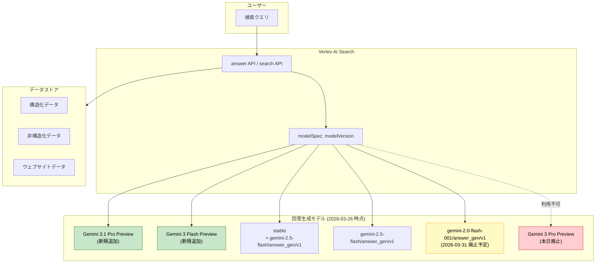

# Vertex AI Search: 回答生成モデルの更新 - Gemini 3.1 Pro / Gemini 3 Flash 追加、Gemini 3 Pro 廃止

**リリース日**: 2026-03-26

**サービス**: Vertex AI Search

**機能**: Gemini 3.1 Pro および Gemini 3 Flash による回答生成 (Preview) / Gemini 3 Pro の廃止

**ステータス**: Preview (新モデル) / Discontinued (Gemini 3 Pro)

[このアップデートのインフォグラフィックを見る](https://takech9203.github.io/google-cloud-news-summary/20260326-vertex-ai-search-answer-generation-model-update.html)

## 概要

Vertex AI Search の回答生成機能において、2 つの重要なモデル更新が行われた。まず、Gemini 3.1 Pro (Preview) および Gemini 3 Flash (Preview) が新たに回答生成モデルとして利用可能になった。これにより、ユーザーは最新世代の Gemini モデルを活用して、より高品質な検索回答を生成できるようになる。

同時に、Gemini 3 Pro (Preview) が廃止され、回答生成に利用できなくなった。Gemini 3 Pro の廃止日は 2026 年 3 月 26 日であり、本日をもって利用不可となる。Gemini 3 Pro を使用していたユーザーは、後継モデルである Gemini 3.1 Pro へのアップグレードが必要である。

この更新は、Vertex AI Search の answer メソッドおよび search summaries を使用するすべてのカスタム検索アプリケーションに影響する。Solutions Architect やアプリケーション開発者は、現在使用しているモデルバージョンを確認し、必要に応じて移行計画を立てる必要がある。

**アップデート前の課題**

- Gemini 3 Pro (Preview) は回答生成に利用可能であったが、より新しいモデルへの移行パスが提供されていなかった
- Vertex AI Search の回答生成で利用可能な最新モデルは Gemini 3 Pro にとどまっていた
- Flash 系モデル (高速・低コスト) の最新世代が Vertex AI Search の回答生成では選択できなかった

**アップデート後の改善**

- Gemini 3.1 Pro (Preview) が利用可能になり、最先端の推論能力を活用した高品質な回答生成が可能になった
- Gemini 3 Flash (Preview) が利用可能になり、高速かつコスト効率の良い回答生成の選択肢が追加された
- Gemini 3 Pro が廃止されたことで、モデルラインナップが整理され、最新モデルへの移行が促進される

## アーキテクチャ図



Vertex AI Search の回答生成で利用可能なモデルの構成を示す。緑色が今回新規追加されたモデル、赤色が廃止されたモデル、黄色が近日中に廃止予定のモデルである。

## サービスアップデートの詳細

### 主要機能

1. **Gemini 3.1 Pro (Preview) の追加**
   - Vertex AI Search の answer メソッドおよび search summaries で利用可能
   - Gemini 3.1 Pro は最先端の推論モデルであり、複雑な質問応答タスクに最適化されている
   - 1M トークンのコンテキストウィンドウを持つ Gemini 3.1 Pro をベースに、質問応答タスク向けにさらにチューニングされている
   - 2026 年 2 月 19 日に Vertex AI で Preview として公開されたモデルの、Vertex AI Search 対応版

2. **Gemini 3 Flash (Preview) の追加**
   - 高速かつコスト効率の良い回答生成が可能な Flash 系モデル
   - レイテンシに敏感なユースケースや、大量のクエリを処理する必要がある場面に適している
   - Pro モデルと比較して、より低コストで回答を生成できる

3. **Gemini 3 Pro (Preview) の廃止**
   - モデルバージョン `gemini-3.0-pro-preview/answer_gen/v1` は 2026 年 3 月 26 日をもって廃止
   - Vertex AI のモデルライフサイクルポリシーに基づき、次バージョンのリリースから 6 か月後に廃止される
   - 後継モデルとして Gemini 3.1 Pro への移行が推奨される

## 技術仕様

### 回答生成モデルバージョン一覧 (2026-03-26 時点)

| モデルバージョン | 説明 | コンテキストウィンドウ | 廃止予定日 |
|------|------|------|------|
| stable | デフォルトモデル。現在は gemini-2.5-flash/answer_gen/v1 を指す | 128K | 2026-06-17 |
| gemini-3.1-pro-preview/answer_gen/v1 | Gemini 3.1 Pro ベース (新規) | - | - |
| gemini-3-flash-preview/answer_gen/v1 | Gemini 3 Flash ベース (新規) | - | - |
| gemini-2.5-flash/answer_gen/v1 | Gemini 2.5 Flash ベース (凍結済み) | 128K | 2026-06-17 |
| gemini-2.0-flash-001/answer_gen/v1 | Gemini 2.0 Flash ベース (凍結済み) | 128K | 2026-03-31 |
| preview | プレビューモデル。変更される可能性あり | 128K | 2026-06-17 |
| ~~gemini-3.0-pro-preview/answer_gen/v1~~ | ~~Gemini 3 Pro ベース~~ (廃止) | ~~128K~~ | **2026-03-26 (本日)** |

### API でのモデル指定方法

```bash
curl -X POST \
  -H "Authorization: Bearer $(gcloud auth print-access-token)" \
  -H "Content-Type: application/json" \
  "https://discoveryengine.googleapis.com/v1/projects/PROJECT_ID/locations/global/collections/default_collection/engines/APP_ID/servingConfigs/default_search:answer" \
  -d '{
    "query": {
      "text": "検索クエリ"
    },
    "answerGenerationSpec": {
      "modelSpec": {
        "modelVersion": "gemini-3.1-pro-preview/answer_gen/v1"
      }
    }
  }'
```

## 設定方法

### 前提条件

1. Google Cloud プロジェクトで Vertex AI Search (AI Applications) が有効であること
2. カスタム検索アプリケーションが作成済みであること
3. データストア (構造化、非構造化、またはウェブサイト) が接続済みであること

### 手順

#### ステップ 1: 現在使用中のモデルバージョンを確認

現在のアプリケーションで `gemini-3.0-pro-preview/answer_gen/v1` を明示的に指定している場合、本日以降エラーが発生する可能性がある。answer メソッドの `answerGenerationSpec.modelSpec.modelVersion` パラメータを確認する。

#### ステップ 2: モデルバージョンを更新

```bash
# Gemini 3.1 Pro に移行する場合
curl -X POST \
  -H "Authorization: Bearer $(gcloud auth print-access-token)" \
  -H "Content-Type: application/json" \
  "https://discoveryengine.googleapis.com/v1/projects/PROJECT_ID/locations/global/collections/default_collection/engines/APP_ID/servingConfigs/default_search:answer" \
  -d '{
    "query": {
      "text": "テストクエリ"
    },
    "answerGenerationSpec": {
      "modelSpec": {
        "modelVersion": "gemini-3.1-pro-preview/answer_gen/v1"
      }
    }
  }'
```

#### ステップ 3: 回答品質の検証

モデル変更後は、代表的なクエリで回答品質を検証することを推奨する。特に、Gemini 3 Pro から Gemini 3.1 Pro への移行では、回答の精度や文体に変化が生じる可能性がある。

## メリット

### ビジネス面

- **最新モデルによる回答品質向上**: Gemini 3.1 Pro は前世代比で推論能力が向上しており、より正確で包括的な回答を生成できる
- **コスト最適化の選択肢**: Gemini 3 Flash の追加により、精度とコストのバランスを要件に応じて選択できるようになった
- **ユーザー体験の向上**: Flash モデルの低レイテンシにより、エンドユーザーへの回答表示速度が改善される

### 技術面

- **モデル選択の柔軟性**: Pro (高精度) と Flash (高速・低コスト) の 2 つの最新モデルから選択可能
- **最新の推論能力**: Gemini 3.1 Pro の 1M トークンコンテキストウィンドウにより、大量のドキュメントを参照した回答生成が可能
- **ライフサイクル管理の明確化**: モデルの廃止スケジュールが事前に公開されており、計画的な移行が可能

## デメリット・制約事項

### 制限事項

- 新モデル (Gemini 3.1 Pro、Gemini 3 Flash) は Preview ステータスであり、本番環境での利用には Pre-GA の利用規約が適用される
- Preview モデルは変更される可能性があり、回答の一貫性が保証されない場合がある
- Gemini 3 Pro を使用していたアプリケーションは即座にモデル変更が必要 (本日廃止のため)

### 考慮すべき点

- `stable` モデルは現在 `gemini-2.5-flash/answer_gen/v1` を指しており、新モデルへの自動切り替えは行われない
- `gemini-2.0-flash-001/answer_gen/v1` も 2026 年 3 月 31 日に廃止予定であり、このモデルを使用している場合も早急な移行が必要
- 医療 (Healthcare) データストアでは answer メソッドの利用に制限がある

## ユースケース

### ユースケース 1: 社内ナレッジベースの検索回答を高品質化

**シナリオ**: 社内ドキュメント (マニュアル、FAQ、技術仕様書) を Vertex AI Search に取り込み、従業員からの質問に対して AI 生成の回答を提供しているシステムで、Gemini 3.1 Pro に切り替えることで回答精度を向上させる。

**実装例**:
```json
{
  "answerGenerationSpec": {
    "modelSpec": {
      "modelVersion": "gemini-3.1-pro-preview/answer_gen/v1"
    }
  }
}
```

**効果**: 複雑な技術的質問や、複数のドキュメントにまたがる情報を統合した回答の品質が向上する。

### ユースケース 2: EC サイトの商品検索における高速回答

**シナリオ**: EC サイトの商品カタログを Vertex AI Search に接続し、ユーザーの自然言語クエリに対して商品推薦と説明を生成するシステムで、Gemini 3 Flash に切り替えてレイテンシを削減する。

**効果**: 大量の同時アクセスがある EC サイトにおいて、回答生成のレイテンシが削減され、ユーザー体験が向上する。コスト面でも Flash モデルの方が有利になる可能性がある。

## 料金

Vertex AI Search の回答生成における料金は、使用する料金モデル (General または Configurable) によって異なる。

- **General モデル**: 従量課金 (pay-as-you-go) ベース
- **Configurable モデル**: サブスクリプションベース。AI overview アドオンで生成機能が有効になる

回答生成に使用するモデルの変更自体に追加料金は発生しないが、モデルによって処理コストが異なる可能性がある。詳細は料金ページを参照。

## 利用可能リージョン

Vertex AI Search はグローバルロケーション (`global`) で利用可能。回答生成モデルの利用可能リージョンについては、Vertex AI Search のドキュメントを参照。

## 関連サービス・機能

- **Vertex AI (Gemini モデル)**: Vertex AI Search の回答生成モデルのベースとなる LLM。Gemini 3.1 Pro は 2026 年 2 月 19 日に Vertex AI で Preview として公開されている
- **Vertex AI Search - Stream Answers**: 回答をストリーミングで返す機能 (GA)。モデル変更と組み合わせて利用可能
- **Vertex AI Search - MCP Server**: Model Context Protocol サーバー (Public Preview) を通じた検索アクセス
- **Gemini Enterprise**: Vertex AI Search と同様の回答生成モデルバージョンを使用。StreamAssist 経由での利用が推奨されている

## 参考リンク

- [インフォグラフィック](https://takech9203.github.io/google-cloud-news-summary/20260326-vertex-ai-search-answer-generation-model-update.html)
- [公式リリースノート](https://cloud.google.com/release-notes#March_26_2026)
- [回答生成モデルバージョンとライフサイクル](https://cloud.google.com/generative-ai-app-builder/docs/answer-generation-models)
- [回答とフォローアップの取得](https://cloud.google.com/generative-ai-app-builder/docs/answer)
- [Gemini 3.1 Pro](https://cloud.google.com/vertex-ai/generative-ai/docs/models/gemini/3-1-pro)
- [Vertex AI Search の料金](https://cloud.google.com/generative-ai-app-builder/pricing)
- [Vertex AI モデルライフサイクルポリシー](https://cloud.google.com/vertex-ai/generative-ai/docs/learn/model-versioning)

## まとめ

Vertex AI Search の回答生成モデルにおいて、Gemini 3.1 Pro と Gemini 3 Flash が Preview として新たに利用可能になり、同時に Gemini 3 Pro が廃止された。Gemini 3 Pro を使用しているユーザーは、即座に Gemini 3.1 Pro への移行が必要である。また、gemini-2.0-flash-001 も 2026 年 3 月 31 日に廃止予定であるため、あわせて最新モデルへの移行を計画することを推奨する。

---

**タグ**: #VertexAISearch #Gemini #AnswerGeneration #ModelUpdate #Preview #Discontinued
