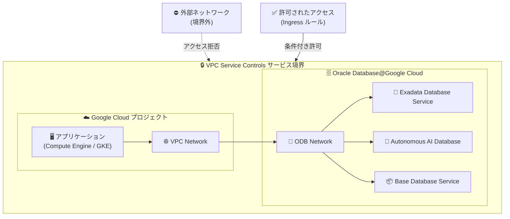

# VPC Service Controls: Oracle Database@Google Cloud 統合の GA サポート

**リリース日**: 2026-03-26

**サービス**: VPC Service Controls

**機能**: Oracle Database@Google Cloud 統合の General Availability サポート

**ステータス**: GA

📊 [このアップデートのインフォグラフィックを見る](https://takech9203.github.io/google-cloud-news-summary/20260326-vpc-service-controls-oracle-database.html)

## 概要

VPC Service Controls が Oracle Database@Google Cloud との統合を General Availability (GA) としてサポート開始した。これにより、Oracle Database@Google Cloud リソースの周囲にサービス境界 (Service Perimeter) を作成し、データ漏洩リスクを軽減できるようになった。

Oracle Database@Google Cloud は、Google Cloud データセンター内で OCI Exadata ハードウェア上に Oracle データベースサービスをデプロイできる、Oracle と Google の共同ソリューションである。今回の VPC Service Controls 統合により、Exadata Database Service、Autonomous AI Database Service、Base Database Service、Exascale Infrastructure などの Oracle Database@Google Cloud リソースに対して、Google Cloud のセキュリティ境界による保護が本番環境で完全にサポートされる。

エンタープライズ環境で Oracle データベースを Google Cloud 上で運用する組織にとって、VPC Service Controls による保護はコンプライアンス要件を満たし、機密データの外部流出を防止するために重要な機能である。

**アップデート前の課題**

- Oracle Database@Google Cloud リソースを VPC Service Controls のサービス境界で保護する機能が GA として提供されていなかった
- Oracle データベースリソースへのアクセス制御は IAM とネットワークセキュリティグループのみに依存しており、データ漏洩防止の多層防御が限定的だった
- 規制要件の厳しい業界では、VPC Service Controls による保護なしでは Oracle Database@Google Cloud の本番環境導入にセキュリティ上の懸念があった

**アップデート後の改善**

- Oracle Database@Google Cloud リソースを VPC Service Controls のサービス境界に含めることが GA として完全サポートされた
- 盗まれた認証情報による不正ネットワークからのアクセス、悪意のある内部関係者によるデータ漏洩、誤設定された IAM ポリシーによるデータ公開といったリスクを軽減できるようになった
- 本番環境での完全サポートにより、規制要件の厳しい環境でも安心して Oracle Database@Google Cloud を採用できるようになった

## アーキテクチャ図



VPC Service Controls のサービス境界が Oracle Database@Google Cloud リソースを保護し、境界外からの不正アクセスを防止する構成を示している。Ingress/Egress ルールにより、必要な外部アクセスのみを条件付きで許可できる。

## サービスアップデートの詳細

### 主要機能

1. **サービス境界による Oracle Database@Google Cloud リソースの保護**
   - Oracle Database@Google Cloud API をサービス境界の制限対象サービスとして追加可能
   - Exadata Database Service、Autonomous AI Database、Base Database Service、Exascale Infrastructure のリソースを境界内で保護
   - 境界外からの API リクエストをブロックし、データ漏洩リスクを軽減

2. **Ingress/Egress ルールによる柔軟なアクセス制御**
   - 特定のプロジェクト、サービスアカウント、IP 範囲からの境界越えアクセスを条件付きで許可
   - Dry Run モードで事前にアクセスパターンを確認し、本番適用前に影響を評価可能
   - Agent ID や SPIFFE 形式のワークフォースおよびワークロード ID もサポート (Preview)

3. **Shared VPC デプロイメントとの統合**
   - Shared VPC 構成で Oracle Database@Google Cloud を使用する場合、ホストプロジェクトとサービスプロジェクトの両方を同じ境界に含めることで適切に保護
   - ODB Network を使用したネットワーク管理と VPC Service Controls による境界保護を組み合わせた多層防御が可能

## 技術仕様

### VPC Service Controls 統合の詳細

| 項目 | 詳細 |
|------|------|
| ステータス | GA (General Availability) |
| 保護対象 | Oracle Database@Google Cloud API |
| 境界による保護 | 対応 |
| 対象サービス | Exadata Database Service、Autonomous AI Database、Base Database Service、Exascale Infrastructure |
| Restricted VIP | 対応 |

### 必要な IAM ロール

VPC Service Controls の設定と管理には、以下の IAM ロールが必要となる。

| ロール | 説明 |
|--------|------|
| `roles/accesscontextmanager.policyAdmin` | アクセスポリシーとサービス境界の管理 |
| `roles/accesscontextmanager.policyEditor` | サービス境界の編集 |
| `roles/oracledatabase.odbNetworkAdmin` | ODB Network の管理 |
| `roles/oracledatabase.autonomousDatabaseAdmin` | Autonomous AI Database の管理 |

## 設定方法

### 前提条件

1. Google Cloud 組織レベルまたはフォルダ/プロジェクトレベルのアクセスポリシーが設定済みであること
2. Oracle Database@Google Cloud API が有効化されていること
3. VPC Service Controls の管理に必要な IAM ロールが付与されていること

### 手順

#### ステップ 1: サービス境界の作成または更新

```bash
# 既存のサービス境界に Oracle Database@Google Cloud を追加
gcloud access-context-manager perimeters update PERIMETER_ID \
  --policy=POLICY_ID \
  --add-restricted-services=oracledatabase.googleapis.com
```

`PERIMETER_ID` はサービス境界の ID、`POLICY_ID` はアクセスポリシーの ID に置き換える。

#### ステップ 2: Google Cloud コンソールからの設定

```
1. Google Cloud コンソールで VPC Service Controls ページに移動
2. 対象のサービス境界をクリック
3. [編集] をクリック
4. [サービスを追加] をクリック
5. Oracle Database@Google Cloud (oracledatabase.googleapis.com) を選択
6. [保存] をクリック
```

#### ステップ 3: Dry Run モードでの検証 (推奨)

```bash
# Dry Run モードで境界を作成し、影響を事前確認
gcloud access-context-manager perimeters dry-run create PERIMETER_ID \
  --policy=POLICY_ID \
  --restricted-services=oracledatabase.googleapis.com \
  --resources=projects/PROJECT_NUMBER
```

Dry Run モードでは実際のアクセスはブロックされず、違反ログのみが記録されるため、本番適用前の影響評価に活用できる。

## メリット

### ビジネス面

- **コンプライアンス対応の強化**: 金融、医療、政府機関などの規制要件が厳しい業界において、Oracle データベースのデータ保護要件を満たすことが容易になる
- **マルチクラウド戦略の推進**: Oracle Database@Google Cloud のセキュリティ体制が強化されることで、エンタープライズ顧客が Oracle ワークロードを Google Cloud に移行する際のセキュリティ懸念が解消される

### 技術面

- **多層防御の実現**: IAM、ネットワークセキュリティグループ、VPC Service Controls を組み合わせた多層防御アーキテクチャを構築可能
- **データ漏洩防止**: 盗まれた認証情報、悪意のある内部関係者、誤設定された IAM ポリシーによるデータ漏洩リスクを軽減
- **一元的なセキュリティ管理**: 組織レベルのアクセスポリシーにより、Oracle Database@Google Cloud を含むすべての Google Cloud サービスのセキュリティを一元管理

## デメリット・制約事項

### 制限事項

- VPC Service Controls はメタデータの移動を包括的に制御するようには設計されていない。リソースの属性 (メタデータ) は VPC Service Controls のポリシーチェックなしにアクセスされる場合がある
- Shared VPC 構成では、ホストプロジェクトとサービスプロジェクトの両方を同じサービス境界に含める必要がある。境界の分離は既存インスタンスの利用不能や新規インスタンスの作成失敗を引き起こす可能性がある

### 考慮すべき点

- サービス境界の設定を誤ると、正当なアクセスもブロックされる可能性がある。本番適用前に Dry Run モードで十分な検証を行うことを推奨
- Oracle Database@Google Cloud の OCI 側のネットワークセキュリティグループや IAM ポリシーとの整合性を確保する必要がある
- Ingress/Egress ルールの設計には、Oracle Database@Google Cloud と連携する他の Google Cloud サービス (Cloud Storage、Cloud KMS など) も考慮する必要がある

## ユースケース

### ユースケース 1: 金融機関における Oracle データベースの保護

**シナリオ**: 金融機関が Oracle Database@Google Cloud 上で顧客の金融データを管理しており、データの外部流出を防止する規制要件がある。

**実装例**:
```bash
# 金融データプロジェクトのサービス境界を作成
gcloud access-context-manager perimeters create finance-perimeter \
  --policy=POLICY_ID \
  --title="Finance Data Perimeter" \
  --restricted-services="oracledatabase.googleapis.com,storage.googleapis.com,bigquery.googleapis.com" \
  --resources="projects/FINANCE_PROJECT_NUMBER" \
  --access-levels="accessPolicies/POLICY_ID/accessLevels/corp-network"
```

**効果**: 企業ネットワーク外からの Oracle データベースへのアクセスをブロックし、金融規制のコンプライアンス要件を満たす。

### ユースケース 2: マルチチーム環境での Oracle ワークロードの分離

**シナリオ**: 複数の開発チームが Shared VPC 環境で Oracle Database@Google Cloud を利用しており、チーム間のデータ分離を確保したい。

**効果**: サービス境界と Ingress/Egress ルールにより、各チームのプロジェクトからアクセスできる Oracle データベースリソースを制限し、意図しないクロスプロジェクトアクセスを防止する。

## 料金

VPC Service Controls 自体には追加料金は発生しない。ただし、以下の関連コストを考慮する必要がある。

- **VPC Service Controls 違反ダッシュボード**: Cloud Logging リソースのデプロイと、監査ログの複製に伴うログバケットのコストが発生する
- **Oracle Database@Google Cloud**: Oracle とのライセンス契約に基づく料金が別途発生する

詳細な料金情報は以下のリンクを参照。

- [Oracle Database@Google Cloud の購入と請求](https://cloud.google.com/oracle/database/docs/purchase-and-billing)
- [Google Cloud Observability の料金](https://cloud.google.com/stackdriver/pricing)

## 利用可能リージョン

Oracle Database@Google Cloud は以下のリージョンで利用可能。VPC Service Controls はこれらすべてのリージョンで利用できる。

| リージョン | 説明 | 対応サービス |
|-----------|------|-------------|
| asia-northeast1 | 東京 | Exadata, Exascale, Base DB, Autonomous AI DB |
| asia-northeast2 | 大阪 | Exadata, Autonomous AI DB |
| asia-south1 | ムンバイ | Exadata, Autonomous AI DB |
| asia-south2 | デリー | Exadata, Autonomous AI DB |
| australia-southeast1 | シドニー | Exadata, Autonomous AI DB |
| australia-southeast2 | メルボルン | Exadata, Autonomous AI DB |
| us-central1 | アイオワ | Exadata, Exascale, Base DB, Autonomous AI DB |
| us-east4 | 北バージニア | Exadata, Exascale, Base DB, Autonomous AI DB |
| us-west3 | ソルトレイクシティ | Exadata, Exascale, Base DB, Autonomous AI DB |
| northamerica-northeast1 | モントリオール | Exadata, Exascale, Base DB, Autonomous AI DB |
| northamerica-northeast2 | トロント | Exadata, Autonomous AI DB |
| southamerica-east1 | サンパウロ | Exadata, Autonomous AI DB |
| europe-west2 | ロンドン | Exadata, Exascale, Base DB, Autonomous AI DB |
| europe-west3 | フランクフルト | Exadata, Exascale, Base DB, Autonomous AI DB |
| europe-west8 | ミラノ | Exadata, Autonomous AI DB |

## 関連サービス・機能

- **[Oracle Database@Google Cloud](https://cloud.google.com/oracle/database/docs/overview)**: Google Cloud データセンター内で OCI Exadata ハードウェア上に Oracle データベースをデプロイするサービス。今回の VPC Service Controls 統合の対象
- **[Cloud IAM](https://cloud.google.com/iam/docs)**: Oracle Database@Google Cloud リソースへのアクセス制御を提供。VPC Service Controls と組み合わせた多層防御に利用
- **[Cloud KMS](https://cloud.google.com/kms/docs)**: Oracle Database@Google Cloud で顧客管理暗号鍵 (CMEK) を使用する際に利用。サービス境界内に含めることを推奨
- **[Cloud Logging / Cloud Monitoring](https://cloud.google.com/logging/docs)**: VPC Service Controls の違反ログの記録と監視。違反ダッシュボードによるアクセス拒否の可視化
- **[Access Context Manager](https://cloud.google.com/access-context-manager/docs)**: VPC Service Controls のアクセスポリシー、サービス境界、アクセスレベルの管理

## 参考リンク

- 📊 [インフォグラフィック](https://takech9203.github.io/google-cloud-news-summary/20260326-vpc-service-controls-oracle-database.html)
- [公式リリースノート](https://cloud.google.com/release-notes#March_26_2026)
- [VPC Service Controls 概要](https://cloud.google.com/vpc-service-controls/docs/overview)
- [VPC Service Controls 対応プロダクト一覧](https://cloud.google.com/vpc-service-controls/docs/supported-products)
- [Oracle Database@Google Cloud 概要](https://cloud.google.com/oracle/database/docs/overview)
- [Oracle Database@Google Cloud 環境のセットアップ](https://cloud.google.com/oracle/database/docs/setup-oracle-database-environment)
- [VPC Service Controls リリースノート](https://cloud.google.com/vpc-service-controls/docs/release-notes)

## まとめ

VPC Service Controls の Oracle Database@Google Cloud GA サポートにより、エンタープライズ環境で Oracle データベースワークロードを Google Cloud 上で安全に運用するための重要なセキュリティレイヤーが追加された。特に規制要件の厳しい業界の組織は、既存のサービス境界に Oracle Database@Google Cloud を追加し、Dry Run モードで検証した上で本番適用することを推奨する。

---

**タグ**: #VPCServiceControls #OracleDatabase #Security #GA #DataProtection #Compliance #MultiCloud
