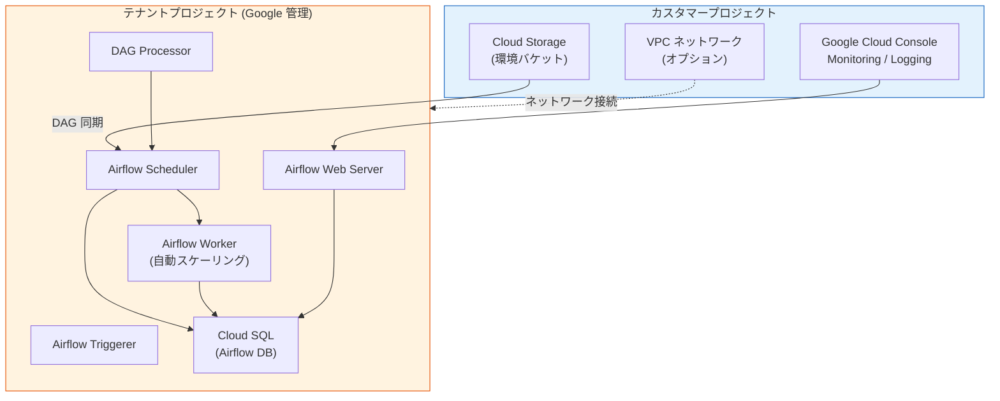

# Cloud Composer: Melbourne リージョンが Cloud Composer 3 専用に移行

**リリース日**: 2026-03-27

**サービス**: Cloud Composer

**機能**: Melbourne リージョン (australia-southeast2) における Cloud Composer 3 専用化

**ステータス**: Announcement

📊 [このアップデートのインフォグラフィックを見る](https://takech9203.github.io/google-cloud-news-summary/20260327-cloud-composer-melbourne-composer-3.html)

## 概要

Google Cloud は、Melbourne リージョン (australia-southeast2) において Cloud Composer 2 環境の新規作成を停止し、Cloud Composer 3 環境のみをサポートするリージョンへ移行することを発表しました。これにより、Melbourne リージョンでは今後 Cloud Composer 3 のみが新規作成可能となります。

この変更は、Cloud Composer 3 への段階的な移行戦略の一環です。Cloud Composer 3 は、簡素化されたネットワーク設定、テナントプロジェクトベースのアーキテクチャ、Airflow 3 のサポート (プレビュー) など、多くの改善を備えた最新メジャーバージョンです。既に Cloud Composer 1 のサポート終了が進行中であり、Cloud Composer 2 の 2.0.x バージョンも 2026 年 9 月 15 日にサポート終了が予定されています。

なお、Melbourne リージョンに既存の Cloud Composer 2 環境がある場合、それらは引き続き動作し、今回の変更による影響はありません。ただし、新規に Cloud Composer 2 環境を作成することはできなくなります。

**アップデート前の課題**

- Melbourne リージョンでは Cloud Composer 2 と Cloud Composer 3 の両方の環境を新規作成できたため、バージョン管理が複雑になる可能性があった
- Cloud Composer 2 では環境のクラスタがカスタマープロジェクト内に配置されるため、インフラ管理の負担が大きかった
- Cloud Composer 2 ではネットワーク設定 (Private Service Connect) がより複雑だった

**アップデート後の改善**

- Melbourne リージョンの新規環境は全て Cloud Composer 3 に統一され、バージョン管理がシンプルになった
- Cloud Composer 3 のテナントプロジェクトベースのアーキテクチャにより、インフラ管理の負担が軽減される
- 簡素化されたネットワーク設定により、環境構築が容易になった

## アーキテクチャ図



Cloud Composer 3 では、全ての Airflow コンポーネントがテナントプロジェクト内で実行されます。カスタマープロジェクトには環境バケット (Cloud Storage) のみが配置され、インフラ管理の負担が大幅に軽減されています。

## サービスアップデートの詳細

### 主要ポイント

1. **Cloud Composer 2 新規作成の停止**
   - Melbourne (australia-southeast2) リージョンで Cloud Composer 2 環境の新規作成が不可に
   - 既存の Cloud Composer 2 環境は引き続き動作し、影響なし
   - 環境のアップグレードやメンテナンスは継続される

2. **Cloud Composer 3 専用リージョン化**
   - Melbourne リージョンでは今後 Cloud Composer 3 のみ新規作成可能
   - Cloud Composer 3 のデフォルトバージョンは `composer-3-airflow-2` で作成される
   - 以前に他のリージョン (northamerica-south1 など) でも同様の移行が行われている

3. **Cloud Composer 2 から 3 への移行パス**
   - サイドバイサイド方式での移行をサポート (インプレースアップグレードは不可)
   - 移行スクリプト (`composer_migrate.py`) を使用した移行
   - スナップショットを使用した移行
   - 移行前に `check-upgrade` コマンドで互換性チェックが可能

## 技術仕様

### Cloud Composer 2 と Cloud Composer 3 の主な違い

| 項目 | Cloud Composer 2 | Cloud Composer 3 |
|------|-----------------|-----------------|
| 環境クラスタ | カスタマープロジェクト内の GKE Autopilot | テナントプロジェクト内 (非公開) |
| ネットワーク設定 | Private Service Connect | 簡素化 (Public/Private IP 切替可能) |
| Airflow バージョン | Airflow 2 | Airflow 2 / Airflow 3 (プレビュー) |
| Airflow Executor | Celery Executor | CeleryKubernetes Executor |
| DAG Processor | Scheduler に統合 | 独立コンポーネント |
| データベース保持ポリシー | 未対応 | 対応 |
| イメージバージョン形式 | `composer-2.b.c-airflow-x.y.z` | `composer-3-airflow-x.y.z-build.t` |

### 互換性チェックコマンド

```bash
# Cloud Composer 3 との互換性を事前チェック
gcloud composer environments check-upgrade \
  ENVIRONMENT_NAME \
  --location australia-southeast2 \
  --image-version composer-3-airflow-2
```

## 設定方法

### 前提条件

1. Google Cloud プロジェクトで Cloud Composer API が有効であること
2. 適切な IAM 権限 (`composer.environments.create`) を持っていること
3. gcloud CLI がインストール・認証済みであること

### 手順

#### ステップ 1: 新規 Cloud Composer 3 環境の作成

```bash
# Melbourne リージョンで Cloud Composer 3 環境を作成
gcloud composer environments create my-composer3-env \
  --location australia-southeast2 \
  --image-version composer-3-airflow-2
```

Melbourne リージョンでは Cloud Composer 3 のみが作成可能です。`--image-version` を省略した場合もデフォルトで Cloud Composer 3 が選択されます。

#### ステップ 2: 既存 Cloud Composer 2 環境からの移行 (該当する場合)

```bash
# 移行スクリプトのダウンロード
curl -O https://raw.githubusercontent.com/GoogleCloudPlatform/python-docs-samples/main/composer/tools/composer_migrate.py

# 移行のプレビュー (ドライラン)
python3 composer_migrate.py \
  --project PROJECT_ID \
  --location australia-southeast2 \
  --source_environment my-composer2-env \
  --target_environment my-composer3-env \
  --target_airflow_version 2.10.5 \
  --dry_run

# 実際の移行実行
python3 composer_migrate.py \
  --project PROJECT_ID \
  --location australia-southeast2 \
  --source_environment my-composer2-env \
  --target_environment my-composer3-env \
  --target_airflow_version 2.10.5
```

移行スクリプトはスナップショットを使用して DAG、データ、設定を Cloud Composer 2 から Cloud Composer 3 に転送します。

## メリット

### ビジネス面

- **運用管理の簡素化**: Cloud Composer 3 ではインフラストラクチャがテナントプロジェクトで管理されるため、GKE クラスタの管理が不要になり、運用チームの負担が軽減される
- **バージョン統一による保守性向上**: リージョン内のバージョンが統一されることで、ナレッジの集約やトラブルシューティングが効率化される

### 技術面

- **簡素化されたネットワーク設定**: Public IP と Private IP の切り替えが既存環境でも可能になり、ネットワーク構成の柔軟性が向上
- **DAG Processor の独立化**: Scheduler から分離された DAG Processor により、DAG の解析パフォーマンスが向上し、Scheduler のリソース消費が最適化される
- **CeleryKubernetes Executor**: KubernetesPodOperator ワークロードが環境とは独立してスケーリングされ、リソース効率が向上

## デメリット・制約事項

### 制限事項

- Melbourne リージョンで Cloud Composer 2 環境を新規作成することは不可能になった
- Cloud Composer 2 から Cloud Composer 3 へのインプレースアップグレードは非対応 (サイドバイサイド移行が必要)
- Cloud Composer 3 では KubernetesPodOperator でカスタムサービスアカウントの使用が非対応
- Cloud Composer 3 では Pod affinity の設定が使用不可

### 考慮すべき点

- 既存の Cloud Composer 2 環境は影響を受けないが、将来的には Cloud Composer 3 への移行が推奨される
- 移行前に `check-upgrade` コマンドで BLOCKING / NON_BLOCKING の互換性問題を確認すべき
- スナップショットの作成には Airflow データベースが 20 GB 以下、DAG/plugins/data フォルダのオブジェクト数が 10 万未満である必要がある
- Cloud Composer 3 ではプリインストールパッケージのバージョンが異なる場合があり、DAG の互換性確認が必要

## ユースケース

### ユースケース 1: Melbourne リージョンでの新規ワークフロー環境構築

**シナリオ**: オーストラリアのデータレジデンシー要件を持つ企業が、Melbourne リージョンで新しいデータパイプラインの Airflow 環境を構築する必要がある。

**効果**: Cloud Composer 3 を使用することで、GKE クラスタの管理が不要になり、環境構築とメンテナンスにかかる時間と労力が削減される。簡素化されたネットワーク設定により、セキュリティ要件への対応も容易になる。

### ユースケース 2: 既存 Cloud Composer 2 環境の計画的移行

**シナリオ**: Melbourne リージョンで稼働中の Cloud Composer 2 環境を持つ組織が、Cloud Composer 2 のサポート終了 (2026 年 9 月 15 日) に先立って計画的に移行を進める。

**効果**: 移行スクリプトやスナップショット機能を活用することで、DAG やデータを保持したままスムーズに移行でき、サービスの継続性を確保できる。事前の互換性チェックにより、移行リスクを最小化できる。

## 料金

Cloud Composer 3 の料金モデルは Cloud Composer 2 とは異なります。Cloud Composer 3 では、コンピュートリソース (CPU、メモリ) と環境サイズに基づく料金体系が適用されます。詳細は [Cloud Composer 料金ページ](https://cloud.google.com/composer/pricing) を参照してください。

## 利用可能リージョン

この変更は **Melbourne (australia-southeast2)** リージョンに適用されます。同リージョンでは今後 Cloud Composer 3 のみが新規作成可能です。なお、過去には northamerica-south1 (Mexico) でも同様の Cloud Composer 2 新規作成停止が実施されています。他のリージョンについては、今後段階的に同様の移行が進む可能性があります。

## 関連サービス・機能

- **Cloud Composer 3**: Apache Airflow ベースのフルマネージドワークフローオーケストレーションサービスの最新メジャーバージョン
- **Google Kubernetes Engine (GKE)**: Cloud Composer 2 では環境クラスタとして使用されるが、Cloud Composer 3 ではテナントプロジェクト内に隠蔽される
- **Cloud Storage**: 環境バケットとして DAG、プラグイン、データの格納に使用
- **Cloud SQL**: Airflow メタデータデータベースとしてテナントプロジェクト内で稼働
- **Cloud Logging / Cloud Monitoring**: 環境のログとメトリクスの監視に使用

## 参考リンク

- 📊 [インフォグラフィック](https://takech9203.github.io/google-cloud-news-summary/20260327-cloud-composer-melbourne-composer-3.html)
- [公式リリースノート](https://cloud.google.com/composer/docs/release-notes)
- [Cloud Composer 3 環境アーキテクチャ](https://cloud.google.com/composer/docs/composer-3/environment-architecture)
- [Cloud Composer 2 から 3 への移行ガイド (スクリプト)](https://cloud.google.com/composer/docs/composer-2/migrate-composer-3-script)
- [Cloud Composer 2 から 3 への移行ガイド (スナップショット)](https://cloud.google.com/composer/docs/composer-2/migrate-composer-3)
- [Cloud Composer バージョニング概要](https://cloud.google.com/composer/docs/composer-versioning-overview)
- [料金ページ](https://cloud.google.com/composer/pricing)

## まとめ

Melbourne リージョン (australia-southeast2) が Cloud Composer 3 専用リージョンに移行したことは、Google Cloud が Cloud Composer 3 への全面移行を着実に進めていることを示しています。既存の Cloud Composer 2 環境への即時の影響はありませんが、Cloud Composer 2 の 2.0.x バージョンが 2026 年 9 月 15 日にサポート終了を迎えることを考慮し、早期に Cloud Composer 3 への移行計画を策定し、互換性チェックと段階的な移行を開始することを推奨します。

---

**タグ**: #CloudComposer #CloudComposer3 #Melbourne #australia-southeast2 #Migration #Airflow #Orchestration #RegionUpdate
