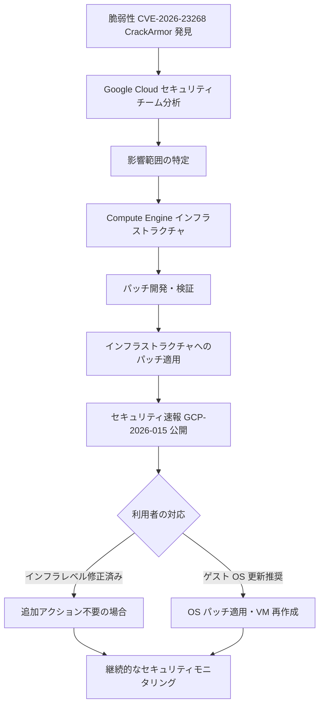

# Compute Engine: CrackArmor 脆弱性 (CVE-2026-23268) に対するセキュリティ対応

**リリース日**: 2026-03-27

**サービス**: Compute Engine

**機能**: Security Bulletin GCP-2026-015 (CVE-2026-23268 CrackArmor)

**ステータス**: Security Bulletin

📊 [このアップデートのインフォグラフィックを見る](https://takech9203.github.io/google-cloud-news-summary/20260327-compute-engine-crackarmor-cve-2026-23268.html)

## 概要

Google Cloud は、Compute Engine に影響する CrackArmor と呼ばれる脆弱性 (CVE-2026-23268) を発見し、対処したことをセキュリティ速報 GCP-2026-015 として公開しました。この脆弱性はすでに修正が適用されており、Compute Engine のインフラストラクチャレベルでの対策が完了しています。

CrackArmor は、Compute Engine VM インスタンスが稼働するインフラストラクチャに関連するセキュリティ上の脆弱性です。Google Cloud のセキュリティチームがこの脆弱性を特定し、速やかにパッチを適用して対処しました。Google Cloud のセキュリティ速報 (Security Bulletin) は、Google Cloud のプロダクトに影響を与えるセキュリティ脆弱性に関する情報を提供するもので、今回の GCP-2026-015 もその一環として公開されました。

利用者は、GCP-2026-015 セキュリティ速報の詳細を確認し、必要に応じて推奨されるアクションを実施することが求められます。Google Cloud の過去のセキュリティ速報のパターンに基づくと、インフラストラクチャレベルでの修正が完了している場合でも、ゲスト OS レベルでの追加のパッチ適用が推奨される場合があります。

**アップデート前の課題**

- CrackArmor 脆弱性 (CVE-2026-23268) が存在し、Compute Engine 環境にセキュリティリスクがあった
- 脆弱性が悪用された場合、VM インスタンスのセキュリティが侵害される可能性があった
- 利用者側で脆弱性の存在を認識し、リスクを評価する手段が限られていた

**アップデート後の改善**

- Google Cloud が脆弱性を特定し、パッチを適用してセキュリティリスクを排除した
- セキュリティ速報 GCP-2026-015 の公開により、利用者が脆弱性の影響範囲と対応状況を確認可能になった
- Compute Engine インフラストラクチャにおける CrackArmor 脆弱性への対策が完了した

## アーキテクチャ図



CrackArmor 脆弱性が発見されてから、Google Cloud のセキュリティチームによる分析、パッチ適用、セキュリティ速報公開までの対応フローを示しています。利用者はセキュリティ速報の内容に基づき、追加のアクションが必要かどうかを判断します。

## サービスアップデートの詳細

### 主要機能

1. **脆弱性の修正 (CVE-2026-23268)**
   - CrackArmor と名付けられた脆弱性に対するパッチが適用された
   - Compute Engine のインフラストラクチャレベルでセキュリティ対策が実施された

2. **セキュリティ速報 GCP-2026-015 の公開**
   - 脆弱性の概要、影響範囲、推奨されるアクションが文書化された
   - Google Cloud のセキュリティ速報ページから詳細を確認可能

3. **インフラストラクチャレベルでの保護**
   - Google Cloud 側でのパッチ適用により、Compute Engine を実行する基盤インフラストラクチャが保護された
   - VM インスタンス間の分離機構がセキュリティを強化

## 技術仕様

### 脆弱性情報

| 項目 | 詳細 |
|------|------|
| CVE ID | CVE-2026-23268 |
| 通称 | CrackArmor |
| セキュリティ速報番号 | GCP-2026-015 |
| 公開日 | 2026-03-27 |
| 影響を受けるサービス | Compute Engine |
| 対応状況 | 修正済み |

## 設定方法

### 推奨アクション

#### ステップ 1: セキュリティ速報の確認

[GCP-2026-015 セキュリティ速報](https://cloud.google.com/support/bulletins#gcp-2026-015) の詳細を確認し、自身の環境への影響を評価してください。

#### ステップ 2: ゲスト OS の確認と更新

セキュリティ速報で推奨されている場合は、VM インスタンスのゲスト OS を最新バージョンに更新してください。

```bash
# VM Manager のパッチジョブを使用した OS パッチ適用の例
gcloud compute os-config patch-jobs execute \
    --instance-filter-names="zones/ZONE/instances/INSTANCE_NAME" \
    --description="CVE-2026-23268 patch"
```

#### ステップ 3: セキュリティモニタリングの確認

Security Command Center を使用して、環境内のセキュリティ状態を継続的に監視してください。

```bash
# セキュリティに関する検出結果の確認
gcloud scc findings list ORGANIZATION_ID \
    --source=SOURCE_ID \
    --filter="category=\"OS_VULNERABILITY\""
```

## メリット

### セキュリティ面

- **迅速な脆弱性対応**: Google Cloud のセキュリティチームが脆弱性を特定し、速やかにパッチを適用
- **透明性の確保**: セキュリティ速報を通じて脆弱性の詳細と対応状況を公開
- **インフラストラクチャレベルの保護**: 利用者のアクションを必要とせずに基盤レベルでの修正を実施

### 運用面

- **ダウンタイムの最小化**: Google Cloud がインフラストラクチャレベルで対処するため、多くの場合 VM の停止が不要
- **一元的な情報提供**: セキュリティ速報ページから脆弱性の影響と対応方法を一括確認可能

## デメリット・制約事項

### 考慮すべき点

- セキュリティ速報の内容を確認し、自身の環境で追加のアクションが必要かどうかを判断する必要がある
- ゲスト OS レベルでのパッチ適用が推奨される場合、利用者側での作業が発生する可能性がある
- カスタムイメージを使用している場合、個別にパッチの適用状況を確認する必要がある

## ユースケース

### ユースケース 1: 本番環境の Compute Engine VM を運用している場合

**シナリオ**: 本番環境で多数の Compute Engine VM インスタンスを稼働させている組織が、CrackArmor 脆弱性への対応を行う。

**効果**: セキュリティ速報 GCP-2026-015 の推奨事項に従い、必要な場合はゲスト OS の更新を計画的に実施することで、セキュリティリスクを最小化できる。

### ユースケース 2: コンプライアンス要件がある環境

**シナリオ**: PCI DSS や SOC 2 などのコンプライアンス要件により、セキュリティ脆弱性への対応記録が必要な組織。

**効果**: GCP-2026-015 セキュリティ速報を参照し、脆弱性の認識と対応プロセスをコンプライアンス記録として文書化できる。

## 関連サービス・機能

- **[Compute Engine セキュリティ速報](https://cloud.google.com/compute/docs/security-bulletins)**: Compute Engine に関連するすべてのセキュリティ速報の一覧
- **[VM Manager (OS Patch Management)](https://cloud.google.com/compute/vm-manager/docs/patch)**: VM インスタンスの OS パッチ管理を自動化するサービス
- **[Security Command Center](https://cloud.google.com/security-command-center/docs)**: Google Cloud 環境全体のセキュリティ状態を統合管理
- **[Shielded VM](https://cloud.google.com/compute/shielded-vm/docs)**: セキュアブートや整合性モニタリングによる VM のセキュリティ強化
- **[Confidential VM](https://cloud.google.com/confidential-computing/confidential-vm/docs)**: メモリ暗号化によるデータのランタイム保護

## 参考リンク

- 📊 [インフォグラフィック](https://takech9203.github.io/google-cloud-news-summary/20260327-compute-engine-crackarmor-cve-2026-23268.html)
- [公式リリースノート](https://docs.cloud.google.com/release-notes#March_27_2026)
- [GCP-2026-015 セキュリティ速報](https://cloud.google.com/support/bulletins#gcp-2026-015)
- [Compute Engine セキュリティ速報一覧](https://cloud.google.com/compute/docs/security-bulletins)
- [CVE-2026-23268 (MITRE)](https://cve.mitre.org/cgi-bin/cvename.cgi?name=CVE-2026-23268)
- [VM Manager パッチ管理ドキュメント](https://cloud.google.com/compute/vm-manager/docs/patch)

## まとめ

CrackArmor 脆弱性 (CVE-2026-23268) は Google Cloud のセキュリティチームによって発見・修正され、セキュリティ速報 GCP-2026-015 として公開されました。Compute Engine を利用している場合は、セキュリティ速報の詳細を確認し、必要に応じてゲスト OS の更新や VM Manager を使用したパッチ適用を検討してください。Google Cloud のインフラストラクチャレベルでは既に対策が完了していますが、継続的なセキュリティモニタリングを通じて環境全体の安全性を維持することが重要です。

---

**タグ**: #ComputeEngine #Security #CVE-2026-23268 #CrackArmor #GCP-2026-015 #SecurityBulletin #VulnerabilityManagement #PatchManagement
