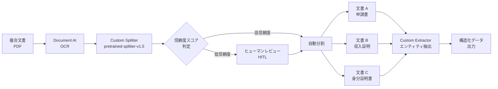

# Document AI: カスタムスプリッターモデル pretrained-splitter-v1.5-2025-07-14 が GA に

**リリース日**: 2026-03-27

**サービス**: Document AI

**機能**: Custom splitter model pretrained-splitter-v1.5-2025-07-14 GA

**ステータス**: GA (Generally Available)

[このアップデートのインフォグラフィックを見る](https://takech9203.github.io/google-cloud-news-summary/20260327-document-ai-custom-splitter-ga.html)

## 概要

Google Cloud Document AI のカスタムスプリッター（Custom Splitter）において、事前学習済みモデル `pretrained-splitter-v1.5-2025-07-14` が General Availability（GA）としてリリースされました。このモデルは Gemini 2.5 Flash LLM を基盤としており、事前のトレーニングなしでゼロショットでの文書分割・分類が可能です。

カスタムスプリッターは、複数種類の文書が混在する複合文書（例: 住宅ローンパッケージに含まれる申請書、収入証明書、身分証明書など）を、個々の論理的な文書単位に分割するためのプロセッサです。今回の GA リリースにより、本番環境での安定した利用が正式にサポートされるようになりました。

このアップデートは、大量の文書処理を行う金融機関、保険会社、法務部門、BPO（ビジネスプロセスアウトソーシング）企業など、文書の自動分類・分割パイプラインを構築するすべてのユーザーに影響します。

**アップデート前の課題**

- カスタムスプリッターの事前学習済みモデルは Preview 段階であり、本番環境での SLA が保証されていなかった
- ゼロショット分割を本番ワークロードに適用する際、GA レベルの安定性と信頼性が確保されていなかった
- 従来のレガシースプリッター（procurement-splitter、lending-document-split など）は特定の文書タイプにしか対応できず、カスタムクラスの定義が困難だった

**アップデート後の改善**

- `pretrained-splitter-v1.5-2025-07-14` が Stable チャネルで提供され、本番環境での利用が正式にサポートされた
- Gemini 2.5 Flash ベースのゼロショット分割により、トレーニングデータなしで即座に文書分割・分類を開始できるようになった
- 信頼度スコア（confidence score）がサポートされ、ヒューマンレビューの判断基準として活用可能になった
- レガシースプリッターからの移行先として推奨されるモデルとなった

## アーキテクチャ図



カスタムスプリッターを中心とした文書処理パイプラインの全体像です。複合文書が OCR 処理を経てスプリッターで分割され、信頼度スコアに基づいて自動処理またはヒューマンレビューに振り分けられます。分割後の各文書は適切なエクストラクターに送られ、エンティティが抽出されます。

## サービスアップデートの詳細

### 主要機能

1. **ゼロショット文書分割・分類**
   - 事前のトレーニングデータなしで、ユーザー定義のクラスに基づいて複合文書を分割可能
   - Gemini 2.5 Flash LLM の生成 AI 能力を活用し、多様な文書タイプに対応
   - スキーマ定義（クラス設定）のみで即座にデプロイ可能

2. **信頼度スコアのサポート**
   - v1.5 から信頼度スコアが利用可能になり、分割結果の品質を定量的に評価可能
   - スコアに基づいて自動処理とヒューマンレビューの振り分けを実装可能
   - ビジネス要件に応じたエラー許容度の設定が柔軟に行える

3. **GA レベルの安定性と SLA**
   - Stable リリースチャネルで提供され、本番環境での利用に適した安定性を確保
   - Google Cloud の GA サービスとしての SLA が適用される
   - レガシースプリッターからの推奨移行先として位置づけられている

## 技術仕様

### モデルバージョン一覧

| モデルバージョン | 基盤モデル | リリースチャネル | リリース日 |
|------|------|------|------|
| pretrained-splitter-v1.5-2025-07-14 | Gemini 2.5 Flash | Stable (GA) | 2025-07-14 |
| pretrained-splitter-v1.6-2026-03-09 | Gemini 3.1 Flash | Release Candidate | 2026-03-09 |
| pretrained-splitter-v1.6-pro-2026-03-09 | Gemini 3.1 Pro | Release Candidate | 2026-03-09 |

### API レスポンス形式

カスタムスプリッターの出力は Document JSON オブジェクトの `entities` フィールドに格納されます。

```json
{
  "textAnchor": {
    "textSegments": [
      {
        "startIndex": "5543",
        "endIndex": "10470"
      }
    ]
  },
  "type": "form_1040",
  "confidence": 0.8983272,
  "pageAnchor": {
    "pageRefs": [
      {
        "page": "1",
        "confidence": 0.8983272
      },
      {
        "page": "2",
        "confidence": 0.9636311
      }
    ]
  }
}
```

### 必要な IAM ロール

| ロール | 説明 |
|------|------|
| `roles/documentai.admin` | Document AI Administrator - プロセッサの作成・管理 |
| `roles/storage.admin` | Storage Admin - データセット用 Cloud Storage バケットの管理 |

## 設定方法

### 前提条件

1. Google Cloud プロジェクトで Document AI API が有効化されていること
2. 適切な IAM ロール（Document AI Administrator、Storage Admin）が付与されていること
3. Cloud Storage バケットがデータセット用に準備されていること（空のバケットまたはフォルダ）

### 手順

#### ステップ 1: プロセッサの作成

Google Cloud コンソールの Document AI セクションから Workbench ページにアクセスし、Custom Document Splitter を作成します。

```bash
# gcloud CLI でプロセッサを作成する場合
gcloud document-ai processors create \
  --display-name="my-custom-splitter" \
  --type="CUSTOM_SPLITTING_PROCESSOR" \
  --location="us"
```

#### ステップ 2: 事前学習済みモデルバージョンの選択とデプロイ

コンソールの「Manage Versions」タブから `pretrained-splitter-v1.5-2025-07-14` を選択し、デプロイします。

```bash
# プロセッサバージョンのデプロイ
gcloud document-ai processor-versions deploy \
  PROCESSOR_VERSION_ID \
  --processor=PROCESSOR_ID \
  --location="us"
```

#### ステップ 3: スキーマ（クラス）の定義

データセットタブでプロセッサスキーマを定義し、分割対象の文書クラス（例: `invoice`, `contract`, `id_card` など）を作成します。

#### ステップ 4: 処理リクエストの送信

```bash
# ドキュメント処理リクエストの送信
curl -X POST \
  -H "Authorization: Bearer $(gcloud auth print-access-token)" \
  -H "Content-Type: application/json" \
  "https://us-documentai.googleapis.com/v1/projects/PROJECT_ID/locations/us/processors/PROCESSOR_ID:process" \
  -d '{
    "rawDocument": {
      "content": "BASE64_ENCODED_CONTENT",
      "mimeType": "application/pdf"
    }
  }'
```

## メリット

### ビジネス面

- **迅速な本番導入**: ゼロショット対応により、トレーニングデータの準備期間を省略し、数時間以内にプロダクション環境へデプロイ可能
- **運用コスト削減**: 手動での文書仕分け作業を自動化し、人件費と処理時間を大幅に削減
- **柔軟なエラー管理**: 信頼度スコアを活用したヒューマンレビューの条件設定により、ビジネス要件に合わせた品質管理が可能

### 技術面

- **Gemini 2.5 Flash 基盤**: 最新の LLM 技術により、高精度な文書分割と分類を実現
- **GA レベルの信頼性**: Stable チャネルでの提供により、SLA に基づいた安定運用が可能
- **統合パイプライン構築**: Document AI Toolbox SDK と組み合わせることで、分割から抽出までの一貫した処理パイプラインを構築可能

## デメリット・制約事項

### 制限事項

- 30 ページを超える論理文書の分割には対応していない（30 ページ超の場合、複数文書に分割される可能性がある）
- スプリッターは各論理文書に対して単一のクラスのみを予測し、複数クラスの信頼度スコアは返さない
- スプリッターはページ境界の予測のみを行い、実際のファイル分割は Document AI Toolbox SDK を使用して別途実行する必要がある

### 考慮すべき点

- ML モデルの特性上、分割エラーは2つの文書に影響を与えるため、ヒューマンレビューステップの組み込みがベストプラクティスとして強く推奨される
- 信頼度スコアの閾値設定は、過去のエラー率データに基づいてビジネス判断として決定する必要がある
- レガシースプリッター（procurement-splitter、lending-document-split 等）は 2026 年 6 月 30 日に廃止予定のため、早めの移行計画が必要

## ユースケース

### ユースケース 1: 住宅ローン審査文書の自動仕分け

**シナリオ**: 金融機関が住宅ローン申請パッケージ（申請書、収入証明書、納税証明書、身分証明書などが一つの PDF にまとめられたもの）を受領し、各文書タイプに自動分類する。

**実装例**:
```python
from google.cloud import documentai_v1 as documentai
from google.cloud.documentai_toolbox import document

# プロセッサでドキュメントを処理
client = documentai.DocumentProcessorServiceClient()
name = f"projects/{project_id}/locations/us/processors/{processor_id}"

with open("mortgage_package.pdf", "rb") as f:
    content = f.read()

request = documentai.ProcessRequest(
    name=name,
    raw_document=documentai.RawDocument(
        content=content,
        mime_type="application/pdf"
    )
)

result = client.process_document(request=request)

# 分割結果の確認
for entity in result.document.entities:
    print(f"Type: {entity.type_}, Confidence: {entity.confidence}")
    for page_ref in entity.page_anchor.page_refs:
        print(f"  Page: {page_ref.page}")
```

**効果**: 手動仕分けに平均 5-10 分かかっていた作業を数秒で自動化し、審査プロセス全体のリードタイムを短縮

### ユースケース 2: 保険金請求書類の自動分類

**シナリオ**: 保険会社が受領する保険金請求パッケージ（請求書、診断書、領収書、事故報告書など）を自動分類し、それぞれの文書タイプに応じたエクストラクターに振り分ける。

**効果**: 請求処理の自動化率を向上させ、処理時間の短縮と人的エラーの削減を実現。信頼度スコアが低い場合のみヒューマンレビューに回すことで、効率的な品質管理が可能。

## 料金

Document AI のカスタムスプリッターは、トレーニングやアップトレーニングに費用はかかりません。課金はホスティングと予測処理（推論）に対して発生します。詳細な料金体系は [Document AI Pricing](https://cloud.google.com/document-ai/pricing) を参照してください。

## 利用可能リージョン

カスタムスプリッターは以下のリージョンで利用可能です。

| リージョン | ロケーション |
|------|------|
| us | マルチリージョン（米国） |
| eu | マルチリージョン（EU） |
| asia-south1 | ムンバイ |
| asia-southeast1 | シンガポール |
| australia-southeast1 | シドニー |
| europe-west2 | ロンドン |
| europe-west3 | フランクフルト |
| northamerica-northeast1 | モントリオール |

## 関連サービス・機能

- **Document AI Custom Extractor**: スプリッターで分割された文書からエンティティを抽出するためのプロセッサ。分割後のパイプラインで連携利用される
- **Document AI Custom Classifier**: 文書の分類に特化したプロセッサ。スプリッターが文書の分割と分類を同時に行うのに対し、クラシファイアは分類のみを行う
- **Document AI OCR**: 文書の光学文字認識を行うプロセッサ。スプリッター処理の前段として使用される
- **Document AI Toolbox SDK**: 分割結果を基にした物理的なファイル分割などのユーティリティ機能を提供する Python SDK
- **Human-in-the-Loop (HITL)**: 信頼度スコアが低い分割結果に対するヒューマンレビュー機能

## 参考リンク

- [インフォグラフィック](https://takech9203.github.io/google-cloud-news-summary/20260327-document-ai-custom-splitter-ga.html)
- [公式リリースノート](https://cloud.google.com/document-ai/docs/release-notes)
- [カスタムスプリッター ドキュメント](https://cloud.google.com/document-ai/docs/custom-splitter)
- [料金ページ](https://cloud.google.com/document-ai/pricing)
- [リージョン情報](https://cloud.google.com/document-ai/docs/regions)
- [スプリッター出力の処理](https://cloud.google.com/document-ai/docs/splitters)

## まとめ

Document AI のカスタムスプリッター事前学習済みモデル `pretrained-splitter-v1.5-2025-07-14` が GA となったことで、Gemini 2.5 Flash を基盤としたゼロショット文書分割・分類を本番環境で安定的に利用できるようになりました。特にレガシースプリッターが 2026 年 6 月 30 日に廃止予定であるため、該当プロセッサを利用中のユーザーは早急に本モデルへの移行を計画することを推奨します。信頼度スコアを活用したヒューマンレビュー統合パイプラインの構築により、高品質な文書処理自動化を実現できます。

---

**タグ**: #DocumentAI #CustomSplitter #GA #Gemini #ZeroShot #DocumentProcessing #MachineLearning #GoogleCloud
