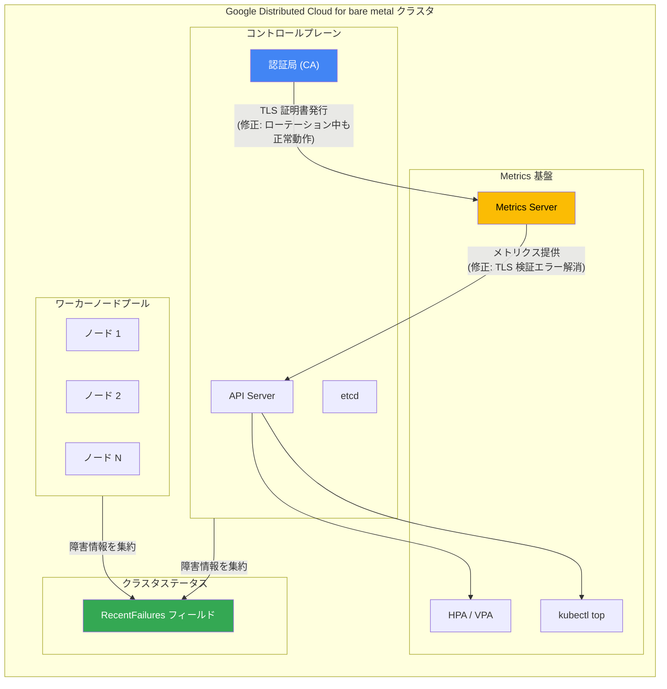

# Google Distributed Cloud (software only) for bare metal: バージョン 1.32.1000-gke.57 リリース

**リリース日**: 2026-03-27

**サービス**: Google Distributed Cloud (software only) for bare metal

**機能**: バージョン 1.32.1000-gke.57 (Kubernetes v1.32.13-gke.1000) - バグ修正と機能改善

**ステータス**: GA (一般提供)

📊 [このアップデートのインフォグラフィックを見る](https://takech9203.github.io/google-cloud-news-summary/20260327-google-distributed-cloud-bare-metal-1-32.html)

## 概要

Google Distributed Cloud (software only) for bare metal のバージョン 1.32.1000-gke.57 がリリースされました。このバージョンは Kubernetes v1.32.13-gke.1000 をベースとしており、セキュリティ脆弱性の修正、クラスタ障害情報の可視性向上、CA ローテーションおよび Metrics API に関する重要なバグ修正が含まれています。

今回のリリースでは特に、CA (認証局) ローテーション中に発生していた TLS 検証エラーによる Metrics API の障害と、セルフマネージドクラスタにおける CA ローテーションのスタック問題が修正されました。これらはオンプレミス環境で Kubernetes クラスタを運用するユーザーにとって、運用安定性に直結する重要な修正です。

また、クラスタおよびノードプールの障害情報がクラスタステータスの RecentFailures フィールドに集約されるようになり、障害発生時のトラブルシューティングが大幅に効率化されます。

**アップデート前の課題**

- CA ローテーション中に Metrics API (kubectl top、HPA、VPA) が TLS 検証エラーで失敗し、メトリクスベースの自動スケーリングや監視が一時的に機能しなくなる場合があった
- セルフマネージドクラスタ (admin、hybrid、standalone) で CA ローテーションが内部リソース同期エラーにより途中でスタックし、手動介入が必要になる場合があった
- クラスタやノードプールの障害情報がワーカーノードプールとコントロールプレーンノードで分散しており、エラーの全体像を把握するために複数の箇所を確認する必要があった

**アップデート後の改善**

- CA ローテーション中でも Metrics API が正常に動作し、HPA や VPA による自動スケーリングが中断されなくなった
- セルフマネージドクラスタにおける CA ローテーションが内部リソース同期エラーでスタックしなくなり、安定して完了するようになった
- クラスタステータスの RecentFailures フィールドにより、ワーカーノードプールとコントロールプレーンノードの両方の障害情報を一元的に確認できるようになった

## アーキテクチャ図



この図は、今回のアップデートで修正された主要コンポーネント間の関係を示しています。CA からの TLS 証明書発行が Metrics Server に正しく反映されるようになり、RecentFailures フィールドにコントロールプレーンとワーカーノードプールの障害情報が集約される仕組みが追加されました。

## サービスアップデートの詳細

### 主要機能

1. **セキュリティ脆弱性の修正**
   - Vulnerability fixes に記載されている脆弱性が修正されました
   - 定期的なアップグレードによりクラスタのセキュリティを維持することが推奨されます

2. **RecentFailures フィールドによるクラスタ障害情報の一元化**
   - クラスタおよびノードプールの障害情報がクラスタステータスの RecentFailures フィールドに集約されるようになりました
   - ワーカーノードプールとコントロールプレーンノードの両方のエラーを一箇所で確認可能になりました
   - 障害発生時の原因特定とトラブルシューティングが効率化されます

3. **Metrics API の TLS 検証エラー修正**
   - CA ローテーション中に kubectl top、HPA (Horizontal Pod Autoscaler)、VPA (Vertical Pod Autoscaler) が TLS 検証エラーで失敗する問題が修正されました
   - CA が更新された際に Metrics Server が古い証明書を使い続けることで発生していた `x509: certificate signed by unknown authority` エラーが解消されました

4. **セルフマネージドクラスタの CA ローテーションスタック問題の修正**
   - admin、hybrid、standalone クラスタで CA ローテーションが内部リソース同期エラーにより途中でスタックする問題が修正されました
   - CA ローテーションプロセスが安定して最後まで完了するようになりました

## 技術仕様

### バージョン情報

| 項目 | 詳細 |
|------|------|
| バージョン | 1.32.1000-gke.57 |
| Kubernetes バージョン | v1.32.13-gke.1000 |
| リリースタイプ | パッチリリース (修正 + 機能改善) |
| GKE On-Prem API 利用可能時期 | リリース後約 7-14 日 |

### CA ローテーション

CA ローテーションは `bmctl update credentials certificate-authorities rotate` コマンドで実行します。TLS 証明書はデフォルトで 1 年の有効期限を持ち、CA ローテーション時およびクラスタアップグレード時に更新されます。

```bash
bmctl update credentials certificate-authorities rotate \
  --cluster CLUSTER_NAME \
  --kubeconfig KUBECONFIG
```

## 設定方法

### 前提条件

1. 既存の Google Distributed Cloud for bare metal クラスタがバージョン 1.32 系であること
2. アップグレードパスがバージョンスキュールールに準拠していること
3. サードパーティストレージベンダーを使用している場合は、対応状況を確認済みであること

### 手順

#### ステップ 1: アップグレードの準備

```bash
# クラスタの現在のバージョンを確認
kubectl get cluster -n CLUSTER_NAMESPACE -o yaml | grep anthosBareMetalVersion

# クラスタのヘルスチェックを実行
bmctl check cluster --cluster CLUSTER_NAME --kubeconfig KUBECONFIG
```

アップグレード前にクラスタの状態が正常であることを確認します。

#### ステップ 2: クラスタのアップグレード

```bash
# クラスタ構成ファイルの anthosBareMetalVersion を更新
# anthosBareMetalVersion: 1.32.1000-gke.57

# アップグレードを実行
bmctl upgrade cluster --cluster CLUSTER_NAME --kubeconfig KUBECONFIG
```

リリース後、GKE On-Prem API クライアント (Google Cloud コンソール、gcloud CLI、Terraform) でのインストールやアップグレードが可能になるまで約 7-14 日かかります。

## メリット

### ビジネス面

- **運用効率の向上**: RecentFailures フィールドにより障害情報が一元化され、トラブルシューティングにかかる時間を短縮できます
- **サービスの安定性向上**: CA ローテーション中のメトリクス収集停止が解消され、自動スケーリングの信頼性が向上します

### 技術面

- **CA ローテーションの信頼性向上**: セルフマネージドクラスタで CA ローテーションが途中でスタックする問題が解消され、証明書管理のライフサイクルが安定します
- **Metrics API の安定性**: CA ローテーション中も HPA/VPA が正常に動作するため、ワークロードの自動スケーリングが維持されます
- **障害可視性の改善**: コントロールプレーンとワーカーノードプールの障害情報を統合的に監視できるようになり、問題の根本原因分析が容易になります

## デメリット・制約事項

### 制限事項

- GKE On-Prem API クライアント経由でのアップグレードは、リリース後 7-14 日経過するまで利用できません
- CA ローテーションは開始後に一時停止またはロールバックすることができません
- CA ローテーションは手動で発行された証明書は更新しないため、CA ローテーション完了後に手動で再配布する必要があります

### 考慮すべき点

- アップグレード中はワークロードの再起動およびリスケジュールが発生する可能性があります
- 高可用性構成でないクラスタではアップグレード中に短時間のコントロールプレーンダウンタイムが発生する場合があります
- サードパーティストレージベンダーを使用している場合は、本バージョンとの互換性を事前に確認する必要があります

## ユースケース

### ユースケース 1: CA ローテーション運用の安定化

**シナリオ**: セルフマネージドクラスタ (admin/hybrid/standalone) を運用しており、定期的な CA ローテーションが内部リソース同期エラーでスタックして手動介入が必要になっていた環境。

**効果**: 本バージョンにアップグレードすることで、CA ローテーションが安定して完了するようになり、証明書管理の定期運用が自動化できます。HPA/VPA も CA ローテーション中に中断されなくなるため、メンテナンスウィンドウの短縮が期待できます。

### ユースケース 2: 大規模クラスタの障害監視効率化

**シナリオ**: 多数のワーカーノードプールを持つ大規模なベアメタルクラスタを運用しており、障害発生時に複数のリソースを横断的に確認する必要があった環境。

**効果**: RecentFailures フィールドにより、コントロールプレーンとワーカーノードプールの障害情報を一箇所で確認できるようになり、障害対応の初動が迅速化します。

## 関連サービス・機能

- **Google Kubernetes Engine (GKE)**: Google Distributed Cloud for bare metal のベースとなる Kubernetes エンジン
- **GKE On-Prem API**: Google Cloud コンソール、gcloud CLI、Terraform からのクラスタ管理を提供
- **Google Distributed Cloud (software only) for VMware**: VMware 環境向けの同等製品。同様のパッチリリースが提供される場合があります
- **Anthos Config Management**: クラスタ間での構成管理を統一するツール

## 参考リンク

- 📊 [インフォグラフィック](https://takech9203.github.io/google-cloud-news-summary/20260327-google-distributed-cloud-bare-metal-1-32.html)
- [公式リリースノート](https://docs.cloud.google.com/release-notes#March_27_2026)
- [Google Distributed Cloud for bare metal リリースノート](https://cloud.google.com/kubernetes-engine/distributed-cloud/bare-metal/docs/release-notes)
- [クラスタのアップグレード手順](https://cloud.google.com/kubernetes-engine/distributed-cloud/bare-metal/docs/how-to/upgrade)
- [CA ローテーションドキュメント](https://cloud.google.com/kubernetes-engine/distributed-cloud/bare-metal/docs/how-to/ca-rotation)
- [既知の問題](https://cloud.google.com/kubernetes-engine/distributed-cloud/bare-metal/docs/troubleshooting/known-issues)
- [脆弱性修正情報](https://cloud.google.com/kubernetes-engine/distributed-cloud/bare-metal/docs/version-history)

## まとめ

Google Distributed Cloud (software only) for bare metal 1.32.1000-gke.57 は、CA ローテーションに関連する 2 つの重要なバグ修正と、クラスタ障害情報の可視性向上を含む重要なパッチリリースです。特にセルフマネージドクラスタを運用しているユーザーは、CA ローテーションの安定性向上の恩恵を受けるため、早期のアップグレードが推奨されます。RecentFailures フィールドの追加により、障害対応のワークフローも改善されるため、運用チーム全体の効率向上が期待できます。

---

**タグ**: #GoogleDistributedCloud #BareMetal #Kubernetes #CARotation #TLS #MetricsAPI #HPA #VPA #セキュリティ修正 #オンプレミス #GKE
