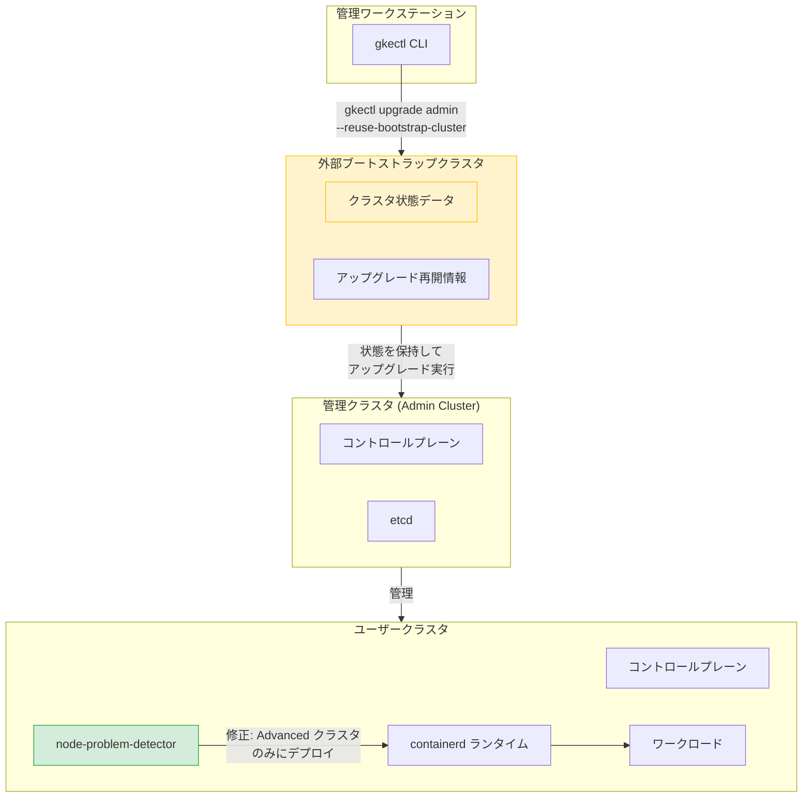

# Google Distributed Cloud (software only) for VMware: バージョン 1.33.600-gke.40 / 1.32.1000-gke.57 リリース

**リリース日**: 2026-03-27

**サービス**: Google Distributed Cloud (software only) for VMware

**機能**: クラスタアップグレード・運用安定性に関する複数の重要バグ修正

**ステータス**: Fixed / Announcement

📊 [このアップデートのインフォグラフィックを見る](https://takech9203.github.io/google-cloud-news-summary/20260327-google-distributed-cloud-vmware-1-32-1-33.html)

## 概要

Google Distributed Cloud (software only) for VMware の2つの新バージョンがリリースされました。バージョン 1.33.600-gke.40（Kubernetes 1.33.5-gke.2200）とバージョン 1.32.1000-gke.57（Kubernetes v1.32.13-gke.1000）が利用可能になっています。両バージョンとも、クラスタのアップグレードや運用に影響を与える重要なバグ修正が含まれています。

特に注目すべきは、Advanced クラスタへのアップグレード失敗時にブートストラップクラスタを削除するとデータが失われる深刻な問題の修正、および node-problem-detector が非 Advanced（V1）VMware クラスタに誤ってデプロイされ containerd ランタイムの連続再起動を引き起こす問題の修正です。これらはクラスタの可用性とデータ整合性に直接影響する重大な修正であり、該当バージョンを利用中のユーザーは早急なアップグレードが推奨されます。

バージョン 1.32 から 1.33 へのアップグレード時にはクラスタが自動的に Advanced クラスタに変換される点も重要です。今回の修正により、この移行プロセスの信頼性が大幅に向上しました。

**アップデート前の課題**

- node-problem-detector が非 Advanced（V1）クラスタに誤ってデプロイされ、containerd ランタイムが継続的に再起動し、ETCD/CRI 障害やクラスタアップグレードの失敗が発生していた
- 非推奨の `stackdriver.enableVPC` フィールドが `true` に設定されていると、Advanced クラスタへのアップグレードがブロックされていた
- レジストリミラー用にカスタム CA 証明書を設定すると、システム証明書プールが無視されていた
- `gkectl upgrade admin` の再試行時に「AlreadyExists」エラーが発生していた
- proxy/noProxy 設定フィールドに余分な空白が含まれていると、クラスタの作成やアップグレードが失敗していた
- Advanced 管理クラスタのアップデート/アップグレードが失敗し、外部ブートストラップクラスタが削除されると、重要なデータが失われる可能性があった

**アップデート後の改善**

- node-problem-detector のデプロイ対象が正しく Advanced クラスタのみに限定され、非 Advanced クラスタでの containerd 再起動問題が解消された
- `stackdriver.enableVPC` フィールドの設定がアップグレードバリデーション中に無視されるようになり、Advanced クラスタへの移行がブロックされなくなった
- カスタム CA 証明書設定時もシステム証明書プールが正しく参照されるようになった
- `gkectl upgrade admin` の再試行が「AlreadyExists」エラーなく正常に動作するようになった
- proxy/noProxy フィールドの空白が適切に処理されるようになった
- アップグレード失敗時のデータ保護が強化された

## アーキテクチャ図



この図は、Google Distributed Cloud for VMware のアップグレードフローと今回修正された主要コンポーネントの関係を示しています。ブートストラップクラスタが管理クラスタのアップグレード状態を保持し、`--reuse-bootstrap-cluster` フラグにより安全なリトライが可能になっています。

## サービスアップデートの詳細

### 主要機能

1. **node-problem-detector デプロイ対象の修正（v1.32.1000-gke.57 / v1.33.600-gke.40）**
   - node-problem-detector が非 Advanced（V1）VMware クラスタに誤ってデプロイされる問題を修正
   - この問題により、影響を受けたノードで containerd ランタイムが継続的に再起動し、ETCD/CRI 障害やクラスタアップグレードの失敗が発生していた
   - 修正により、node-problem-detector は Advanced クラスタにのみ正しくデプロイされるようになった

2. **非推奨 stackdriver.enableVPC フィールドの処理改善（v1.32.1000-gke.57）**
   - `stackdriver.enableVPC` フィールドが `true` に設定されている場合、Advanced クラスタへのアップグレードバリデーションがブロックされていた問題を修正
   - このフィールドは非推奨であり、アップグレードバリデーション時に設定が無視されるようになった

3. **レジストリミラーのカスタム CA 証明書処理の修正（v1.32.1000-gke.57）**
   - レジストリミラー用にカスタム CA 証明書が設定されている場合、システム証明書プールが無視される問題を修正
   - カスタム CA とシステム証明書プールの両方が正しく参照されるようになった

4. **gkectl upgrade admin リトライ時の AlreadyExists エラー修正（v1.32.1000-gke.57）**
   - 以前の失敗後に `gkectl upgrade admin` コマンドを再実行すると、ブートストラップクラスタで「AlreadyExists」エラーが発生する問題を修正

5. **proxy/noProxy 設定の空白処理修正（v1.32.1000-gke.57）**
   - proxy または noProxy 設定フィールドに余分な空白が含まれていると、内部コマンドライン引数のパースに干渉し、コントロールプレーンのロードバランサー初期化が失敗する問題を修正

6. **アップグレード失敗時のデータ損失防止（v1.32.1000-gke.57 / v1.33.600-gke.40）**
   - Advanced 管理クラスタのアップデートまたはアップグレードが失敗し、外部ブートストラップクラスタが削除された場合に重要なデータが失われる問題を修正
   - `--reuse-bootstrap-cluster`（または `-r`）フラグの使用が引き続き推奨される

## 技術仕様

### バージョン情報

| 項目 | v1.33.600-gke.40 | v1.32.1000-gke.57 |
|------|-------------------|-------------------|
| Kubernetes バージョン | 1.33.5-gke.2200 | v1.32.13-gke.1000 |
| リリース種別 | パッチリリース | パッチリリース |
| 修正数 | データ損失防止の修正 | 6件の修正 |

### アップグレード時の重要フラグ

| フラグ | 説明 |
|--------|------|
| `--reuse-bootstrap-cluster` / `-r` | 以前の失敗からアップグレードを再開する際に必須。ブートストラップクラスタの状態を再利用する |

### バージョン 1.32 から 1.33 へのアップグレード時の注意点

| 項目 | 詳細 |
|------|------|
| Advanced クラスタ自動変換 | 1.32 から 1.33 へのアップグレード時にクラスタが自動的に Advanced クラスタに変換される |
| 非 Advanced 維持オプション | 1.32 から 1.33 へのアップグレード時のみ非 Advanced として維持可能 |
| gkectl バージョン要件 | 非 Advanced クラスタのアップグレード時は gkectl バージョンがターゲットバージョンと完全一致する必要がある |
| バージョンスキュー | 非 Advanced から Advanced への移行時はコントロールプレーンと全ノードプールを同時にアップグレードする必要がある |
| cert-manager | Advanced クラスタに自動インストールされる（バージョン 1.33 では cert-manager 1.18 がバンドル） |

## 設定方法

### 前提条件

1. 管理ワークステーションが適切なバージョンにアップグレードされていること
2. 管理クラスタおよびユーザークラスタの現行バックアップが取得されていること
3. gkectl バージョンがターゲットバージョンと互換性があること

### 手順

#### ステップ 1: OS イメージの準備

```bash
gkectl prepare \
  --bundle-path /var/lib/gke/bundles/gke-onprem-vsphere-TARGET_VERSION.tgz \
  --kubeconfig ADMIN_CLUSTER_KUBECONFIG
```

ターゲットバージョンの OS イメージを vSphere にインポートします。

#### ステップ 2: Advanced クラスタへのアップグレード準備（該当する場合）

```bash
gkectl prepare \
  --bundle-path BUNDLE_PATH \
  --kubeconfig ADMIN_CLUSTER_KUBECONFIG \
  --advanced-cluster
```

Advanced クラスタへの移行を伴う場合は `--advanced-cluster` フラグを追加します。

#### ステップ 3: 管理クラスタのアップグレード

```bash
gkectl upgrade admin \
  --kubeconfig ADMIN_CLUSTER_KUBECONFIG \
  --config ADMIN_CLUSTER_CONFIG \
  --reuse-bootstrap-cluster
```

`--reuse-bootstrap-cluster` フラグを使用することで、失敗時にブートストラップクラスタの状態が保持され、安全なリトライが可能になります。

#### ステップ 4: ユーザークラスタのアップグレード

```bash
gkectl upgrade cluster \
  --kubeconfig ADMIN_CLUSTER_KUBECONFIG \
  --config USER_CLUSTER_CONFIG
```

管理クラスタのアップグレード完了後、ユーザークラスタをアップグレードします。

## メリット

### ビジネス面

- **運用リスクの低減**: データ損失やクラスタダウンタイムにつながる複数の重大な問題が修正され、本番環境の安定性が向上
- **アップグレードの信頼性向上**: proxy 設定の空白や非推奨フィールドなど、アップグレードをブロックしていた問題が解消され、計画的なメンテナンスが予定通り実行可能に

### 技術面

- **containerd 安定性の改善**: node-problem-detector の誤デプロイが修正され、非 Advanced クラスタのノードランタイムが安定稼働
- **証明書管理の改善**: レジストリミラーでカスタム CA とシステム証明書プールの両方が正しく機能し、エンタープライズ PKI 環境での互換性が向上
- **アップグレードリトライの改善**: AlreadyExists エラーの修正により、失敗後のリカバリ操作が確実に実行可能

## デメリット・制約事項

### 制限事項

- GKE On-Prem API クライアント（Google Cloud コンソール、gcloud CLI、Terraform）での利用は、リリース後約 7～14 日で順次利用可能になる
- 非 Advanced クラスタを非 Advanced のまま維持できるのは 1.32 から 1.33 へのアップグレード時のみ。1.33 から 1.34 へのアップグレードでは必ず Advanced クラスタに変換される
- 非 Advanced クラスタから Advanced クラスタへの移行時は gkectl CLI のみサポート

### 考慮すべき点

- アップグレード前に管理クラスタとユーザークラスタの両方のバックアップを必ず取得すること
- サードパーティストレージベンダーを使用している場合は、該当リリースの認定状況を事前に確認すること
- `--reuse-bootstrap-cluster` フラグの使用を運用手順に組み込むことを強く推奨

## ユースケース

### ユースケース 1: Advanced クラスタへの移行

**シナリオ**: 現在バージョン 1.32 の非 Advanced クラスタを運用しており、1.33 の Advanced クラスタに移行したい。以前は `stackdriver.enableVPC` の設定や node-problem-detector の問題によりアップグレードが失敗していた。

**実装例**:
```bash
# バックアップの取得
gkectl backup admin --kubeconfig ADMIN_KUBECONFIG

# Advanced クラスタ用の準備
gkectl prepare \
  --bundle-path /var/lib/gke/bundles/gke-onprem-vsphere-1.33.600-gke.40.tgz \
  --kubeconfig ADMIN_KUBECONFIG \
  --advanced-cluster

# 管理クラスタのアップグレード
gkectl upgrade admin \
  --kubeconfig ADMIN_KUBECONFIG \
  --config ADMIN_CONFIG \
  --reuse-bootstrap-cluster
```

**効果**: 非推奨フィールドや node-problem-detector の問題に阻まれることなく、安全に Advanced クラスタへ移行できる

### ユースケース 2: プロキシ環境でのクラスタ運用

**シナリオ**: 企業のプロキシ環境下で Google Distributed Cloud を運用しており、proxy/noProxy 設定の空白が原因でクラスタの作成やアップグレードが失敗していた。

**効果**: proxy/noProxy 設定フィールドの空白が適切にトリミングされるようになり、プロキシ環境下でのクラスタ運用が安定化する

## 関連サービス・機能

- **Google Distributed Cloud (software only) for bare metal**: 同日に bare metal 版のリリースノートも更新されており、一部共通の修正が含まれる
- **GKE Enterprise**: Google Distributed Cloud は GKE Enterprise のオンプレミスコンポーネントであり、Fleet 管理やポリシーの一元管理と連携
- **Anthos Config Management**: Advanced クラスタでのポリシー管理やGitOps ワークフローに使用
- **Cloud Logging / Cloud Monitoring**: Stackdriver 統合（`stackdriver.enableVPC` フィールド）に関連し、クラスタのオブザーバビリティを提供

## 参考リンク

- 📊 [インフォグラフィック](https://takech9203.github.io/google-cloud-news-summary/20260327-google-distributed-cloud-vmware-1-32-1-33.html)
- [公式リリースノート](https://docs.cloud.google.com/release-notes#March_27_2026)
- [アップグレード手順ドキュメント](https://cloud.google.com/kubernetes-engine/distributed-cloud/vmware/docs/how-to/upgrading)
- [アップグレード概要](https://cloud.google.com/kubernetes-engine/distributed-cloud/vmware/docs/how-to/upgrade-overview)
- [Advanced クラスタへのアップデート/アップグレード](https://cloud.google.com/kubernetes-engine/distributed-cloud/vmware/docs/how-to/update-or-upgrade-to-adv-cluster)
- [アップグレードのベストプラクティス](https://cloud.google.com/kubernetes-engine/distributed-cloud/vmware/docs/how-to/upgrade-best-practices)

## まとめ

今回のリリースは、Google Distributed Cloud for VMware の運用安定性とアップグレード信頼性を大幅に向上させる重要なパッチリリースです。特に、node-problem-detector の誤デプロイによる containerd 再起動問題やアップグレード失敗時のデータ損失リスクは、本番環境に深刻な影響を与える可能性があったため、早急なアップグレードが推奨されます。アップグレード実行時は、必ず `--reuse-bootstrap-cluster` フラグを使用し、事前にクラスタのバックアップを取得してください。

---

**タグ**: #GoogleDistributedCloud #VMware #GKE #Kubernetes #OnPremise #ClusterUpgrade #BugFix #AdvancedCluster #containerd #etcd #GKEEnterprise
