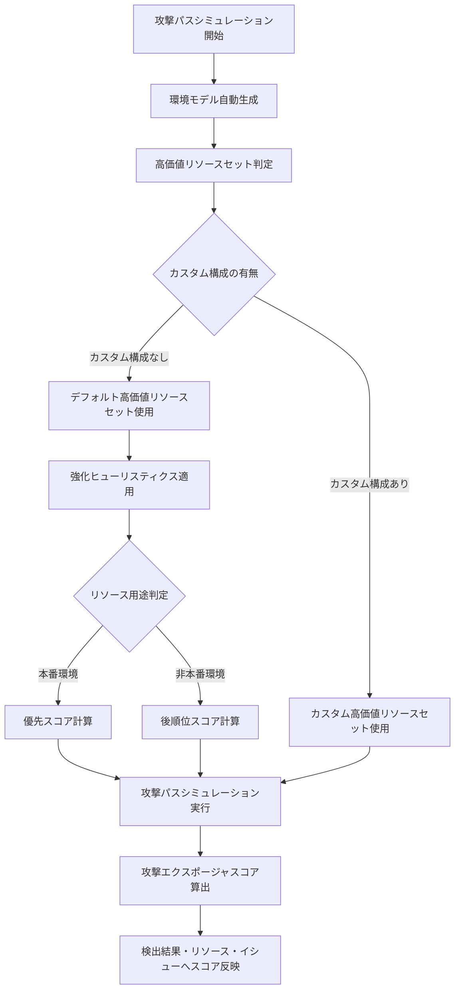

# Security Command Center: Risk Engine のデフォルト高価値リソースに対する強化ヒューリスティクス

**リリース日**: 2026-03-27

**サービス**: Security Command Center

**機能**: Risk Engine enhanced heuristics for default high-value resources

**ステータス**: Announcement

📊 [このアップデートのインフォグラフィックを見る](https://takech9203.github.io/google-cloud-news-summary/20260327-security-command-center-risk-engine-heuristics.html)

## 概要

Security Command Center の Risk Engine において、デフォルト高価値リソースセットの識別精度を向上させる強化ヒューリスティクスがリリースされました。この改善により、Risk Engine は本番環境以外の用途で使用されているリソースをより正確に識別し、攻撃エクスポージャスコアの計算優先順位を最適化します。

デフォルト高価値リソースセットを使用している組織では、検出結果（Findings）、リソース、およびイシューのエクスポージャスコアに変動が生じる可能性があります。これは、ヒューリスティクスが非本番リソースを識別し、本番環境のリソースに対するスコア計算を優先するようになったためです。

このアップデートは、Security Command Center Premium および Enterprise ティアを組織レベルで有効化しているユーザーが対象です。カスタムの高価値リソースセットを定義している場合は影響を受けません。

**アップデート前の課題**

- デフォルト高価値リソースセットでは、本番環境と非本番環境のリソースが同等に扱われていた
- 非本番リソース（開発・テスト環境など）にも同じ優先度でスコアが計算され、セキュリティチームの注意が分散していた
- 攻撃エクスポージャスコアが実際のビジネスリスクを正確に反映していない場合があった

**アップデート後の改善**

- Risk Engine が強化ヒューリスティクスにより非本番リソースを自動的に識別できるようになった
- 本番環境のリソースに対するスコア計算が優先され、より重要な資産から先にスコアが算出されるようになった
- セキュリティチームが真にリスクの高いリソースに集中できるようになり、対応の効率が向上した

## アーキテクチャ図



Risk Engine はまず環境のグラフモデルを生成し、高価値リソースセットに対して攻撃パスシミュレーションを実行します。今回の強化ヒューリスティクスにより、デフォルトセット使用時に本番リソースのスコア計算が優先されるようになりました。

## サービスアップデートの詳細

### 主要機能

1. **非本番リソースの自動識別**
   - Risk Engine がヒューリスティクスを使用して、デフォルト高価値リソースセット内の非本番用途のアセットを自動的に識別
   - 開発環境、テスト環境、ステージング環境などのリソースが対象

2. **スコア計算の優先順位最適化**
   - 本番環境のリソースに対する攻撃エクスポージャスコアが先に計算される
   - 非本番リソースのスコアは後順位で計算されるため、重要なアセットの情報が確実に提供される

3. **エクスポージャスコアの精度向上**
   - 検出結果（Findings）、リソース、およびイシューのスコアがより正確にビジネスリスクを反映
   - Toxic Combination や Chokepoint の検出精度も間接的に向上

## 技術仕様

### デフォルト高価値リソースセットの対象リソースタイプ

| リソースタイプ | 説明 |
|------|------|
| `aiplatform.googleapis.com/Model` | Vertex AI モデル |
| `artifactregistry.googleapis.com/Repository` | Artifact Registry リポジトリ |
| `bigquery.googleapis.com/Dataset` | BigQuery データセット |
| `cloudbuild.googleapis.com/BuildTrigger` | Cloud Build トリガー |
| `cloudfunctions.googleapis.com/CloudFunction` | Cloud Functions 関数 |
| `compute.googleapis.com/Instance` | Compute Engine インスタンス |
| `run.googleapis.com/Job` | Cloud Run ジョブ |
| `run.googleapis.com/Service` | Cloud Run サービス |
| `spanner.googleapis.com/Instance` | Spanner インスタンス |
| `sqladmin.googleapis.com/Instance` | Cloud SQL インスタンス |
| `storage.googleapis.com/Bucket` | Cloud Storage バケット |

### スコア計算の仕組み

| 項目 | 詳細 |
|------|------|
| シミュレーション頻度 | 約 6 時間ごと（最低 1 日 1 回） |
| デフォルト優先度 | LOW（Sensitive Data Protection 未使用時） |
| 高感度データ連携時 | HIGH または MEDIUM に自動昇格 |
| 高価値リソース上限 | クラウドプロバイダーごとに 1,000 インスタンス |
| リソース値構成上限 | 組織あたり最大 100 構成 |

### 必要な IAM ロール

```
roles/securitycenter.attackPathsViewer     # 攻撃パスの閲覧
roles/securitycenter.findingsViewer        # 検出結果の閲覧
roles/securitycenter.assetsViewer          # アセットの閲覧
roles/securitycenter.valuedResourcesViewer # 高価値リソースの閲覧
```

## 設定方法

### 前提条件

1. Security Command Center Premium または Enterprise ティアが組織レベルで有効化されていること
2. 適切な IAM ロールが付与されていること

### 手順

#### ステップ 1: 現在の高価値リソースセットの確認

Google Cloud コンソールで Security Command Center の設定ページを開き、Attack path simulation タブから現在の高価値リソースセットを確認します。デフォルトセットを使用している場合、今回のヒューリスティクス強化の影響を受けます。

#### ステップ 2: エクスポージャスコアの変動確認

シミュレーション実行後、以下の手順でスコアの変動を確認します。

1. Google Cloud コンソールで Security Command Center の Assets ページに移動
2. High value resource set タブを選択
3. 攻撃エクスポージャスコアの変動を確認

#### ステップ 3: カスタム高価値リソースセットの定義（推奨）

デフォルトセットではなく、組織のセキュリティ優先度に基づいたカスタム高価値リソースセットを定義することが推奨されます。

1. Security Command Center の Settings ページで Attack path simulation タブを開く
2. Create new configuration をクリック
3. リソースタイプ、スコープ、タグ、リソース値を指定して構成を作成

## メリット

### ビジネス面

- **セキュリティ対応の効率化**: 本番環境の重要リソースに対するスコアが優先的に計算されるため、セキュリティチームが真にリスクの高い問題に迅速に対応可能
- **リスク可視化の精度向上**: 非本番リソースによるノイズが低減され、経営層への報告においてもより正確なリスク状況を提示可能

### 技術面

- **自動的な優先順位付け**: ヒューリスティクスによる自動判定のため、手動での構成変更が不要
- **スコア信頼性の向上**: 攻撃エクスポージャスコアがビジネス上の実際のリスクをより正確に反映するようになり、Toxic Combination や Chokepoint の対応判断が改善

## デメリット・制約事項

### 制限事項

- デフォルト高価値リソースセットを使用している場合のみ影響がある（カスタム構成を定義済みの場合は無関係）
- 組織レベルでの Security Command Center 有効化が必須（プロジェクトレベルでは利用不可）
- ヒューリスティクスの判定基準は公開されていないため、特定のリソースがどのように分類されるかを事前に予測することは困難

### 考慮すべき点

- スコアの変動により、既存のアラートしきい値やダッシュボードの見直しが必要になる場合がある
- 非本番リソースと判定されたリソースのスコアが下がる可能性があるため、実際には重要なリソースが非本番と誤判定されていないか確認が推奨される
- デフォルトセットのリソースには LOW の優先度が割り当てられるため、より正確なスコアを得るにはカスタム高価値リソースセットの定義が推奨される

## ユースケース

### ユースケース 1: 大規模組織でのセキュリティ優先順位付け

**シナリオ**: 数千の Compute Engine インスタンスと Cloud Storage バケットを持つ大規模組織で、開発・テスト・本番環境が混在している。デフォルト高価値リソースセットを使用しているが、非本番リソースのスコアがノイズとなり、本番環境の重要な脆弱性への対応が遅れていた。

**効果**: 強化ヒューリスティクスにより、本番環境のリソースに対するスコアが優先的に計算され、セキュリティチームは最も重要な脆弱性から順に対応できるようになる。

### ユースケース 2: Toxic Combination 検出の精度向上

**シナリオ**: 複数のクラウドサービスを利用する組織で、Toxic Combination（複合的な脆弱性の組み合わせ）の検出結果が多数報告されている。非本番リソースに関連する検出結果も含まれており、優先度の判断が難しかった。

**効果**: 本番環境に関連する Toxic Combination のスコアが優先的に計算されるため、実際にビジネスインパクトの大きい複合脆弱性への対応を効率的に進められる。

## 料金

Risk Engine は Security Command Center Premium および Enterprise ティアの機能として含まれています。今回のヒューリスティクス強化による追加料金は発生しません。

| ティア | Risk Engine 利用 |
|--------|-----------------|
| Standard | 利用不可 |
| Premium | 利用可能 |
| Enterprise | 利用可能 |

## 関連サービス・機能

- **Sensitive Data Protection**: データ機密性に基づく自動優先度設定と連携し、HIGH/MEDIUM 感度データを含むリソースの優先度を自動調整
- **Cloud Asset Inventory**: Risk Engine が攻撃パスシミュレーションのモデル生成で使用するリソースインベントリ情報を提供
- **Event Threat Detection / Container Threat Detection**: Risk Engine が潜在的リスクを評価するのに対し、これらは実際の脅威をリアルタイムで検出

## 参考リンク

- 📊 [インフォグラフィック](https://takech9203.github.io/google-cloud-news-summary/20260327-security-command-center-risk-engine-heuristics.html)
- [公式リリースノート](https://cloud.google.com/security-command-center/docs/release-notes)
- [攻撃エクスポージャスコアと攻撃パスの概要](https://cloud.google.com/security-command-center/docs/attack-exposure-learn)
- [高価値リソースセットの定義と管理](https://cloud.google.com/security-command-center/docs/attack-exposure-define-high-value-resource-set)
- [Risk Engine サポート対象機能](https://cloud.google.com/security-command-center/docs/attack-exposure-supported-features)

## まとめ

今回の Risk Engine の強化ヒューリスティクスにより、デフォルト高価値リソースセットを使用している組織は、本番環境のリソースに対するより正確な攻撃エクスポージャスコアを取得できるようになりました。スコアの変動が予想されるため、既存のセキュリティ運用フローへの影響を確認することを推奨します。また、より正確なリスク評価のために、組織固有のカスタム高価値リソースセットを定義することが引き続き推奨されます。

---

**タグ**: Security Command Center, Risk Engine, 攻撃エクスポージャスコア, 高価値リソース, ヒューリスティクス, セキュリティ, 攻撃パス
