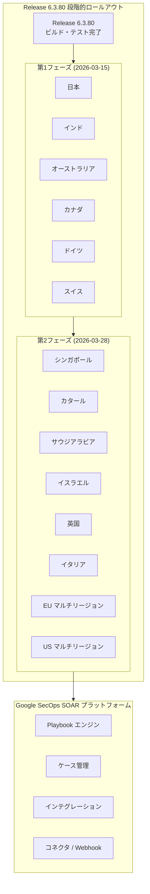

# Google SecOps SOAR: Release 6.3.80 が全リージョンで利用可能に

**リリース日**: 2026-03-28

**サービス**: Google SecOps SOAR (Security Orchestration, Automation, and Response)

**機能**: Release 6.3.80 全リージョン展開完了

**ステータス**: 全リージョンで利用可能 (GA)

📊 [このアップデートのインフォグラフィックを見る](https://takech9203.github.io/google-cloud-news-summary/20260328-google-secops-soar-release-6-3-80.html)

## 概要

Google SecOps SOAR の Release 6.3.80 が全リージョンで利用可能になりました。本リリースは 2026年3月15日に第1フェーズのリージョン (日本、インド、オーストラリア、カナダ、ドイツ、スイス) への展開が開始され、約2週間の段階的ロールアウトを経て、3月28日に第2フェーズのリージョン (シンガポール、カタール、サウジアラビア、イスラエル、英国、イタリア、EU マルチリージョン、US マルチリージョン) を含む全リージョンへの展開が完了しました。

本リリースには、内部バグ修正およびカスタマーから報告されたバグ修正が含まれています。Google SecOps SOAR はセキュリティオーケストレーション、自動化、レスポンスのためのプラットフォームであり、セキュリティチームが脅威の検出、調査、対応を自動化するために使用されています。定期的なリリースによるバグ修正は、プラットフォームの安定性と信頼性を維持するために重要です。

なお、本リリースは最近の Google SecOps SOAR における重要なマイルストーンと並行して提供されています。2026年3月17日には SOAR Permission Groups の Google Cloud IAM への移行が GA となり、3月16日には SOAR の Google Cloud への移行 Stage 2 の期限が 2026年9月30日まで延長されるアナウンスも行われています。

## アーキテクチャ図

Google SecOps SOAR のリリースは2段階のロールアウトプロセスを経て全リージョンに展開されます。第1フェーズで安定性を確認した後、第2フェーズで残りのリージョンに展開する方式により、リスクを最小化しています。

## サービスアップデートの詳細

### 主要機能

1. **内部バグ修正**
   - Google 内部で検出された問題の修正が含まれています
   - プラットフォームの安定性と信頼性が向上しています

2. **カスタマーバグ修正**
   - カスタマーから報告された問題に対する修正が含まれています
   - ユーザー体験の改善が図られています

3. **全リージョン展開完了**
   - 第1フェーズ (6リージョン) と第2フェーズ (8リージョン) の全14リージョンで利用可能になりました
   - すべてのカスタマーが最新バージョンを利用できる状態になっています

## 技術仕様

### リリース情報

| 項目 | 詳細 |
|------|------|
| リリースバージョン | 6.3.80 |
| 前バージョン | 6.3.79 |
| 第1フェーズ展開日 | 2026年3月15日 (日曜日) |
| 全リージョン展開日 | 2026年3月28日 |
| メンテナンスウィンドウ | 毎週日曜日 11:00-15:00 UTC |
| リリース内容 | 内部バグ修正、カスタマーバグ修正 |

### リリーススケジュールの仕組み

Google SecOps SOAR のリリースは通常、日曜日に実施される2段階のロールアウトプロセスに従います。第2フェーズのリージョンは、第1フェーズのリージョンから約1週間後にアップグレードされます。

## 利用可能リージョン

### 第1フェーズリージョン (2026-03-15 展開済み)

| リージョン |
|-----------|
| 日本 |
| インド |
| オーストラリア |
| カナダ |
| ドイツ |
| スイス |

### 第2フェーズリージョン (2026-03-28 展開完了)

| リージョン |
|-----------|
| シンガポール |
| カタール |
| サウジアラビア |
| イスラエル |
| 英国 (ロンドン) |
| イタリア |
| EU (マルチリージョン) |
| US (マルチリージョン) |

## メリット

### ビジネス面

- **プラットフォームの安定性向上**: バグ修正によりセキュリティ運用の中断リスクが低減されます
- **段階的ロールアウトによるリスク軽減**: 2段階の展開プロセスにより、問題が全リージョンに波及する前に検出・対処が可能です

### 技術面

- **継続的なバグ修正**: 週次リリースサイクルにより、問題の早期解決が実現されています
- **全リージョンでの統一バージョン**: すべてのリージョンで同一バージョンが稼働することで、環境間の一貫性が確保されています

## デメリット・制約事項

### 制限事項

- 本リリースの具体的なバグ修正内容の詳細は公開されていません
- メンテナンスウィンドウ中 (日曜日 11:00-15:00 UTC) に一時的なサービス影響が発生する可能性があります

### 考慮すべき点

- SOAR の Google Cloud への移行 Stage 2 の期限が 2026年9月30日に延長されています。まだ移行を完了していない場合は、計画的な対応が推奨されます
- レガシー SOAR API は 2026年6月に完全に非機能化される予定です。Chronicle API への移行がまだの場合は早急な対応が必要です

## 関連サービス・機能

- **Google SecOps SIEM**: SOAR と統合されたセキュリティ情報・イベント管理プラットフォーム。SOAR のプレイブック機能と連携してアラートの自動処理を実現します
- **Google Cloud IAM**: 2026年3月17日に GA となった SOAR Permission Groups の IAM 移行により、より精密なアクセス制御が可能になりました
- **SOAR Playbook エンジン**: セキュリティワークフローの自動化を実現するコア機能。Gemini を活用したプレイブック作成機能も利用可能です
- **SOAR Marketplace**: サードパーティ製インテグレーションやユースケースを提供するコンテンツハブ

## 参考リンク

- 📊 [インフォグラフィック](https://takech9203.github.io/google-cloud-news-summary/20260328-google-secops-soar-release-6-3-80.html)
- [公式リリースノート](https://docs.cloud.google.com/chronicle/docs/soar/release-notes)
- [Google SecOps SOAR 概要ドキュメント](https://docs.cloud.google.com/chronicle/docs/soar/overview-and-introduction/soar-overview)
- [段階的リリース計画](https://docs.cloud.google.com/chronicle/docs/soar/overview-and-introduction/soar-gradual-release)
- [SOAR の Google Cloud への移行ガイド](https://docs.cloud.google.com/chronicle/docs/soar/admin-tasks/advanced/migrate-to-gcp)
- [Google SecOps 料金](https://docs.cloud.google.com/chronicle/docs/onboard/understand-billing)

## まとめ

Google SecOps SOAR Release 6.3.80 が全リージョンで利用可能になり、内部およびカスタマーから報告されたバグ修正が適用されました。本リリースは段階的ロールアウトプロセスを通じて安全に展開されており、すべてのカスタマーが最新の安定版を利用できる状態です。SOAR をご利用の方は、併せてレガシー API の Chronicle API への移行 (2026年6月期限) および SOAR の Google Cloud 移行 Stage 2 (2026年9月30日期限) の対応状況もご確認ください。

---

**タグ**: #GoogleCloud #GoogleSecOps #SOAR #セキュリティ #Release #バグ修正 #全リージョン展開 #SecurityOperations
