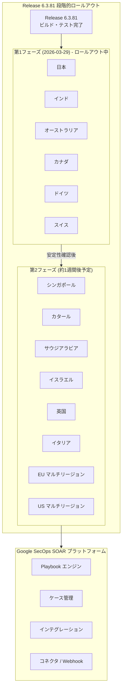

# Google SecOps SOAR: Release 6.3.81 が第1フェーズリージョンへ展開開始

**リリース日**: 2026-03-29

**サービス**: Google SecOps SOAR (Security Orchestration, Automation, and Response)

**機能**: Release 6.3.81 第1フェーズリージョン展開開始

**ステータス**: 第1フェーズリージョンへロールアウト中

📊 [このアップデートのインフォグラフィックを見る](https://takech9203.github.io/google-cloud-news-summary/20260329-google-secops-soar-release-6-3-81.html)

## 概要

Google SecOps SOAR の Release 6.3.81 が第1フェーズのリージョン (日本、インド、オーストラリア、カナダ、ドイツ、スイス) への段階的ロールアウトを開始しました。本リリースには、内部バグ修正およびカスタマーから報告されたバグ修正が含まれています。

Google SecOps SOAR はセキュリティオーケストレーション、自動化、レスポンスのためのプラットフォームであり、セキュリティチームが脅威の検出、調査、対応を効率的に自動化するために使用されています。Release 6.3.81 は前バージョン 6.3.80 (2026年3月28日に全リージョン展開完了) に続く定期リリースであり、週次リリースサイクルに基づいてプラットフォームの安定性と信頼性を継続的に向上させるものです。

第2フェーズのリージョン (シンガポール、カタール、サウジアラビア、イスラエル、英国、イタリア、EU マルチリージョン、US マルチリージョン) への展開は、第1フェーズの安定性確認後、約1週間後の日曜日に実施される予定です。

**アップデート前の状況**

- Release 6.3.80 が全リージョンで稼働中であり、内部およびカスタマーバグが存在していた
- 第1フェーズリージョンのユーザーは 6.3.80 バージョンを使用していた

**アップデート後の改善**

- Release 6.3.81 により、内部で検出された問題が修正されプラットフォームの安定性が向上
- カスタマーから報告されたバグが修正されユーザー体験が改善
- 第1フェーズリージョンから段階的に最新の安定版が利用可能に

## アーキテクチャ図

Google SecOps SOAR のリリースは2段階のロールアウトプロセスを経て全リージョンに展開されます。第1フェーズで安定性を確認した後、約1週間後に第2フェーズで残りのリージョンに展開する方式により、リスクを最小化しています。

## サービスアップデートの詳細

### 主要内容

1. **内部バグ修正**
   - Google 内部で検出された問題の修正が含まれています
   - プラットフォームの安定性と信頼性が向上しています

2. **カスタマーバグ修正**
   - カスタマーから報告された問題に対する修正が含まれています
   - ユーザー体験の改善が図られています

3. **段階的ロールアウト開始**
   - 第1フェーズの6リージョンへの展開が開始されました
   - メンテナンスウィンドウ (日曜日 11:00-15:00 UTC) に実施されます

## 技術仕様

### リリース情報

| 項目 | 詳細 |
|------|------|
| リリースバージョン | 6.3.81 |
| 前バージョン | 6.3.80 |
| 第1フェーズ展開日 | 2026年3月29日 (日曜日) |
| 第2フェーズ展開予定 | 約1週間後 (日曜日) |
| メンテナンスウィンドウ | 毎週日曜日 11:00-15:00 UTC |
| リリース内容 | 内部バグ修正、カスタマーバグ修正 |

## 利用可能リージョン

### 第1フェーズリージョン (2026-03-29 展開開始)

| リージョン | ステータス |
|-----------|-----------|
| 日本 | ロールアウト中 |
| インド | ロールアウト中 |
| オーストラリア | ロールアウト中 |
| カナダ | ロールアウト中 |
| ドイツ | ロールアウト中 |
| スイス | ロールアウト中 |

### 第2フェーズリージョン (展開予定)

| リージョン | ステータス |
|-----------|-----------|
| シンガポール | 待機中 |
| カタール | 待機中 |
| サウジアラビア | 待機中 |
| イスラエル | 待機中 |
| 英国 (ロンドン) | 待機中 |
| イタリア | 待機中 |
| EU (マルチリージョン) | 待機中 |
| US (マルチリージョン) | 待機中 |

## メリット

### ビジネス面

- **プラットフォームの安定性向上**: バグ修正によりセキュリティ運用の中断リスクが低減されます
- **段階的ロールアウトによるリスク軽減**: 2段階の展開プロセスにより、問題が全リージョンに波及する前に検出・対処が可能です

### 技術面

- **継続的なバグ修正**: 週次リリースサイクルにより、問題の早期解決が実現されています
- **迅速なリリースサイクル**: Release 6.3.80 の全リージョン展開完了翌日に 6.3.81 の展開が開始され、継続的な改善が行われています

## デメリット・制約事項

### 制限事項

- 本リリースの具体的なバグ修正内容の詳細は公開されていません
- メンテナンスウィンドウ中 (日曜日 11:00-15:00 UTC) に一時的なサービス影響が発生する可能性があります
- 第2フェーズリージョンのユーザーは、展開完了まで 6.3.80 を継続使用します

### 考慮すべき点

- SOAR の Google Cloud への移行 Stage 2 の期限が 2026年9月30日に延長されています。まだ移行を完了していない場合は、計画的な対応が推奨されます
- SOAR Permission Groups の Google Cloud IAM への移行が GA となっています (2026年3月17日)。レガシー権限グループからの移行を検討してください

## 関連サービス・機能

- **Google SecOps SIEM**: SOAR と統合されたセキュリティ情報・イベント管理プラットフォーム。SOAR のプレイブック機能と連携してアラートの自動処理を実現します
- **Security Command Center**: Google Cloud のセキュリティ態勢管理プラットフォーム。SecOps と連携して脅威の検出から対応までの統合ワークフローを提供します
- **Google Cloud IAM**: SOAR Permission Groups の IAM 移行により、より精密なアクセス制御が可能になりました
- **SOAR Marketplace**: サードパーティ製インテグレーションやユースケースを提供するコンテンツハブ

## 参考リンク

- 📊 [インフォグラフィック](https://takech9203.github.io/google-cloud-news-summary/20260329-google-secops-soar-release-6-3-81.html)
- [公式リリースノート](https://cloud.google.com/release-notes#March_29_2026)
- [Google SecOps SOAR リリースノート](https://docs.cloud.google.com/chronicle/docs/soar/release-notes)
- [段階的リリース計画](https://docs.cloud.google.com/chronicle/docs/soar/overview-and-introduction/soar-gradual-release)
- [SOAR の Google Cloud への移行ガイド](https://docs.cloud.google.com/chronicle/docs/soar/admin-tasks/advanced/migrate-to-gcp)
- [SOAR Permission Groups IAM 移行ガイド](https://docs.cloud.google.com/chronicle/docs/soar/admin-tasks/advanced/migrate-soar-permissions-iam)
- [Google SecOps 料金](https://docs.cloud.google.com/chronicle/docs/onboard/understand-billing)

## まとめ

Google SecOps SOAR Release 6.3.81 が第1フェーズのリージョン (日本、インド、オーストラリア、カナダ、ドイツ、スイス) への段階的ロールアウトを開始しました。本リリースには内部およびカスタマーバグ修正が含まれており、約1週間後に第2フェーズリージョンへの展開が予定されています。SOAR をご利用の方は、併せて SOAR Permission Groups の IAM 移行 (GA 済み) および SOAR の Google Cloud 移行 Stage 2 (2026年9月30日期限) の対応状況もご確認ください。

---

**タグ**: #GoogleCloud #GoogleSecOps #SOAR #セキュリティ #Release #バグ修正 #段階的ロールアウト #SecurityOperations
