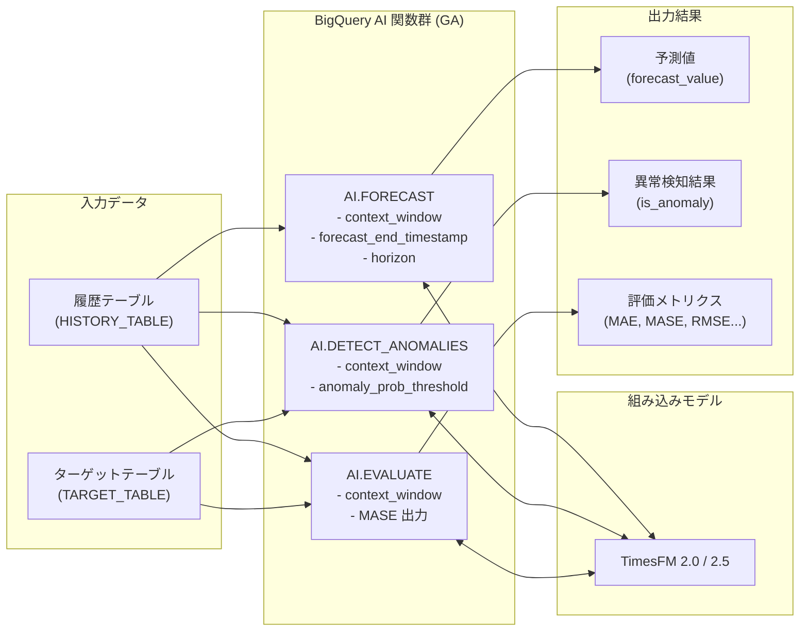

# BigQuery: AI 予測・異常検知関数の GA (一般提供開始)

**リリース日**: 2026-03-30

**サービス**: BigQuery

**機能**: AI.FORECAST / AI.DETECT_ANOMALIES / AI.EVALUATE 関数の機能強化と GA

**ステータス**: GA (一般提供)

[このアップデートのインフォグラフィックを見る](https://takech9203.github.io/google-cloud-news-summary/20260330-bigquery-ai-forecasting-anomaly-detection-ga.html)

## 概要

BigQuery の時系列予測・異常検知に関する AI 関数群 (`AI.FORECAST`、`AI.DETECT_ANOMALIES`、`AI.EVALUATE`) に新たな機能が追加され、一般提供 (GA) となりました。これらの関数は BigQuery ML に組み込まれた TimesFM モデルを活用し、モデルの作成やトレーニングを必要とせずに時系列データの予測・異常検知・評価を SQL だけで実行できる機能です。

今回のアップデートでは、カスタムコンテキストウィンドウの指定、予測の終了タイムスタンプ指定、そして平均絶対スケール誤差 (MASE) の出力といった新機能が追加されました。これにより、ユーザーはモデルが参照するデータポイントの範囲をきめ細かく制御でき、予測精度の評価もより包括的に行えるようになります。

データアナリスト、データサイエンティスト、ML エンジニアなど、BigQuery で時系列データを扱うすべてのユーザーが対象です。特に、需要予測、異常検知、KPI モニタリングなどのユースケースで大きな恩恵を受けます。

**アップデート前の課題**

- AI.DETECT_ANOMALIES でモデルが参照するデータポイント数を明示的に制御できず、自動選択に依存していた
- AI.FORECAST で予測の終了時点を柔軟に指定する手段が限られていた
- AI.EVALUATE の出力メトリクスに平均絶対スケール誤差 (MASE) が含まれておらず、スケール非依存の精度評価が難しかった
- AI.EVALUATE でコンテキストウィンドウをカスタム指定できず、評価条件の統一が困難だった

**アップデート後の改善**

- AI.DETECT_ANOMALIES に `context_window` パラメータが追加され、最新のデータポイントから何個を使用するかを明示的に制御可能になった
- AI.FORECAST に `forecast_end_timestamp` パラメータが追加され、予測の終了タイムスタンプを直接指定可能になった
- AI.EVALUATE に `context_window` パラメータが追加され、評価時に使用するデータポイント数を制御可能になった
- AI.EVALUATE の出力に `mean_absolute_scaled_error` (MASE) が追加され、時系列のスケールに依存しない精度評価が可能になった

## アーキテクチャ図



BigQuery の AI 関数群は、入力データを受け取り、組み込みの TimesFM モデルを使用して予測・異常検知・評価を実行します。今回の GA では各関数にコンテキストウィンドウの制御機能が追加され、モデルへの入力をより精密に制御できるようになりました。

## サービスアップデートの詳細

### 主要機能

1. **AI.DETECT_ANOMALIES のカスタムコンテキストウィンドウ**
   - `context_window` パラメータで、異常検知に使用する最新データポイント数を明示的に指定可能
   - TimesFM 2.0 では 64, 128, 256, 512, 1024, 2048 から選択
   - TimesFM 2.5 では最大 15,360 まで対応 (64, 128, 256, 512, 1024, 2048, 4096, 8192, 15360)
   - 未指定の場合は入力データポイント数に基づいて自動選択される

2. **AI.FORECAST の予測終了タイムスタンプ指定**
   - `forecast_end_timestamp` パラメータにより、予測の終了時点をタイムスタンプリテラルで直接指定可能
   - ホライズンは終了タイムスタンプと入力データの頻度から自動算出される
   - 算出されたホライズンが有効範囲 [1, 10,000] 外の場合はエラーが返される
   - `horizon` パラメータとの同時使用は不可

3. **AI.EVALUATE のカスタムコンテキストウィンドウと MASE 出力**
   - `context_window` パラメータにより、評価時に使用するデータポイント数を制御可能
   - 出力に `mean_absolute_scaled_error` (MASE) が新たに追加
   - MASE はスケールに依存しないメトリクスであり、異なるスケールの時系列間での精度比較が可能

## 技術仕様

### コンテキストウィンドウの設定値

| モデル | サポートされるコンテキストウィンドウ長 |
|--------|--------------------------------------|
| TimesFM 2.0 | 64, 128, 256, 512, 1024, 2048 |
| TimesFM 2.5 | 64, 128, 256, 512, 1024, 2048, 4096, 8192, 15360 |

### AI.EVALUATE の出力メトリクス

| メトリクス | 説明 |
|-----------|------|
| `mean_absolute_error` | 平均絶対誤差 (MAE) |
| `mean_squared_error` | 平均二乗誤差 (MSE) |
| `root_mean_squared_error` | 二乗平均平方根誤差 (RMSE) |
| `mean_absolute_percentage_error` | 平均絶対パーセント誤差 (MAPE) |
| `symmetric_mean_absolute_percentage_error` | 対称平均絶対パーセント誤差 (sMAPE) |
| `mean_absolute_scaled_error` | 平均絶対スケール誤差 (MASE) **[新規追加]** |

### データ型の要件

| パラメータ | サポートされるデータ型 |
|-----------|----------------------|
| `data_col` | INT64, NUMERIC, BIGNUMERIC, FLOAT64 |
| `timestamp_col` | TIMESTAMP, DATE, DATETIME |
| `id_cols` | STRING, INT64, ARRAY<STRING>, ARRAY<INT64> |

## 設定方法

### 前提条件

1. BigQuery が有効化された Google Cloud プロジェクト
2. BigQuery に対する適切な IAM 権限 (`bigquery.jobs.create` 等)
3. 時系列データが格納されたテーブルまたはクエリ

### 手順

#### ステップ 1: AI.DETECT_ANOMALIES でカスタムコンテキストウィンドウを使用

```sql
SELECT *
FROM AI.DETECT_ANOMALIES(
  TABLE `mydataset.history_table`,
  TABLE `mydataset.target_table`,
  data_col    => 'units_sold',
  timestamp_col => 'sales_date',
  context_window => 512
);
```

`context_window` に 512 を指定することで、最新 512 データポイントを使用して異常検知を実行します。

#### ステップ 2: AI.FORECAST で予測終了タイムスタンプを指定

```sql
SELECT *
FROM AI.FORECAST(
  TABLE `mydataset.sales_data`,
  data_col    => 'revenue',
  timestamp_col => 'sale_date',
  forecast_end_timestamp => '2026-06-30'
);
```

`forecast_end_timestamp` を指定することで、指定した日付まで予測が生成されます。

#### ステップ 3: AI.EVALUATE でカスタムコンテキストウィンドウと MASE を確認

```sql
SELECT *
FROM AI.EVALUATE(
  (SELECT * FROM `mydataset.history_data` WHERE date < '2026-01-01'),
  (SELECT * FROM `mydataset.actual_data` WHERE date >= '2026-01-01'),
  data_col    => 'num_orders',
  timestamp_col => 'date',
  context_window => 1024
);
```

結果には従来のメトリクスに加えて `mean_absolute_scaled_error` が含まれます。

## メリット

### ビジネス面

- **予測精度の向上**: コンテキストウィンドウを業務要件に合わせて最適化することで、予測精度を向上させ、より信頼性の高いビジネス判断が可能になる
- **運用効率の改善**: SQL だけで高度な時系列分析が完結するため、ML モデルの管理コストを削減でき、データアナリストだけでも時系列分析を実行可能
- **柔軟な予測計画**: 終了タイムスタンプ指定により、四半期末や会計年度末といったビジネスカレンダーに合わせた予測を簡単に生成可能

### 技術面

- **きめ細かな制御**: コンテキストウィンドウのカスタム指定により、データの特性に応じた最適な設定が可能
- **包括的な評価指標**: MASE の追加により、異なるスケールの時系列を公平に比較評価可能。ナイーブ予測に対する相対的な精度を定量化できる
- **GA の安定性**: プレビューから GA に昇格したことで、SLA による保証が適用され、本番ワークロードでの利用が推奨される

## デメリット・制約事項

### 制限事項

- AI.DETECT_ANOMALIES では最新 1,024 データポイントのみが評価対象。より多くのデータポイントの評価が必要な場合は bqml-feedback@google.com への問い合わせが必要
- TimesFM 2.0 では最大コンテキストウィンドウが 2,048、TimesFM 2.5 では 15,360 が上限
- AI.FORECAST の `forecast_end_timestamp` と `horizon` は同時に使用不可
- 時系列データポイントが 3 未満の場合はエラーが発生する

### 考慮すべき点

- コンテキストウィンドウを大きく設定するとコンピュート使用量が増加し、コストに影響する可能性がある
- TimesFM モデルは組み込みモデルのため、ハイパーパラメータのカスタムチューニングは不可
- ARIMA_PLUS モデルとは異なる関数体系 (`AI.*` vs `ML.*`) のため、既存ワークフローからの移行時には注意が必要

## ユースケース

### ユースケース 1: EC サイトの売上異常検知

**シナリオ**: EC サイトで日次売上データを監視し、通常の変動パターンから外れた異常な売上増減を検知したい。過去 512 日分のデータを参照して精度を高めたい。

**実装例**:
```sql
SELECT *
FROM AI.DETECT_ANOMALIES(
  TABLE `ecommerce.daily_sales_history`,
  TABLE `ecommerce.daily_sales_recent`,
  data_col           => 'total_revenue',
  timestamp_col      => 'sale_date',
  id_cols            => ['product_category'],
  anomaly_prob_threshold => 0.95,
  context_window     => 512
);
```

**効果**: 商品カテゴリごとの異常を自動検知し、不正取引やシステム障害の早期発見が可能になる。コンテキストウィンドウの指定により、季節性を考慮した精度の高い検知を実現。

### ユースケース 2: 会計年度末までの売上予測

**シナリオ**: 3 月期決算企業が、現在の売上トレンドに基づいて会計年度末 (3 月末) までの売上を予測したい。

**実装例**:
```sql
SELECT *
FROM AI.FORECAST(
  TABLE `finance.monthly_revenue`,
  data_col              => 'revenue',
  timestamp_col         => 'month',
  id_cols               => ['business_unit'],
  forecast_end_timestamp => '2027-03-31',
  confidence_level      => 0.9
);
```

**効果**: `forecast_end_timestamp` を使用して会計年度末ぴったりまでの予測を生成でき、経営層への報告や予算策定に活用可能。

### ユースケース 3: 複数 KPI の予測精度比較

**シナリオ**: 異なるスケールを持つ複数の KPI (売上金額、注文件数、アクティブユーザー数) の予測精度を MASE で統一的に比較したい。

**実装例**:
```sql
-- 各 KPI に対して AI.EVALUATE を実行し、MASE を比較
SELECT 'revenue' AS kpi, mean_absolute_scaled_error
FROM AI.EVALUATE(
  (SELECT * FROM `analytics.history` WHERE metric = 'revenue' AND date < '2026-01-01'),
  (SELECT * FROM `analytics.actuals` WHERE metric = 'revenue' AND date >= '2026-01-01'),
  data_col => 'value', timestamp_col => 'date', context_window => 1024
)
UNION ALL
SELECT 'orders' AS kpi, mean_absolute_scaled_error
FROM AI.EVALUATE(
  (SELECT * FROM `analytics.history` WHERE metric = 'orders' AND date < '2026-01-01'),
  (SELECT * FROM `analytics.actuals` WHERE metric = 'orders' AND date >= '2026-01-01'),
  data_col => 'value', timestamp_col => 'date', context_window => 1024
);
```

**効果**: MASE を使用することで、スケールが異なる KPI 間での予測精度を公平に比較でき、モデルの有効性を統一的に評価可能。MASE が 1.0 未満であればナイーブ予測よりも優れていることを示す。

## 料金

AI.FORECAST、AI.DETECT_ANOMALIES、AI.EVALUATE の使用料金は、BigQuery ML のオンデマンド料金における「評価・検査・予測 (evaluation, inspection, and prediction)」レートで課金されます。

### 料金体系

| 料金モデル | 説明 |
|-----------|------|
| オンデマンド | スキャンしたデータ量に基づく従量課金。BigQuery ML の操作は通常のクエリより高いレートが適用される場合あり |
| キャパシティベース (Editions) | スロット単位の課金。Standard / Enterprise / Enterprise Plus エディションから選択 |

### 料金例

| 使用量 | 月額料金 (概算) |
|--------|-----------------|
| オンデマンド分析 | $6.25 / TiB (US マルチリージョン) |
| Standard Edition (PAYG) | スロット時間あたりの課金 |
| Enterprise Edition (1 年コミットメント) | 割引レートが適用 |

料金の詳細は [BigQuery ML 料金ページ](https://cloud.google.com/bigquery/pricing#bigquery-ml-pricing) を参照してください。

## 利用可能リージョン

AI.FORECAST、AI.DETECT_ANOMALIES、AI.EVALUATE と TimesFM モデルは、BigQuery ML がサポートするすべてのロケーションで利用可能です。詳細は [BigQuery ML ロケーション](https://cloud.google.com/bigquery/docs/locations#bqml-loc) を参照してください。

## 関連サービス・機能

- **BigQuery ML (ARIMA_PLUS)**: 従来型の時系列予測モデル。CREATE MODEL でのモデルトレーニングが必要だが、より細かなカスタマイズが可能
- **BigQuery ML (TimesFM)**: 今回の AI 関数群が使用する組み込みモデル。モデル管理不要で即座に予測・異常検知を実行可能
- **Vertex AI Forecasting**: より高度な ML パイプラインが必要な場合の選択肢。AutoML ベースの時系列予測に対応
- **Looker / Looker Studio**: BigQuery の予測結果をダッシュボードで可視化するための BI ツール

## 参考リンク

- [インフォグラフィック](https://takech9203.github.io/google-cloud-news-summary/20260330-bigquery-ai-forecasting-anomaly-detection-ga.html)
- [公式リリースノート](https://docs.cloud.google.com/release-notes#March_30_2026)
- [AI.DETECT_ANOMALIES ドキュメント](https://docs.cloud.google.com/bigquery/docs/reference/standard-sql/bigqueryml-syntax-ai-detect-anomalies)
- [AI.FORECAST ドキュメント](https://docs.cloud.google.com/bigquery/docs/reference/standard-sql/bigqueryml-syntax-ai-forecast)
- [AI.EVALUATE ドキュメント](https://docs.cloud.google.com/bigquery/docs/reference/standard-sql/bigqueryml-syntax-ai-evaluate)
- [BigQuery ML 料金](https://cloud.google.com/bigquery/pricing#bigquery-ml-pricing)

## まとめ

BigQuery の AI 予測・異常検知関数群が GA となり、カスタムコンテキストウィンドウ、予測終了タイムスタンプ指定、MASE メトリクス出力といった実用的な機能が追加されました。これらの機能により、SQL だけで高精度な時系列分析を実行でき、モデル管理のオーバーヘッドなく本番環境での利用が可能です。BigQuery で時系列データを扱うユーザーは、既存の ARIMA_PLUS ベースのワークフローと比較検討し、TimesFM ベースの AI 関数群への移行を検討することを推奨します。

---

**タグ**: #BigQuery #BigQueryML #TimesFM #時系列予測 #異常検知 #GA #AI.FORECAST #AI.DETECT_ANOMALIES #AI.EVALUATE #MASE
