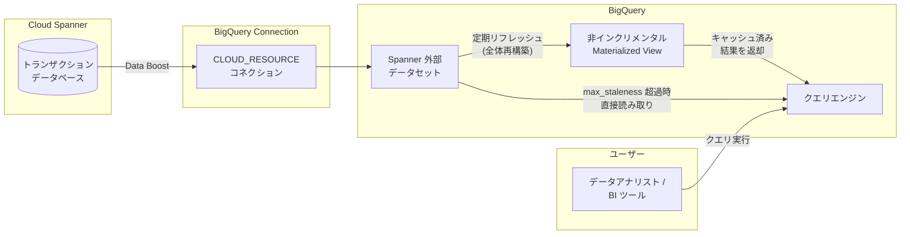

# BigQuery: Spanner データに対する非インクリメンタル Materialized View が GA

**リリース日**: 2026-03-30
**サービス**: BigQuery
**機能**: Spanner 外部データセットに対する非インクリメンタル Materialized View
**ステータス**: GA (Generally Available)

[このアップデートのインフォグラフィックを見る](https://takech9203.github.io/google-cloud-news-summary/20260330-bigquery-materialized-views-spanner.html)

## 概要

BigQuery において、Spanner 外部データセットのテーブルを参照する非インクリメンタル Materialized View の作成が一般提供 (GA) となった。`allow_non_incremental_definition` オプションを使用することで、Spanner データに対するクエリ結果を定期的にキャッシュし、クエリパフォーマンスを大幅に向上させることが可能になる。

Spanner はトランザクション処理に優れた OLTP データベースであるが、分析クエリの実行には最適化されていない。BigQuery の Materialized View を活用することで、Spanner に格納されたデータに対する集計・フィルタリング・結合などの分析クエリを高速化できる。これにより、Spanner のトランザクション性能を維持しながら、BigQuery 側で効率的な分析処理を実現するハイブリッドアーキテクチャが構築できる。

本機能は、Spanner をトランザクションデータベースとして使用しつつ、BigQuery で分析ワークロードを実行しているデータエンジニア、データアナリスト、アプリケーション開発者を主な対象としている。

**アップデート前の課題**

- Spanner 外部データセットに対する Materialized View は Preview 段階であり、本番ワークロードでの使用に制限があった
- Spanner データに対する分析クエリは毎回 Data Boost 経由でデータを取得する必要があり、繰り返しのクエリでもキャッシュが活用されなかった
- Spanner から BigQuery へのデータパイプラインを別途構築する必要があり、データの鮮度とパフォーマンスのトレードオフが課題であった

**アップデート後の改善**

- Spanner データに対する非インクリメンタル Materialized View が GA となり、本番環境での利用が正式にサポートされた
- `max_staleness` と `refresh_interval_minutes` の設定により、データ鮮度とパフォーマンスのバランスを柔軟に制御できるようになった
- 定期的なキャッシュ更新により、繰り返しの分析クエリのコストとレイテンシが大幅に削減された

## アーキテクチャ図



Spanner のデータは CLOUD_RESOURCE コネクション経由で BigQuery の外部データセットとして公開される。Materialized View は定期的にリフレッシュされ、キャッシュされた結果を返却する。`max_staleness` を超過した場合は、ベーステーブル (Spanner) から直接データが読み取られる。

## サービスアップデートの詳細

### 主要機能

1. **非インクリメンタル Materialized View の作成**
   - `allow_non_incremental_definition = true` オプションを指定して、Spanner 外部データセットのテーブルに対する Materialized View を作成できる
   - インクリメンタル (差分更新) ではなく、リフレッシュ時にビュー全体が再構築される

2. **自動リフレッシュ制御**
   - `enable_refresh = true` で自動リフレッシュを有効化
   - `refresh_interval_minutes` でリフレッシュ間隔を分単位で指定可能 (例: 60 分ごと)
   - リフレッシュはバックグラウンドで実行され、クエリの可用性に影響しない

3. **データ鮮度管理 (max_staleness)**
   - `max_staleness` パラメータでキャッシュデータの許容鮮度を設定
   - 最後のリフレッシュが `max_staleness` の範囲内であれば、キャッシュからデータを返却
   - 範囲外の場合は、Spanner のベーステーブルから直接データを読み取る

## 技術仕様

### Materialized View の設定パラメータ

| パラメータ | 説明 | 例 |
|------|------|------|
| `allow_non_incremental_definition` | 非インクリメンタル定義を許可 (Spanner では必須) | `true` |
| `enable_refresh` | 自動リフレッシュの有効/無効 | `true` |
| `refresh_interval_minutes` | リフレッシュ間隔 (分) | `60` |
| `max_staleness` | キャッシュデータの最大許容鮮度 | `INTERVAL "24" HOUR` |

### 必要な権限とロール

| ロール / 権限 | 用途 |
|------|------|
| `bigquery.connections.delegate` | CLOUD_RESOURCE コネクションの作成・管理 (BigQuery Connection Admin ロール) |
| `bigquery.tables.create` | Materialized View の作成 |
| Spanner データベースへの読み取り権限 | コネクションのサービスアカウントに付与 |

## 設定方法

### 前提条件

1. Spanner データベースが作成済みであること
2. BigQuery で CLOUD_RESOURCE コネクションが作成済みであること
3. コネクションのサービスアカウントに Spanner データベースへの読み取り権限が付与されていること
4. Spanner 外部データセットが CLOUD_RESOURCE コネクションを使用して作成済みであること

### 手順

#### ステップ 1: CLOUD_RESOURCE コネクションの作成

```bash
bq mk --connection --location=REGION --project_id=PROJECT_ID \
  --connection_type=CLOUD_RESOURCE CONNECTION_ID
```

コネクション作成後、サービスアカウント ID を確認する:

```bash
bq show --connection PROJECT_ID.REGION.CONNECTION_ID
```

出力されたサービスアカウントに Spanner データベースへの読み取り権限を付与する。

#### ステップ 2: Spanner 外部データセットの作成

```sql
CREATE EXTERNAL SCHEMA spanner_external_dataset
  WITH CONNECTION PROJECT_ID.REGION.CONNECTION_ID
  OPTIONS (
    external_source = 'google-cloudspanner:/projects/PROJECT_ID/instances/INSTANCE/databases/DATABASE',
    location = 'REGION'
  );
```

#### ステップ 3: 非インクリメンタル Materialized View の作成

```sql
CREATE MATERIALIZED VIEW my_dataset.my_spanner_mv
  OPTIONS (
    enable_refresh = true,
    refresh_interval_minutes = 60,
    max_staleness = INTERVAL "24" HOUR,
    allow_non_incremental_definition = true
  )
AS
  SELECT
    column1,
    COUNT(*) AS cnt,
    SUM(column2) AS total
  FROM
    spanner_external_dataset.my_table
  GROUP BY
    column1;
```

Materialized View の作成後、設定したリフレッシュ間隔に従って自動的にデータがキャッシュされる。

#### ステップ 4: Materialized View へのクエリ実行

```sql
SELECT * FROM my_dataset.my_spanner_mv;
```

キャッシュが `max_staleness` の範囲内であれば、キャッシュされた結果が返却される。

## メリット

### ビジネス面

- **分析コストの削減**: 繰り返し実行される分析クエリがキャッシュから返却されるため、Spanner Data Boost の使用量と BigQuery のクエリコストが削減される
- **データパイプラインの簡素化**: Spanner から BigQuery へのデータエクスポートパイプラインを構築する必要がなくなり、運用負荷が軽減される
- **本番環境での信頼性**: GA リリースにより SLA が適用され、本番ワークロードでの利用が正式にサポートされる

### 技術面

- **クエリパフォーマンスの向上**: 事前計算された集計結果を返却するため、クエリレイテンシが大幅に改善される
- **柔軟な鮮度制御**: `max_staleness` と `refresh_interval_minutes` の組み合わせで、ユースケースに応じたデータ鮮度とパフォーマンスのバランスを調整可能
- **Spanner への負荷軽減**: 分析クエリが BigQuery のキャッシュから処理されるため、Spanner のトランザクション処理への影響を最小限に抑えられる

## デメリット・制約事項

### 制限事項

- インクリメンタル (差分) リフレッシュはサポートされず、リフレッシュ時にビュー全体が再構築される
- スマートチューニング (クエリの自動リライト) は非インクリメンタル Materialized View には適用されないため、ビューを直接クエリする必要がある
- `max_staleness` を超過した場合、クエリは Spanner のベーステーブルから直接データを読み取るため、レイテンシが増加する可能性がある
- Materialized View の SQL 定義は作成後に変更できないため、変更する場合は再作成が必要

### 考慮すべき点

- リフレッシュ間隔と `max_staleness` の設定は、データ鮮度の要件とコストのバランスを考慮して決定する必要がある
- 非インクリメンタルリフレッシュはビュー全体を再構築するため、大量データの場合はリフレッシュコストが高くなる可能性がある
- CLOUD_RESOURCE コネクションの使用が必須であり、エンドユーザー認証情報 (EUC) によるコネクションは使用できない
- 列レベルのセキュリティ制約がある場合、`max_staleness` オプション付きの Materialized View はクエリ実行時に制約が検証される

## ユースケース

### ユースケース 1: EC サイトの売上ダッシュボード

**シナリオ**: Spanner でトランザクション処理を行う EC サイトにおいて、日次の売上集計ダッシュボードを Looker で表示したい。リアルタイム性は必要ないが、1 時間以内のデータ鮮度は確保したい。

**実装例**:
```sql
CREATE MATERIALIZED VIEW analytics.daily_sales_summary
  OPTIONS (
    enable_refresh = true,
    refresh_interval_minutes = 30,
    max_staleness = INTERVAL "1" HOUR,
    allow_non_incremental_definition = true
  )
AS
  SELECT
    DATE(order_timestamp) AS order_date,
    product_category,
    COUNT(*) AS order_count,
    SUM(total_amount) AS total_sales,
    AVG(total_amount) AS avg_order_value
  FROM
    spanner_ecommerce.orders
  GROUP BY
    order_date, product_category;
```

**効果**: Looker ダッシュボードのロード時間が数十秒から数秒に短縮され、Spanner の Data Boost 使用量も大幅に削減される。

### ユースケース 2: IoT デバイスのセンサーデータ分析

**シナリオ**: Spanner に格納された IoT センサーデータに対して、デバイスごとの統計情報を定期的に分析したい。24 時間以内のデータ鮮度で十分である。

**効果**: 大量のセンサーデータに対する集計クエリが事前計算されるため、アドホッククエリの応答時間が劇的に改善され、Data Boost のコストも最適化される。

## 料金

Materialized View の料金は以下の 3 つの要素で構成される。

- **クエリコスト**: Materialized View からの読み取りバイト数 (オンデマンド) またはスロット消費 (容量ベース)
- **メンテナンスコスト**: リフレッシュ時に処理されるバイト数 (オンデマンド) またはスロット消費 (容量ベース)。自動リフレッシュのコストはビューが存在するプロジェクトに課金される
- **ストレージコスト**: Materialized View に格納されたデータのバイト数に対して課金

### 料金例

| コンポーネント | オンデマンド料金 | 容量ベース料金 |
|--------|-----------------|-----------------|
| クエリ | Materialized View およびベーステーブルから処理されたバイト数に基づく | クエリ実行中のスロット消費 |
| メンテナンス (リフレッシュ) | リフレッシュ時に処理されたバイト数に基づく | リフレッシュ時のスロット消費 |
| ストレージ | Materialized View に格納されたバイト数に基づく | Materialized View に格納されたバイト数に基づく |

加えて、Spanner 側では Data Boost の使用に対する料金が発生する。リフレッシュ時に Spanner からデータを取得する際は Data Boost が使用されるため、リフレッシュ頻度に応じた Data Boost コストを考慮する必要がある。

## 利用可能リージョン

BigQuery の Materialized View は、BigQuery がサポートするすべてのリージョンおよびマルチリージョンで利用可能。ただし、CLOUD_RESOURCE コネクションは Spanner データベースと同じロケーションに作成する必要がある。

## 関連サービス・機能

- **Cloud Spanner**: トランザクション処理を行うベースデータベース。外部データセットのソースとなる
- **BigQuery Connection (CLOUD_RESOURCE)**: Spanner と BigQuery を接続するためのコネクション。サービスアカウントによるアクセス委任を実現する
- **Spanner Data Boost**: Spanner データへのフェデレーテッドクエリおよびリフレッシュ時に使用される独立したコンピューティングリソース
- **BigQuery Materialized View (インクリメンタル)**: BigQuery マネージドストレージテーブルに対する標準的な Materialized View。スマートチューニングによる自動クエリリライトをサポート

## 参考リンク

- [インフォグラフィック](https://takech9203.github.io/google-cloud-news-summary/20260330-bigquery-materialized-views-spanner.html)
- [公式リリースノート](https://docs.cloud.google.com/release-notes#March_30_2026)
- [ドキュメント: Spanner データに対する Materialized View の作成](https://docs.cloud.google.com/bigquery/docs/materialized-views-create#spanner)
- [ドキュメント: Materialized View の概要](https://docs.cloud.google.com/bigquery/docs/materialized-views-intro)
- [ドキュメント: Spanner 外部データセット](https://docs.cloud.google.com/bigquery/docs/spanner-external-datasets)
- [料金ページ: BigQuery](https://cloud.google.com/bigquery/pricing)
- [料金ページ: Spanner Data Boost](https://cloud.google.com/spanner/pricing)

## まとめ

BigQuery における Spanner データに対する非インクリメンタル Materialized View の GA リリースにより、Spanner のトランザクション処理能力と BigQuery の分析処理能力を組み合わせたハイブリッドアーキテクチャが本番環境で正式にサポートされた。Spanner から BigQuery へのデータエクスポートパイプラインを構築することなく、定期的なキャッシュ更新により分析クエリのパフォーマンスとコストを最適化できる。Spanner をトランザクションデータベースとして利用しているチームは、頻繁に実行される分析クエリに対して本機能の導入を検討することを推奨する。

---

**タグ**: #BigQuery #Spanner #MaterializedView #GA #データ分析 #フェデレーテッドクエリ #パフォーマンス最適化
