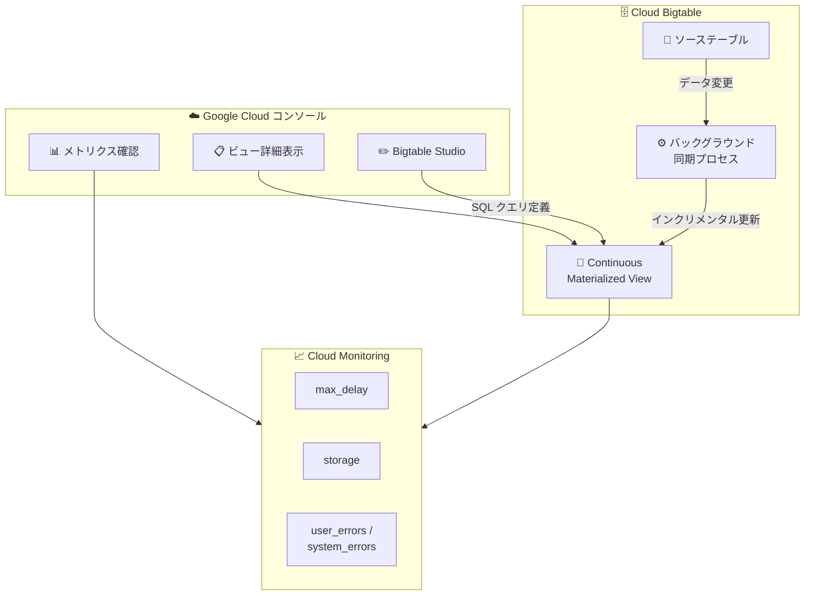

# Bigtable: Continuous Materialized Views のコンソール詳細表示

**リリース日**: 2026-03-30

**サービス**: Cloud Bigtable

**機能**: Continuous Materialized Views の Google Cloud コンソール詳細表示

**ステータス**: Feature

📊 [このアップデートのインフォグラフィックを見る](https://takech9203.github.io/google-cloud-news-summary/20260330-bigtable-materialized-views-console.html)

## 概要

Bigtable の Continuous Materialized Views (継続的マテリアライズドビュー) の詳細情報を Google Cloud コンソール上で直接確認できるようになりました。これにより、マテリアライズドビューの状態、メトリクス、構成情報をブラウザ上で視覚的に把握することが可能になります。

Continuous Materialized Views は、ソーステーブルのデータ変更に応じて自動的にインクリメンタル更新される事前計算テーブルです。SQL クエリで定義した集約やデータ変換の結果を、バックグラウンドで継続的に維持管理します。今回のアップデートにより、これらのビューの運用管理がコンソール上でより直感的に行えるようになりました。

対象ユーザーは、Bigtable を利用してリアルタイムデータの事前集約やセカンダリアクセスパターンを実装しているデータエンジニアやインフラ管理者です。

**アップデート前の課題**

- マテリアライズドビューの詳細情報を確認するには gcloud CLI やクライアントライブラリを使用する必要があった
- ビューの処理遅延やストレージ使用量などのメトリクスをコンソール上で一元的に確認する手段が限られていた
- 複数のマテリアライズドビューの状態を俯瞰的に把握するには、コマンドラインでの操作が必要だった

**アップデート後の改善**

- Google Cloud コンソール上でマテリアライズドビューの詳細情報 (定義クエリ、ステータス、メトリクスなど) を直接確認できるようになった
- GUI ベースの操作により、CLI に不慣れなユーザーでもビューの管理が容易になった
- 運用監視のワークフローがコンソールに統合され、管理効率が向上した

## アーキテクチャ図



Google Cloud コンソールから Bigtable の Continuous Materialized View の詳細情報やメトリクスを直接確認し、Bigtable Studio でビューの作成・管理を行う構成を示しています。

## サービスアップデートの詳細

### 主要機能

1. **コンソール上でのビュー詳細表示**
   - マテリアライズドビューの定義 SQL クエリ、ステータス、作成日時などの詳細情報をコンソールで確認可能
   - インスタンス内の全マテリアライズドビューを一覧表示

2. **メトリクスの可視化**
   - `materialized_view/max_delay`: 処理遅延の上限値
   - `materialized_view/storage`: ビューのストレージ使用量 (バイト単位)
   - `materialized_view/intermediate_storage`: 中間処理のストレージ使用量
   - `materialized_view/user_errors` / `materialized_view/system_errors`: エラー数

3. **Bigtable Studio との統合**
   - Bigtable Studio のクエリエディタからマテリアライズドビューの作成が可能
   - SQL クエリのバリデーション、フォーマット、実行、ビューとしての保存をワンストップで実行

## 技術仕様

### Continuous Materialized Views の主要特性

| 項目 | 詳細 |
|------|------|
| 一貫性モデル | 結果整合性 (Eventually Consistent) |
| メンテナンス | ゼロメンテナンス (自動バックグラウンド更新) |
| クエリ言語 | GoogleSQL for Bigtable |
| GC ポリシー連携 | ソーステーブルのガベージコレクションと自動同期 |
| 読み書きレイテンシ | ソーステーブルへの影響は最小限 (適切なプロビジョニング前提) |
| 削除保護 | オプションで有効化可能 |

### 必要な IAM ロール・権限

| 操作 | 必要な権限 |
|------|-----------|
| 作成 | `bigtable.materializedViews.create` + `bigtable.tables.readRows` |
| 更新 | `bigtable.materializedViews.update` |
| 削除 | `bigtable.materializedViews.delete` |
| 一覧表示 | `bigtable.materializedViews.list` |
| 管理者 (全操作) | `roles/bigtable.admin` |

## 設定方法

### 前提条件

1. Bigtable インスタンスが作成済みであること
2. 適切な IAM 権限 (`roles/bigtable.admin` または個別権限) が付与されていること
3. ソーステーブルが存在し、読み取り権限があること

### 手順

#### ステップ 1: コンソールでインスタンスを開く

Google Cloud コンソールで [Bigtable インスタンス一覧](https://console.cloud.google.com/bigtable/instances) を開き、対象のインスタンスを選択します。

#### ステップ 2: マテリアライズドビューの詳細を確認する

インスタンスの詳細画面から、作成済みの Continuous Materialized View の詳細情報 (定義クエリ、メトリクス、ステータスなど) を確認できます。

#### ステップ 3: Bigtable Studio でビューを作成する (新規作成の場合)

```sql
-- Bigtable Studio のクエリエディタで SQL を記述
-- 例: ソーステーブルからの集約ビュー
SELECT
  row_key,
  COUNT(*) AS event_count,
  SUM(value) AS total_value
FROM my_source_table
GROUP BY row_key
```

1. ナビゲーションペインで「Bigtable Studio」をクリック
2. 新しいタブで「Editor」を選択
3. SQL クエリを記述し「Run」で実行
4. 結果確認後、「Save as」から「Save as materialized view」を選択
5. ビュー名を入力して「Save」をクリック

#### gcloud CLI での作成 (代替手段)

```bash
gcloud beta bigtable materialized-views create VIEW_NAME \
  --instance=INSTANCE_ID \
  --query="SELECT row_key, COUNT(*) AS cnt FROM my_table GROUP BY row_key"
```

## メリット

### ビジネス面

- **運用効率の向上**: コンソール上でビューの状態を一目で把握でき、問題の早期発見とトラブルシューティングが迅速化
- **学習コストの低減**: GUI ベースの操作により、CLI に不慣れなチームメンバーでもマテリアライズドビューの管理に参加可能

### 技術面

- **統合的な監視**: メトリクス (処理遅延、ストレージ使用量、エラー数) をコンソールで直接確認でき、Cloud Monitoring との連携がシームレス
- **Bigtable Studio 統合**: クエリの作成からビューの保存までをワンストップで実行でき、開発・運用ワークフローが効率化

## デメリット・制約事項

### 制限事項

- Continuous Materialized Views 自体が現在 Preview ステータスであり、SLA の適用外
- マテリアライズドビューは結果整合性であり、ソーステーブルの変更がビューに反映されるまでに遅延が発生する

### 考慮すべき点

- マテリアライズドビューの作成・同期にはコンピュート (CPU) とストレージのコストが追加で発生する
- クラスターのオートスケーリング有効化がベストプラクティスとして推奨されている
- ビュー定義に使用するロウキー、カラム修飾子、カラム値はサービスデータとして扱われるため、機密情報を含めないこと

## ユースケース

### ユースケース 1: リアルタイムダッシュボード向けデータ事前集約

**シナリオ**: IoT デバイスから大量のセンサーデータを Bigtable に取り込み、ダッシュボードで集約メトリクスを表示する場合。マテリアライズドビューでデータを事前集約し、コンソールでビューの処理遅延やエラーを監視する。

**効果**: Dataflow や Spark を使った別途の集約パイプラインが不要になり、コンソールからビューの状態を直接確認できるため運用負荷が大幅に軽減

### ユースケース 2: セカンダリアクセスパターンの運用管理

**シナリオ**: ソーステーブルとは異なるルックアップパターンでデータを参照する必要がある場合に、非同期セカンダリインデックスとしてマテリアライズドビューを利用。コンソールで複数のビューの状態を一覧管理する。

**効果**: 複数のマテリアライズドビューの健全性を GUI で俯瞰的に確認でき、問題発生時の対応が迅速化

## 料金

Continuous Materialized Views にはリソース単位の追加料金は発生しません。ただし、ビューの作成・同期に伴うコンピュートとストレージの使用量に対して標準料金が適用されます。

- **ストレージ**: ビューのデータおよび中間処理データの保存に対して課金
- **コンピュート**: ソーステーブルとビューの継続的な同期処理に必要な CPU 処理に対して課金

一方、マテリアライズドビューの導入により、テーブルの範囲スキャンや反復的な集約計算が不要になる場合があり、処理コストが削減される可能性があります。

詳細は [Bigtable 料金ページ](https://cloud.google.com/bigtable/pricing) を参照してください。

## 関連サービス・機能

- **Cloud Monitoring**: マテリアライズドビューのメトリクス (処理遅延、ストレージ、エラー) を監視
- **Cloud Logging**: マテリアライズドビュー関連のログエントリを記録・分析
- **Bigtable Studio**: コンソール上でのクエリ編集・実行・ビュー管理
- **Dataflow / Apache Spark**: マテリアライズドビューにより代替可能な集約パイプライン

## 参考リンク

- 📊 [インフォグラフィック](https://takech9203.github.io/google-cloud-news-summary/20260330-bigtable-materialized-views-console.html)
- [公式リリースノート](https://cloud.google.com/release-notes#March_30_2026)
- [Continuous Materialized Views 概要](https://cloud.google.com/bigtable/docs/continuous-materialized-views)
- [Continuous Materialized Views の作成と管理](https://cloud.google.com/bigtable/docs/manage-continuous-materialized-views)
- [Bigtable 料金ページ](https://cloud.google.com/bigtable/pricing)

## まとめ

今回のアップデートにより、Bigtable の Continuous Materialized Views の詳細情報を Google Cloud コンソール上で直接確認できるようになりました。CLI を使わずにビューの状態やメトリクスを把握できるため、運用監視の効率が向上します。Bigtable でマテリアライズドビューを利用している場合は、コンソールでの管理ワークフローへの移行を検討してください。

---

**タグ**: #Bigtable #MaterializedViews #GoogleCloudConsole #NoSQL #データ集約 #Preview
