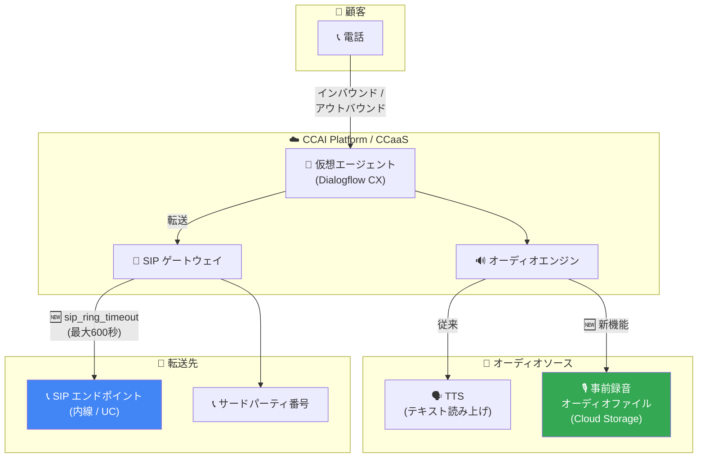

# Google Cloud CCaaS: 仮想エージェントの事前録音オーディオ再生、SIP リングタイムアウト設定、バグ修正

**リリース日**: 2026-03-30

**サービス**: Google Cloud Contact Center as a Service (CCaaS) / CCAI Platform

**機能**: 仮想エージェント向け事前録音オーディオ再生 / SIP エンドポイント転送リングタイムアウト設定 / バグ修正

**ステータス**: Feature / Fixed

📊 [このアップデートのインフォグラフィックを見る](https://takech9203.github.io/google-cloud-news-summary/20260330-ccaas-pre-recorded-audio-updates.html)

## 概要

Google Cloud Contact Center as a Service (CCaaS) / CCAI Platform に複数のアップデートが提供された。主要なアップデートとして、Dialogflow を利用した仮想エージェントが事前録音されたオーディオファイルを再生できるようになった。これにより、標準的なテキスト読み上げ (TTS) の代わりに高品質なオーディオファイルを使用して顧客に応答できる。この機能はインバウンド・アウトバウンド通話を含むすべての音声チャネルで利用可能で、サポート仮想エージェント、タスク仮想エージェント、セッション後仮想エージェントのすべてに対応している。

また、Twilio ユーザー向けに、仮想エージェントが SIP エンドポイントに転送するアウトバウンド通話のリングタイムアウトを設定できるようになった。`sip_ring_timeout` フィールドを仮想エージェントのカスタムペイロードに追加することで、最大 600 秒までのリング期間を設定でき、内線や UC (Unified Communications) 宛先への通話が切断される前に十分な応答時間を確保できる。

さらに、通話録音とメール割り当てに関する 2 件のバグが修正された。

**アップデート前の課題**

- 仮想エージェントの音声応答は標準的な TTS に限定されており、ブランド独自の音声やプロフェッショナルな録音を使用できなかった
- SIP エンドポイントへの転送時にリングタイムアウトを細かく制御できず、内線や UC 宛先が応答する前に通話が切断されるケースがあった
- サードパーティ番号への転送後、エージェントが通話を離れても録音が継続される問題があった
- エージェントロールを持たないユーザーにメールが自動割り当てされる問題があった

**アップデート後の改善**

- 高品質な事前録音オーディオファイルを仮想エージェントの応答として再生できるようになり、ブランド体験の一貫性が向上した
- `sip_ring_timeout` フィールドにより SIP 転送時のリングタイムアウトを最大 600 秒まで柔軟に設定可能になった
- サードパーティ番号への転送後の録音継続問題が修正され、設定通りに動作するようになった
- メールの自動割り当てがエージェントロールを持つユーザーのみに正しく適用されるようになった

## アーキテクチャ図



仮想エージェントが事前録音オーディオを再生する新しいフローと、SIP エンドポイントへの転送時にリングタイムアウトを設定できる構成を示している。

## サービスアップデートの詳細

### 主要機能

1. **仮想エージェント向け事前録音オーディオ再生**
   - Dialogflow の仮想エージェントが事前録音された高品質オーディオファイルで応答可能
   - すべての音声チャネル (インバウンド・アウトバウンド) で利用可能
   - サポート仮想エージェント、タスク仮想エージェント、セッション後仮想エージェントに対応
   - TTS では実現できないブランド固有の音声やプロフェッショナルな録音を使用可能

2. **SIP エンドポイント転送のリングタイムアウト設定**
   - Twilio ユーザー向けの新機能
   - 仮想エージェントのカスタムペイロードに `sip_ring_timeout` フィールドを追加
   - 最大 600 秒 (10 分) までのリング期間を設定可能
   - 内線や UC (Unified Communications) 宛先への十分な応答時間を確保

3. **バグ修正**
   - サードパーティ番号への転送後の通話録音継続問題: 「Continue Call recording to Third Party Numbers after the agent leaves the call」設定をクリアしても、転送後に録音が継続される問題を修正
   - メール自動割り当て問題: エージェントロールを持たないユーザーにメールが自動割り当てされる問題を修正

## 技術仕様

### 事前録音オーディオの要件

| 項目 | 詳細 |
|------|------|
| オーディオ形式 | シングルチャネル (モノラル) |
| エンコーディング | μ-law (mu-law) |
| サンプリングレート | 8kHz |
| ホスティング | Cloud Storage |
| 対応チャネル | インバウンド通話、アウトバウンド通話 |
| 対応エージェントタイプ | サポート、タスク、セッション後 |

### SIP リングタイムアウト設定

| 項目 | 詳細 |
|------|------|
| フィールド名 | `sip_ring_timeout` |
| 設定場所 | 仮想エージェントのカスタムペイロード |
| 最大値 | 600 秒 (10 分) |
| 対象 | Twilio ユーザー |
| 用途 | SIP エンドポイントへのアウトバウンド転送 |

### SIP リングタイムアウトのカスタムペイロード例

```json
{
  "ujet": {
    "type": "action",
    "action": "deflection",
    "deflection_type": "sip",
    "sip_uri": "sip:1-999-123-4567@voip-provider.example.net",
    "sip_ring_timeout": 120
  }
}
```

### Dialogflow CX での事前録音オーディオ設定

Dialogflow CX のフルフィルメントで `PlayAudio` レスポンスタイプを使用する。

```json
{
  "audioUri": "gs://your-bucket/audio/welcome-message.wav",
  "allowPlaybackInterruption": true
}
```

## 設定方法

### 前提条件

1. CCAI Platform インスタンスが作成済みであること
2. Dialogflow CX エージェントが CCAI Platform に統合済みであること
3. (事前録音オーディオ) Cloud Storage バケットにオーディオファイルがアップロード済みであること
4. (SIP リングタイムアウト) Twilio との統合が設定済みであること

### 手順

#### ステップ 1: 事前録音オーディオファイルの準備

オーディオファイルを以下の仕様で準備し、Cloud Storage にアップロードする。

```bash
# Cloud Storage バケットの作成
gcloud storage buckets create gs://my-ccaas-audio --location=us-central1

# オーディオファイルのアップロード
gcloud storage cp welcome-message.wav gs://my-ccaas-audio/audio/
```

オーディオファイルはシングルチャネル (モノラル)、μ-law エンコーディング、8kHz サンプリングレートで作成する必要がある。

#### ステップ 2: Dialogflow CX での事前録音オーディオの設定

Dialogflow CX コンソールでエージェントのフルフィルメントに「Play prerecorded audio」レスポンスを追加し、Cloud Storage 上のオーディオファイル URI を指定する。

#### ステップ 3: SIP リングタイムアウトの設定

Twilio ユーザーは、仮想エージェントのカスタムペイロードに `sip_ring_timeout` フィールドを追加して、リング期間を秒単位で指定する。

## メリット

### ビジネス面

- **ブランド体験の一貫性**: プロフェッショナルに録音されたオーディオメッセージにより、ブランドイメージに合った顧客体験を提供できる
- **顧客満足度の向上**: 高品質なオーディオにより、IVR の印象が向上し、顧客エンゲージメントが改善される
- **転送成功率の向上**: SIP リングタイムアウトの柔軟な設定により、内線や UC 宛先への転送が切断前に応答される確率が高まる

### 技術面

- **柔軟なオーディオ管理**: Cloud Storage 上のファイルを差し替えるだけで応答メッセージを更新可能
- **TTS との使い分け**: 動的な応答には TTS、固定メッセージには事前録音オーディオと、用途に応じた使い分けが可能
- **SIP 転送の信頼性向上**: リングタイムアウトの細かな制御により、ネットワーク遅延のある環境でも安定した転送が実現できる

## デメリット・制約事項

### 制限事項

- 事前録音オーディオはシングルチャネル (モノラル)、μ-law エンコーディング、8kHz のフォーマットに限定される
- オーディオファイルは Cloud Storage 上にホスティングする必要がある
- SIP リングタイムアウトの設定は現時点で Twilio ユーザーに限定される
- `sip_ring_timeout` の最大値は 600 秒

### 考慮すべき点

- 事前録音オーディオの品質は録音時の機材や環境に依存するため、プロフェッショナルな録音環境の確保が望ましい
- 多言語対応の場合、各言語ごとにオーディオファイルを準備する必要がある
- SIP リングタイムアウトを長く設定すると、顧客の待ち時間が増加する可能性があるため、適切な値の調整が必要

## ユースケース

### ユースケース 1: プロフェッショナルな IVR メッセージ

**シナリオ**: 大手金融機関が、ブランドイメージに合った高品質な音声でウェルカムメッセージやメニューガイダンスを提供したい。

**実装例**:
```json
{
  "audioUri": "gs://financial-corp-audio/ivr/welcome-ja.wav",
  "allowPlaybackInterruption": false
}
```

**効果**: TTS では表現しにくい感情やトーンを含むプロフェッショナルな録音により、信頼感のある顧客体験を実現。

### ユースケース 2: UC 環境への確実な転送

**シナリオ**: 企業の内部 UC システム (Microsoft Teams、Cisco Webex など) にホストされた内線に仮想エージェントが通話を転送する際、応答まで十分な時間を確保したい。

**実装例**:
```json
{
  "ujet": {
    "type": "action",
    "action": "deflection",
    "deflection_type": "sip",
    "sip_uri": "sip:support-team@uc.example.com",
    "sip_ring_timeout": 180
  }
}
```

**効果**: UC 環境特有のルーティング遅延を考慮した十分なリング時間により、転送の成功率が向上。

## 料金

CCAI Platform の料金は以下の課金モデルに基づく。

| 課金モデル | 説明 |
|-----------|------|
| 同時エージェント数 | 月間の最大同時ログインエージェント数に基づく |
| 指名エージェント数 | エージェントロールを持つユーザーの最大数に基づく |
| 使用分数 | エージェントロールのユーザーがログインしている分数に基づく |

テレフォニー費用は使用量に応じて別途課金される。詳細な料金については Google Cloud の営業担当または [Google Cloud パートナー](https://cloud.google.com/find-a-partner/?specializations=Contact%20Center%20AI%20-%20Services) に問い合わせが必要。

## 利用可能リージョン

CCAI Platform の利用可能なロケーションについては、[公式ロケーションページ](https://cloud.google.com/contact-center/ccai-platform/docs/localities) を参照。

## 関連サービス・機能

- **Dialogflow CX**: 仮想エージェントの会話フローを構築する基盤。事前録音オーディオはフルフィルメントの一部として設定される
- **Cloud Storage**: 事前録音オーディオファイルのホスティング先
- **Gemini Enterprise for Customer Experience**: CCAI Platform を含む包括的なコンタクトセンター AI ソリューション
- **Agent Assist**: 人間のエージェントをリアルタイムで支援する機能。仮想エージェントからのエスカレーション時に連携
- **Customer Experience Insights**: コンタクトセンターのインタラクションを分析し、改善ポイントを特定

## 参考リンク

- 📊 [インフォグラフィック](https://takech9203.github.io/google-cloud-news-summary/20260330-ccaas-pre-recorded-audio-updates.html)
- [公式リリースノート](https://cloud.google.com/release-notes#March_30_2026)
- [CCAI Platform ドキュメント](https://cloud.google.com/contact-center/ccai-platform/docs)
- [Dialogflow CX Phone Gateway - 事前録音オーディオ](https://cloud.google.com/dialogflow/cx/docs/concept/integration/phone-gateway#audio)
- [Dialogflow CX フルフィルメント](https://cloud.google.com/dialogflow/cx/docs/concept/fulfillment)
- [仮想エージェントカスタムペイロード](https://cloud.google.com/contact-center/ccai-platform/docs/va-custom-payload)
- [CCAI Platform 仮想エージェント](https://cloud.google.com/contact-center/ccai-platform/docs/virtual-agent)

## まとめ

今回のアップデートにより、CCAI Platform の仮想エージェントがより柔軟な音声応答手段を獲得し、コンタクトセンターの顧客体験品質が向上する。特に事前録音オーディオ再生機能は、ブランドの一貫性を重視する企業にとって重要な機能であり、TTS では実現が難しいプロフェッショナルな音声体験を提供できる。SIP リングタイムアウトの設定と合わせて、通話転送の信頼性も向上しているため、UC 環境との統合を行っている組織は設定の見直しを推奨する。

---

**タグ**: #GoogleCloud #CCaaS #CCAIPlatform #DialogflowCX #VirtualAgent #PreRecordedAudio #SIP #ContactCenter #IVR #BugFix
