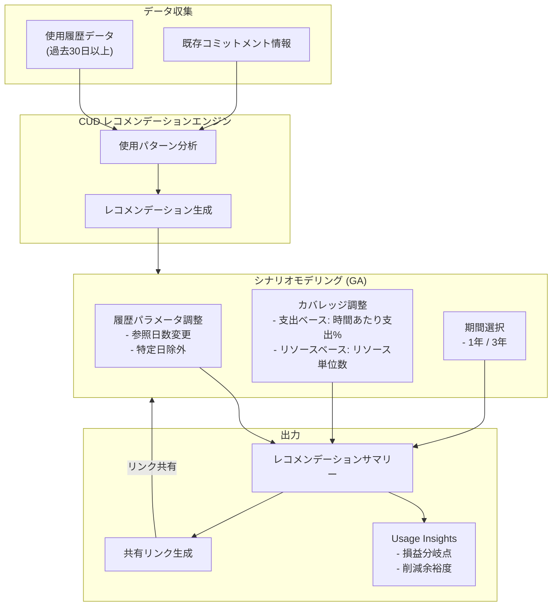

# Cloud Billing: CUD レコメンデーション向けシナリオモデリングが GA

**リリース日**: 2026-03-30

**サービス**: Cloud Billing

**機能**: 確約利用割引 (CUD) レコメンデーション向けシナリオモデリングの一般提供

**ステータス**: GA (一般提供)

[このアップデートのインフォグラフィックを見る](https://takech9203.github.io/google-cloud-news-summary/20260330-cloud-billing-cud-scenario-modeling-ga.html)

## 概要

Google Cloud の確約利用割引 (Committed Use Discount: CUD) レコメンデーションにおけるシナリオモデリング機能が一般提供 (GA) となりました。この機能により、支出ベース (spend-based) およびリソースベース (resource-based) の両方の CUD に対してシナリオをシミュレーションし、コスト削減を最大化するコミットメント購入のカスタマイズが可能になります。

シナリオモデリングは、FinOps hub 内で CUD レコメンデーションの詳細ページから利用でき、過去の使用履歴に基づいた推奨を独自のパラメータで調整できます。使用履歴の参照期間変更、特定日の除外、カバレッジ率の調整、コミットメント期間 (1年/3年) の選択など、実際のビジネス要件に合わせた柔軟なシミュレーションが可能です。

Cloud Billing 管理者、FinOps チーム、クラウドコスト最適化を担当するすべてのユーザーが対象です。特に大規模なクラウド支出を管理する組織において、CUD 購入前のリスク分析と投資対効果の最大化に大きく貢献します。

**アップデート前の課題**

- CUD レコメンデーションはデフォルト設定のみで提供され、ビジネス固有の要件に合わせた調整が困難だった
- CUD 購入前に異なるシナリオ (カバレッジ率、期間、対象期間) を比較検討する手段が限られていた
- 一時的な使用量の急増や異常値がレコメンデーションに反映され、不正確な推奨が生成される可能性があった
- コミットメントのブレークイーブンポイント (損益分岐点) を事前に把握することが難しかった

**アップデート後の改善**

- FinOps hub から直接シナリオモデリングツールを使用して、CUD レコメンデーションをカスタマイズ可能になった
- 支出ベースとリソースベースの両方の CUD に対して、使用量カバレッジのシミュレーションが可能になった
- 使用履歴の参照日数変更や特定日の除外により、異常な使用パターンの影響を排除できるようになった
- Usage Insights により、損益分岐点やコスト削減の余裕度が明確に表示されるようになった

## アーキテクチャ図



CUD レコメンデーションエンジンが使用履歴と既存コミットメントを分析し、シナリオモデリングツールでパラメータを調整した結果が、Usage Insights と共にサマリーとして出力されます。共有リンクにより、チームメンバーと同じシナリオ設定を共有できます。

## サービスアップデートの詳細

### 主要機能

1. **シナリオ作成とカスタマイズ**
   - FinOps hub でレコメンデーション詳細ページから「Create a scenario」をクリックして開始
   - 使用履歴の参照期間をデフォルトの30日から変更可能
   - 特定の日付範囲を除外して異常な使用パターンの影響を排除
   - レコメンデーションはパラメータ変更に応じてリアルタイムで再計算

2. **使用量カバレッジのモデリング**
   - 支出ベース CUD: 時間あたりの支出パーセンテージを設定してシミュレーション
   - リソースベース CUD: 使用するリソース単位数を設定してシミュレーション
   - 実際の安定使用量がメッセージとして表示され、現実的なモデリングを支援

3. **Usage Insights (使用量インサイト)**
   - 過去の支出パターンに基づいたレコメンデーション算出根拠の説明
   - 損益分岐点の表示 (例: 使用量が何%低下しても節約が維持されるか)
   - コミットメント期間中の予測コスト削減額の表示

4. **シナリオ共有機能**
   - 作成したシナリオの設定をリンクとして共有可能
   - 受信者がリンクを開くと、同じパラメータ設定と最新の使用量データが反映される

## 技術仕様

### 対応する CUD タイプ

| CUD タイプ | カバレッジ調整方法 | コミットメント期間 |
|------|------|------|
| 支出ベース (Spend-based) | 時間あたり支出パーセンテージ | 1年 / 3年 |
| リソースベース (Resource-based) | リソース単位数 | 1年 / 3年 |
| Compute フレキシブル | 時間あたり支出パーセンテージ | 1年 / 3年 |

### 支出ベース CUD 対応サービス

| サービス | 備考 |
|------|------|
| AlloyDB for PostgreSQL | - |
| Backup and DR Service | - |
| Dataflow Streaming CUD Subscription | - |
| Memorystore | - |
| Spanner | - |
| Cloud SQL | - |
| Compute フレキシブル CUD | - |
| Google Cloud VMware Engine | - |
| Google Cloud NetApp Volumes | - |

### 必要な IAM 権限

```json
{
  "シナリオモデリング (リスト価格ベース)": {
    "permission": "billing.cudrecommendations.generateDefaultPriceSavingRecommendation"
  },
  "シナリオモデリング (カスタム価格ベース)": {
    "permission": "billing.cudrecommendations.generateCustomPriceSavingRecommendation"
  },
  "レコメンデーション閲覧": {
    "role": "roles/billing.viewer (Billing Account Viewer)"
  },
  "レコメンデーション閲覧・変更": {
    "role": "roles/billing.admin (Billing Account Administrator)"
  }
}
```

## 設定方法

### 前提条件

1. Cloud Billing アカウントへの適切な IAM ロール (Billing Account Viewer 以上) が付与されていること
2. シナリオモデリングを使用する場合は `billing.cudrecommendations.generateDefaultPriceSavingRecommendation` 権限が必要
3. カスタム価格契約がある場合は、追加で `billing.cudrecommendations.generateCustomPriceSavingRecommendation` 権限が必要

### 手順

#### ステップ 1: FinOps hub へのアクセス

Google Cloud コンソールで FinOps hub を開きます。

```
Google Cloud コンソール > お支払い > FinOps hub
URL: https://console.cloud.google.com/billing/optimize
```

対象の Cloud Billing アカウントを選択し、「Top recommendations」セクションで CUD レコメンデーションを確認します。

#### ステップ 2: シナリオの作成

レコメンデーションの詳細ページで「Create a scenario」をクリックし、以下のパラメータを調整します。

```
1. 使用履歴の参照期間: デフォルト30日から変更可能
2. 除外日の設定: 異常な使用量があった期間を除外
3. カバレッジ率の調整:
   - 支出ベース: 時間あたり支出の割合 (%)
   - リソースベース: リソース単位数
4. コミットメント期間: 1年 または 3年を選択
```

#### ステップ 3: 結果の確認と共有

シナリオモデリングの結果を確認し、Usage Insights で損益分岐点とコスト削減見込みを確認します。「Copy to clipboard」でリンクを取得し、チームメンバーと共有できます。

#### ステップ 4: コミットメントの購入

レビュー後、「Review and purchase」をクリックして購入プロセスに進みます。購入前に必ず適切なレビュアーによる評価を行ってください。

## メリット

### ビジネス面

- **コスト最適化の精度向上**: 実際のビジネス要件に合わせたシミュレーションにより、過剰なコミットメントや不足を回避できる
- **意思決定の迅速化**: 複数のシナリオを比較検討することで、CUD 購入に関する意思決定プロセスが加速される
- **チーム間連携の強化**: シナリオ共有リンクにより、財務チームと技術チームが同じデータに基づいて議論できる
- **リスクの可視化**: 損益分岐点や使用量低下時の影響が明確に表示され、コミットメント購入のリスクを定量的に評価できる

### 技術面

- **柔軟なパラメータ調整**: 使用履歴の参照期間、除外日、カバレッジ率をきめ細かく制御可能
- **リアルタイム再計算**: パラメータ変更に応じてレコメンデーションが即座に再計算される
- **カスタム価格対応**: 標準リスト価格だけでなく、カスタム価格契約に基づいたシミュレーションも可能
- **IAM による細かいアクセス制御**: シナリオモデリング専用の権限により、セキュリティを維持しつつ適切なアクセスを提供

## デメリット・制約事項

### 制限事項

- CUD は購入後のキャンセルができないため、シナリオモデリングの結果を十分にレビューしてから購入する必要がある
- リソースベース CUD レコメンデーションは特定のマシンシリーズ (A2, C2, E2, N1, N2 など) のみに対応
- 支出ベース CUD レコメンデーションは一部のサービス (AlloyDB, Cloud SQL, Spanner など) のみに対応
- Cloud Run および Autopilot の新規コミットメント購入は非対応 (Compute フレキシブル CUD を代替として利用)

### 考慮すべき点

- シナリオモデリングの結果は過去の使用履歴に基づくため、将来の使用パターンが大きく変わる場合は実際の削減額が異なる可能性がある
- カスタム価格契約に基づくシミュレーションには追加の IAM 権限が必要
- CUD 共有が有効でない場合、プロジェクトレベルでの権限設定が必要になる
- コミットメント購入時は、月額料金がコミットメント期間中の実際の使用量に関係なく発生する点に注意

## ユースケース

### ユースケース 1: 大規模 Compute Engine 環境のコスト最適化

**シナリオ**: 100台以上の VM を常時稼働させている企業が、リソースベース CUD を検討している。ただし、四半期ごとにインフラのスケールアップイベントがあり、通常の使用量とは異なるパターンが発生する。

**実装例**:
```
1. FinOps hub でリソースベース CUD レコメンデーションを開く
2. 「Create a scenario」をクリック
3. 使用履歴を90日に設定
4. 「Ignore usage history from specific days」を有効化し、スケールアップイベント期間を除外
5. リソース単位数を安定使用量に合わせて調整
6. 1年と3年の両方でシミュレーションを比較
```

**効果**: 一時的な使用量急増の影響を除外した正確なレコメンデーションにより、年間数万ドル規模のコスト削減を実現しつつ、過剰コミットメントのリスクを回避。

### ユースケース 2: マルチサービス環境での支出ベース CUD 戦略

**シナリオ**: Cloud SQL、Spanner、AlloyDB を組み合わせて利用しているデータプラットフォームチームが、各サービスの支出ベース CUD を最適化したい。

**効果**: 各サービスの支出パターンに基づいたカバレッジ率のシミュレーションにより、サービスごとに最適なコミットメント金額を特定。共有リンクを使ってデータベースチームと財務チームの間で合意形成を加速。

### ユースケース 3: FinOps チームによるコミットメントポートフォリオ管理

**シナリオ**: FinOps チームが複数の Cloud Billing アカウントにまたがる CUD ポートフォリオの年次レビューを実施している。

**効果**: Usage Insights の損益分岐点分析を活用して、既存コミットメントの更新判断と新規コミットメントの購入計画を策定。シナリオ共有リンクにより、経営層への報告資料としても活用可能。

## 料金

シナリオモデリング機能自体に追加料金は発生しません。CUD の購入により発生する料金は、選択したコミットメントタイプと期間に依存します。

### 料金例 (Compute フレキシブル CUD の場合)

| コミットメント期間 | 割引率 (概算) | 備考 |
|--------|-----------------|------|
| 1年 | 最大 37% | オンデマンド料金比 |
| 3年 | 最大 55% | オンデマンド料金比 |

※ 実際の割引率はサービスやリソースタイプにより異なります。詳細は各サービスの料金ページを参照してください。

## 利用可能リージョン

シナリオモデリング機能は Cloud Billing アカウントレベルで提供されるため、リージョンに依存しません。すべての Cloud Billing アカウントで利用可能です。CUD 自体のリージョン制限は、各 CUD タイプの仕様に従います。

## 関連サービス・機能

- **FinOps hub**: CUD レコメンデーションとシナリオモデリングへのメインエントリーポイント
- **Cloud Billing レポート**: CUD の使用状況と削減効果の可視化
- **Recommender サービス**: CUD レコメンデーションを生成する基盤サービス
- **Compute Engine CUD**: リソースベースの確約利用割引 (vCPU、メモリ)
- **Cost Management**: Google Cloud の包括的なコスト管理ツールセット

## 参考リンク

- [インフォグラフィック](https://takech9203.github.io/google-cloud-news-summary/20260330-cloud-billing-cud-scenario-modeling-ga.html)
- [公式リリースノート](https://cloud.google.com/release-notes#March_30_2026)
- [CUD レコメンデーション ドキュメント](https://cloud.google.com/billing/docs/how-to/cuds-recommender)
- [CUD シナリオモデリング ドキュメント](https://cloud.google.com/billing/docs/how-to/cud-analysis-scenario-modeling)
- [確約利用割引の概要](https://cloud.google.com/docs/cuds)
- [支出ベース CUD の詳細](https://cloud.google.com/docs/cuds-spend-based)
- [料金ページ](https://cloud.google.com/billing/pricing)

## まとめ

CUD レコメンデーション向けシナリオモデリングの GA は、Google Cloud のコスト最適化において重要な進展です。過去の使用パターンに基づく自動レコメンデーションに加え、ビジネス固有の要件を反映したカスタムシミュレーションが可能になったことで、CUD 購入のリスクを低減しつつ、コスト削減効果を最大化できます。Cloud Billing アカウントをお持ちの組織は、FinOps hub からシナリオモデリング機能を活用し、既存の CUD ポートフォリオの見直しと新規コミットメントの最適化を検討することを推奨します。

---

**タグ**: #CloudBilling #CUD #CommittedUseDiscount #コスト最適化 #FinOps #シナリオモデリング #GA
