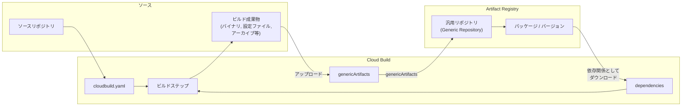

# Cloud Build: 汎用アーティファクトの Artifact Registry への直接アップロードと依存関係としてのダウンロードをサポート

**リリース日**: 2026-03-30

**サービス**: Cloud Build

**機能**: 汎用リポジトリへの汎用アーティファクトのアップロードおよび依存関係としてのダウンロード

**ステータス**: Feature

📊 [このアップデートのインフォグラフィックを見る](https://takech9203.github.io/google-cloud-news-summary/20260330-cloud-build-generic-artifacts.html)

## 概要

Cloud Build のビルド構成ファイルに `genericArtifacts` スタンザを追加することで、ビルド成果物を Artifact Registry の汎用 (generic) リポジトリに直接アップロードできるようになった。また、汎用リポジトリに保存されたアーティファクトをビルドの依存関係として指定し、ビルド実行時に自動的にダウンロードすることも可能になった。これにより、Docker イメージや言語固有のパッケージに限らず、あらゆる形式のファイルを Cloud Build のパイプラインに統合できる。

従来、Cloud Build から Artifact Registry の汎用リポジトリにアーティファクトをアップロードするには、ビルドステップ内で `gcloud artifacts generic upload` コマンドを手動で実行する必要があった。今回のアップデートにより、ビルド構成ファイルの宣言的な設定だけで汎用アーティファクトの管理が完結するようになり、CI/CD パイプラインの構築がより簡潔かつ再現性の高いものになった。

**アップデート前の課題**

- 汎用アーティファクトを Artifact Registry にアップロードするには、ビルドステップで `gcloud` コマンドを明示的に記述する必要があり、ビルド構成が冗長になっていた
- ビルドの依存関係として汎用リポジトリからファイルをダウンロードする標準的な方法がなく、ビルドステップ内でカスタムスクリプトを用意する必要があった
- Docker イメージや Maven/npm/Python パッケージには専用の構成フィールドがあったが、汎用フォーマットのアーティファクトには同等の宣言的サポートがなかった

**アップデート後の改善**

- ビルド構成ファイルの `genericArtifacts` フィールドでアップロード対象のファイル、パッケージ名、バージョンを宣言的に指定できるようになった
- `dependencies` スタンザで汎用アーティファクトをビルド依存関係として指定し、ビルド開始時に自動ダウンロードできるようになった
- カスタムビルドステップを記述する必要がなくなり、ビルド構成の可読性と保守性が向上した

## アーキテクチャ図



Cloud Build のビルド構成ファイルから `genericArtifacts` で Artifact Registry の汎用リポジトリにアーティファクトをアップロードし、`dependencies` で別のビルドの依存関係として同リポジトリからダウンロードする双方向のフローを示す。

## サービスアップデートの詳細

### 主要機能

1. **genericArtifacts によるアップロード**
   - ビルド構成ファイルのトップレベルに `genericArtifacts` スタンザを追加することで、ビルド成果物を Artifact Registry の汎用リポジトリに直接アップロードできる
   - パッケージ名、バージョン、アップロード対象のファイルパスを宣言的に指定
   - 圧縮ファイル (tar, zip)、設定ファイル (YAML, TOML)、バイナリ、PDF など任意のファイル形式に対応

2. **汎用アーティファクトの依存関係指定**
   - ビルド構成ファイルの `dependencies` スタンザで汎用リポジトリのアーティファクトを参照可能
   - ビルド開始時に指定したアーティファクトが自動的に `/workspace` 配下にダウンロードされる
   - 他のビルドで生成されたバイナリや設定ファイルをビルド間で共有する仕組みとして活用可能

3. **既存のアーティファクト管理との統合**
   - Docker イメージ、Maven、npm、Python パッケージなどの既存サポートに加え、汎用フォーマットが追加
   - Artifact Registry の IAM、VPC Service Controls、脆弱性スキャンなどのセキュリティ機能をそのまま利用可能
   - Cloud Build のサブスティテューション変数を使用した動的な設定にも対応

## 技術仕様

### genericArtifacts の構成

| 項目 | 詳細 |
|------|------|
| 設定場所 | ビルド構成ファイル (cloudbuild.yaml / cloudbuild.json) のトップレベル |
| リポジトリ形式 | Artifact Registry の generic フォーマット |
| パッケージ名制約 | 英数字で始まり終わる、英数字・ハイフン・アンダースコア・ピリオドのみ、256 文字以内 |
| バージョン制約 | 英数字で始まり終わる、小文字英数字と `-.+~:` のみ、128 文字以内、`latest` は使用不可 |
| 対応ファイル形式 | 任意 (圧縮ファイル、設定ファイル、バイナリ、PDF、メディアファイル等) |

### ビルド構成例 (アップロード)

```yaml
steps:
  - name: 'gcr.io/cloud-builders/go'
    args: ['build', '-o', 'output/my-app', '.']

genericArtifacts:
  location: 'us-central1'
  repository: 'my-generic-repo'
  package: 'my-app'
  version: '$BUILD_ID'
  files:
    - 'output/my-app'
```

### ビルド構成例 (依存関係としてダウンロード)

```yaml
dependencies:
  genericArtifact:
    repository: 'projects/my-project/locations/us-central1/repositories/my-generic-repo'
    package: 'my-app'
    version: '1.0.0'
    destPath: 'deps/my-app'

steps:
  - name: 'ubuntu'
    entrypoint: 'bash'
    args:
      - '-c'
      - 'chmod +x /workspace/deps/my-app/my-app && /workspace/deps/my-app/my-app'
```

## 設定方法

### 前提条件

1. Artifact Registry に汎用フォーマットのリポジトリが作成されていること
2. Cloud Build サービスアカウントに Artifact Registry Writer ロール (`roles/artifactregistry.writer`) が付与されていること (同一プロジェクトの場合はデフォルトで付与済み)

### 手順

#### ステップ 1: 汎用リポジトリの作成

```bash
gcloud artifacts repositories create my-generic-repo \
  --repository-format=generic \
  --location=us-central1 \
  --description="Generic artifact repository for Cloud Build"
```

Artifact Registry に汎用フォーマットのリポジトリを作成する。

#### ステップ 2: ビルド構成ファイルに genericArtifacts を追加

```yaml
# cloudbuild.yaml
steps:
  - name: 'gcr.io/cloud-builders/go'
    args: ['build', '-o', 'output/my-binary', '.']

genericArtifacts:
  location: 'us-central1'
  repository: 'my-generic-repo'
  package: 'my-binary'
  version: '${SHORT_SHA}'
  files:
    - 'output/my-binary'
```

ビルドステップでアーティファクトを生成し、`genericArtifacts` フィールドでアップロード先を指定する。

#### ステップ 3: ビルドの実行

```bash
gcloud builds submit --config=cloudbuild.yaml .
```

ビルドが完了すると、生成されたアーティファクトが自動的に Artifact Registry にアップロードされる。

#### ステップ 4: 別のビルドで依存関係として使用

```yaml
# cloudbuild-deploy.yaml
dependencies:
  genericArtifact:
    repository: 'projects/my-project/locations/us-central1/repositories/my-generic-repo'
    package: 'my-binary'
    version: '1.0.0'
    destPath: 'bin'

steps:
  - name: 'gcr.io/google.com/cloudsdktool/cloud-sdk'
    entrypoint: 'bash'
    args:
      - '-c'
      - './bin/my-binary --deploy'
```

`dependencies` スタンザでアーティファクトを指定すると、ビルド開始時に `/workspace/bin` 配下にダウンロードされる。

## メリット

### ビジネス面

- **CI/CD パイプラインの簡素化**: ビルド構成ファイルの宣言的な記述だけでアーティファクト管理が完結し、パイプラインの構築・保守コストが削減される
- **ビルド間のアーティファクト共有**: 異なるビルドパイプライン間でバイナリや設定ファイルを安全に共有でき、マイクロサービスアーキテクチャや複雑なリリースフローに対応しやすくなる

### 技術面

- **宣言的な構成**: カスタムビルドステップの記述が不要になり、ビルド構成の可読性と再現性が向上
- **Artifact Registry との統合**: IAM によるアクセス制御、VPC Service Controls、Artifact Analysis による脆弱性スキャンなど、Artifact Registry のセキュリティ機能をそのまま活用可能
- **バージョン管理の一元化**: パッケージ名とバージョンによるアーティファクトの管理により、ビルド成果物のトレーサビリティが向上

## デメリット・制約事項

### 制限事項

- 汎用リポジトリにアップロードされたアーティファクトは不変 (immutable) であり、同一パッケージ名・同一バージョンのファイルを上書きすることはできない
- バージョン名として `latest` を使用することはできない
- パッケージ名は 256 文字以内、バージョン名は 128 文字以内の制約がある

### 考慮すべき点

- 汎用リポジトリはパッケージマネージャー (Docker, Maven, npm 等) によるネイティブな操作には対応していない。パッケージマネージャー経由での利用が必要な場合は、対応する形式のリポジトリを使用すること
- 大量のファイルをアップロードする場合は、`--source-directory` に相当する設定でディレクトリ単位の指定を検討すること
- クロスプロジェクトでリポジトリを利用する場合は、Cloud Build サービスアカウントへの明示的な IAM ロール付与が必要

## ユースケース

### ユースケース 1: Go バイナリのクロスコンパイルと配布

**シナリオ**: 複数のプラットフォーム向けに Go バイナリをクロスコンパイルし、各環境のデプロイパイプラインで利用したい場合。

**実装例**:
```yaml
steps:
  - name: 'golang'
    entrypoint: 'bash'
    args:
      - '-c'
      - |
        GOOS=linux GOARCH=amd64 go build -o output/my-app-linux-amd64 .
        GOOS=darwin GOARCH=arm64 go build -o output/my-app-darwin-arm64 .

genericArtifacts:
  location: 'us-central1'
  repository: 'release-binaries'
  package: 'my-app'
  version: '$TAG_NAME'
  files:
    - 'output/my-app-linux-amd64'
    - 'output/my-app-darwin-arm64'
```

**効果**: ビルドで生成された複数プラットフォームのバイナリが自動的にバージョン管理され、デプロイパイプラインから依存関係として安全にダウンロードできる。

### ユースケース 2: Terraform プランファイルのビルド間共有

**シナリオ**: CI パイプラインで `terraform plan` の結果を保存し、承認後のデプロイパイプラインで `terraform apply` に使用したい場合。

**実装例**:
```yaml
# plan ステージ
steps:
  - name: 'hashicorp/terraform'
    args: ['plan', '-out=tfplan']

genericArtifacts:
  location: 'us-central1'
  repository: 'terraform-plans'
  package: 'infra-plan'
  version: '$BUILD_ID'
  files:
    - 'tfplan'
```

```yaml
# apply ステージ
dependencies:
  genericArtifact:
    repository: 'projects/my-project/locations/us-central1/repositories/terraform-plans'
    package: 'infra-plan'
    version: '<plan-build-id>'
    destPath: 'plan'

steps:
  - name: 'hashicorp/terraform'
    args: ['apply', '/workspace/plan/tfplan']
```

**効果**: プランファイルが Artifact Registry で不変かつバージョン管理された状態で保存され、承認プロセスを挟んだ安全なデプロイフローを実現できる。

## 料金

Cloud Build の汎用アーティファクト機能自体に追加料金は発生しない。ただし、以下の関連サービスの料金が適用される。

### 料金例

| 項目 | 料金 (概算) |
|------|------------|
| Cloud Build ビルド時間 (デフォルトマシンタイプ) | 最初の 120 分/日は無料、以降 $0.003/ビルド分 |
| Artifact Registry ストレージ | $0.10/GB/月 |
| Artifact Registry ネットワーク (同一リージョン) | 無料 |
| Artifact Registry ネットワーク (リージョン間) | 標準のネットワーク料金が適用 |

## 利用可能リージョン

Artifact Registry の汎用リポジトリが利用可能な全リージョンで使用可能。主要なリージョンとして us-central1、us-east1、europe-west1、asia-northeast1 (東京) などが含まれる。マルチリージョン (us, europe, asia) もサポートされている。

## 関連サービス・機能

- **Artifact Registry**: 汎用アーティファクトの保存先となるリポジトリサービス。Docker、Maven、npm、Python、Go など複数のパッケージ形式をサポートし、今回の汎用フォーマットも同一プラットフォームで管理できる
- **Cloud Build トリガー**: ソースリポジトリの変更を検知して自動ビルドを実行する機能。genericArtifacts と組み合わせることで、コード変更から成果物の保存まで自動化できる
- **Artifact Analysis**: Artifact Registry に保存されたアーティファクトの脆弱性スキャンやメタデータ管理を行うサービス
- **VPC Service Controls**: Artifact Registry リポジトリをセキュリティ境界内に配置し、データの流出を防止する機能

## 参考リンク

- 📊 [インフォグラフィック](https://takech9203.github.io/google-cloud-news-summary/20260330-cloud-build-generic-artifacts.html)
- [公式リリースノート](https://cloud.google.com/release-notes#March_30_2026)
- [Cloud Build ドキュメント - Artifact Registry へのアーティファクト保存](https://cloud.google.com/build/docs/building/store-artifacts-in-artifact-registry)
- [Artifact Registry - 汎用アーティファクトの管理](https://cloud.google.com/artifact-registry/docs/generic)
- [Artifact Registry - 汎用リポジトリのクイックスタート](https://cloud.google.com/artifact-registry/docs/generic/store-generic)
- [Cloud Build - 依存関係の管理](https://cloud.google.com/build/docs/building/manage-dependencies)
- [Artifact Registry 料金](https://cloud.google.com/artifact-registry/pricing)

## まとめ

今回のアップデートにより、Cloud Build のビルド構成ファイルから Artifact Registry の汎用リポジトリへのアーティファクトのアップロードと、汎用リポジトリからのビルド依存関係としてのダウンロードが宣言的に行えるようになった。Docker イメージや言語固有パッケージ以外のビルド成果物 (バイナリ、設定ファイル、アーカイブ等) を扱う CI/CD パイプラインを構築している組織は、この機能を活用することでパイプラインの簡素化とアーティファクト管理の一元化を進めることを推奨する。

---

**タグ**: #CloudBuild #ArtifactRegistry #GenericArtifacts #CI/CD #DevOps #ビルド成果物管理
