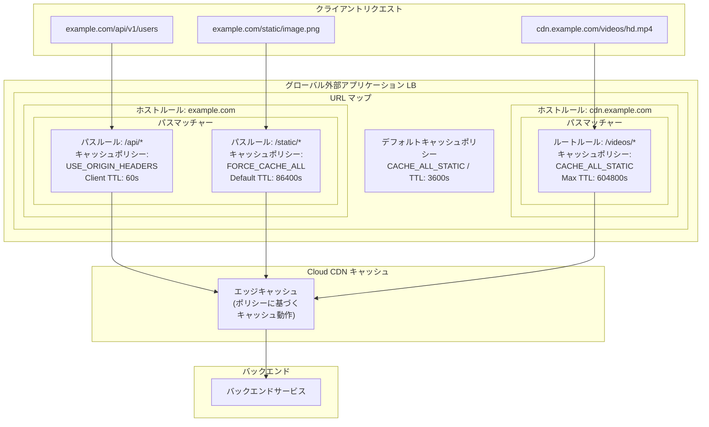

# Cloud CDN: URL マップレベルでのキャッシュポリシー設定が可能に

**リリース日**: 2026-03-30

**サービス**: Cloud CDN

**機能**: URL マップにおけるキャッシュポリシーの粒度制御

**ステータス**: Preview

📊 [このアップデートのインフォグラフィックを見る](https://takech9203.github.io/google-cloud-news-summary/20260330-cloud-cdn-cache-policies-url-maps.html)

## 概要

Cloud CDN において、グローバル外部アプリケーションロードバランサの URL マップの各レベルでキャッシュポリシーを構成できる新機能が Preview として提供開始されました。これにより、ホスト名、URL パス、HTTP ヘッダー、クエリパラメータに基づいて、より細かいキャッシュロジックを適用できるようになります。

従来、Cloud CDN のキャッシュポリシー (キャッシュモード、TTL 設定、キャッシュキー設定など) はバックエンドサービスまたはバックエンドバケット単位でしか設定できませんでした。今回のアップデートにより、URL マップ内のホストルール、パスマッチャー、パスルール、ルートルールといった各階層でキャッシュポリシーを個別に定義できるようになり、同一バックエンドに対しても URL パスやリクエスト属性に応じた柔軟なキャッシュ戦略を実現できます。

本機能は、マイクロサービスアーキテクチャや複数のコンテンツタイプを配信する Web アプリケーションを運用するチームにとって特に有用です。API レスポンス、静的アセット、動的コンテンツそれぞれに最適なキャッシュ戦略を一つのロードバランサ設定内で柔軟に管理できるようになります。

**アップデート前の課題**

- キャッシュポリシーはバックエンドサービス/バケット単位でのみ設定可能であり、同一バックエンド内の異なるパスに異なるキャッシュ戦略を適用できなかった
- パスごとにキャッシュ動作を変えるには、別々のバックエンドサービスを作成して URL マップでルーティングする必要があり、アーキテクチャが複雑化していた
- API エンドポイントと静的アセットが同一バックエンドで配信される場合、一律のキャッシュモードや TTL しか適用できず、最適化が困難だった

**アップデート後の改善**

- URL マップのホストルール、パスマッチャー、ルートルール各レベルでキャッシュポリシーを個別に定義可能になった
- 同一バックエンドサービスに対しても、URL パスや HTTP ヘッダー、クエリパラメータに基づいて異なるキャッシュモードや TTL を適用できるようになった
- キャッシュ戦略の最適化のために不要なバックエンドサービスの分割が不要になり、アーキテクチャがシンプルになった

## アーキテクチャ図



この図は、URL マップ内の各レベル (ホストルール、パスマッチャー、パスルール/ルートルール) でキャッシュポリシーが階層的に適用される様子を示しています。リクエストの URL パスやホスト名に応じて、異なるキャッシュモードや TTL が自動的に選択されます。

## サービスアップデートの詳細

### 主要機能

1. **URL マップ階層でのキャッシュポリシー定義**
   - ホストルール、パスマッチャー、パスルール、ルートルールの各レベルでキャッシュポリシーを設定可能
   - 下位レベルのポリシーが上位レベルのポリシーをオーバーライドする階層的な適用モデル
   - デフォルトのキャッシュポリシーはバックエンドサービスレベルで引き続き機能

2. **ホスト名ベースのキャッシュ制御**
   - 異なるドメイン/サブドメインに対して個別のキャッシュ戦略を設定可能
   - 例: `api.example.com` と `static.example.com` で異なるキャッシュモードを適用

3. **URL パスベースのキャッシュ制御**
   - パスルールまたはルートルールに基づいて、パスごとに異なるキャッシュポリシーを定義
   - ワイルドカードパターンやフレキシブルパターンマッチングと組み合わせて使用可能

4. **HTTP ヘッダー・クエリパラメータによる条件分岐**
   - ルートルールのマッチ条件を活用し、特定のヘッダーやクエリパラメータに基づいてキャッシュ動作を変更
   - A/B テストやカナリアリリースのシナリオでキャッシュ戦略を最適化

## 技術仕様

### キャッシュポリシー設定項目

URL マップの各レベルで設定可能なキャッシュポリシーのパラメータは以下の通りです。

| 項目 | 説明 | 設定値の例 |
|------|------|-----------|
| キャッシュモード | キャッシュの基本動作を決定 | `CACHE_ALL_STATIC`, `USE_ORIGIN_HEADERS`, `FORCE_CACHE_ALL` |
| Default TTL | キャッシュのデフォルト有効期間 | 0 - 31,622,400 秒 (最大1年) |
| Max TTL | キャッシュの最大有効期間 | 0 - 31,622,400 秒 (最大1年) |
| Client TTL | クライアント側キャッシュの最大有効期間 | 0 - 31,622,400 秒 (最大1年) |
| ネガティブキャッシュ | エラーレスポンスのキャッシュ設定 | 有効/無効 |

### キャッシュモードの比較

| キャッシュモード | 動作 | 推奨用途 |
|----------------|------|---------|
| `CACHE_ALL_STATIC` | 静的コンテンツを自動キャッシュ。オリジンのキャッシュディレクティブも尊重 | 一般的な Web サイト、静的アセット配信 |
| `USE_ORIGIN_HEADERS` | オリジンの Cache-Control ヘッダーに完全に従う | API レスポンス、動的コンテンツ |
| `FORCE_CACHE_ALL` | 全てのレスポンスを強制的にキャッシュ | 公開コンテンツのみのバックエンド |

### URL マップでのキャッシュポリシー設定例

```json
{
  "name": "my-url-map",
  "defaultService": "projects/my-project/global/backendServices/default-backend",
  "hostRules": [
    {
      "hosts": ["example.com"],
      "pathMatcher": "main-matcher"
    }
  ],
  "pathMatchers": [
    {
      "name": "main-matcher",
      "defaultService": "projects/my-project/global/backendServices/web-backend",
      "routeRules": [
        {
          "priority": 1,
          "matchRules": [
            {
              "prefixMatch": "/api/"
            }
          ],
          "routeAction": {
            "cdnPolicy": {
              "cacheMode": "USE_ORIGIN_HEADERS"
            }
          },
          "service": "projects/my-project/global/backendServices/api-backend"
        },
        {
          "priority": 2,
          "matchRules": [
            {
              "prefixMatch": "/static/"
            }
          ],
          "routeAction": {
            "cdnPolicy": {
              "cacheMode": "FORCE_CACHE_ALL",
              "defaultTtl": "86400s"
            }
          },
          "service": "projects/my-project/global/backendServices/web-backend"
        }
      ]
    }
  ]
}
```

## 設定方法

### 前提条件

1. グローバル外部アプリケーションロードバランサが構成済みであること
2. Cloud CDN がバックエンドサービスで有効化されていること
3. `gcloud` CLI が最新バージョンに更新されていること

### 手順

#### ステップ 1: 既存の URL マップ構成を確認

```bash
gcloud compute url-maps describe MY_URL_MAP \
    --global \
    --format=yaml
```

現在の URL マップの構成を確認し、ホストルールとパスマッチャーの構造を把握します。

#### ステップ 2: URL マップにキャッシュポリシー付きルートルールを追加

```bash
gcloud compute url-maps edit MY_URL_MAP --global
```

エディタが開いたら、ルートルールに `cdnPolicy` セクションを追加します。

#### ステップ 3: 構成を検証

```bash
gcloud compute url-maps validate MY_URL_MAP --global
```

URL マップの構成が有効であることを確認します。

#### ステップ 4: キャッシュ動作を確認

```bash
curl -sI "https://example.com/static/test.css" | grep -i "x-cache\|cache-control\|age"
```

レスポンスヘッダーを確認し、期待通りのキャッシュ動作が適用されていることを検証します。

## メリット

### ビジネス面

- **コスト最適化**: パスごとに適切なキャッシュ戦略を適用することで、不要なキャッシュフィルを削減し、オリジンへのトラフィックとコストを最小化
- **運用効率向上**: バックエンドサービスの分割が不要になり、インフラストラクチャの管理が簡素化される
- **ユーザー体験の改善**: コンテンツタイプに応じた最適な TTL 設定により、キャッシュヒット率が向上し、レスポンス時間が短縮

### 技術面

- **きめ細かいキャッシュ制御**: 同一バックエンド内でもパスやヘッダー条件に応じて異なるキャッシュモード・TTL を適用可能
- **アーキテクチャの簡素化**: キャッシュ戦略の違いだけのためにバックエンドサービスを分割する必要がなくなり、URL マップの構成がシンプルに
- **段階的な移行が容易**: 既存のバックエンドレベルのキャッシュポリシーとの互換性が維持され、URL マップレベルのポリシーを段階的に追加可能

## デメリット・制約事項

### 制限事項

- 本機能は現在 Preview ステータスであり、本番環境での利用には注意が必要。SLA の対象外となる可能性がある
- グローバル外部アプリケーションロードバランサでのみ利用可能。リージョン外部/内部アプリケーションロードバランサやクラシックモードでは使用不可
- URL マップの階層が深くなると、どのキャッシュポリシーが実際に適用されるかの把握が複雑になる可能性がある

### 考慮すべき点

- URL マップレベルのキャッシュポリシーとバックエンドサービスレベルのキャッシュポリシーの優先順位を正しく理解する必要がある
- Preview 期間中は仕様が変更される可能性があるため、本番環境への導入は慎重に検討すべき
- キャッシュポリシーの設定ミスにより、プライベートコンテンツが意図せずキャッシュされるリスクがあるため、`FORCE_CACHE_ALL` の適用範囲には特に注意が必要

## ユースケース

### ユースケース 1: API と静的アセットの混在配信

**シナリオ**: 単一のバックエンドサービスで REST API と静的フロントエンドアセットの両方を配信しているアプリケーション。API レスポンスはオリジンのキャッシュヘッダーに従い、静的アセットは長期間キャッシュしたい。

**実装例**:
```yaml
pathMatchers:
  - name: app-matcher
    defaultService: my-backend
    routeRules:
      - priority: 1
        matchRules:
          - prefixMatch: "/api/"
        routeAction:
          cdnPolicy:
            cacheMode: USE_ORIGIN_HEADERS
      - priority: 2
        matchRules:
          - prefixMatch: "/assets/"
        routeAction:
          cdnPolicy:
            cacheMode: FORCE_CACHE_ALL
            defaultTtl: "604800s"
```

**効果**: API レスポンスのキャッシュはオリジンサーバーが制御し、静的アセットは7日間の長期キャッシュにより高いキャッシュヒット率を実現。バックエンドサービスの分割が不要。

### ユースケース 2: マルチテナント SaaS アプリケーション

**シナリオ**: テナントごとに異なるサブドメインを持つ SaaS アプリケーションで、共通の静的リソースは長くキャッシュし、テナント固有のデータはキャッシュしない構成にしたい。

**効果**: ホストルールレベルでテナントごとのキャッシュ戦略を定義し、共通リソースには積極的なキャッシュを、動的なテナントデータにはキャッシュ無効化を適用。パフォーマンスとデータプライバシーを両立。

### ユースケース 3: コンテンツタイプに応じたキャッシュ最適化

**シナリオ**: メディア配信サイトで、動画ファイル (/videos/) は長期キャッシュ、ニュース記事 (/articles/) は短い TTL、ユーザーダッシュボード (/dashboard/) はキャッシュしないという要件がある。

**効果**: 3つの異なるパスルールで、それぞれに最適なキャッシュモードと TTL を設定。単一の URL マップ内で全てのキャッシュ要件を管理でき、運用コストを削減。

## 料金

Cloud CDN のキャッシュポリシー設定自体に追加料金は発生しません。Cloud CDN の標準料金が適用されます。

### 料金構成

| 項目 | 説明 |
|------|------|
| キャッシュエグレス | キャッシュからクライアントへのデータ転送量に応じた料金 |
| キャッシュフィル | オリジンからキャッシュへのデータ転送量に応じた料金 |
| HTTP(S) リクエスト | リクエスト数に応じた料金 |
| キャッシュ無効化 | 月あたりの無効化リクエスト数に応じた料金 |

キャッシュポリシーの最適化により、キャッシュヒット率が向上すればキャッシュフィルのコスト削減が期待できます。詳細な料金については [Cloud CDN の料金ページ](https://cloud.google.com/cdn/pricing) を参照してください。

## 利用可能リージョン

Cloud CDN はグローバルサービスとして提供されており、Google の全てのエッジロケーションで利用可能です。本機能はグローバル外部アプリケーションロードバランサと組み合わせて使用するため、グローバルに配置されたエッジノードで一貫したキャッシュポリシーが適用されます。

## 関連サービス・機能

- **Cloud Load Balancing**: URL マップを管理するグローバル外部アプリケーションロードバランサの基盤サービス。キャッシュポリシーは URL マップの構成要素として設定される
- **Cloud CDN キャッシュモード**: `CACHE_ALL_STATIC`、`USE_ORIGIN_HEADERS`、`FORCE_CACHE_ALL` の3つのキャッシュモードを URL マップの各レベルで個別に指定可能
- **Cloud CDN TTL 設定**: Default TTL、Max TTL、Client TTL の各設定を URL マップレベルのキャッシュポリシーで制御
- **Cloud CDN キャッシュキー設定**: HTTP ヘッダー、Cookie、クエリパラメータをキャッシュキーに含める設定をルートルールと組み合わせて活用可能

## 参考リンク

- 📊 [インフォグラフィック](https://takech9203.github.io/google-cloud-news-summary/20260330-cloud-cdn-cache-policies-url-maps.html)
- [公式リリースノート](https://docs.cloud.google.com/release-notes#March_30_2026)
- [グローバルトラフィック管理でのCDNキャッシュポリシー設定](https://docs.cloud.google.com/load-balancing/docs/https/setting-up-global-traffic-mgmt#cdn-cache-policy)
- [URL マップにおけるキャッシュポリシー](https://docs.cloud.google.com/cdn/docs/caching#cache-policies-url-maps)
- [Cloud CDN キャッシュ概要](https://docs.cloud.google.com/cdn/docs/caching)
- [Cloud CDN 料金](https://cloud.google.com/cdn/pricing)

## まとめ

Cloud CDN の URL マップレベルでのキャッシュポリシー設定は、従来のバックエンドサービス単位のキャッシュ制御から大きく進化した機能です。ホスト名、URL パス、HTTP ヘッダー、クエリパラメータに基づくきめ細かいキャッシュ戦略を単一の URL マップ内で定義できるようになり、アーキテクチャの簡素化とキャッシュ効率の向上が同時に実現できます。現在 Preview ステータスのため、まずは開発/ステージング環境で検証し、GA リリース後の本番適用を計画することをお勧めします。

---

**タグ**: #CloudCDN #URLMap #キャッシュポリシー #LoadBalancing #Preview #パフォーマンス最適化 #コンテンツ配信
