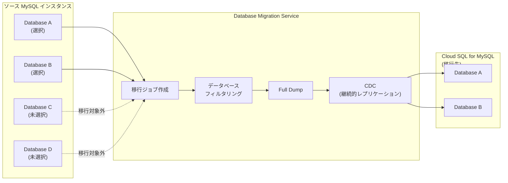

# Cloud Database Migration Service: MySQL 同種移行で個別データベースの選択的移行が可能に

**リリース日**: 2026-03-30

**サービス**: Cloud Database Migration Service

**機能**: MySQL 同種移行における個別データベース選択移行

**ステータス**: Feature (一般提供)

📊 [このアップデートのインフォグラフィックを見る](https://takech9203.github.io/google-cloud-news-summary/20260330-cloud-dms-mysql-individual-database-migration.html)

## 概要

Database Migration Service (DMS) の MySQL 同種移行 (Homogeneous Migration) において、ソースインスタンスから個別のデータベースを選択して移行できる機能が追加されました。これまで MySQL の同種移行ではソースインスタンスに含まれる全データベースが一括で移行されていましたが、今回のアップデートにより、移行ジョブの作成時に移行対象のデータベースを個別に選択できるようになりました。

この機能は、PostgreSQL (Cloud SQL / AlloyDB) や SQL Server の同種移行では既に提供されていた機能であり、今回の対応により MySQL でも同等の選択的移行が実現しました。大規模なソースインスタンスから必要なデータベースのみを移行したいユースケースにおいて、移行時間の短縮やリソースの効率的な利用が可能になります。

対象ユーザーは、オンプレミスや他クラウド (AWS RDS、Amazon Aurora、Azure Database for MySQL) から Cloud SQL for MySQL への移行を計画しているデータベース管理者やクラウドアーキテクトです。

**アップデート前の課題**

- MySQL 同種移行ではソースインスタンスの全データベースが移行対象となり、個別選択ができなかった
- 不要なデータベースも含めて移行する必要があり、移行時間とネットワーク帯域が余分に消費されていた
- 特定のデータベースのみを移行したい場合、手動でのダンプ・リストア作業が必要だった
- PostgreSQL や SQL Server の同種移行では個別データベース選択が可能だったが、MySQL では非対応だった

**アップデート後の改善**

- 移行ジョブ作成時にソースインスタンスから移行対象のデータベースを個別に選択可能になった
- 必要なデータベースのみを移行することで、移行時間とリソース消費を最適化できるようになった
- Google Cloud コンソールおよび gcloud CLI (`--databases-filter` フラグ) の両方から設定可能
- MySQL でも PostgreSQL や SQL Server と同等の柔軟な移行オプションが利用可能になった

## アーキテクチャ図



移行ジョブ作成時にソースインスタンスのデータベース一覧から移行対象を選択し、選択されたデータベースのみがフルダンプおよび CDC (Change Data Capture) を通じて Cloud SQL for MySQL の移行先インスタンスにレプリケーションされます。

## サービスアップデートの詳細

### 主要機能

1. **個別データベース選択**
   - 移行ジョブ作成ウィザードの「Configure migration objects」ステップでソースインスタンスのデータベース一覧が表示される
   - 移行対象のデータベースをチェックボックスで個別に選択可能
   - 全データベースの一括移行も引き続きサポート (`--all-databases` フラグ)

2. **gcloud CLI サポート**
   - `--databases-filter` フラグを使用して移行対象データベースを指定可能
   - `--all-databases` フラグで従来通り全データベースの移行も可能
   - 自動化スクリプトや Infrastructure as Code との統合が容易

3. **継続移行 (Continuous Migration) との互換性**
   - 選択したデータベースに対してフルダンプ後の継続的なレプリケーション (CDC) が適用される
   - 移行対象外のデータベースの変更は無視され、帯域幅を節約
   - ワンタイム移行 (One-time Migration) でも利用可能

## 技術仕様

### 対応ソースデータベース

| ソース | サポートバージョン |
|--------|-------------------|
| Self-managed MySQL | 5.5, 5.6, 5.7, 8.0, 8.4 |
| Amazon RDS for MySQL | 5.6, 5.7, 8.0, 8.4 |
| Amazon Aurora MySQL | 5.6, 5.7, 8.0, 8.4 |
| Azure Database for MySQL | 5.7, 8.0, 8.4 |
| Cloud SQL for MySQL | 5.6, 5.7, 8.0, 8.4 |

### 移行先データベース

| 移行先 | サポートバージョン |
|--------|-------------------|
| Cloud SQL for MySQL | 5.6, 5.7, 8.0, 8.4 |

### 必要な IAM ロール

```
roles/datamigration.admin    # Database Migration Admin
roles/cloudsql.editor        # Cloud SQL Editor
roles/compute.networkUser    # Compute Network User (VPC ピアリング使用時)
```

## 設定方法

### 前提条件

1. ソース MySQL インスタンスへの接続プロファイルが作成済みであること
2. Database Migration Service API が有効化されていること
3. 適切な IAM ロールが付与されていること

### 手順

#### ステップ 1: Google Cloud コンソールでの設定

Google Cloud コンソールから移行ジョブを作成する場合、ウィザードの「Configure migration objects」パネルで移行対象のデータベースを選択します。

1. [Migration jobs ページ](https://console.cloud.google.com/dbmigration/migrations) に移動
2. 「Create migration job」をクリック
3. ソースデータベースエンジンとして「MySQL」を選択
4. ソース接続プロファイルを指定
5. 「Configure migration objects」ステップで移行対象のデータベースを選択
6. テストを実行し、移行ジョブを作成

#### ステップ 2: gcloud CLI での設定

```bash
# 個別データベースを指定して移行ジョブを作成
gcloud database-migration migration-jobs create my-mysql-migration \
  --region=us-central1 \
  --type=CONTINUOUS \
  --source=mysql-source-profile \
  --destination=mysql-dest-profile \
  --databases-filter=app_db,user_db,analytics_db
```

```bash
# 全データベースを移行する場合 (従来の動作)
gcloud database-migration migration-jobs create my-mysql-migration \
  --region=us-central1 \
  --type=CONTINUOUS \
  --source=mysql-source-profile \
  --destination=mysql-dest-profile \
  --all-databases
```

## メリット

### ビジネス面

- **移行コストの削減**: 必要なデータベースのみを移行することで、移行に要する時間とコンピューティングリソースを削減できる
- **段階的な移行戦略の実現**: アプリケーションごとに使用するデータベースを段階的に移行することで、リスクを分散し、移行の影響を最小化できる
- **ダウンタイムの最小化**: 移行対象データ量の削減により、フルダンプ・CDC のキャッチアップ時間が短縮され、切り替え時のダウンタイムを短縮できる

### 技術面

- **ネットワーク帯域の効率化**: 不要なデータベースのレプリケーションを排除し、ネットワーク帯域を効率的に利用できる
- **移行ジョブの簡素化**: 複数の移行ジョブを作成する代わりに、1つの移行ジョブで必要なデータベースのみを選択的に移行できる
- **CLI/API 対応による自動化**: `--databases-filter` フラグにより、Terraform や CI/CD パイプラインとの統合が容易

## デメリット・制約事項

### 制限事項

- MySQL 8.4 の移行先については物理バックアップファイルを使用した移行がサポートされていない
- Database Migration Service はリージョナルサービスであるため、ソース・移行先・接続プロファイルはすべて同一リージョンに配置する必要がある
- system データベース (mysql, information_schema, performance_schema, sys) は移行対象から自動的に除外される

### 考慮すべき点

- データベース間に外部キーや結合クエリなどの依存関係がある場合、関連するデータベースを全て移行対象に含める必要がある
- 移行対象のデータベース選択後に、ソースインスタンスで新しいデータベースが作成された場合、自動的には移行対象に追加されない
- ストアドプロシージャやイベントがデータベースをまたいで参照している場合は、移行前に依存関係を確認する必要がある

## ユースケース

### ユースケース 1: マルチテナントアプリケーションの段階的移行

**シナリオ**: 1つの MySQL インスタンスに複数のテナントのデータベースが格納されている SaaS アプリケーションで、テナントごとに段階的に Cloud SQL へ移行したい場合。

**実装例**:
```bash
# 第1バッチ: テナントA とテナントB のデータベースを移行
gcloud database-migration migration-jobs create batch1-migration \
  --region=asia-northeast1 \
  --type=CONTINUOUS \
  --source=saas-mysql-source \
  --destination=csql-mysql-dest-1 \
  --databases-filter=tenant_a_db,tenant_b_db
```

**効果**: テナントごとにリスクを分散し、問題が発生した場合の影響範囲を限定できる。各テナントのアプリケーション切り替えも段階的に実施可能。

### ユースケース 2: 開発環境の部分移行

**シナリオ**: 本番環境のソースインスタンスには多数のデータベースが存在するが、開発・テスト用に特定のデータベースのみを Cloud SQL に移行したい場合。

**効果**: 開発環境に必要なデータベースのみを移行することで、コストとストレージ使用量を抑え、移行時間を大幅に短縮できる。

## 料金

Database Migration Service の同種移行 (Homogeneous Migration) は追加料金なしで利用可能です。ただし、以下のリソースに対して料金が発生します。

### 料金例

| リソース | 料金 |
|---------|------|
| Database Migration Service (同種移行) | 無料 |
| Cloud SQL for MySQL (移行先インスタンス) | Cloud SQL の通常料金が適用 |
| Cloud Storage (物理バックアップ使用時) | Cloud Storage の通常料金が適用 |
| ネットワーク (リージョン間通信) | ネットワーク egress 料金が適用 |

## 利用可能リージョン

Database Migration Service はリージョナルサービスです。Cloud SQL for MySQL がサポートされている全リージョンで利用可能です。主要リージョンは以下の通りです。

- **アジア太平洋**: asia-northeast1 (東京), asia-northeast2 (大阪), asia-southeast1 (シンガポール), asia-south1 (ムンバイ) 他
- **北米**: us-central1, us-east1, us-west1, northamerica-northeast1 他
- **ヨーロッパ**: europe-west1, europe-west3, europe-north1 他

## 関連サービス・機能

- **Cloud SQL for MySQL**: MySQL 同種移行の移行先として使用される Google Cloud のマネージド MySQL サービス
- **Database Migration Service 同種移行**: PostgreSQL (Cloud SQL / AlloyDB) および SQL Server でも同様の個別データベース選択移行が利用可能
- **Cloud Storage**: 物理バックアップファイル (Percona XtraBackup) を使用した移行フローで利用
- **VPC ネットワーク**: プライベート IP 接続やリバース SSH トンネルによるセキュアな移行接続に使用

## 参考リンク

- 📊 [インフォグラフィック](https://takech9203.github.io/google-cloud-news-summary/20260330-cloud-dms-mysql-individual-database-migration.html)
- [公式リリースノート](https://docs.cloud.google.com/release-notes#March_30_2026)
- [移行ジョブの作成 (MySQL 同種移行)](https://docs.cloud.google.com/database-migration/docs/mysql/create-migration-job-intro)
- [Database Migration Service 概要](https://docs.cloud.google.com/database-migration/docs/overview)
- [同種移行の概要](https://docs.cloud.google.com/database-migration/docs/homogeneous-migrations)
- [サポートされるソース・移行先データベース](https://docs.cloud.google.com/database-migration/docs/supported-databases)

## まとめ

今回のアップデートにより、Database Migration Service の MySQL 同種移行で個別データベースの選択的移行が可能になりました。これは PostgreSQL や SQL Server では既に提供されていた機能の MySQL への展開であり、段階的な移行戦略やコスト最適化を実現する上で重要な改善です。MySQL から Cloud SQL への移行を計画している場合は、移行ジョブ作成時にデータベース選択オプションを活用し、効率的な移行計画を策定することを推奨します。

---

**タグ**: #CloudDatabaseMigrationService #MySQL #CloudSQL #HomogeneousMigration #DatabaseMigration #データ移行
