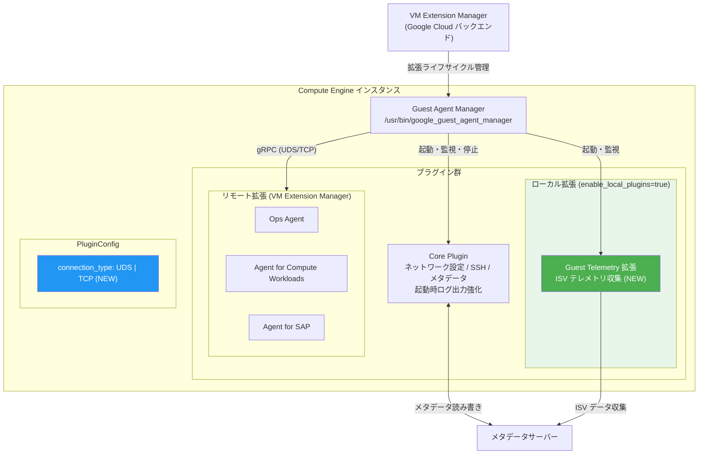

# Compute Engine: Guest Agent v20260329.00 - 新テレメトリ拡張とプラグイン設定の強化

**リリース日**: 2026-03-30

**サービス**: Compute Engine (Guest Environment)

**機能**: Guest Agent バージョン 20260329.00 リリース

**ステータス**: 全サポート対象 OS で利用可能

📊 [このアップデートのインフォグラフィックを見る](https://takech9203.github.io/google-cloud-news-summary/20260330-compute-engine-guest-agent-v20260329.html)

## 概要

Compute Engine の Guest Agent バージョン 20260329.00 が全サポート対象オペレーティングシステムで利用可能になりました。本リリースでは、ISV (Independent Software Vendor) のテレメトリ収集を行う新しいローカル拡張「guest telemetry」の追加、ローカルプラグインのデフォルト有効化、および gRPC 通信における新しい接続タイプ設定の導入が含まれています。

Guest Agent は Compute Engine インスタンスのゲスト環境 (Guest Environment) の中核コンポーネントであり、ネットワーク設定、SSH アクセス管理、メタデータアクセス、テレメトリ収集などの基本機能を担っています。バージョン 20250901.00 以降、モノリシック設計からプラグインベースのアーキテクチャへ移行しており、今回のリリースはこのモジュラー設計をさらに推進するものです。

また、本リリースでは複数の重要なバグ修正が含まれており、拡張機能の gRPC クライアントが null の場合のエージェント異常終了の防止、メタデータサーバーへの HTTPS アクセス用認証情報セットアップの改善、コアプラグインの起動ログ追加、ローカルバンドル拡張のプロセス管理改善が行われています。

**アップデート前の課題**

- ローカルプラグインはデフォルトで無効 (`enable_local_plugins = false`) であり、利用するには手動で有効化する必要があった
- ISV のテレメトリデータを収集する標準的な仕組みが Guest Agent に組み込まれていなかった
- プラグインの接続タイプ (UDS / TCP) を設定で切り替える方法がなく、柔軟性に欠けていた
- 拡張機能の gRPC クライアントが null の場合にエージェント全体が異常終了する問題があった
- メタデータサーバーへの HTTPS 認証情報セットアップがレディネスシグナルをブロックしていた

**アップデート後の改善**

- `enable_local_plugins` がデフォルトで `true` となり、ローカルプラグインが追加設定なしで動作するようになった
- 新しい guest telemetry 拡張により、インスタンス上で稼働する ISV のテレメトリデータを自動収集可能になった
- `connection_type` 設定フラグにより、UDS (Unix Domain Socket) と TCP から接続方式を選択できるようになった
- gRPC クライアントが null の場合でもエージェントが安全に動作を継続するようになった
- 認証情報セットアップの処理順序が改善され、レディネスシグナルが迅速に送信されるようになった

## アーキテクチャ図



Guest Agent Manager がすべてのプラグインのライフサイクルを管理し、新たに追加された guest telemetry 拡張がローカルプラグインとして ISV テレメトリを収集します。`connection_type` 設定により、プラグイン間通信で UDS または TCP を選択可能です。

## サービスアップデートの詳細

### 新機能

1. **Guest Telemetry ローカル拡張**
   - インスタンス上で稼働する ISV (Independent Software Vendor) ソフトウェアに関するテレメトリデータを収集する新しいローカル拡張
   - ゲスト環境の既存システムテレメトリ (エージェントバージョン、OS 情報、カーネル情報) に加え、ISV 固有の情報を収集
   - ローカル拡張として動作するため、VM Extension Manager を介さずにエージェントマネージャーが直接管理

2. **`enable_local_plugins` のデフォルト値変更**
   - `enable_local_plugins` 設定がデフォルトで `true` に変更
   - これにより、ローカルにバンドルされた拡張 (guest telemetry を含む) が追加の設定なしで自動的に有効化
   - 必要に応じて `false` に設定することでローカルプラグインを無効化可能

3. **`connection_type` 設定フラグの導入**
   - `PluginConfig` セクションに新しい `connection_type` フラグを追加
   - UDS (Unix Domain Socket) と TCP の2種類の接続方式をサポート
   - プラグインとエージェントマネージャー間の gRPC 通信方式を柔軟に選択可能

### バグ修正

1. **gRPC クライアント null 時の異常終了防止**
   - 拡張機能の gRPC クライアントが null の場合に Guest Agent が異常終了する問題を修正
   - null チェックの追加により、エージェントの安定性が大幅に向上

2. **HTTPS 認証情報セットアップの処理順序改善**
   - メタデータサーバーへの HTTPS アクセス用認証情報のセットアップ処理を移動
   - レディネスシグナル (`systemd-notify --ready`) の送信がブロックされなくなり、依存サービスの起動が高速化

3. **コアプラグインの起動ログ追加**
   - コアプラグインが起動時にログを出力するように改善
   - トラブルシューティング時のシグナルが改善され、起動シーケンスの可視性が向上

4. **ローカルバンドル拡張のプロセス管理改善**
   - ローカルにバンドルされた拡張がエージェントマネージャーの直接の子プロセスとして動作するように変更
   - プロセスライフサイクル管理の信頼性が向上し、孤児プロセスの発生を防止

## 技術仕様

### 設定項目の変更

| 項目 | 変更内容 | 設定セクション |
|------|----------|----------------|
| `enable_local_plugins` | デフォルト値が `false` から `true` に変更 | PluginConfig |
| `connection_type` | 新規追加 (UDS / TCP をサポート) | PluginConfig |

### Guest Agent 設定ファイル

```ini
# /etc/default/instance_configs.cfg (Linux)
# C:\ProgramData\Google\Compute Engine\instance_configs.cfg (Windows)

[PluginConfig]
# ローカルプラグインの有効/無効 (デフォルト: true)
enable_local_plugins = true

# プラグイン接続タイプの指定 (新規)
# UDS: Unix Domain Socket (Linux 推奨)
# TCP: TCP 接続 (Windows またはネットワーク経由の場合)
connection_type = UDS
```

### バイナリパス

| コンポーネント | Linux パス | Windows パス |
|---------------|-----------|-------------|
| Guest Agent Manager | `/usr/bin/google_guest_agent_manager` | `C:\ProgramData\Google\Compute Engine\agent\GCEWindowsAgentManager.exe` |
| Core Plugin | `/usr/lib/google/guest_agent/core_plugin` | `C:\Program Files\Google\Compute Engine\agent\CorePlugin.exe` |
| Metadata Script Runner | `/usr/bin/gce_metadata_script_runner` | `C:\Program Files\Google\Compute Engine\agent\GCEMetadataScriptRunner.exe` |

## 設定方法

### 前提条件

1. Compute Engine インスタンスが Google 提供のパブリック OS イメージを使用していること
2. ゲスト環境がインストール済みであること

### 手順

#### ステップ 1: Guest Agent のバージョン確認

```bash
# Linux
sudo systemctl status google-guest-agent-manager
# ログからバージョンを確認
journalctl -u google-guest-agent-manager | grep "GCE Agent Started"
```

```powershell
# Windows
Get-Service GCEAgentManager | Select-Object Status, DisplayName
# イベントログからバージョン確認
Get-EventLog -LogName Application -Source GCEGuestAgent -Newest 5
```

バージョンが `20260329.00` 以上であることを確認してください。

#### ステップ 2: Guest Agent の更新 (必要な場合)

```bash
# Linux (Debian/Ubuntu)
sudo apt-get update && sudo apt-get install google-guest-agent

# Linux (RHEL/CentOS/Rocky)
sudo yum update google-guest-agent
```

```powershell
# Windows (GooGet)
googet -noconfirm install google-compute-engine-windows
```

#### ステップ 3: 接続タイプの設定 (オプション)

```bash
# Linux: 設定ファイルを編集
sudo vi /etc/default/instance_configs.cfg

# [PluginConfig] セクションに以下を追加
# connection_type = UDS
```

設定変更後、Guest Agent を再起動します。

```bash
sudo systemctl restart google-guest-agent-manager
```

#### ステップ 4: テレメトリ収集の確認・無効化 (オプション)

```bash
# ISV テレメトリを含むゲストテレメトリを無効化する場合
gcloud compute instances add-metadata INSTANCE_NAME \
    --metadata disable-guest-telemetry=true \
    --zone ZONE
```

## メリット

### ビジネス面

- **ISV 環境の可視性向上**: guest telemetry 拡張により、インスタンス上で稼働する ISV ソフトウェアの情報を自動的に収集でき、ライセンス管理やキャパシティプランニングに活用可能
- **運用負荷の軽減**: ローカルプラグインのデフォルト有効化により、初期セットアップの手順が簡素化され、設定漏れによる問題を防止

### 技術面

- **エージェントの安定性向上**: gRPC クライアント null 時の異常終了防止により、エージェントの信頼性が大幅に改善
- **起動時間の短縮**: HTTPS 認証情報セットアップの処理順序改善により、レディネスシグナルの遅延が解消され、依存サービスの起動が高速化
- **プロセス管理の堅牢化**: ローカルバンドル拡張が直接の子プロセスとなることで、プロセスライフサイクルの追跡と管理が確実に
- **通信方式の柔軟性**: UDS と TCP の選択により、環境に応じた最適な通信方式を構成可能

## デメリット・制約事項

### 制限事項

- `enable_local_plugins` のデフォルト変更により、以前は無効だったローカルプラグインが自動的に有効化されるため、既存環境でセキュリティポリシーにより無効にしている場合は明示的に `false` を設定する必要がある
- guest telemetry 拡張は ISV テレメトリを収集するため、データプライバシーの観点から組織のポリシーに応じて無効化の検討が必要
- `connection_type` の UDS オプションは Linux 環境向けであり、Windows では TCP の使用が推奨される

### 考慮すべき点

- 本バージョンへの更新後、ローカルプラグインの挙動変更がワークロードに影響しないか確認が必要
- メタデータキー `disable-guest-telemetry` を `true` に設定している場合、システムテレメトリに加え ISV テレメトリも無効化される
- 自動更新パッケージ (`google-compute-engine-auto-updater`) を使用していない場合は手動での更新が必要

## ユースケース

### ユースケース 1: ISV ソフトウェアの運用管理

**シナリオ**: 大規模な Compute Engine フリートで複数の ISV ソフトウェア (データベース、セキュリティツール、モニタリングエージェントなど) を運用しており、各インスタンスで稼働している ISV の状況を把握したい。

**実装例**:
```bash
# Guest Agent を最新版に更新
sudo apt-get update && sudo apt-get install google-guest-agent

# ローカルプラグインが有効であることを確認 (デフォルトで有効)
grep enable_local_plugins /etc/default/instance_configs.cfg

# テレメトリ収集が有効であることを確認
gcloud compute instances describe INSTANCE_NAME \
    --zone ZONE \
    --format="value(metadata.items[key='disable-guest-telemetry'])"
```

**効果**: ISV テレメトリの自動収集により、フリート全体のソフトウェア構成の可視化が可能になり、ライセンスコンプライアンスの確認やセキュリティ監査が効率化される。

### ユースケース 2: 高信頼性が求められるプロダクション環境

**シナリオ**: ミッションクリティカルなワークロードを実行するインスタンスで、Guest Agent の安定性が運用に直結する環境。

**効果**: gRPC クライアント null 時の異常終了防止、レディネスシグナルのブロック解消、起動ログの改善により、エージェントの信頼性が向上し、依存サービスの起動遅延やエージェント停止に起因する障害リスクが低減される。

### ユースケース 3: カスタムプラグイン開発環境

**シナリオ**: 独自のローカルプラグインを開発し、Guest Agent のプラグインベースアーキテクチャを活用してインスタンスのカスタム機能を実装したい。

**実装例**:
```ini
# /etc/default/instance_configs.cfg
[PluginConfig]
enable_local_plugins = true
# UDS を使用してローカル通信を最適化
connection_type = UDS
```

**効果**: `connection_type` の UDS/TCP 選択により、カスタムプラグインの通信要件に応じた最適な接続方式を選択でき、開発の柔軟性が向上する。

## 料金

Guest Agent はすべての Compute Engine インスタンスに無償で含まれるコンポーネントであり、本アップデートに伴う追加料金は発生しません。

| 項目 | 料金 |
|------|------|
| Guest Agent 利用 | 無料 (Compute Engine に含まれる) |
| テレメトリ収集 | 追加料金なし |
| ローカルプラグイン実行 | 追加料金なし |

## 利用可能リージョン

Guest Agent はすべての Compute Engine リージョンで利用可能です。Google 提供のパブリック OS イメージを使用するすべてのインスタンスで自動的にインストールされます。サポート対象 OS には Linux (Debian, Ubuntu, RHEL, CentOS, Rocky Linux, SLES) および Windows Server が含まれます。

## 関連サービス・機能

- **VM Extension Manager**: Guest Agent の拡張ライフサイクル (インストール、更新、設定) を管理するマネージドサービス
- **Cloud Monitoring / Ops Agent**: Guest Agent の拡張として動作し、メトリクスとログを収集
- **OS Config Agent**: VM Manager で使用される OS インベントリ、パッチ、ポリシー管理エージェント
- **メタデータサーバー**: Guest Agent が通信するインスタンス毎の HTTP サーバーで、構成情報と運用データを提供

## 参考リンク

- 📊 [インフォグラフィック](https://takech9203.github.io/google-cloud-news-summary/20260330-compute-engine-guest-agent-v20260329.html)
- [公式リリースノート](https://docs.cloud.google.com/release-notes#March_30_2026)
- [Guest Agent ドキュメント](https://docs.cloud.google.com/compute/docs/images/guest-agent)
- [Guest Agent 機能詳細](https://docs.cloud.google.com/compute/docs/images/guest-agent-functions)
- [システムテレメトリ収集](https://docs.cloud.google.com/compute/docs/images/guest-agent-functions#system-telemetry-collection)
- [ゲスト環境](https://docs.cloud.google.com/compute/docs/images/guest-environment)
- [Guest Agent GitHub リポジトリ](https://github.com/GoogleCloudPlatform/guest-agent)

## まとめ

Guest Agent v20260329.00 は、ISV テレメトリ収集の新機能追加、ローカルプラグインのデフォルト有効化、gRPC 接続タイプの設定柔軟化という3つの新機能と、エージェントの安定性・起動速度・プロセス管理に関わる4つの重要なバグ修正を含む重要なリリースです。特にプロダクション環境では、gRPC クライアント null 時の異常終了防止とレディネスシグナルの改善による信頼性向上の恩恵が大きいため、早期の更新を推奨します。`enable_local_plugins` のデフォルト値変更については、既存のセキュリティポリシーとの整合性を確認した上で適用してください。

---

**タグ**: #ComputeEngine #GuestAgent #GuestEnvironment #テレメトリ #プラグイン #gRPC #安定性向上 #v20260329
