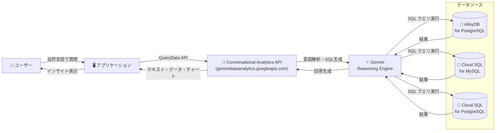

# AlloyDB / Cloud SQL: Conversational Analytics API による自然言語クエリ

**リリース日**: 2026-03-30

**サービス**: AlloyDB for PostgreSQL / Cloud SQL for MySQL / Cloud SQL for PostgreSQL

**機能**: Conversational Analytics (自然言語による運用データクエリ)

**ステータス**: Preview

[このアップデートのインフォグラフィックを見る](https://takech9203.github.io/google-cloud-news-summary/20260330-conversational-analytics-alloydb-cloud-sql.html)

## 概要

AlloyDB for PostgreSQL、Cloud SQL for MySQL、Cloud SQL for PostgreSQL の 3 サービスに対して、Conversational Analytics 機能が Preview として同時に提供開始された。この機能は Conversational Analytics API (`geminidataanalytics.googleapis.com`) を基盤としており、ユーザーが自然言語で運用データベースに問い合わせを行い、実用的なインサイトを得ることを可能にする。

Conversational Analytics API は Gemini for Google Cloud を活用した AI 搭載のデータエージェント基盤であり、従来は BigQuery、Looker、Looker Studio 向けに提供されていた。今回のアップデートにより、`QueryData` メソッドを通じて AlloyDB、Cloud SQL for MySQL、Cloud SQL for PostgreSQL のデータベースに対しても自然言語クエリが可能になった。これにより、SQL の専門知識がないビジネスユーザーでも、運用データベースから直接インサイトを引き出せるようになる。

対象ユーザーは、運用データベースに蓄積されたデータを活用してビジネス意思決定を行いたいデータアナリスト、ビジネスユーザー、およびデータ駆動型アプリケーションを構築する開発者である。

**アップデート前の課題**

- 運用データベースから情報を取得するには SQL の知識が必要であり、非技術者がデータにアクセスするハードルが高かった
- ビジネスユーザーがデータを必要とする度に、データエンジニアやアナリストに SQL クエリの作成を依頼する必要があった
- Conversational Analytics API は BigQuery、Looker、Looker Studio のみをサポートしており、AlloyDB や Cloud SQL の運用データに対する自然言語クエリは利用できなかった

**アップデート後の改善**

- AlloyDB、Cloud SQL for MySQL、Cloud SQL for PostgreSQL のデータベースに対して自然言語で直接クエリが可能になった
- Conversational Analytics API の `QueryData` メソッドにより、SQL を書かずにデータからインサイトを得られるようになった
- 既に Conversational Analytics API を利用しているユーザーは、同じ API を通じて運用データベースにもアクセスできるようになった

## アーキテクチャ図



ユーザーの自然言語の質問が Conversational Analytics API を通じて Gemini の推論エンジンに送られ、適切な SQL クエリに変換されてデータベースに対して実行される。結果はテキスト、データ、チャートなどの形式でユーザーに返却される。

## サービスアップデートの詳細

### 主要機能

1. **自然言語によるデータクエリ (QueryData メソッド)**
   - 自然言語の質問を SQL クエリに自動変換し、データベースに対して実行
   - AlloyDB for PostgreSQL、Cloud SQL for MySQL、Cloud SQL for PostgreSQL をサポート
   - API エンドポイント: `POST /v1beta/projects/*/locations/*/conversations:queryData`

2. **データエージェント機能**
   - ビジネス固有のコンテキストや指示を設定できるデータエージェントの作成
   - システム指示によるエージェントの動作カスタマイズ
   - ゴールデンクエリ (検証済みクエリ) の登録による精度向上

3. **AlloyDB AI Natural Language API (AlloyDB 固有の追加機能)**
   - `alloydb_ai_nl.get_sql()`: 自然言語から SQL クエリを生成
   - `alloydb_ai_nl.execute_nl_query()`: 自然言語の質問に対してデータベースから直接回答
   - `alloydb_ai_nl.get_sql_summary()`: クエリ結果の要約を自然言語で取得
   - スキーマコンテキストの自動生成によるセットアップの効率化
   - パラメータ化セキュアビューによるきめ細かいアクセス制御

4. **マルチツール対応**
   - SQL、Python、可視化ライブラリなどのツールを利用可能
   - テキスト、データ、チャートなど複数形式での回答出力

## 技術仕様

### サポート対象サービス

| サービス | QueryData メソッド | AlloyDB AI NL API | ステータス |
|---------|-------------------|-------------------|-----------|
| AlloyDB for PostgreSQL | 対応 | 対応 (`alloydb_ai_nl` 拡張) | Preview |
| Cloud SQL for MySQL | 対応 | - | Preview |
| Cloud SQL for PostgreSQL | 対応 | - | Preview |

### Conversational Analytics API エンドポイント

| 操作 | メソッド | エンドポイント |
|------|---------|---------------|
| データクエリ | POST | `/v1beta/projects/*/locations/*/conversations:queryData` |
| 会話取得 | GET | `/v1beta/projects/*/locations/*/conversations/*` |
| 会話一覧 | GET | `/v1beta/projects/*/locations/*/conversations` |
| メッセージ一覧 | GET | `/v1beta/projects/*/locations/*/conversations/*/messages` |
| 会話削除 | DELETE | `/v1beta/projects/*/locations/*/conversations/*` |

### AlloyDB AI Natural Language 設定例

```sql
-- alloydb_ai_nl 拡張のインストール
ALTER SYSTEM SET alloydb_ai_nl.enabled = on;
SELECT pg_reload_conf();
CREATE EXTENSION alloydb_ai_nl CASCADE;

-- 自然言語設定オブジェクトの作成と使用
-- スキーマコンテキストの自動生成
SELECT alloydb_ai_nl.generate_schema_context('my_config', TRUE);

-- 自然言語から SQL を生成
SELECT alloydb_ai_nl.get_sql('my_config', '先月の売上トップ3の製品は?') ->> 'sql';

-- 自然言語の質問に直接回答
SELECT alloydb_ai_nl.execute_nl_query('my_config', '東京のお客様の数は?');

-- 結果の要約を取得
SELECT alloydb_ai_nl.get_sql_summary(
  nl_config_id => 'my_config',
  nl_question => '最も売上が多いブランドはどれですか?'
);
```

## 設定方法

### 前提条件

1. Google Cloud プロジェクトで課金が有効化されていること
2. Conversational Analytics API (`geminidataanalytics.googleapis.com`) が有効化されていること
3. AlloyDB、Cloud SQL for MySQL、または Cloud SQL for PostgreSQL のインスタンスが作成済みであること
4. 適切な IAM ロール (`cloudaicompanion.topicAdmin` など) が付与されていること

### 手順

#### ステップ 1: Conversational Analytics API の有効化

```bash
# API の有効化
gcloud services enable geminidataanalytics.googleapis.com \
  --project=YOUR_PROJECT_ID
```

#### ステップ 2: 認証とアクセストークンの取得

```bash
# アクセストークンの取得
ACCESS_TOKEN=$(gcloud auth print-identity-token)

# API へのリクエスト例
curl -H "Authorization: Bearer ${ACCESS_TOKEN}" \
  https://geminidataanalytics.googleapis.com/v1beta/projects/YOUR_PROJECT_ID/locations/global/dataAgents
```

#### ステップ 3: QueryData メソッドによるデータクエリ

```bash
# 自然言語でデータベースにクエリ
curl -X POST \
  -H "Authorization: Bearer ${ACCESS_TOKEN}" \
  -H "Content-Type: application/json" \
  "https://geminidataanalytics.googleapis.com/v1beta/projects/YOUR_PROJECT_ID/locations/global/conversations:queryData" \
  -d '{
    "query": "先月の売上が最も高かった製品を教えてください"
  }'
```

#### ステップ 4: AlloyDB 固有の設定 (AlloyDB の場合)

```sql
-- alloydb_ai_nl 拡張のインストール
ALTER SYSTEM SET alloydb_ai_nl.enabled = on;
SELECT pg_reload_conf();
CREATE EXTENSION alloydb_ai_nl CASCADE;

-- スキーマコンテキストの自動生成と適用
SELECT alloydb_ai_nl.generate_schema_context('my_config', TRUE);
SELECT alloydb_ai_nl.apply_generated_schema_context('my_config', TRUE);
```

## メリット

### ビジネス面

- **データアクセスの民主化**: SQL の知識がないビジネスユーザーでも、自然言語で運用データベースからインサイトを得られるようになり、データ駆動の意思決定が加速する
- **生産性の向上**: データエンジニアへの SQL 作成依頼が不要になり、ビジネスユーザーがセルフサービスでデータ分析を実行できる
- **迅速な意思決定**: リアルタイムの運用データに対して即座に質問できるため、意思決定のスピードが大幅に向上する

### 技術面

- **統一された API**: Conversational Analytics API の `QueryData` メソッドにより、AlloyDB、Cloud SQL for MySQL、Cloud SQL for PostgreSQL を統一的にアクセスできる
- **AlloyDB AI の深い統合**: AlloyDB では `alloydb_ai_nl` 拡張により、スキーマコンテキストの自動生成やパラメータ化セキュアビューなど、より高度な自然言語機能を利用できる
- **セキュリティ**: IAM と PostgreSQL ロールによるアクセス制御、パラメータ化セキュアビューによるきめ細かいデータアクセス制御をサポート

## デメリット・制約事項

### 制限事項

- Preview ステータスのため、本番環境での使用は推奨されない (Pre-GA Offerings Terms が適用)
- QueryData メソッドは BigQuery や Looker のデータソースをサポートしない (逆に Chat/DataAgent メソッドは AlloyDB/Cloud SQL をサポートしない)
- AI 生成の出力は事実と異なる可能性があるため、すべての出力を検証することが推奨される
- Preview 期間中は限定的なサポートのみ提供される

### 考慮すべき点

- スキーマコンテキストやゴールデンクエリの適切な設定が、回答精度の向上に重要である
- 個人データや法的・規制コンプライアンス要件の対象となるデータの処理には、テスト環境でのみ使用すべきである
- Vertex AI の利用料金が別途発生する可能性がある (AlloyDB AI Natural Language 使用時)

## ユースケース

### ユースケース 1: セールスアナリティクス

**シナリオ**: 営業マネージャーが、AlloyDB に格納された CRM データに対して自然言語で問い合わせ、営業パフォーマンスを把握する。

**実装例**:
```sql
-- AlloyDB AI Natural Language API を使用
SELECT alloydb_ai_nl.get_sql(
  'sales_config',
  '先月の東京オフィスの売上トップ3の営業担当者は誰ですか?'
) ->> 'sql';

-- 結果の要約を取得
SELECT alloydb_ai_nl.get_sql_summary(
  nl_config_id => 'sales_config',
  nl_question => '四半期ごとの売上トレンドを教えてください'
);
```

**効果**: 営業チームが SQL の知識なしにリアルタイムの営業データを分析し、迅速な意思決定が可能になる。

### ユースケース 2: カスタマーサポート分析

**シナリオ**: カスタマーサポート部門のマネージャーが、Cloud SQL for MySQL に格納されたチケットデータに対して自然言語で問い合わせ、サポート品質のトレンドを把握する。

**効果**: 過去 7 日間の問い合わせカテゴリの傾向や、対応時間の分析をセルフサービスで実行でき、サービス品質の改善に直結する。

### ユースケース 3: サプライチェーン最適化

**シナリオ**: ロジスティクス担当者が、Cloud SQL for PostgreSQL に格納された出荷データに対して「3日以上遅延している出荷を表示して」のような自然言語クエリを実行する。

**効果**: リアルタイムの運用データに基づいて、配送遅延の早期発見と対応が可能になる。

## 料金

Conversational Analytics API は Preview フェーズであり、Preview 期間中は追加料金が発生しない。GA 移行時に料金体系が変更される可能性があるため、Google からの事前通知に注意が必要である。

ただし、AlloyDB AI Natural Language API を使用する場合、AlloyDB for PostgreSQL および Vertex AI の利用料金が別途発生する。

- [AlloyDB for PostgreSQL 料金](https://cloud.google.com/alloydb/pricing)
- [Cloud SQL for MySQL 料金](https://cloud.google.com/sql/pricing)
- [Cloud SQL for PostgreSQL 料金](https://cloud.google.com/sql/pricing)
- [Vertex AI 料金](https://cloud.google.com/vertex-ai/pricing)

## 利用可能リージョン

Conversational Analytics API の利用可能リージョンについては、公式ドキュメントを参照のこと。AlloyDB および Cloud SQL が利用可能なリージョンで、Gemini for Google Cloud がサポートされているリージョンが対象となる。

- [AlloyDB リージョン](https://cloud.google.com/alloydb/docs/locations)
- [Cloud SQL リージョン](https://cloud.google.com/sql/docs/mysql/locations)

## 関連サービス・機能

- **Gemini for Google Cloud**: Conversational Analytics API の基盤となる AI モデル。自然言語の理解と SQL 生成を担当する
- **Vertex AI**: AlloyDB AI Natural Language で使用されるエンベディングモデルやセマンティック検索機能を提供
- **BigQuery Conversational Analytics**: BigQuery 向けの同様の自然言語クエリ機能。データエージェントを作成してチャット形式でデータ分析が可能
- **Looker / Looker Studio**: Conversational Analytics が統合されており、セマンティックレイヤーを活用した自然言語分析が可能
- **AlloyDB AI**: ベクトル検索、ML モデル呼び出し、自然言語クエリなど、AlloyDB に統合された AI 機能群
- **Cloud Spanner (GoogleSQL)**: Conversational Analytics API の QueryData メソッドでサポートされる追加のデータソース

## 参考リンク

- [インフォグラフィック](https://takech9203.github.io/google-cloud-news-summary/20260330-conversational-analytics-alloydb-cloud-sql.html)
- [公式リリースノート](https://cloud.google.com/release-notes#March_30_2026)
- [Conversational Analytics API 概要](https://cloud.google.com/gemini/data-agents/conversational-analytics-api/overview)
- [Conversational Analytics API 主要コンセプト](https://cloud.google.com/gemini/data-agents/conversational-analytics-api/key-concepts)
- [AlloyDB AI Natural Language ランディングページ](https://cloud.google.com/alloydb/docs/ai/natural-language-landing)
- [AlloyDB AI Natural Language チュートリアル](https://cloud.google.com/alloydb/docs/ai/use-natural-language-generate-sql-queries)
- [Conversational Analytics API 認証設定](https://cloud.google.com/gemini/data-agents/conversational-analytics-api/authentication)
- [Conversational Analytics API FAQ](https://cloud.google.com/gemini/data-agents/conversational-analytics-api/frequently-asked-questions)
- [AlloyDB for PostgreSQL 料金](https://cloud.google.com/alloydb/pricing)
- [Cloud SQL 料金](https://cloud.google.com/sql/pricing)

## まとめ

AlloyDB for PostgreSQL、Cloud SQL for MySQL、Cloud SQL for PostgreSQL の 3 サービスで Conversational Analytics 機能が Preview として利用可能になったことは、Google Cloud のデータベースサービスにおける AI 統合の大きな進展である。Conversational Analytics API の `QueryData` メソッドを通じて、運用データベースに対する自然言語クエリが統一的に実現され、特に AlloyDB では `alloydb_ai_nl` 拡張によるスキーマ認識型の高度な SQL 生成機能も利用できる。Preview ステータスのため本番利用には注意が必要だが、テスト環境での評価を開始し、スキーマコンテキストやゴールデンクエリの整備を進めておくことを推奨する。

---

**タグ**: #AlloyDB #CloudSQL #MySQL #PostgreSQL #ConversationalAnalytics #NaturalLanguageQuery #GeminiForGoogleCloud #AI #Preview #データ分析 #自然言語処理
